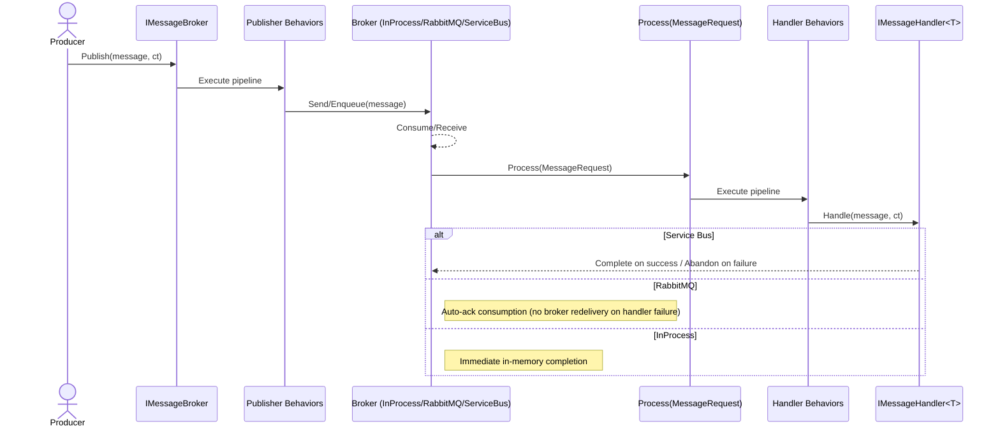
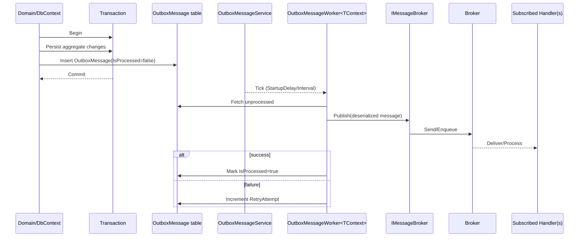
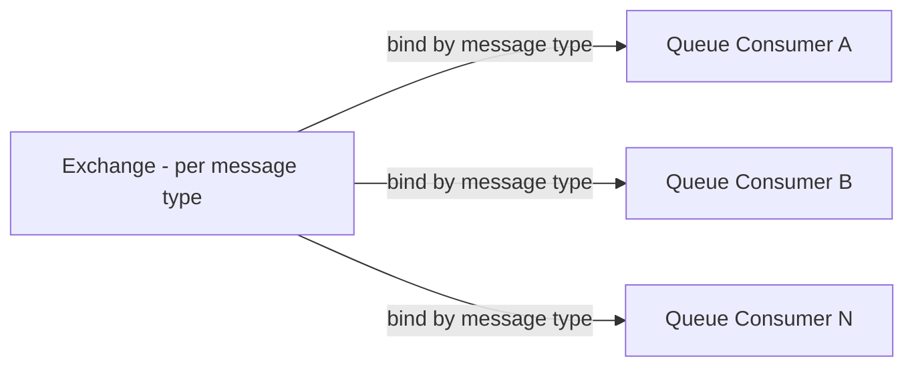
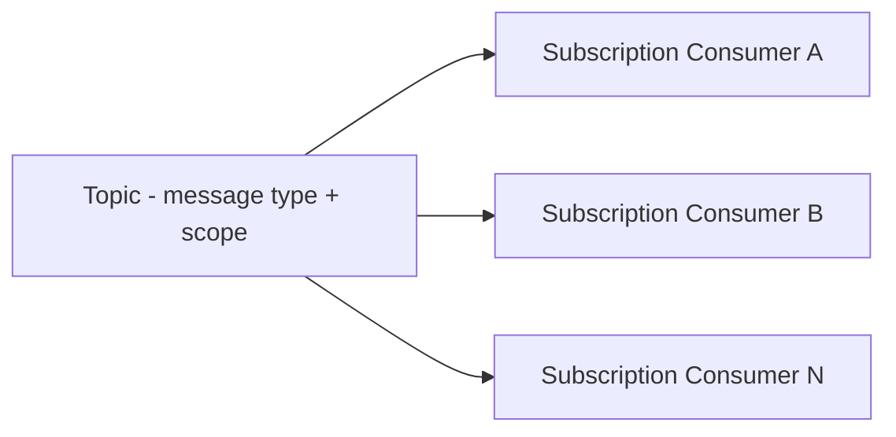

# Messaging Feature Documentation

[TOC]

## Overview

Messaging provides asynchronous publish/subscribe communication between parts of your application and across modules. It decouples producers from consumers, improves resilience, enables eventual consistency, and scales background work without blocking request flows.

## Challenges

- Coupling: Direct calls create tight dependencies between components and modules.
- Reliability: Ensuring delivery with durable storage, retries, and redelivery semantics.
- Ordering: Understanding when processing order is guaranteed vs. best-effort.
- Expiration: Dropping stale messages safely via TTL/expiration policies.
- Observability: Correlation, tracing, metrics, and structured logging across hops.
- Transport differences: In-process, RabbitMQ, and Azure Service Bus behave differently.

## Solution

- Abstractions: `IMessage`, `IMessageHandler<T>`, and `IMessageBroker` decouple publishers from subscribers.
- Behaviors: Publisher and handler behavior pipelines add cross-cutting concerns (module scoping, metrics, retry, timeout, chaos) consistently.
- Execution model: publish → transport → process → handle (sequence diagram below).

## Architecture

The broker is the central interface used by producers to publish messages and by infrastructure to dispatch them to subscribed handlers. The flow below shows the end-to-end path, including behavior pipelines and transport specifics.



## Core Contracts

- `IMessageBroker` ([src/Application.Messaging/IMessageBroker.cs](src/Application.Messaging/IMessageBroker.cs))
  - **Subscribe<TMessage,THandler>() / Subscribe(Type,Type):** Bind a message type to a handler type.
  - **Unsubscribe<TMessage,THandler>() / Unsubscribe(Type,Type) / Unsubscribe():** Remove bindings.
  - **Publish(IMessage, CancellationToken):** Validate and run publisher behaviors, then enqueue/send via the broker.
  - **Process(MessageRequest):** Resolve subscriptions, run handler behaviors, invoke each `IMessageHandler<T>`.
- `MessageRequest`: Envelope carrying the message and cancellation for processing (created by brokers when messages are consumed).
- Validation & serialization: Message validation (FluentValidation) and serialization are configured via the messaging builder.

## Getting Started

### DI setup

Minimal example that adds behaviors, the outbox, and an in-process broker:

```csharp
// In Program.cs or your composition root
builder.Services.AddMessaging(builder.Configuration, o => o.StartupDelay("00:00:30"))
  // Publisher/handler behavior pipelines
  .WithBehavior<ModuleScopeMessagePublisherBehavior>()
  .WithBehavior<ModuleScopeMessageHandlerBehavior>()
  .WithBehavior<MetricsMessagePublisherBehavior>()
  .WithBehavior<MetricsMessageHandlerBehavior>()
  .WithBehavior<RetryMessageHandlerBehavior>()
  .WithBehavior<TimeoutMessageHandlerBehavior>()
  // Transactional outbox for reliability
  .WithOutbox<AppDbContext>(o => o
    .ProcessingInterval("00:00:30")
    .StartupDelay("00:00:05"))
  // Choose a broker
  .WithInProcessBroker();
  //.WithRabbitMQBroker();
  //.WithServiceBusBroker();
```

### Define a message and handler

```csharp
public sealed record UserRegisteredMessage(Guid UserId, string Email) : IMessage;

public sealed class UserRegisteredHandler : IMessageHandler<UserRegisteredMessage>
{
  private readonly ILogger<UserRegisteredHandler> logger;
  public UserRegisteredHandler(ILogger<UserRegisteredHandler> logger) => this.logger = logger;

  public Task Handle(UserRegisteredMessage message, CancellationToken cancellationToken)
  {
    logger.LogInformation("Welcome email scheduled for {UserId} ({Email})", message.UserId, message.Email);
    return Task.CompletedTask;
  }
}
```

### Subscribe a handler

Subscribe during startup (e.g., in a hosted startup task or module initialization).

```csharp
public sealed class MessagingSubscriptionsStartupTask : IHostedService
{
  private readonly IMessageBroker broker;
  public MessagingSubscriptionsStartupTask(IMessageBroker broker) => this.broker = broker;

  public async Task StartAsync(CancellationToken cancellationToken)
  {
    await broker.Subscribe<UserRegisteredMessage, UserRegisteredHandler>();
  }

  public Task StopAsync(CancellationToken cancellationToken) => Task.CompletedTask;
}
```

### Publish a message

```csharp
public sealed class RegistrationService
{
  private readonly IMessageBroker broker;
  public RegistrationService(IMessageBroker broker) => this.broker = broker;

  public async Task RegisterAsync(Guid userId, string email, CancellationToken ct)
  {
    // ... domain work ...
    await broker.Publish(new UserRegisteredMessage(userId, email), ct);
  }
}
```

## Outbox (Reliability)

Use the transactional outbox to achieve “at least once” delivery: domain changes and an outbox record are persisted in the same transaction, and a background worker publishes messages from the outbox until processed.

- Entity: [src/Domain.Outbox/Message/OutboxMessage.cs](src/Domain.Outbox/Message/OutboxMessage.cs)
  - Fields: `AggregateId`, `AggregateType`, `EventType`, `Aggregate`, `AggregateEvent`, `TimeStamp`, `IsProcessed`, `RetryAttempt`, `MessageId`.
- Registration: `.WithOutbox<TContext>(...)` wires the publisher behavior, hosted service, and worker. See [src/Infrastructure.EntityFramework/Messaging/Outbox/ServiceCollectionExtensions.cs](src/Infrastructure.EntityFramework/Messaging/Outbox/ServiceCollectionExtensions.cs).
  - Common options: `ProcessingInterval`, `StartupDelay` (advanced: `ProcessingModeImmediate`, use cautiously).

Outbox flow:



Best practices:

- Prefer scheduled processing; enable `ProcessingModeImmediate` only when validated in your environment.
- Make handlers idempotent; use `MessageId` to deduplicate when necessary.
- Monitor retries and consider DLQ/alerting for persistent failures.
- Set appropriate TTL/expiration and durability settings per transport.

## Broker Implementations

### InProcessMessageBroker

- Ordered, single-threaded handling using TPL Dataflow (`ActionBlock` with `EnsureOrdered=true`).
- Options: `ProcessDelay` (simulated work), `MessageExpiration` (drop before processing).
- See [src/Application.Messaging/Brokers/InProcessMessageBroker.cs](src/Application.Messaging/Brokers/InProcessMessageBroker.cs).

### RabbitMQMessageBroker

- Direct exchange per message name; queues bound by message type name per consumer (fanout-like behavior).
- Durability: `IsDurable`, queue flags `ExclusiveQueue`, `AutoDeleteQueue` (avoid for production patterns unless intended).
- Expiration: per-message expiration via AMQP properties.
- Correlation: `CorrelationId` populated from Activity baggage when present.
- Consumption uses auto-ack in the current implementation; handler failures do not trigger broker redelivery. Use handler-level retries and idempotency.
- See [src/Infrastructure.RabbitMQ/Messaging/RabbitMQMessageBroker.cs](src/Infrastructure.RabbitMQ/Messaging/RabbitMQMessageBroker.cs).

RabbitMQ topology (fanout-like per message type):



### ServiceBusMessageBroker

- Topic per message name with optional `TopicScope` suffix; subscription per consumer; topics/subscriptions created if missing.
- TTL: defaults to ~60 minutes unless overridden.
- On success: completes messages. On failure: abandons messages so they can be redelivered.
- Correlation: `CorrelationId` populated from Activity baggage when present.
- See [src/Infrastructure.Azure.ServiceBus/ServiceBusMessageBroker.cs](src/Infrastructure.Azure.ServiceBus/ServiceBusMessageBroker.cs).

Service Bus topology (topic/subscriptions):



## Configuration & Options

- InProcess: `ProcessDelay`, `MessageExpiration`.
- RabbitMQ: `HostName`/`ConnectionString`, `ExchangeName`, `QueueName`/`QueueNameSuffix`, `IsDurable`, `ExclusiveQueue`, `AutoDeleteQueue`, `MessageExpiration`.
- Service Bus: `ConnectionString`, `TopicScope`, `MessageExpiration` (TTL).
- Naming/routing: message type name is used for routing; `TopicScope` adds a suffix to Service Bus topics.

## Reliability & Observability

- Idempotency: design handlers to be safe on re-execution; deduplicate via `MessageId` if required.
- Durability: enable persistent messages and durable queues (RabbitMQ) and rely on persisted topics/subscriptions (Service Bus).
- Ordering: guaranteed with InProcess; not guaranteed across distributed consumers for RabbitMQ/Service Bus.
- Expiration/TTL: prevent processing stale data; in-process broker drops expired messages before processing.
- Retries/redelivery: prefer handler retry behaviors; Service Bus will redeliver after abandon; RabbitMQ auto-ack means no redelivery on failures.
- Correlation/tracing: propagate correlation via Activity baggage; instrument via OpenTelemetry.

## Testing

- InProcess broker for unit/integration tests: deterministic ordering and simple setup.
- Transport-backed integration tests: run RabbitMQ/Service Bus locally (containers/emulators), ensure subscriptions exist before publishing, and assert side-effects and idempotency.

## Minimal Examples

- Switch brokers via DI (single lines): `.WithInProcessBroker()`, `.WithRabbitMQBroker()`, `.WithServiceBusBroker()`.
- Subscribe in startup and publish from application services (see snippets above).

## Appendix A — Behaviors

Behaviors wrap the publish and handle pipelines to add cross-cutting concerns consistently. You can compose multiple behaviors; registration order defines execution order (outermost first).

- Publisher behaviors: implement `IMessagePublisherBehavior` and wrap `Publish(...)`.
- Handler behaviors: implement `IMessageHandlerBehavior` and wrap `Handle(...)`.

Common built-ins include module scoping, metrics, retry, timeout, and (optionally) chaos. Add them via the messaging builder’s `.WithBehavior<TBehavior>()` method.

### Creating a custom publisher behavior

```csharp
using BridgingIT.DevKit.Application.Messaging;

public sealed class CustomAuditMessagePublisherBehavior : MessagePublisherBehaviorBase
{
  public CustomAuditMessagePublisherBehavior(ILoggerFactory loggerFactory) : base(loggerFactory) { }

  public override async Task Publish<TMessage>(
    TMessage message,
    CancellationToken cancellationToken,
    MessagePublisherDelegate next)
    where TMessage : IMessage
  {
    Logger.LogInformation("Publishing {MessageType} with id {MessageId}", typeof(TMessage).Name, message.MessageId);
    await next();
  }
}
```

Registration:

```csharp
builder.Services.AddMessaging(builder.Configuration)
  .WithBehavior<CustomAuditMessagePublisherBehavior>();
```

### Creating a custom handler behavior

```csharp
using BridgingIT.DevKit.Application.Messaging;

public sealed class CustomLatencyMessageHandlerBehavior : MessageHandlerBehaviorBase
{
  public CustomLatencyMessageHandlerBehavior(ILoggerFactory loggerFactory) : base(loggerFactory) { }

  public override async Task Handle<TMessage>(
    TMessage message,
    CancellationToken cancellationToken,
    object handler,
    MessageHandlerDelegate next)
    where TMessage : IMessage
  {
    var sw = System.Diagnostics.Stopwatch.StartNew();
    try
    {
      await next();
    }
    finally
    {
      sw.Stop();
      Logger.LogInformation("Handled {MessageType} in {Elapsed} ms", typeof(TMessage).Name, sw.ElapsedMilliseconds);
    }
  }
}
```

Registration:

```csharp
builder.Services.AddMessaging(builder.Configuration)
  .WithBehavior<CustomLatencyMessageHandlerBehavior>();
```

Notes:

- Keep behaviors side-effect free and fast; avoid blocking operations.
- Prefer metrics/logging/tracing here instead of duplicating logic in every handler.
- Ordering matters: register from outermost to innermost wrapper.

### Built-in behavior matrix (brief)

| Behavior | Pipeline | Purpose | Recommended use |
|---|---|---|---|
| ModuleScopeMessagePublisherBehavior | Publisher | Propagate module context across publish pipeline | Always for multi-module apps |
| ModuleScopeMessageHandlerBehavior | Handler | Propagate module context into handlers | Always for multi-module apps |
| MetricsMessagePublisherBehavior | Publisher | Emit publish counters/timers | Recommended in all environments |
| MetricsMessageHandlerBehavior | Handler | Emit handler counters/timers | Recommended in all environments |
| RetryMessageHandlerBehavior | Handler | Retry transient failures in handlers | Use when handlers call unreliable external systems; ensure idempotency |
| TimeoutMessageHandlerBehavior | Handler | Enforce a time budget for handling | Use to prevent runaway handlers; set sensible defaults |
| ChaosExceptionMessageHandlerBehavior | Handler | Fault injection for resilience testing | Use only in test/staging to validate recovery |
| OutboxMessagePublisherBehavior (EF Outbox) | Publisher | Persist messages to transactional outbox | Use when reliability is required; pair with Outbox worker |
