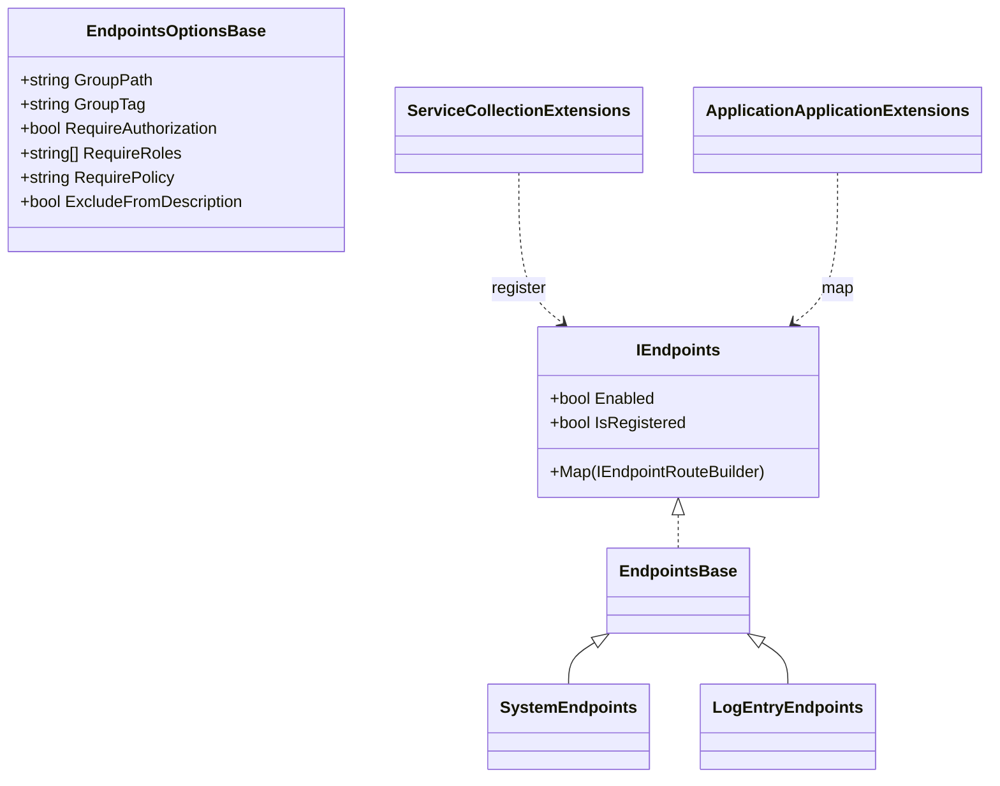
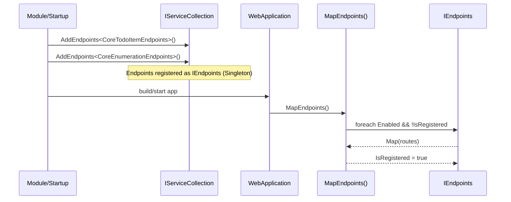

# Presentation Endpoints Feature Documentation

[TOC]

## Overview

The Endpoints feature provides a clean, modular way to define Minimal API endpoints as composable classes. Each endpoint set implements a simple contract and can be registered and mapped automatically, with optional grouping, authorization, and discovery via DI scanning.

### Challenges

- Modularity: Keep endpoint definitions isolated per feature or module.
- Discovery: Register endpoints without manual wiring for each class.
- Consistency: Apply grouping and authorization consistently across endpoints.
- Observability: Log registration to aid debugging in multi-module apps.

### Solution

- Contracts: `IEndpoints` defines the minimal surface; `EndpointsBase` provides helpers.
- Registration: DI helpers add endpoints by type, instance, or assembly scanning.
- Mapping: A single `MapEndpoints()` call maps all registered endpoints.
- Grouping & Auth: `EndpointsOptionsBase` centralizes group path, tags, and authorization.

## Core Contracts

- `IEndpoints` ([src/Presentation.Web/Endpoints/IEndpoints.cs](src/Presentation.Web/Endpoints/IEndpoints.cs))
  - `Enabled`: Toggle endpoint availability.
  - `IsRegistered`: Prevent duplicate mapping.
  - `Map(IEndpointRouteBuilder)`: Define routes.
- `EndpointsBase` ([src/Presentation.Web/Endpoints/EndpointsBase.cs](src/Presentation.Web/Endpoints/EndpointsBase.cs))
  - `MapGroup(app, options)`: Build a `RouteGroupBuilder` with path, tags, and authorization.
  - Common properties: `Enabled`, `IsRegistered`.
- `EndpointsOptionsBase` ([src/Presentation.Web/Endpoints/EndpointsOptionsBase.cs](src/Presentation.Web/Endpoints/EndpointsOptionsBase.cs))
  - `GroupPath`, `GroupTag`, `RequireAuthorization`, `RequireRoles`, `RequirePolicy`, `ExcludeFromDescription`.
- Registration helpers ([src/Presentation.Web/Endpoints/ServiceCollectionExtensions.cs](src/Presentation.Web/Endpoints/ServiceCollectionExtensions.cs))
  - `AddEndpoints(assemblies)` / `AddEndpoints(assembly)` / `AddEndpoints<T>()` / `AddEndpoints(endpoints)`.
  - Logs added endpoint types for visibility.
- Mapping extension ([src/Presentation.Web/Endpoints/ApplicationBuilderExtensions.cs](src/Presentation.Web/Endpoints/ApplicationBuilderExtensions.cs))
  - `MapEndpoints(WebApplication, RouteGroupBuilder?)`: Iterates `IEndpoints` in DI and calls `Map` when `Enabled`.

## Architecture

### Class Diagram



### Sequence (Registration → Mapping)



## Getting Started

### DI Registration

Register endpoints explicitly by type or via assembly scanning.

```csharp
// Per type
services.AddEndpoints<CoreTodoItemEndpoints>();
services.AddEndpoints<CoreEnumerationEndpoints>();

// Or register all endpoint classes from assemblies
services.AddEndpoints(AppDomain.CurrentDomain.GetAssemblies());
```

### Mapping in the Pipeline

Map all registered endpoints once during app startup.

```csharp
// After building the WebApplication
app.MapEndpoints();

// Optionally map within a preconfigured RouteGroup
var api = app.MapGroup("/api");
app.MapEndpoints(api);
```

### Grouping and Authorization

Use `EndpointsBase.MapGroup(...)` with options to enforce authorization and group metadata.

```csharp
public sealed class MyEndpoints(MyEndpointsOptions options) : EndpointsBase
{
  public override void Map(IEndpointRouteBuilder app)
  {
    var group = this.MapGroup(app, options); // path/tags/auth
    group.MapGet("items", () => Results.Ok());
  }
}

public sealed class MyEndpointsOptions : EndpointsOptionsBase
{
  public MyEndpointsOptions() { GroupPath = "/api/items"; GroupTag = "Items"; RequireAuthorization = true; }
}
```

## Built-in Endpoints

- `SystemEndpoints` ([src/Presentation.Web/Endpoints/SystemEndpoints.cs](src/Presentation.Web/Endpoints/SystemEndpoints.cs))
  - Grouped under a configurable `GroupPath`; provides `echo`, `info`, and `modules` routes based on options.
  - Options: `SystemEndpointsOptions` ([src/Presentation.Web/Endpoints/SystemEndpointsOptions.cs](src/Presentation.Web/Endpoints/SystemEndpointsOptions.cs)).
- `LogEntryEndpoints` ([src/Presentation.Web/Endpoints/LogEntryEndpoints.cs](src/Presentation.Web/Endpoints/LogEntryEndpoints.cs))
  - Minimal logging-related endpoints; configured via `LogEntryEndpointsOptions`.

- `JobSchedulingEndpoints` ([src/Presentation.Web.JobScheduling/JobSchedulingEndpoints.cs](src/Presentation.Web.JobScheduling/JobSchedulingEndpoints.cs))
  - Job management endpoints: list jobs, get job details, runs (with filters), run stats, triggers.
  - Control endpoints: trigger, pause, resume, interrupt, purge runs.
  - Uses Minimal API method chains: `Produces<T>()`, `WithName(...)`, `WithDescription(...)` for metadata.

## Example Usage

Define a minimal endpoint using `EndpointsBase` that serves `GET /echo`:

```csharp
public sealed class EchoEndpoints(EchoEndpointsOptions options) : EndpointsBase
{
  public override void Map(IEndpointRouteBuilder app)
  {
    var group = this.MapGroup("api/system").RequireAuthorization()
            .WithTags("System");

    group.MapGet("echo", ([FromQuery] string? message) =>
        TypedResults.Ok(new EchoModel{ Message = message ?? "pong" }))
      .WithName("Echo.Get")
      .WithDescription("Simple echo endpoint.")
      .Produces<EchoModel>()
      .ProducesResultProblem(StatusCodes.Status400BadRequest);
  }
}
```

From a module register endpoints by type:

```csharp
services.AddEndpoints<EchoEndpoints>();
```

Then map them once at app startup:

```csharp
app.MapEndpoints();
```

## Troubleshooting

- Endpoints not appearing: Ensure `app.MapEndpoints()` is called after DI registration.
- Authorization not enforced: Verify `EndpointsOptionsBase` settings and that `MapGroup` is used.
- Duplicate mapping: `IsRegistered` prevents re-map; avoid calling `MapEndpoints()` multiple times for the same builder.
- Discovery by assembly: Confirm assemblies contain concrete classes implementing `IEndpoints`.

## Appendix A — Minimal API Syntax

Endpoints follow ASP.NET Core Minimal API conventions via fluent mapping on `RouteGroupBuilder`.

```csharp
// Requester-based GET (Result<T> → HTTP)
group.MapGet("items", async ([FromServices] IRequester requester,
                              [FromQuery] FilterModel filter,
                              CancellationToken ct) =>
    (await requester
        .SendAsync(new ItemsFindAllQuery { Filter = filter }, cancellationToken: ct))
        .MapHttpOkAll())
  .Produces<IEnumerable<ItemModel>>()
  .Produces<ProblemDetails>(StatusCodes.Status500InternalServerError)
  .WithName("Items.Get")
  .WithDescription("Retrieves items matching the optional filter.");

// Requester-based POST create (Result<T> → HTTP)
group.MapPost("items", async ([FromServices] IRequester requester,
                               [FromBody] ItemModel model,
                               CancellationToken ct) =>
    (await requester
        .SendAsync(new ItemCreateCommand { Model = model }, cancellationToken: ct))
        .MapHttpCreated(v => $"/api/items/{v.Id}"))
  .Produces<ItemModel>(StatusCodes.Status201Created)
  .Produces<ProblemDetails>(StatusCodes.Status400BadRequest)
  .WithName("Items.Create")
  .WithDescription("Creates a new item.");

// Requester-based DELETE (Result → HTTP)
group.MapDelete("items/{id}", async ([FromServices] IRequester requester,
                                      [FromRoute] string id,
                                      CancellationToken ct) =>
    (await requester
        .SendAsync(new ItemDeleteCommand(id), cancellationToken: ct))
        .MapHttpNoContent())
  .Produces(StatusCodes.Status204NoContent)
  .Produces<ProblemDetails>(StatusCodes.Status404NotFound)
  .WithName("Items.Delete")
  .WithDescription("Deletes the specified item.");

// Requester signature (Result<T>)
// Task<Result<TValue>> SendAsync<TValue>(IRequest<TValue> request, SendOptions options = null, CancellationToken ct = default);
```

### Grouping and Authorization Options

- Build groups with `EndpointsBase.MapGroup(app, options)` for a consistent path, tags, and authorization.
- Authorization options:
  - `RequireAuthorization = true`: enforce default authorization.
  - `RequireRoles = ["Admin", "Ops"]`: role-based access via AuthorizeAttribute roles.
  - `RequirePolicy = "PolicyName"`: policy-based access.
- `ExcludeFromDescription = true`: hide endpoints from OpenAPI description.

### Result and Metadata

- Map `Result<T>` to HTTP using helpers (e.g., `MapHttpOk()`, `MapHttpOkAll()`, `MapHttpCreated(...)`, `MapHttpNoContent()`).
- Add descriptive metadata with `Produces<T>()`, `WithName(...)`, `WithDescription(...)` to improve API docs.

### Result Mapping Helpers

The endpoint examples above use the built-in mapping helpers that convert `Result` and `Result<T>` to typed Minimal API responses. These live in:

- Result helpers: [src/Presentation.Web/Result/Map/ResultMapExtensions.cs](src/Presentation.Web/Result/Map/ResultMapExtensions.cs)
- Core mapping: [src/Presentation.Web/Result/Map/ResultMapHttpExtensions.cs](src/Presentation.Web/Result/Map/ResultMapHttpExtensions.cs)

#### Helper Overview

- **`MapHttpOk<T>(Result<T>)`**: Returns `Ok<T>` on success; maps errors to `Unauthorized`, `BadRequest`, or `Problem`. For single resources.
- **`MapHttpOkAll<T>(Result<T>)`**: Returns `Ok<T>` on success without `NotFound` branch (for collections where empty is valid).
- **`MapHttpNoContent(Result)` / `MapHttpNoContent(Result<T>)`**: Returns `NoContent` on success (e.g., DELETE); handles `NotFound` and other errors.
- **`MapHttpCreated<T>(Result<T>, string uri)`**: Returns `Created<T>` with the provided URI on success.
- **`MapHttpCreated<T>(Result<T>, Func<T,string>)`**: Builds the URI from the value only when successful.
- **`MapHttpAccepted(Result, string location)` / `MapHttpAccepted<T>(Result<T>, string)`**: Returns `Accepted` for long-running operations.
- **`MapHttpAccepted<T>(Result<T>, Func<T,string>)`**: Location factory variant for `Accepted<T>`.
- **`MapHttpOkPaged<T>(ResultPaged<T>)`**: Returns `Ok<PagedResponse<T>>` with paging metadata.
- **`MapHttpFile(Result<FileContent>)`**: Returns `FileContentHttpResult` for downloads; overload accepts `Func<FileContent,string>` to derive the file name.
- **Generic `Map` overloads**: Advanced mapping to `Results<...>` with explicit success shapes (`Ok`, `NoContent`, `Created<T>`) and error variants.

All helpers perform error-to-HTTP mapping and support optional logging via `ILogger`.

#### Usage Examples

```csharp
// Paged listing (ResultPaged<T> → HTTP)
group.MapGet("items", async ([FromServices] IRequester requester, [FromQuery] int page, [FromQuery] int size, CancellationToken ct) =>
    (await requester.SendAsync(new ItemsFindPagedQuery(page, size), cancellationToken: ct))
        .MapHttpOkPaged())
  .Produces<PagedResponse<ItemModel>>()
  .WithName("Items.GetPaged");

// Long-running job trigger (Result → HTTP 202 Accepted)
group.MapPost("jobs/{id}/run", async ([FromServices] IRequester requester, [FromRoute] string id, CancellationToken ct) =>
    (await requester.SendAsync(new JobRunCommand(id), cancellationToken: ct))
        .MapHttpAccepted($"/api/jobs/{id}/runs/last"))
  .Produces<Accepted>()
  .WithName("Jobs.Run");

// File export (Result<FileContent> → HTTP file)
group.MapGet("items/export", async ([FromServices] IRequester requester, CancellationToken ct) =>
    (await requester.SendAsync(new ItemsExportQuery(), cancellationToken: ct))
        .MapHttpFile(fc => $"items-export-{DateTime.UtcNow:yyyyMMdd}.csv"))
  .Produces<FileContentHttpResult>()
  .WithName("Items.Export");
```

#### Custom Error Handlers

You can plug in custom error-to-HTTP mapping for specific Result errors. Register handlers once at startup; the registry is consulted before default mapping.

```csharp
// At startup (e.g., Program.cs)
ResultMapHttpExtensions.RegisterErrorHandler<CustomBusinessError>((logger, result) =>
{
  logger?.LogWarning("Business rule violation: {Error}", result.ToString());
  return TypedResults.Problem(
    detail: result.ToString(),
    statusCode: StatusCodes.Status422UnprocessableEntity,
    title: "Business Rule Violation",
    type: "https://example.com/errors/business-rule");
});
```

#### Notes and Constraints

- `MapHttpOk<T>`/`MapHttpCreated<T>` require `T : class`; null `Value` on success throws `InvalidOperationException`.
- `MapHttpCreated<T>` with `uriFactory` only computes the URI for successful results; failure paths ignore the URI.
- Generic `Map` overloads return typed `Results<...>` unions suitable for Minimal API signatures and OpenAPI.
- All helpers accept an optional `ILogger` to enrich error logging without changing the HTTP shape.
