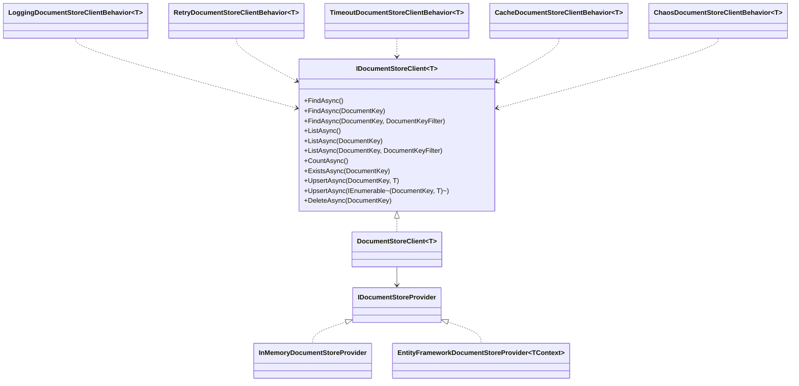
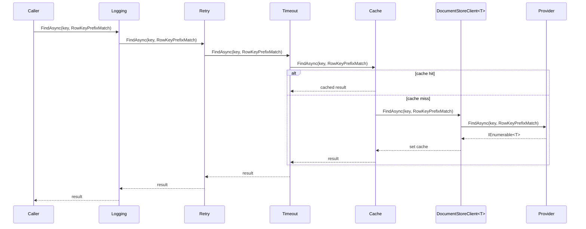
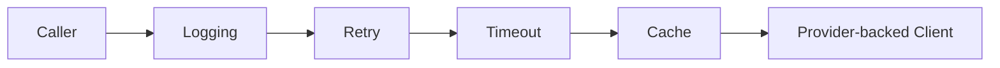

# DocumentStorage Feature Documentation

[TOC]

## Overview

Document Storage provides a simple, type-safe abstraction for storing and retrieving JSON-like documents keyed by a `DocumentKey` (partitionKey + rowKey). It focuses on straightforward CRUD operations, filtered lookups, and pluggable provider implementations, with optional client-side behaviors for resilience, caching, logging, and timeouts.

## Challenges

- Consistent access: Unified API across providers (in-memory, EF-backed, cloud) without leaking implementation details.
- Keyed access patterns: Efficient reads by partition/row keys with flexible filtering (prefix/suffix).
- Resilience and latency: Retriable operations, bounded execution time, and diagnostics.
- Caching and invalidation: Avoid repeated reads while ensuring cache is invalidated on writes.

## Solution

- Core Contracts: `IDocumentStoreClient<T>` and `IDocumentStoreProvider` define the public API and provider surface.
- Keys and Filters: `DocumentKey` and `DocumentKeyFilter` standardize lookup and listing semantics.
- Providers: In-memory and Entity Framework implementations; additional providers can be added similarly.
- Behaviors: Decorator pipeline around the client for logging, retry, timeout, caching, and chaos testing.

## Architecture

The Document Storage architecture consists of a provider-backed client decorated by optional behaviors. Consumers depend on `IDocumentStoreClient<T>`, while providers implement `IDocumentStoreProvider`.

- Components:
  - `IDocumentStoreClient<T>`: Public API for CRUD, listing, filtering, and existence checks.
  - `DocumentStoreClient<T>`: Default client that forwards to an `IDocumentStoreProvider`.
  - `IDocumentStoreProvider`: Backend contract implemented by providers (e.g., In-Memory, EF).
  - Behaviors: Decorators that wrap the client (logging, retry, timeout, cache, chaos).

### Class Diagram



### Flow Diagram



## Core Contracts

- `IDocumentStoreClient<T>` ([src/Application.Storage/Documents/IDocumentStoreClient.cs](src/Application.Storage/Documents/IDocumentStoreClient.cs))
  - **FindAsync()**: Return all entities of type `T`.
  - **FindAsync(DocumentKey)**: Return entities for an exact key.
  - **FindAsync(DocumentKey, DocumentKeyFilter)**: Return entities filtered by `FullMatch`, `RowKeyPrefixMatch`, or `RowKeySuffixMatch`.
  - **ListAsync()**: Return all `DocumentKey`s for type `T`.
  - **ListAsync(DocumentKey)**: Return `DocumentKey`s for an exact key.
  - **ListAsync(DocumentKey, DocumentKeyFilter)**: Return filtered keys by `FullMatch`, `RowKeyPrefixMatch`, or `RowKeySuffixMatch`.
  - **CountAsync()**: Return number of stored entities of type `T`.
  - **ExistsAsync(DocumentKey)**: Check if an entity exists for an exact key.
  - **UpsertAsync(DocumentKey, T)**: Insert or update a single entity.
  - **UpsertAsync(IEnumerable<(DocumentKey, T)>)**: Insert or update multiple entities.
  - **DeleteAsync(DocumentKey)**: Delete the entity for an exact key.
- `IDocumentStoreProvider` ([src/Application.Storage/Documents/IDocumentStoreProvider.cs](src/Application.Storage/Documents/IDocumentStoreProvider.cs))
  - Backend interface; `DocumentStoreClient<T>` delegates to a provider implementation.
- `DocumentStoreClient<T>` ([src/Application.Storage/Documents/DocumentStoreClient.cs](src/Application.Storage/Documents/DocumentStoreClient.cs))
  - Default client implementation that forwards all operations to the provider.
- `DocumentKey` ([src/Application.Storage/Documents/DocumentKey.cs](src/Application.Storage/Documents/DocumentKey.cs))
  - Value type: `PartitionKey`, `RowKey`.
- `DocumentKeyFilter` ([src/Application.Storage/Documents/DocumentKeyFilter.cs](src/Application.Storage/Documents/DocumentKeyFilter.cs))
  - `FullMatch`, `RowKeyPrefixMatch`, `RowKeySuffixMatch`.

## Providers

### In-Memory

- `InMemoryDocumentStoreProvider` ([src/Application.Storage/Documents/InMemory/InMemoryDocumentStoreProvider.cs](src/Application.Storage/Documents/InMemory/InMemoryDocumentStoreProvider.cs))
  - Keeps documents in a process-local store; supports all operations and filters.
  - Useful for local development, tests, or simple ephemeral storage.

### Entity Framework

- `EntityFrameworkDocumentStoreProvider<TContext>` ([src/Infrastructure.EntityFramework/Storage/Documents/EntityFrameworkDocumentStoreProvider.cs](src/Infrastructure.EntityFramework/Storage/Documents/EntityFrameworkDocumentStoreProvider.cs))
  - Persists documents in a table (see [src/Infrastructure.EntityFramework/Storage/Documents/StorageDocument.cs](src/Infrastructure.EntityFramework/Storage/Documents/StorageDocument.cs)).
  - Keys are stored as `Type`, `PartitionKey`, `RowKey`; content is serialized (System.Text.Json by default) and hashed.
  - Implements filter semantics (`FullMatch`, prefix, suffix) via LINQ queries.

### Azure Cosmos DB

- `CosmosDocumentStoreProvider` ([src/Infrastructure.Azure.Cosmos/Storage/Documents/CosmosDocumentStoreProvider.cs](src/Infrastructure.Azure.Cosmos/Storage/Documents/CosmosDocumentStoreProvider.cs))
  - Stores JSON documents in a Cosmos DB container via `ICosmosSqlProvider<CosmosStorageDocument>`.
  - Supports `FullMatch`, `RowKeyPrefixMatch`, and `RowKeySuffixMatch` filters.
  - Keys: `Type` (partition key for container), with document `PartitionKey` and `RowKey` stored per item.
  - Register: [src/Infrastructure.Azure.Cosmos/Storage/Documents/ServiceCollectionExtensions.cs](src/Infrastructure.Azure.Cosmos/Storage/Documents/ServiceCollectionExtensions.cs)

```csharp
// Using a configured CosmosClient from DI
services.AddCosmosDocumentStoreClient<Person>(cosmosClient);

// Or with options builder (container, partition key etc.)
services.AddCosmosDocumentStoreClient<Person>(o => o
    .Container("storage_documents")
    .PartitionKey(e => e.Type));
```

### Azure Blob Storage

- `AzureBlobDocumentStoreProvider` ([src/Infrastructure.Azure.Storage/Documents/AzureBlobDocumentStoreProvider.cs](src/Infrastructure.Azure.Storage/Documents/AzureBlobDocumentStoreProvider.cs))
  - Stores each entity as a blob named `<PartitionKey>__<RowKey>` in a type-scoped container.
  - Supports `FullMatch` and `RowKeyPrefixMatch` efficiently; `RowKeySuffixMatch` requires enumeration.
  - Register: [src/Infrastructure.Azure.Storage/Documents/ServiceCollectionExtensions.cs](src/Infrastructure.Azure.Storage/Documents/ServiceCollectionExtensions.cs)

```csharp
// Using a BlobServiceClient from DI
services.AddAzureBlobDocumentStoreClient<Person>();

// Or provide a specific BlobServiceClient
services.AddAzureBlobDocumentStoreClient<Person>(blobServiceClient);
```

### Azure Table Storage

- `AzureTableDocumentStoreProvider` ([src/Infrastructure.Azure.Storage/Documents/AzureTableDocumentStoreProvider.cs](src/Infrastructure.Azure.Storage/Documents/AzureTableDocumentStoreProvider.cs))
  - Stores entities as rows with `PartitionKey` and `RowKey`; includes `ContentHash` metadata.
  - Supports `FullMatch` and `RowKeyPrefixMatch`; `RowKeySuffixMatch` is not supported (throws `NotSupportedException`).
  - Register: [src/Infrastructure.Azure.Storage/Documents/ServiceCollectionExtensions.cs](src/Infrastructure.Azure.Storage/Documents/ServiceCollectionExtensions.cs)

```csharp
// Using a TableServiceClient from DI
services.AddAzureTableDocumentStoreClient<Person>();

// Or provide a specific TableServiceClient
services.AddAzureTableDocumentStoreClient<Person>(tableServiceClient);
```

## Getting Started

### DI setup

Register a client for your document type and choose a provider.

```csharp
// Register an EF-backed document client
services.AddEntityFrameworkDocumentStoreClient<Person, AppDbContext>();

// Or: Register a client with a custom factory (e.g., in-memory)
services.AddDocumentStoreClient<Person>(sp =>
{
    var provider = new InMemoryDocumentStoreProvider(sp.GetRequiredService<ILoggerFactory>());
    return new DocumentStoreClient<Person>(provider);
});
```

Add optional client behaviors (decorators):

```csharp
services.AddEntityFrameworkDocumentStoreClient<Person, AppDbContext>()
    .WithBehavior<LoggingDocumentStoreClientBehavior<Person>>()
    .WithBehavior<RetryDocumentStoreClientBehavior<Person>>()
    .WithBehavior<TimeoutDocumentStoreClientBehavior<Person>>();

// Cache behavior (requires an ICacheProvider in DI)
services.AddEntityFrameworkDocumentStoreClient<Person, AppDbContext>()
    .WithBehavior<CacheDocumentStoreClientBehavior<Person>>();
```

### Basic usage

```csharp
public sealed class PeopleService
{
    private readonly IDocumentStoreClient<Person> documents;
    public PeopleService(IDocumentStoreClient<Person> documents) => this.documents = documents;

    public async Task AddOrUpdateAsync(Person p, CancellationToken ct)
    {
        var key = new DocumentKey(partitionKey: p.Country, rowKey: p.Id.ToString());
        await documents.UpsertAsync(key, p, ct);
    }

    public async Task<IEnumerable<Person>> GetAllAsync(CancellationToken ct)
    {
        return await documents.FindAsync(ct);
    }

    public async Task<IEnumerable<Person>> FindByPrefixAsync(string country, string idPrefix, CancellationToken ct)
    {
        var key = new DocumentKey(country, idPrefix);
        return await documents.FindAsync(key, DocumentKeyFilter.RowKeyPrefixMatch, ct);
    }

    public async Task<bool> ExistsAsync(string country, string id, CancellationToken ct)
    {
        return await documents.ExistsAsync(new DocumentKey(country, id), ct);
    }

    public async Task DeleteAsync(string country, string id, CancellationToken ct)
    {
        await documents.DeleteAsync(new DocumentKey(country, id), ct);
    }
}
```

## Operations & Semantics

- **FindAsync()**: Fetch all entities of type `T`.
- **FindAsync(DocumentKey)**: Fetch entities for an exact key. Both `PartitionKey` and `RowKey` must be provided.
- **FindAsync(DocumentKey, DocumentKeyFilter)**:
  - `FullMatch`: Exact `PartitionKey` and `RowKey`.
  - `RowKeyPrefixMatch`: Exact `PartitionKey` and entities where `RowKey` starts with the provided value.
  - `RowKeySuffixMatch`: Exact `PartitionKey` and entities where `RowKey` ends with the provided value.
- **ListAsync()**: List all `DocumentKey`s for type `T`.
- **ListAsync(DocumentKey)** and **ListAsync(DocumentKey, DocumentKeyFilter)**: Same filter semantics as `FindAsync`, returning keys only.
- **CountAsync()**: Total count for type `T`.
- **ExistsAsync(DocumentKey)**: Exact match existence check.
- **UpsertAsync(DocumentKey, T)**: Insert/update a single entity.
- **UpsertAsync(IEnumerable<(DocumentKey, T)>)**: Insert/update a batch; provider may optimize for fewer writes.
- **DeleteAsync(DocumentKey)**: Remove exact entity.

## Behaviors (Client Decorators)

Behaviors are composable decorators applied to `IDocumentStoreClient<T>`. Registration order defines wrapping (outermost first). See [src/Application.Storage/Documents/DocumentStoreBuilderContext.cs](src/Application.Storage/Documents/DocumentStoreBuilderContext.cs).

- Logging: [LoggingDocumentStoreClientBehavior.cs](src/Application.Storage/Documents/Behaviors/LoggingDocumentStoreClientBehavior.cs)
  - Purpose: Structured logs for CRUD and filter operations.
- Retry: [RetryDocumentStoreClientBehavior.cs](src/Application.Storage/Documents/Behaviors/RetryDocumentStoreClientBehavior.cs)
  - Purpose: Polly-based retries for transient failures; configure attempts/backoff.
- Timeout: [TimeoutDocumentStoreClientBehavior.cs](src/Application.Storage/Documents/Behaviors/TimeoutDocumentStoreClientBehavior.cs)
  - Purpose: Enforce time budgets with Polly timeout.
- Cache: [CacheDocumentStoreClientBehavior.cs](src/Application.Storage/Documents/Behaviors/CacheDocumentStoreClientBehavior.cs)
  - Purpose: Cache common reads; invalidates on writes and deletes.
- Chaos: [ChaosDocumentStoreClientBehavior.cs](src/Application.Storage/Documents/Behaviors/ChaosDocumentStoreClientBehavior.cs)
  - Purpose: Fault injection for resilience testing (use in test/staging only).

### Built-in behavior matrix (brief)

| Behavior | Purpose | Recommended use |
|---|---|---|
| Logging | Emit operation logs and parameters | Always, for observability |
| Retry | Retry transient failures | External dependencies or intermittent stores |
| Timeout | Bound execution time | Prevent runaway calls; set sensible defaults |
| Cache | Cache read operations | Hot paths; ensure invalidation via behavior |
| Chaos | Inject failures | Test/staging only for resilience checks |

## Best Practices

- Keys: Always supply non-empty `PartitionKey`; supply `RowKey` for `FullMatch` and when using prefix/suffix filters.
- Filters: Prefer prefix filter for hierarchical keys (e.g., `user:`) and suffix for versioned or trailing identifiers.
- Batching: Use batch `UpsertAsync` for multiple writes to reduce overhead.
- Caching: Add cache behavior for hot read paths; rely on behavior invalidation after writes.
- Resilience: Combine Retry + Timeout behaviors for resilient clients; keep handlers idempotent.
- Serialization: EF provider uses System.Text.Json by default; ensure types are compatible and stable.

## Appendix A — Behaviors

Behaviors are decorators that wrap `IDocumentStoreClient<T>` to add cross-cutting concerns like logging, retries, timeouts, caching, or chaos engineering. Registration order defines wrapping (outermost first). The inner-most component is the provider-backed client (e.g., Entity Framework or In-Memory).

### Pipeline Model



- Outermost behavior sees every call first; each behavior should call through to the inner client and optionally act before/after.
- Registration uses `DocumentStoreBuilderContext<T>.WithBehavior<TBehavior>()` and composes in the order behaviors are added.

### Creating a Custom Behavior

Implement `IDocumentStoreClient<T>` and wrap an inner client. Keep methods thin, call the inner client, and add your concern around the call.

```csharp
using BridgingIT.DevKit.Application.Storage;

public sealed class MetricsDocumentStoreClientBehavior<T> : IDocumentStoreClient<T>
  where T : class, new()
{
  private readonly IDocumentStoreClient<T> inner;
  private readonly IMetrics metrics;

  public MetricsDocumentStoreClientBehavior(IDocumentStoreClient<T> inner, IMetrics metrics)
  {
    this.inner = inner;
    this.metrics = metrics;
  }

  public async Task<IEnumerable<T>> FindAsync(CancellationToken ct)
  {
    var start = Stopwatch.GetTimestamp();
    var result = await inner.FindAsync(ct);
    metrics.Observe("documents.find", Stopwatch.GetElapsedTime(start));
    return result;
  }

  public Task<IEnumerable<T>> FindAsync(DocumentKey key, CancellationToken ct = default)
    => inner.FindAsync(key, ct);

  public Task<IEnumerable<T>> FindAsync(DocumentKey key, DocumentKeyFilter filter, CancellationToken ct = default)
    => inner.FindAsync(key, filter, ct);

  public Task<IEnumerable<DocumentKey>> ListAsync(CancellationToken ct)
    => inner.ListAsync(ct);

  public Task<IEnumerable<DocumentKey>> ListAsync(DocumentKey key, CancellationToken ct = default)
    => inner.ListAsync(key, ct);

  public Task<IEnumerable<DocumentKey>> ListAsync(DocumentKey key, DocumentKeyFilter filter, CancellationToken ct = default)
    => inner.ListAsync(key, filter, ct);

  public Task<long> CountAsync(CancellationToken ct = default)
    => inner.CountAsync(ct);

  public Task<bool> ExistsAsync(DocumentKey key, CancellationToken ct = default)
    => inner.ExistsAsync(key, ct);

  public Task UpsertAsync(DocumentKey key, T entity, CancellationToken ct = default)
    => inner.UpsertAsync(key, entity, ct);

  public Task UpsertAsync(IEnumerable<(DocumentKey DocumentKey, T Entity)> entities, CancellationToken ct = default)
    => inner.UpsertAsync(entities, ct);

  public Task DeleteAsync(DocumentKey key, CancellationToken ct = default)
    => inner.DeleteAsync(key, ct);
}
```

### Registration Patterns

Behaviors are applied so that the first registered ends up as the outermost wrapper.

- Type-based decorator:

```csharp
services.AddEntityFrameworkDocumentStoreClient<Person, AppDbContext>()
  .WithBehavior<LoggingDocumentStoreClientBehavior<Person>>()
  .WithBehavior<RetryDocumentStoreClientBehavior<Person>>()
  .WithBehavior<TimeoutDocumentStoreClientBehavior<Person>>();
```

- Factory-based decorator (dependencies from DI):

```csharp
services.AddEntityFrameworkDocumentStoreClient<Person, AppDbContext>()
  .WithBehavior((inner, sp) =>
    new MetricsDocumentStoreClientBehavior<Person>(inner, sp.GetRequiredService<IMetrics>()));
```
