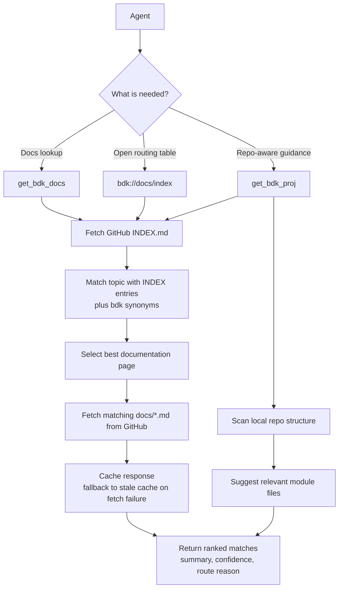
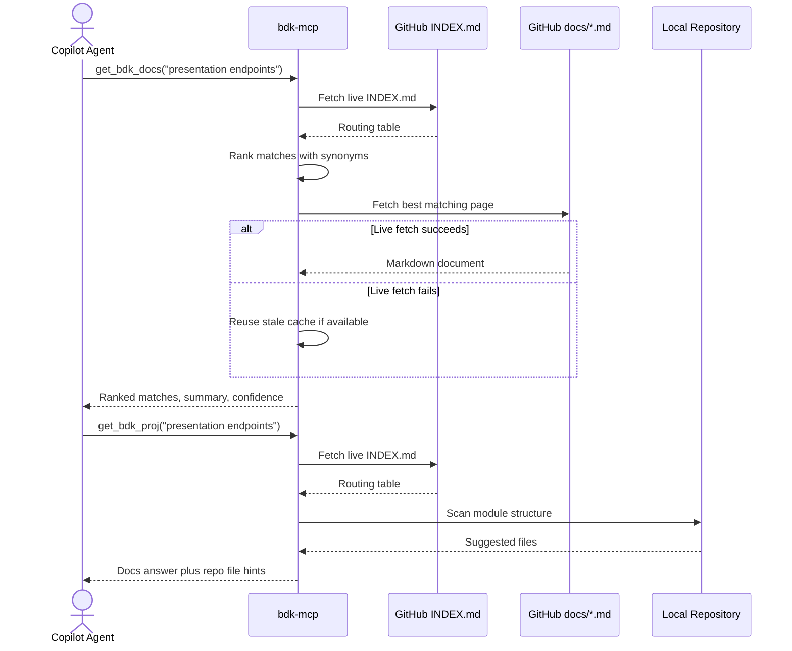

# bdk-mcp

`bdk-mcp` is a small MCP server for bdk documentation and repo-aware development guidance.

It is implemented with `dotnet-script`, runs over stdio, and always pulls the latest documentation directly from GitHub:

- `https://raw.githubusercontent.com/BridgingIT-GmbH/bITdevKit/main/docs/INDEX.md`
- `https://raw.githubusercontent.com/BridgingIT-GmbH/bITdevKit/main/docs/*.md`

The live `INDEX.md` file is treated as the routing table. The server uses it to select the best matching documentation page for a query instead of guessing file names.

This MCP is optimized for prompts that use `bdk` as shorthand as well as `bITdevKit`.

## Documentation Routing Concept

The MCP treats the bITdevKit `INDEX.md` as the authoritative routing table. Instead of guessing which markdown file might contain the answer, it resolves the topic through the index first and then loads the matching page.



The flow above shows the routing concept. This sequence view shows the actual runtime interaction between the caller, the MCP server, GitHub-hosted documentation, and the local repository.



## What It Does

- Exposes the MCP resource `bdk://docs/index`
- Exposes MCP tools `get_bdk_docs` and `get_bdk_proj`
- Routes documentation lookups through the live GitHub `INDEX.md`
- Improves matching with topic synonyms and `bdk` term expansion
- Returns ranked matches with confidence and routing rationale
- Caches live GitHub responses and falls back to stale cache on transient fetch failures
- Returns repo-specific file hints discovered from module structure for common bdk topics

## Files

- `bdk-mcp.csx`: the MCP server
- `../../.vscode/mcp.json`: the VS Code MCP configuration

## Prerequisites

- .NET SDK installed
- Visual Studio Code 1.99 or later
- GitHub Copilot with Agent mode / MCP support enabled

## Usage

1. Open the repository in VS Code.

2. Restore the repo tools from the repository root:

```powershell
dotnet tool restore
```

1. Open [.vscode/mcp.json](.vscode/mcp.json) in VS Code.

2. Start the `bdk-mcp` server from the MCP UI in VS Code.

3. Open GitHub Copilot Chat in Agent mode.

4. Use the tool or resource from Copilot.

## Example Prompts

- `Use get_bdk_docs to find bdk docs for presentation endpoints.`
- `Open the bdk://docs/index resource.`
- `Look up command and queries in bdk documentation and advice on usage in this project.`
- `Find the bdk documentation page for modules and summarize it.`
- `Use get_bdk_proj for modules and suggest exact files in this repo.`
- `Use get_bdk_proj for requester behaviors and show matching files in this repo.`
