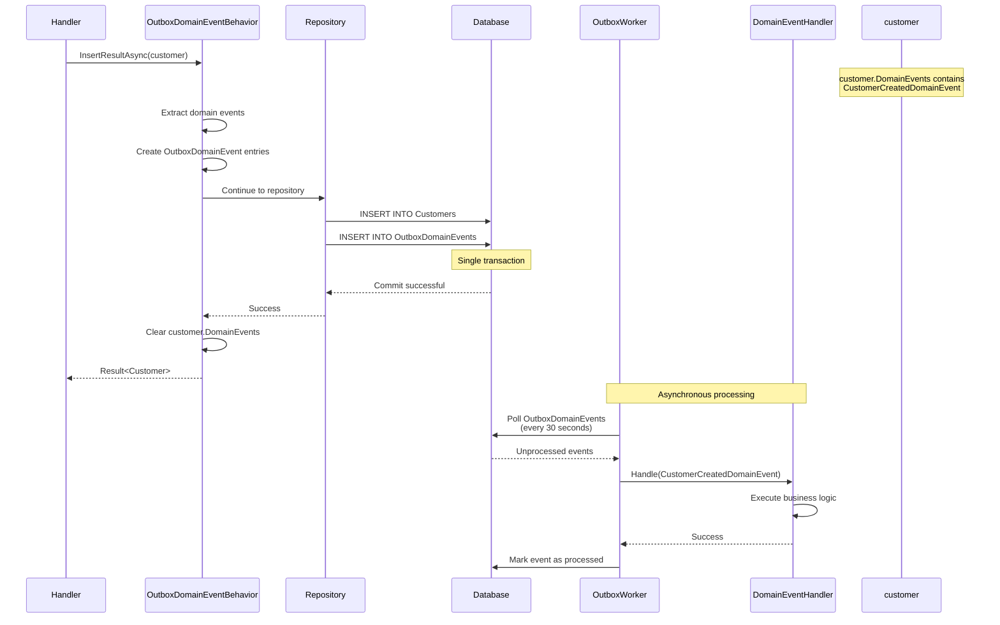

# CoreModule README - Repository Behaviors Chain Section Draft

This file contains the Repository Behaviors Chain section explaining how cross-cutting concerns are applied to repository operations.

---

## Repository Behaviors Chain

Repository behaviors implement the Decorator pattern to add cross-cutting concerns like logging, tracing, auditing, and event handling to repository operations without modifying the repository implementation itself. This section explains how the behavior chain works and how to configure it.

### Behavior Chain Architecture

```mermaid
graph LR
    Handler[Handler] -->|InsertResultAsync| Tracing[RepositoryTracingBehavior]
    Tracing --> Logging[RepositoryLoggingBehavior]
    Logging --> Audit[RepositoryAuditStateBehavior]
    Audit --> Outbox[RepositoryOutboxDomainEventBehavior]
    Outbox --> Repo[EntityFrameworkGenericRepository]
    Repo --> DbContext[CoreModuleDbContext]
    DbContext --> DB[(SQL Server)]
    
    DB -.->|Result| DbContext
    DbContext -.->|Result| Repo
    Repo -.->|Result| Outbox
    Outbox -.->|Result| Audit
    Audit -.->|Result| Logging
    Logging -.->|Result| Tracing
    Tracing -.->|Result Customer| Handler
    
    style Tracing fill:#2196F3
    style Logging fill:#2196F3
    style Audit fill:#2196F3
    style Outbox fill:#2196F3
    style Repo fill:#4CAF50
```



### Configuration in Module

Repository behaviors are configured during module registration in CoreModuleModule:

```csharp
public override IServiceCollection Register(
    IServiceCollection services,
    IConfiguration configuration,
    IWebHostEnvironment environment)
{
    // Repository setup with behavior chain
    services.AddEntityFrameworkRepository<Customer, CoreModuleDbContext>()
        .WithBehavior<RepositoryTracingBehavior<Customer>>()
        .WithBehavior<RepositoryLoggingBehavior<Customer>>()
        .WithBehavior<RepositoryAuditStateBehavior<Customer>>()
        .WithBehavior<RepositoryOutboxDomainEventBehavior<Customer, CoreModuleDbContext>>();
    
    // Configure audit behavior options
    services.AddScoped(_ => new RepositoryAuditStateBehaviorOptions 
    { 
        SoftDeleteEnabled = false 
    });
    
    return services;
}
```

Key points:
- **Order matters**: Behaviors execute in registration order (outer to inner)
- **Generic types**: Each behavior is typed to the entity (Customer)
- **Decorator pattern**: Each behavior wraps the next in the chain
- **Configuration**: Some behaviors accept options (e.g., RepositoryAuditStateBehaviorOptions)

### Execution Flow

When a handler calls repository.InsertResultAsync(customer), the execution flows through the chain:

```
Handler calls InsertResultAsync
  ?
1. RepositoryTracingBehavior
   - Start OpenTelemetry span: "Repository.Insert.Customer"
   - Set span attributes (entity type, operation)
  ?
2. RepositoryLoggingBehavior
   - Log: "Inserting Customer entity"
   - Record start time
  ?
3. RepositoryAuditStateBehavior
   - Set customer.CreatedBy = currentUser.Name
   - Set customer.CreatedDate = utcNow
   - (UpdatedBy/UpdatedDate set on updates)
  ?
4. RepositoryOutboxDomainEventBehavior
   - Extract domain events from customer.DomainEvents
   - Create OutboxDomainEvent entries
   - Will be inserted in same transaction
  ?
5. EntityFrameworkGenericRepository
   - context.Customers.Add(customer)
   - context.OutboxDomainEvents.AddRange(events)
   - context.SaveChangesAsync()
  ?
Database transaction commits
  ?
4. RepositoryOutboxDomainEventBehavior (on success)
   - Mark events as persisted
   - Clear aggregate's DomainEvents collection
  ?
3. RepositoryAuditStateBehavior (on success)
   - Audit fields now persisted in database
  ?
2. RepositoryLoggingBehavior (on success)
   - Calculate duration
   - Log: "Customer inserted successfully, Duration: 45ms"
  ?
1. RepositoryTracingBehavior (on success)
   - Set span status: OK
   - End span
  ?
Handler receives Result<Customer>
```

### Individual Behavior Breakdown

#### 1. RepositoryTracingBehavior

**Purpose**: Adds distributed tracing with OpenTelemetry.

**What it does**:
- Creates a new tracing span for each repository operation
- Sets span name: `Repository.{Operation}.{EntityType}` (e.g., "Repository.Insert.Customer")
- Adds span attributes:
  - `repository.entity_type`: "Customer"
  - `repository.operation`: "Insert"
  - `repository.entity_id`: "{entity-id}" (after operation)
- Reports success or failure to tracing backend

**Benefits**:
- Visualize repository operations in distributed traces
- Measure database operation latency
- Correlate repository calls with HTTP requests
- Identify slow queries or failed operations

**Example span in Jaeger**:
```
Repository.Insert.Customer (45ms)
  ?? attributes:
  ?   repository.entity_type: Customer
  ?   repository.operation: Insert
  ?   repository.entity_id: 123e4567-e89b-12d3-a456-426614174000
  ?? status: OK
```

**Configuration**: Automatically enabled when OpenTelemetry is configured in Program.cs.

#### 2. RepositoryLoggingBehavior

**Purpose**: Adds structured logging for repository operations.

**What it does**:
- Logs operation start with entity type and operation name
- Measures execution duration
- Logs operation completion with success/failure and duration
- Uses structured logging (properties, not string concatenation)

**Log output examples**:

**On start**:
```
[Information] Inserting Customer entity
  - EntityType: Customer
  - Operation: Insert
  - CorrelationId: 123e4567-e89b-12d3-a456-426614174000
```

**On success**:
```
[Information] Customer inserted successfully
  - EntityType: Customer
  - Operation: Insert
  - EntityId: 123e4567-e89b-12d3-a456-426614174000
  - Duration: 45ms
  - CorrelationId: 123e4567-e89b-12d3-a456-426614174000
```

**On failure**:
```
[Error] Failed to insert Customer entity
  - EntityType: Customer
  - Operation: Insert
  - Duration: 12ms
  - Error: Unique constraint violation on Email
  - CorrelationId: 123e4567-e89b-12d3-a456-426614174000
```

**Benefits**:
- Audit trail of all data modifications
- Performance monitoring (identify slow operations)
- Error investigation (what failed and why)
- Correlation with HTTP requests via CorrelationId

**Configuration**: No configuration needed; uses ILogger injected into behavior.

#### 3. RepositoryAuditStateBehavior

**Purpose**: Automatically sets audit metadata on entities.

**What it does**:
- For **Insert** operations:
  - Sets `CreatedBy` to current user (from ICurrentUserAccessor)
  - Sets `CreatedDate` to current UTC time
- For **Update** operations:
  - Sets `UpdatedBy` to current user
  - Sets `UpdatedDate` to current UTC time
- For **Delete** operations (if soft delete enabled):
  - Sets `DeletedBy` to current user
  - Sets `DeletedDate` to current UTC time
  - Sets `IsDeleted` to true

**Requirements**:
Entity must implement IAuditableEntity:
```csharp
public interface IAuditableEntity
{
    string CreatedBy { get; set; }
    DateTimeOffset CreatedDate { get; set; }
    string UpdatedBy { get; set; }
    DateTimeOffset UpdatedDate { get; set; }
}
```

Customer aggregate inherits from AuditableAggregateRoot which implements this interface.

**Configuration**:
```csharp
services.AddScoped(_ => new RepositoryAuditStateBehaviorOptions
{
    SoftDeleteEnabled = false  // Set true to enable soft deletes
});
```

**Soft delete behavior** (when enabled):
- Delete operations set flags instead of removing records
- FindAll queries automatically filter out deleted records (IsDeleted = false)
- FindOne can retrieve deleted records with special flag

**Benefits**:
- Automatic audit trail (who created/modified)
- Compliance with data regulations (GDPR, SOX)
- Debugging and troubleshooting (when was this changed?)
- Soft deletes preserve data while hiding from normal queries

**Example audit data in database**:
```sql
SELECT Id, FirstName, CreatedBy, CreatedDate, UpdatedBy, UpdatedDate
FROM Customers
WHERE Id = '123e4567-e89b-12d3-a456-426614174000'

-- Result:
-- Id: 123e4567-e89b-12d3-a456-426614174000
-- FirstName: John
-- CreatedBy: admin@example.com
-- CreatedDate: 2025-01-15 14:30:00
-- UpdatedBy: admin@example.com
-- UpdatedDate: 2025-01-16 10:15:00
```

#### 4. RepositoryOutboxDomainEventBehavior

**Purpose**: Implements the Outbox pattern for reliable domain event delivery.

**What it does**:
- Before SaveChanges: Extracts domain events from aggregates
- Converts each domain event to OutboxDomainEvent entity
- Inserts outbox events in **same transaction** as aggregate
- After SaveChanges: Clears aggregate's DomainEvents collection
- Outbox worker processes events asynchronously

**Outbox pattern benefits**:
- **Transactional consistency**: Events saved atomically with entity
- **Guaranteed delivery**: Events persisted, won't be lost
- **Retry support**: Failed event handlers can retry
- **Decoupling**: Event publishing asynchronous from business operation

**Execution flow**:



**OutboxDomainEvent table structure**:
```sql
CREATE TABLE OutboxDomainEvents
(
    Id UNIQUEIDENTIFIER PRIMARY KEY,
    EventId UNIQUEIDENTIFIER NOT NULL,
    EventType NVARCHAR(512) NOT NULL,          -- CustomerCreatedDomainEvent
    AggregateId NVARCHAR(256) NOT NULL,        -- Customer ID
    AggregateType NVARCHAR(512) NOT NULL,      -- Customer
    Content NVARCHAR(MAX) NOT NULL,            -- JSON serialized event
    OccurredOn DATETIMEOFFSET NOT NULL,        -- When event occurred
    ProcessedOn DATETIMEOFFSET NULL,           -- When event was processed
    ProcessingAttempts INT NOT NULL DEFAULT 0, -- Retry count
    ErrorMessage NVARCHAR(MAX) NULL            -- Last error if failed
)
```

**Configuration in CoreModuleModule**:
```csharp
services.AddSqlServerDbContext<CoreModuleDbContext>()
    .WithOutboxDomainEventService(o => o
        .ProcessingInterval("00:00:30")         // Poll every 30 seconds
        .ProcessingModeImmediate()              // Forward to queue immediately
        .StartupDelay("00:00:15")               // Wait 15 seconds before first poll
        .PurgeOnStartup());                     // Delete old processed events
```

**Benefits**:
- **Reliability**: Events won't be lost if handler fails
- **Idempotency**: Same event can be replayed safely
- **Monitoring**: See unprocessed events in database
- **Debugging**: Event history preserved for troubleshooting
- **Cross-module communication**: Integration events via outbox

**Event handler example** (Application layer):
```csharp
public class CustomerCreatedDomainEventHandler : 
    NotificationHandlerBase<CustomerCreatedDomainEvent>
{
    private readonly ILogger<CustomerCreatedDomainEventHandler> logger;
    
    protected override Task Handle(
        CustomerCreatedDomainEvent notification,
        CancellationToken cancellationToken)
    {
        logger.LogInformation(
            "Customer created: {CustomerId}, Email: {Email}",
            notification.Model.Id,
            notification.Model.Email);
        
        // Additional logic: send welcome email, notify other modules, etc.
        
        return Task.CompletedTask;
    }
}
```

### Behavior Ordering

**Why order matters**:
The decorator pattern means outer behaviors wrap inner behaviors. Execution flows:
1. Outer behaviors execute first on the way in
2. Inner behaviors execute closer to the actual operation
3. Inner behaviors return first on the way out
4. Outer behaviors complete last

**Current order (from module configuration)**:
```csharp
.WithBehavior<RepositoryTracingBehavior<Customer>>()           // 1?? OUTER
    .WithBehavior<RepositoryLoggingBehavior<Customer>>()       // 2??
        .WithBehavior<RepositoryAuditStateBehavior<Customer>>() // 3??
            .WithBehavior<RepositoryOutboxDomainEventBehavior<Customer, CoreModuleDbContext>>() // 4?? INNER
```

**Rationale for this order**:
1. **Tracing first**: Captures entire operation including all behaviors
2. **Logging second**: Logs complete operation including audit and event handling
3. **Audit third**: Sets metadata before events extracted
4. **Outbox innermost**: Extracts events from aggregate with audit fields already set

**What happens if we change order?** Let's say we put Outbox before Audit:
```csharp
.WithBehavior<RepositoryAuditStateBehavior<Customer>>()        // Now after Outbox
    .WithBehavior<RepositoryOutboxDomainEventBehavior<Customer, CoreModuleDbContext>>()
```

Problem: Outbox extracts events before audit fields are set. Domain event handlers won't see CreatedBy/CreatedDate in the aggregate.

**Best practice**: Put cross-cutting concerns (tracing, logging) on the outside, domain-specific concerns (audit, events) on the inside.

### Adding Custom Behaviors

You can create custom behaviors for module-specific concerns:

#### Example: RepositoryCachingBehavior

```csharp
public class RepositoryCachingBehavior<TEntity>(
    IMemoryCache cache,
    ILogger<RepositoryCachingBehavior<TEntity>> logger) 
    : RepositoryBehaviorBase<TEntity>
    where TEntity : class, IEntity
{
    protected override async Task<Result<TEntity>> FindOneResultAsync(
        object id,
        IFindOptions<TEntity> options = null,
        CancellationToken cancellationToken = default)
    {
        var cacheKey = $"{typeof(TEntity).Name}:{id}";
        
        // Try cache first
        if (cache.TryGetValue(cacheKey, out TEntity cached))
        {
            logger.LogInformation("Cache hit for {EntityType} {Id}", typeof(TEntity).Name, id);
            return Result<TEntity>.Success(cached);
        }
        
        // Cache miss - call next behavior
        var result = await base.FindOneResultAsync(id, options, cancellationToken);
        
        if (result.IsSuccess)
        {
            // Store in cache for 5 minutes
            cache.Set(cacheKey, result.Value, TimeSpan.FromMinutes(5));
            logger.LogInformation("Cached {EntityType} {Id}", typeof(TEntity).Name, id);
        }
        
        return result;
    }
    
    protected override async Task<Result<TEntity>> UpdateResultAsync(
        TEntity entity,
        CancellationToken cancellationToken = default)
    {
        // Invalidate cache on update
        var cacheKey = $"{typeof(TEntity).Name}:{entity.Id}";
        cache.Remove(cacheKey);
        
        return await base.UpdateResultAsync(entity, cancellationToken);
    }
}
```

**Registration**:
```csharp
services.AddEntityFrameworkRepository<Customer, CoreModuleDbContext>()
    .WithBehavior<RepositoryTracingBehavior<Customer>>()
    .WithBehavior<RepositoryLoggingBehavior<Customer>>()
    .WithBehavior<RepositoryCachingBehavior<Customer>>()      // Custom behavior
    .WithBehavior<RepositoryAuditStateBehavior<Customer>>()
    .WithBehavior<RepositoryOutboxDomainEventBehavior<Customer, CoreModuleDbContext>>();
```

#### Example: RepositoryMetricsBehavior

```csharp
public class RepositoryMetricsBehavior<TEntity>(
    IMeterFactory meterFactory) 
    : RepositoryBehaviorBase<TEntity>
    where TEntity : class, IEntity
{
    private readonly Counter<long> operationCounter = meterFactory
        .Create("Repository")
        .CreateCounter<long>("repository.operations");
    
    private readonly Histogram<double> operationDuration = meterFactory
        .Create("Repository")
        .CreateHistogram<double>("repository.duration");
    
    protected override async Task<Result<TEntity>> InsertResultAsync(
        TEntity entity,
        CancellationToken cancellationToken = default)
    {
        var stopwatch = Stopwatch.StartNew();
        
        try
        {
            var result = await base.InsertResultAsync(entity, cancellationToken);
            
            stopwatch.Stop();
            
            // Record metrics
            operationCounter.Add(1, new TagList
            {
                { "entity_type", typeof(TEntity).Name },
                { "operation", "Insert" },
                { "success", result.IsSuccess }
            });
            
            operationDuration.Record(stopwatch.ElapsedMilliseconds, new TagList
            {
                { "entity_type", typeof(TEntity).Name },
                { "operation", "Insert" }
            });
            
            return result;
        }
        catch (Exception ex)
        {
            operationCounter.Add(1, new TagList
            {
                { "entity_type", typeof(TEntity).Name },
                { "operation", "Insert" },
                { "success", false }
            });
            
            throw;
        }
    }
}
```

### Disabling Behaviors

To disable a behavior, simply don't register it:

```csharp
// Minimal behavior chain (tracing and logging only)
services.AddEntityFrameworkRepository<Customer, CoreModuleDbContext>()
    .WithBehavior<RepositoryTracingBehavior<Customer>>()
    .WithBehavior<RepositoryLoggingBehavior<Customer>>();
// Audit and Outbox behaviors not registered - won't execute
```

**Use cases for disabling behaviors**:
- **Testing**: Disable outbox for faster unit tests
- **Performance**: Skip logging in high-throughput scenarios
- **Legacy entities**: Some entities might not support audit fields
- **Read-only contexts**: Behaviors irrelevant for query-only repositories

### Behavior Configuration Options

Some behaviors accept configuration options:

#### RepositoryAuditStateBehaviorOptions

```csharp
services.AddScoped(_ => new RepositoryAuditStateBehaviorOptions
{
    SoftDeleteEnabled = true,                // Enable soft deletes
    SoftDeleteQueryFilter = true,            // Auto-filter deleted records in queries
    CurrentUserProvider = () => "system"     // Fallback if no user context
});
```

#### OutboxDomainEventServiceOptions

```csharp
.WithOutboxDomainEventService(o => o
    .ProcessingInterval("00:01:00")          // Process every 1 minute
    .ProcessingModeImmediate()               // Or .ProcessingModeBatched()
    .StartupDelay("00:00:30")                // Wait 30 seconds on startup
    .PurgeOnStartup()                        // Delete old events
    .MaxRetries(5)                           // Max retry attempts
    .RetryDelay("00:00:05"))                 // Delay between retries
```

### Monitoring and Troubleshooting

#### Check Outbox Events

```sql
-- Unprocessed events
SELECT * FROM OutboxDomainEvents
WHERE ProcessedOn IS NULL
ORDER BY OccurredOn;

-- Failed events
SELECT * FROM OutboxDomainEvents
WHERE ProcessingAttempts > 3
AND ProcessedOn IS NULL;

-- Recently processed
SELECT * FROM OutboxDomainEvents
WHERE ProcessedOn IS NOT NULL
ORDER BY ProcessedOn DESC;
```

#### Logs to Watch

**Successful operation**:
```
[Information] Inserting Customer entity (EntityType: Customer)
[Information] Customer inserted successfully (Duration: 45ms, EntityId: 123...)
```

**Behavior chain error**:
```
[Error] Failed to insert Customer entity (Duration: 12ms, Error: Unique constraint violation)
```

**Outbox processing**:
```
[Information] Processing outbox event (EventId: 456..., EventType: CustomerCreatedDomainEvent)
[Information] Outbox event processed successfully (EventId: 456...)
```

#### Tracing Spans

In Jaeger/Zipkin, you'll see nested spans:
```
HTTP POST /api/coremodule/customers (200ms)
  ?? CustomerCreateCommandHandler (180ms)
  ?   ?? Repository.Insert.Customer (45ms)
  ?       ?? SQL: INSERT INTO Customers (30ms)
  ?       ?? SQL: INSERT INTO OutboxDomainEvents (5ms)
  ?? Map to CustomerModel (10ms)
```

### Best Practices

**Do**:
- Register behaviors in logical order (tracing/logging outer, domain concerns inner)
- Configure soft deletes via options, not by modifying behavior code
- Use outbox for reliable event delivery
- Monitor unprocessed events in OutboxDomainEvents table
- Test behaviors independently with repository test doubles

**Don't**:
- Access DbContext directly in custom behaviors (use base methods)
- Put business logic in behaviors (belongs in domain or handlers)
- Skip tracing behavior (needed for distributed tracing)
- Disable outbox if using domain events (events won't be delivered)
- Forget to clear cache in update/delete custom behaviors

### Behavior Checklist

When adding a custom behavior:
1. Inherit from RepositoryBehaviorBase&lt;TEntity&gt;
2. Override specific operation methods (Insert, Update, Delete, FindOne, FindAll)
3. Call await base.MethodAsync(...) to continue chain
4. Handle both success and failure cases
5. Log important actions with structured logging
6. Register in module with .WithBehavior&lt;CustomBehavior&lt;TEntity&gt;&gt;()
7. Consider ordering relative to other behaviors
8. Write unit tests for behavior in isolation
9. Document configuration options if any
10. Monitor behavior execution in production

---

## Next Section: Domain Events Flow

Continue to [Domain Events Flow](#domain-events-flow) to understand how domain events are registered, persisted via outbox, and handled asynchronously.
