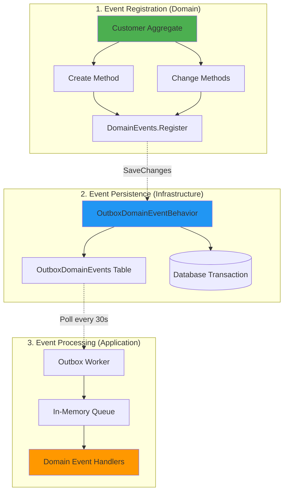
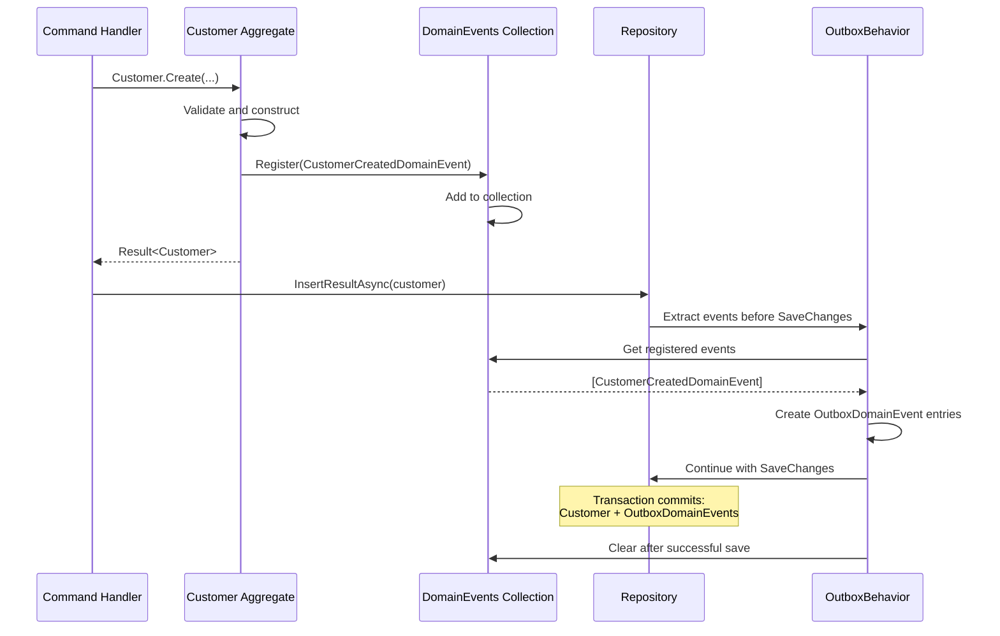
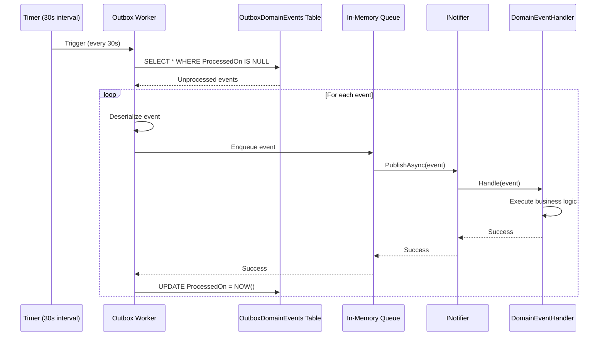

# CoreModule README - Domain Events Flow Section Draft

This file contains the Domain Events Flow section explaining how domain events are registered, persisted, and handled.

---

## Domain Events Flow

Domain events represent significant occurrences in the domain that domain experts care about. They enable loose coupling between aggregates and allow side effects to be handled asynchronously without polluting domain logic. This section explains the complete domain event lifecycle in the CoreModule.

### Domain Events Overview



### Event Lifecycle Stages

1. **Registration**: Aggregate registers events during creation or state changes
2. **Persistence**: Repository behavior persists events to outbox table transactionally
3. **Processing**: Outbox worker polls events and dispatches to handlers
4. **Handling**: Application-layer handlers execute business logic

---

## Stage 1: Event Registration in Aggregates

### Event Classes (Domain Layer)

Domain events inherit from `DomainEventBase` and live in `CoreModule.Domain/Events/`:

**CustomerCreatedDomainEvent**:
```csharp
public partial class CustomerCreatedDomainEvent(Customer model) : DomainEventBase
{
    /// <summary>
    /// Gets the created Customer aggregate instance that triggered this event.
    /// </summary>
    public Customer Model { get; private set; } = model;
}
```

**CustomerUpdatedDomainEvent**:
```csharp
public partial class CustomerUpdatedDomainEvent(Customer model) : DomainEventBase
{
    /// <summary>
    /// Gets the updated Customer aggregate instance that triggered this event.
    /// </summary>
    public Customer Model { get; private set; } = model;
}
```

Key characteristics:
- **Immutable**: Events represent facts that happened; they cannot change
- **Domain-focused**: Contain domain entities or value objects, not DTOs
- **Named in past tense**: CustomerCreated, CustomerUpdated (not CustomerCreate, CustomerUpdate)
- **Self-describing**: Event name and properties clearly indicate what happened

### Registering Events in Aggregates

Events are registered using the `DomainEvents.Register()` method:

#### During Creation

```csharp
public static Result<Customer> Create(
    string firstName, 
    string lastName, 
    string email, 
    CustomerNumber number)
{
    var emailAddressResult = EmailAddress.Create(email);
    if (emailAddressResult.IsFailure)
    {
        return emailAddressResult.Unwrap();
    }
    
    var customer = new Customer(firstName, lastName, emailAddressResult.Value, number);
    
    // Register creation event
    customer.DomainEvents.Register(
        new CustomerCreatedDomainEvent(customer));
    
    return customer;
}
```

What happens:
- Customer created in valid state
- CustomerCreatedDomainEvent registered with aggregate reference
- Event stored in aggregate's internal `DomainEvents` collection
- Event not persisted yet (happens during SaveChanges)

#### During Updates

```csharp
public Result<Customer> ChangeEmail(string email)
{
    if (string.IsNullOrEmpty(email))
    {
        return Result<Customer>.Failure(this, "Invalid email");
    }
    
    var emailResult = EmailAddress.Create(email);
    if (emailResult.IsFailure)
    {
        return emailResult.Unwrap();
    }
    
    // Only change if different
    return this.ApplyChange(this.Email, emailResult.Value, v => this.Email = v);
}

private Result<Customer> ApplyChange<T>(
    T currentValue, 
    T newValue, 
    Action<T> action)
{
    // No-op if value hasn't changed
    if (EqualityComparer<T>.Default.Equals(currentValue, newValue))
    {
        return Result<Customer>.Success(this);
    }
    
    action(newValue); // Apply the change
    
    // Register update events (second parameter: replace if exists)
    this.DomainEvents.Register(
        new CustomerUpdatedDomainEvent(this), replace: true);
    
    this.DomainEvents.Register(
        new EntityUpdatedDomainEvent<Customer>(this), replace: true);
    
    return this;
}
```

**ApplyChange pattern benefits**:
- **Idempotent**: No event registered if value unchanged
- **Consistent**: All Change methods use same pattern
- **Event deduplication**: `replace: true` prevents duplicate update events
- **Generic updater**: Works for any property type
- **Chainable**: Returns Result for fluent API

**Why two update events?**
- `CustomerUpdatedDomainEvent`: Specific to Customer aggregate
- `EntityUpdatedDomainEvent<Customer>`: Generic event for cross-cutting concerns
- Allows both specific and generic handlers

### Event Registration Flow



### Multiple Events in One Operation

Aggregates can register multiple events:

```csharp
var customer = Customer.Create("John", "Doe", "john@example.com", number).Value;

// First event registered: CustomerCreatedDomainEvent

customer.ChangeStatus(CustomerStatus.Active);
// Second event registered: CustomerUpdatedDomainEvent

// Both events persisted when repository.InsertResultAsync() is called
await repository.InsertResultAsync(customer);
```

Result: Two events in OutboxDomainEvents table, same aggregate ID, different event types.

---

## Stage 2: Event Persistence via Outbox Pattern

The Outbox pattern ensures domain events are persisted atomically with the aggregate. See [Repository Behaviors Chain](#repository-behaviors-chain) for detailed OutboxDomainEventBehavior explanation.

### OutboxDomainEventBehavior Flow

```csharp
// Simplified behavior pseudocode
protected override async Task<Result<TEntity>> InsertResultAsync(
    TEntity entity,
    CancellationToken cancellationToken)
{
    // 1. Extract domain events from aggregate
    var events = entity.DomainEvents.GetAll();
    
    // 2. Convert to outbox events
    var outboxEvents = events.Select(e => new OutboxDomainEvent
    {
        EventId = Guid.NewGuid(),
        EventType = e.GetType().FullName,
        AggregateId = entity.Id.ToString(),
        AggregateType = typeof(TEntity).Name,
        Content = JsonSerializer.Serialize(e),
        OccurredOn = DateTimeOffset.UtcNow
    });
    
    // 3. Add to DbContext (same transaction)
    dbContext.OutboxDomainEvents.AddRange(outboxEvents);
    
    // 4. Call next behavior in chain
    var result = await base.InsertResultAsync(entity, cancellationToken);
    
    // 5. Clear events after successful save
    if (result.IsSuccess)
    {
        entity.DomainEvents.Clear();
    }
    
    return result;
}
```

### OutboxDomainEvents Table

```sql
CREATE TABLE OutboxDomainEvents
(
    Id UNIQUEIDENTIFIER PRIMARY KEY,
    EventId UNIQUEIDENTIFIER NOT NULL,
    EventType NVARCHAR(512) NOT NULL,          -- Full type name
    AggregateId NVARCHAR(256) NOT NULL,        -- Customer ID
    AggregateType NVARCHAR(512) NOT NULL,      -- "Customer"
    Content NVARCHAR(MAX) NOT NULL,            -- Serialized event JSON
    OccurredOn DATETIMEOFFSET NOT NULL,        -- When event occurred
    ProcessedOn DATETIMEOFFSET NULL,           -- When handler completed
    ProcessingAttempts INT NOT NULL DEFAULT 0, -- Retry counter
    ErrorMessage NVARCHAR(MAX) NULL            -- Last error if failed
)
```

**Example record after Customer.Create**:
```json
{
  "Id": "550e8400-e29b-41d4-a716-446655440000",
  "EventId": "6ba7b810-9dad-11d1-80b4-00c04fd430c8",
  "EventType": "BridgingIT.DevKit.Examples.GettingStarted.Modules.CoreModule.Domain.Events.CustomerCreatedDomainEvent",
  "AggregateId": "123e4567-e89b-12d3-a456-426614174000",
  "AggregateType": "Customer",
  "Content": "{\"Model\":{\"Id\":\"123e4567-e89b-12d3-a456-426614174000\",\"FirstName\":\"John\",\"LastName\":\"Doe\",\"Email\":\"john@example.com\"}}",
  "OccurredOn": "2025-01-15T14:30:00Z",
  "ProcessedOn": null,
  "ProcessingAttempts": 0,
  "ErrorMessage": null
}
```

### Transactional Consistency Guarantee

```sql
BEGIN TRANSACTION
  -- Insert aggregate
  INSERT INTO Customers (Id, FirstName, LastName, Email, ...)
  VALUES ('123...', 'John', 'Doe', 'john@example.com', ...)
  
  -- Insert event (same transaction)
  INSERT INTO OutboxDomainEvents (Id, EventId, EventType, AggregateId, Content, ...)
  VALUES ('550...', '6ba...', 'CustomerCreatedDomainEvent', '123...', '{...}', ...)
COMMIT
```

**What this guarantees**:
- If aggregate save fails ? no event persisted
- If event save fails ? no aggregate persisted (rollback)
- Both succeed or both fail (atomicity)
- No lost events, no inconsistent state

---

## Stage 3: Event Processing by Outbox Worker

### Outbox Worker Configuration

Configured in CoreModuleModule:

```csharp
services.AddSqlServerDbContext<CoreModuleDbContext>()
    .WithOutboxDomainEventService(o => o
        .ProcessingInterval("00:00:30")       // Poll every 30 seconds
        .ProcessingModeImmediate()            // Forward to queue immediately
        .StartupDelay("00:00:15")             // Wait 15 seconds on startup
        .PurgeOnStartup());                   // Delete old processed events
```

### Worker Execution Flow



### Processing Modes

**Immediate Mode** (configured):
```csharp
.ProcessingModeImmediate()
```
- Events dispatched to in-memory queue immediately
- Handlers execute asynchronously
- Fast feedback for event handlers
- Used in this project

**Batched Mode** (alternative):
```csharp
.ProcessingModeBatched()
```
- Events processed in batches
- Better performance for high-volume scenarios
- Handlers execute in parallel where possible

### Error Handling and Retries

If a handler fails:

```sql
-- Event marked with error, not deleted
UPDATE OutboxDomainEvents
SET ProcessingAttempts = ProcessingAttempts + 1,
    ErrorMessage = 'Handler threw exception: ...'
WHERE Id = '550...'
```

Worker retries on next poll:
- Configurable max retries (default: 3)
- Exponential backoff between retries
- Dead letter after max retries exceeded

**Monitoring failed events**:
```sql
SELECT * FROM OutboxDomainEvents
WHERE ProcessingAttempts > 3
AND ProcessedOn IS NULL
ORDER BY OccurredOn
```

---

## Stage 4: Event Handling in Application Layer

### Event Handler Base Class

All domain event handlers inherit from `DomainEventHandlerBase<TEvent>`:

```csharp
public class CustomerCreatedDomainEventHandler(ILoggerFactory loggerFactory)
    : DomainEventHandlerBase<CustomerCreatedDomainEvent>(loggerFactory)
{
    /// <summary>
    /// Determines whether this handler can process the event.
    /// </summary>
    public override bool CanHandle(CustomerCreatedDomainEvent notification) => true;
    
    /// <summary>
    /// Processes the event. Execute business logic here.
    /// </summary>
    public override Task Process(
        CustomerCreatedDomainEvent notification, 
        CancellationToken cancellationToken)
    {
        // Business logic: send welcome email, create projections, etc.
        this.Logger.LogInformation(
            "Customer {CustomerId} created with email {Email}",
            notification.Model.Id,
            notification.Model.Email.Value);
        
        return Task.CompletedTask;
    }
}
```

### Handler Registration

Handlers are automatically discovered and registered:

```csharp
// In Program.cs
builder.Services.AddNotifier()
    .AddHandlers()          // Scans for INotificationHandler implementations
    .WithDefaultBehaviors(); // Adds cross-cutting behaviors
```

No manual registration needed - handlers auto-registered by convention.

### Multiple Handlers for Same Event

Multiple handlers can process the same event:

```csharp
// Handler 1: Send welcome email
public class CustomerCreatedEmailHandler : 
    DomainEventHandlerBase<CustomerCreatedDomainEvent>
{
    public override Task Process(
        CustomerCreatedDomainEvent notification, 
        CancellationToken cancellationToken)
    {
        // Send welcome email
        return emailService.SendWelcomeEmailAsync(notification.Model.Email);
    }
}

// Handler 2: Create audit log
public class CustomerCreatedAuditHandler : 
    DomainEventHandlerBase<CustomerCreatedDomainEvent>
{
    public override Task Process(
        CustomerCreatedDomainEvent notification, 
        CancellationToken cancellationToken)
    {
        // Log to audit system
        return auditService.LogCustomerCreatedAsync(notification.Model);
    }
}

// Handler 3: Update read model
public class CustomerCreatedReadModelHandler : 
    DomainEventHandlerBase<CustomerCreatedDomainEvent>
{
    public override Task Process(
        CustomerCreatedDomainEvent notification, 
        CancellationToken cancellationToken)
    {
        // Update denormalized read model
        return readModelRepository.UpsertAsync(notification.Model);
    }
}
```

**All three handlers execute for each CustomerCreatedDomainEvent**.

### Handler Execution Order

Handlers execute **sequentially** by default:
1. CustomerCreatedEmailHandler
2. CustomerCreatedAuditHandler
3. CustomerCreatedReadModelHandler

If one handler fails:
- Subsequent handlers don't execute
- Event marked with error in outbox
- Event retried on next worker poll
- Failed handler retried (other handlers re-execute)

**Best practice**: Keep handlers idempotent (safe to execute multiple times).

### Generic Event Handlers

Handle all events of a base type:

```csharp
// Handler for all EntityUpdatedDomainEvent<T>
public class CustomerUpdatedDomainEventHandler2 : 
    DomainEventHandlerBase<EntityUpdatedDomainEvent<Customer>>
{
    public override bool CanHandle(EntityUpdatedDomainEvent<Customer> notification)
    {
        return true; // Process all Customer update events
    }
    
    public override Task Process(
        EntityUpdatedDomainEvent<Customer> notification, 
        CancellationToken cancellationToken)
    {
        this.Logger.LogInformation(
            "Generic customer updated handler: {CustomerId}",
            notification.Entity.Id);
        
        return Task.CompletedTask;
    }
}
```

This handler executes **in addition to** `CustomerUpdatedDomainEventHandler`.

### Advanced Handler Scenarios

#### Conditional Handling

```csharp
public class CustomerActivatedEmailHandler : 
    DomainEventHandlerBase<CustomerUpdatedDomainEvent>
{
    public override bool CanHandle(CustomerUpdatedDomainEvent notification)
    {
        // Only handle if status changed to Active
        return notification.Model.Status == CustomerStatus.Active;
    }
    
    public override Task Process(
        CustomerUpdatedDomainEvent notification, 
        CancellationToken cancellationToken)
    {
        // Send account activation email
        return emailService.SendActivationEmailAsync(notification.Model.Email);
    }
}
```

#### Handler with Dependencies

```csharp
public class CustomerCreatedNotificationHandler(
    ILoggerFactory loggerFactory,
    IEmailService emailService,
    IGenericRepository<Customer> repository) 
    : DomainEventHandlerBase<CustomerCreatedDomainEvent>(loggerFactory)
{
    public override async Task Process(
        CustomerCreatedDomainEvent notification, 
        CancellationToken cancellationToken)
    {
        // Verify customer still exists (idempotency check)
        var exists = await repository.ExistsAsync(
            c => c.Id == notification.Model.Id, 
            cancellationToken: cancellationToken);
        
        if (!exists)
        {
            this.Logger.LogWarning(
                "Customer {CustomerId} not found, skipping notification",
                notification.Model.Id);
            return;
        }
        
        // Send notification
        await emailService.SendWelcomeEmailAsync(
            notification.Model.Email.Value, 
            notification.Model.FirstName,
            cancellationToken);
        
        this.Logger.LogInformation(
            "Welcome email sent to {Email}",
            notification.Model.Email.Value);
    }
}
```

**Idempotency pattern**: Check if work already done before executing.

---

## Integration Events (Cross-Module Communication)

Domain events are internal to a module. For cross-module communication, use **Integration Events**.

### Integration Event Pattern

```csharp
// Domain event (internal to CoreModule)
public class CustomerCreatedDomainEvent(Customer model) : DomainEventBase
{
    public Customer Model { get; } = model;
}

// Integration event (published to other modules)
public class CustomerCreatedIntegrationEvent
{
    public Guid CustomerId { get; init; }
    public string Email { get; init; }
    public DateTimeOffset CreatedAt { get; init; }
}

// Handler publishes integration event
public class CustomerCreatedIntegrationEventPublisher(
    ILoggerFactory loggerFactory,
    INotifier notifier) 
    : DomainEventHandlerBase<CustomerCreatedDomainEvent>(loggerFactory)
{
    public override async Task Process(
        CustomerCreatedDomainEvent notification, 
        CancellationToken cancellationToken)
    {
        // Convert domain event to integration event
        var integrationEvent = new CustomerCreatedIntegrationEvent
        {
            CustomerId = notification.Model.Id,
            Email = notification.Model.Email.Value,
            CreatedAt = notification.Model.CreatedDate
        };
        
        // Publish to other modules
        await notifier.PublishAsync(integrationEvent, cancellationToken);
        
        this.Logger.LogInformation(
            "Integration event published for customer {CustomerId}",
            notification.Model.Id);
    }
}
```

### Integration Event Handler (Other Module)

```csharp
// In InventoryModule.Application
public class CustomerCreatedInventoryHandler : 
    NotificationHandlerBase<CustomerCreatedIntegrationEvent>
{
    protected override Task Handle(
        CustomerCreatedIntegrationEvent notification, 
        CancellationToken cancellationToken)
    {
        // InventoryModule reacts to new customer
        // Create default inventory allocation, etc.
        this.Logger.LogInformation(
            "Creating inventory allocation for customer {CustomerId}",
            notification.CustomerId);
        
        return Task.CompletedTask;
    }
}
```

**Key differences**:
- Domain events: Rich (contain full aggregate)
- Integration events: Lean (only essential data)
- Domain events: Module-internal
- Integration events: Cross-module contracts

---

## Event-Driven Workflows

### Saga Pattern Example

Complex workflows spanning multiple aggregates:

```csharp
// Workflow: New customer ? Send welcome email ? Create loyalty account

// Step 1: Domain event handler sends email
public class CustomerCreatedWelcomeEmailHandler : 
    DomainEventHandlerBase<CustomerCreatedDomainEvent>
{
    public override async Task Process(
        CustomerCreatedDomainEvent notification, 
        CancellationToken cancellationToken)
    {
        await emailService.SendWelcomeEmailAsync(notification.Model.Email);
        
        // Publish event to trigger next step
        await notifier.PublishAsync(
            new CustomerWelcomeEmailSentEvent(notification.Model.Id), 
            cancellationToken);
    }
}

// Step 2: Email sent event handler creates loyalty account
public class CustomerWelcomeEmailSentLoyaltyHandler : 
    NotificationHandlerBase<CustomerWelcomeEmailSentEvent>
{
    protected override async Task Handle(
        CustomerWelcomeEmailSentEvent notification, 
        CancellationToken cancellationToken)
    {
        var loyaltyAccount = LoyaltyAccount.Create(notification.CustomerId);
        await loyaltyRepository.InsertResultAsync(loyaltyAccount, cancellationToken);
        
        this.Logger.LogInformation(
            "Loyalty account created for customer {CustomerId}",
            notification.CustomerId);
    }
}
```

**Benefits**:
- Each handler has single responsibility
- Workflow steps decoupled
- Easy to add/remove steps
- Failures isolated to individual steps

---

## Testing Domain Events

### Unit Testing Event Registration

```csharp
[Fact]
public void Create_ShouldRegisterCustomerCreatedEvent()
{
    // Arrange
    var firstName = "John";
    var lastName = "Doe";
    var email = "john@example.com";
    var number = CustomerNumber.Create(2025, 100000).Value;
    
    // Act
    var result = Customer.Create(firstName, lastName, email, number);
    
    // Assert
    result.ShouldBeSuccess();
    var customer = result.Value;
    
    var events = customer.DomainEvents.GetAll();
    events.ShouldHaveSingleItem();
    events.First().ShouldBeOfType<CustomerCreatedDomainEvent>();
    
    var createdEvent = (CustomerCreatedDomainEvent)events.First();
    createdEvent.Model.ShouldBe(customer);
}
```

### Unit Testing Change Methods

```csharp
[Fact]
public void ChangeEmail_WhenValueDifferent_ShouldRegisterUpdatedEvent()
{
    // Arrange
    var customer = Customer.Create("John", "Doe", "john@example.com", number).Value;
    customer.DomainEvents.Clear(); // Clear creation event
    
    // Act
    var result = customer.ChangeEmail("jane@example.com");
    
    // Assert
    result.ShouldBeSuccess();
    
    var events = customer.DomainEvents.GetAll();
    events.ShouldContain(e => e is CustomerUpdatedDomainEvent);
}

[Fact]
public void ChangeEmail_WhenValueSame_ShouldNotRegisterEvent()
{
    // Arrange
    var customer = Customer.Create("John", "Doe", "john@example.com", number).Value;
    customer.DomainEvents.Clear();
    
    // Act
    var result = customer.ChangeEmail("john@example.com"); // Same email
    
    // Assert
    result.ShouldBeSuccess();
    customer.DomainEvents.GetAll().ShouldBeEmpty(); // No event registered
}
```

### Testing Event Handlers

```csharp
[Fact]
public async Task Process_ShouldLogCustomerCreation()
{
    // Arrange
    var loggerFactory = Substitute.For<ILoggerFactory>();
    var logger = Substitute.For<ILogger>();
    loggerFactory.CreateLogger(Arg.Any<string>()).Returns(logger);
    
    var handler = new CustomerCreatedDomainEventHandler(loggerFactory);
    var customer = Customer.Create("John", "Doe", "john@example.com", number).Value;
    var notification = new CustomerCreatedDomainEvent(customer);
    
    // Act
    await handler.Process(notification, CancellationToken.None);
    
    // Assert
    logger.Received(1).Log(
        LogLevel.Information,
        Arg.Any<EventId>(),
        Arg.Is<object>(o => o.ToString().Contains("CustomerCreatedDomainEvent handled")),
        null,
        Arg.Any<Func<object, Exception, string>>());
}
```

### Integration Testing Outbox

```csharp
[Fact]
public async Task InsertCustomer_ShouldPersistEventToOutbox()
{
    // Arrange
    var customer = Customer.Create("John", "Doe", "john@example.com", number).Value;
    
    // Act
    await repository.InsertResultAsync(customer);
    
    // Assert - Check outbox table
    var outboxEvents = await dbContext.OutboxDomainEvents
        .Where(e => e.AggregateId == customer.Id.ToString())
        .ToListAsync();
    
    outboxEvents.ShouldHaveSingleItem();
    outboxEvents.First().EventType.ShouldContain("CustomerCreatedDomainEvent");
    outboxEvents.First().ProcessedOn.ShouldBeNull(); // Not processed yet
}
```

---

## Monitoring and Troubleshooting

### Check Unprocessed Events

```sql
-- Events waiting to be processed
SELECT 
    Id,
    EventType,
    AggregateId,
    OccurredOn,
    ProcessingAttempts,
    ErrorMessage
FROM OutboxDomainEvents
WHERE ProcessedOn IS NULL
ORDER BY OccurredOn;
```

### Check Failed Events

```sql
-- Events that failed multiple times
SELECT 
    Id,
    EventType,
    AggregateId,
    OccurredOn,
    ProcessingAttempts,
    ErrorMessage
FROM OutboxDomainEvents
WHERE ProcessingAttempts >= 3
AND ProcessedOn IS NULL
ORDER BY OccurredOn DESC;
```

### Check Processing Rate

```sql
-- Events processed in last hour
SELECT 
    EventType,
    COUNT(*) as ProcessedCount,
    AVG(DATEDIFF(SECOND, OccurredOn, ProcessedOn)) as AvgProcessingTimeSeconds
FROM OutboxDomainEvents
WHERE ProcessedOn >= DATEADD(HOUR, -1, GETUTCDATE())
GROUP BY EventType
ORDER BY ProcessedCount DESC;
```

### Manually Reprocess Failed Event

```sql
-- Reset event for reprocessing
UPDATE OutboxDomainEvents
SET ProcessedOn = NULL,
    ProcessingAttempts = 0,
    ErrorMessage = NULL
WHERE Id = '550e8400-e29b-41d4-a716-446655440000';
```

Outbox worker will pick it up on next poll.

### Logs to Watch

**Event registration**:
```
[Debug] Domain event registered: CustomerCreatedDomainEvent, Aggregate: Customer, Id: 123...
```

**Event persistence**:
```
[Information] Outbox events persisted: 1 event(s) for aggregate Customer (123...)
```

**Event processing**:
```
[Information] Processing outbox event: CustomerCreatedDomainEvent, EventId: 6ba...
[Information] CustomerCreatedDomainEvent handled in Application
[Information] Outbox event processed successfully: EventId: 6ba...
```

**Handler error**:
```
[Error] Failed to process outbox event: EventId: 6ba..., Error: SmtpException: Unable to send email
[Warning] Outbox event will be retried: EventId: 6ba..., Attempt: 1/3
```

---

## Best Practices

**Do**:
- Register events in aggregate methods (Create, Change)
- Use past tense for event names (Created, Updated)
- Keep events immutable
- Make handlers idempotent (safe to retry)
- Use CanHandle() for conditional processing
- Log important actions in handlers
- Monitor OutboxDomainEvents table
- Test event registration in domain logic

**Don't**:
- Register events from handlers (belongs in domain)
- Put business logic in events (events are data)
- Access repository from event constructors
- Throw exceptions from handlers for business failures (use logging)
- Create circular event chains (Event A ? Handler B ? Event C ? Handler A)
- Include sensitive data in integration events
- Forget to clear events after failed handler (prevents duplicate processing)

---

## Event Checklist

When adding a new domain event:
1. Create event class inheriting from `DomainEventBase` in `Domain/Events/`
2. Include necessary data (aggregate reference or essential properties)
3. Make event immutable (init-only or private setters)
4. Register event in aggregate method using `DomainEvents.Register()`
5. Use `replace: true` for update events to prevent duplicates
6. Create handler inheriting from `DomainEventHandlerBase<TEvent>` in `Application/Events/`
7. Implement `CanHandle()` for conditional processing
8. Implement `Process()` with business logic
9. Make handler idempotent (check if work already done)
10. Add unit tests for event registration
11. Add unit tests for handler logic
12. Add integration test for outbox persistence

---

## Summary

Domain events enable:
- **Loose coupling**: Aggregates don't know about side effects
- **Single Responsibility**: Each handler has focused purpose
- **Auditability**: Complete event history in outbox
- **Reliability**: Transactional consistency with outbox pattern
- **Testability**: Events and handlers testable independently
- **Extensibility**: Add new handlers without changing domain

The outbox pattern ensures:
- **Atomicity**: Events persisted with aggregate in same transaction
- **Reliability**: Events guaranteed to be delivered
- **At-least-once delivery**: Handlers may execute multiple times (must be idempotent)
- **Ordering**: Events processed in order they occurred

---

## Next Section: Testing Strategy

Continue to [Testing Strategy](#testing-strategy) to understand unit, integration, and architecture testing approaches.
