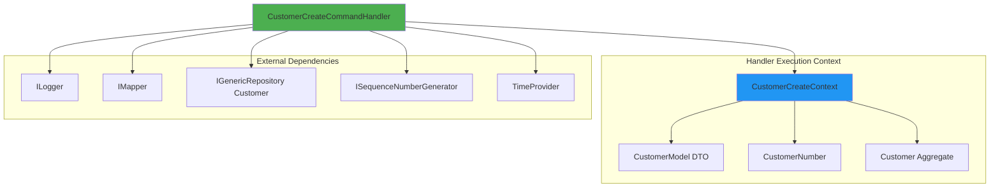

# CoreModule README - Handler Deep Dive Section Draft

This file contains the Handler Deep Dive section explaining command/query handlers in detail.

---

## Handler Deep Dive

Handlers are the heart of the Application layer, orchestrating use cases by coordinating domain logic, validation, persistence, and mapping. This section provides a detailed walkthrough of the CustomerCreateCommandHandler to understand the handler pattern thoroughly.

### Handler Architecture



### Handler Base Class

All command and query handlers inherit from RequestHandlerBase:

```csharp
public class CustomerCreateCommandHandler : 
    RequestHandlerBase<CustomerCreateCommand, CustomerModel>
{
    protected override async Task<Result<CustomerModel>> HandleAsync(
        CustomerCreateCommand request,
        SendOptions options,
        CancellationToken cancellationToken)
    {
        // Handler implementation
    }
}
```

Key aspects:
- Generic parameters: TRequest (CustomerCreateCommand) and TResponse (CustomerModel)
- Result-based: Returns Result&lt;CustomerModel&gt; instead of throwing exceptions
- Async: Uses async/await for I/O operations
- Cancellable: Honors cancellation tokens for long-running operations

### Dependency Injection

Handlers receive dependencies via constructor injection:

```csharp
public CustomerCreateCommandHandler(
    ILogger<CustomerCreateCommandHandler> logger,           // Structured logging
    IMapper mapper,                                          // DTO mapping (Mapster)
    IGenericRepository<Customer> repository,                 // Data access
    ISequenceNumberGenerator numberGenerator,                // Sequence generation
    TimeProvider timeProvider)                               // Testable time
    : RequestHandlerBase<CustomerCreateCommand, CustomerModel>
{
    // Dependencies stored automatically
}
```

Why these dependencies:
- **ILogger**: Structured logging for observability
- **IMapper**: Maps between domain entities and DTOs
- **IGenericRepository**: Abstracts data access (Application never touches DbContext)
- **ISequenceNumberGenerator**: Generates sequential customer numbers
- **TimeProvider**: Testable time abstraction (.NET 8+)

### Context Pattern

The handler uses an internal context class to carry state through the Result pipeline:

```csharp
private class CustomerCreateContext(CustomerModel model)
{
    public CustomerModel Model { get; init; } = model;    // Input DTO
    public CustomerNumber Number { get; set; }            // Generated sequence
    public Customer Entity { get; set; }                  // Created aggregate
}
```

Benefits of the context pattern:
- **State accumulation**: Collects data from multiple steps
- **Type safety**: Compiler ensures correct types at each step
- **Testability**: Each step can be tested independently
- **Clarity**: Explicit about what data flows between steps

### Step-by-Step Breakdown

#### Complete Handler Flow

```csharp
protected override async Task<Result<CustomerModel>> HandleAsync(
    CustomerCreateCommand request,
    SendOptions options,
    CancellationToken cancellationToken) =>
        await Result<CustomerModel>
            // STEP 1: Create context
            .Bind<CustomerCreateContext>(() => new(request.Model))
            .Log(logger, "Context created {@Context}", r => [r.Value])
            
            // STEP 2: Inline validation
            .Ensure((ctx) => ctx.Model.FirstName != ctx.Model.LastName,
                new ValidationError("Firstname cannot be same as lastname", "Firstname"))
            
            // STEP 3: Business rules validation
            .UnlessAsync(async (ctx, ct) => await Rule
                .Add(RuleSet.IsNotEmpty(ctx.Model.FirstName))
                .Add(RuleSet.IsNotEmpty(ctx.Model.LastName))
                .Add(RuleSet.NotEqual(ctx.Model.LastName, "notallowed"))
                .Add(new EmailShouldBeUniqueRule(ctx.Model.Email, repository))
                .CheckAsync(cancellationToken), 
                cancellationToken: cancellationToken)
            
            // STEP 4: Generate sequence number
            .BindResultAsync(this.GenerateSequenceAsync, this.CaptureNumber, cancellationToken)
            .Log(logger, "Customer number created {@Number}", r => [r.Value.Number])
            
            // STEP 5: Create domain aggregate
            .Bind(this.CreateEntity)
            
            // STEP 6: Persist to repository
            .BindResultAsync(this.PersistEntityAsync, this.CapturePersistedEntity, cancellationToken)
            .Log(logger, "AUDIT - Customer {Id} created for {Email}", 
                r => [r.Value.Entity.Id, r.Value.Entity.Email.Value])
            
            // STEP 7: Map to DTO
            .Map(this.ToModel)
            .Log(logger, "Mapped to {@Model}", r => [r.Value]);
```

#### STEP 1: Create Context

```csharp
.Bind<CustomerCreateContext>(() => new(request.Model))
.Log(logger, "Context created {@Context}", r => [r.Value])
```

What happens:
- Creates initial context from request DTO
- Wraps in Result&lt;CustomerCreateContext&gt;
- Logs context creation for debugging

Why this matters:
- Starts the railway with success state
- Establishes the context that flows through all steps
- Logs entry point for request tracing

#### STEP 2: Inline Validation

```csharp
.Ensure((ctx) => ctx.Model.FirstName != ctx.Model.LastName,
    new ValidationError("Firstname cannot be same as lastname", "Firstname"))
```

What happens:
- Checks that first name and last name are different
- If validation fails, returns Result.Failure with ValidationError
- If successful, continues with same context

When to use Ensure:
- Simple inline validations
- Business invariants that don't require external dependencies
- Quick fail-fast checks

Versus FluentValidation:
- FluentValidation (in command): Input validation before handler
- Ensure (in handler): Business rules that need context

#### STEP 3: Business Rules Validation

```csharp
.UnlessAsync(async (ctx, ct) => await Rule
    .Add(RuleSet.IsNotEmpty(ctx.Model.FirstName))           // Required field
    .Add(RuleSet.IsNotEmpty(ctx.Model.LastName))            // Required field
    .Add(RuleSet.NotEqual(ctx.Model.LastName, "notallowed")) // Forbidden value
    .Add(new EmailShouldBeUniqueRule(ctx.Model.Email, repository)) // Uniqueness check
    .CheckAsync(cancellationToken), 
    cancellationToken: cancellationToken)
```

What happens:
- Executes a collection of business rules
- Rules run sequentially; first failure stops evaluation
- EmailShouldBeUniqueRule queries repository to check uniqueness
- If any rule fails, returns Result.Failure

Rule pattern benefits:
- **Composable**: Combine multiple rules with .Add()
- **Reusable**: EmailShouldBeUniqueRule used across commands
- **Testable**: Each rule can be unit tested independently
- **Explicit**: Business rules visible in handler code

Example custom rule (EmailShouldBeUniqueRule):
```csharp
public class EmailShouldBeUniqueRule(
    string email, 
    IGenericRepository<Customer> repository) : IBusinessRule
{
    public string Message => $"Email '{email}' already exists";

    public async Task<bool> IsSatisfiedAsync(CancellationToken cancellationToken = default)
    {
        var exists = await repository.ExistsAsync(
            c => c.Email.Value == email, 
            cancellationToken: cancellationToken);
        
        return !exists; // Rule satisfied if email does NOT exist
    }
}
```

#### STEP 4: Generate Sequence Number

```csharp
.BindResultAsync(this.GenerateSequenceAsync, this.CaptureNumber, cancellationToken)
.Log(logger, "Customer number created {@Number}", r => [r.Value.Number])
```

What happens:
- Calls GenerateSequenceAsync to get next sequence number
- Calls CaptureNumber to store sequence in context
- Logs generated number

Implementation details:

**GenerateSequenceAsync**:
```csharp
private async Task<Result<long>> GenerateSequenceAsync(
    CustomerCreateContext ctx, 
    CancellationToken ct)
{
    return await numberGenerator.GetNextAsync(
        CodeModuleConstants.CustomerNumberSequenceName, 
        "core", 
        ct);
}
```

**CaptureNumber**:
```csharp
private CustomerCreateContext CaptureNumber(
    CustomerCreateContext ctx, 
    long seq)
{
    ctx.Number = CustomerNumber.Create(
        timeProvider.GetUtcNow().UtcDateTime, 
        seq).Value;
    
    return ctx; // Return updated context
}
```

Why BindResultAsync with two functions:
- First function: Async operation returning Result&lt;long&gt;
- Second function: Merge function that updates context with the result
- Keeps context updated as we progress through pipeline

Sequence number format:
- Pattern: CUS-YYYY-NNNNNN (e.g., CUS-2025-100000)
- YYYY: Current year
- NNNNNN: Sequential number starting at 100000
- Stored in database sequence for concurrency safety

#### STEP 5: Create Domain Aggregate

```csharp
.Bind(this.CreateEntity)
```

Implementation:
```csharp
private Result<CustomerCreateContext> CreateEntity(CustomerCreateContext ctx)
{
    var createResult = Customer.Create(
        ctx.Model.FirstName, 
        ctx.Model.LastName, 
        ctx.Model.Email, 
        ctx.Number);
    
    if (createResult.IsFailure)
    {
        return createResult.Unwrap(); // Propagate failure
    }
    
    ctx.Entity = createResult.Value;
    return ctx; // Return updated context
}
```

What happens:
- Calls Customer.Create static factory method
- Factory method validates invariants and creates aggregate
- Domain event (CustomerCreatedDomainEvent) registered automatically
- If creation fails (e.g., invalid email format), failure propagates
- If successful, aggregate stored in context

Why factory methods:
- Encapsulates creation logic in domain
- Ensures entity always in valid state
- Registers domain events automatically
- Returns Result to indicate success/failure

Customer.Create implementation (in Domain):
```csharp
public static Result<Customer> Create(
    string firstName, 
    string lastName, 
    string email, 
    CustomerNumber number)
{
    // Validate email format
    var emailResult = EmailAddress.Create(email);
    if (emailResult.IsFailure)
        return emailResult.Unwrap();
    
    var customer = new Customer
    {
        FirstName = firstName,
        LastName = lastName,
        Email = emailResult.Value,
        Number = number,
        Status = CustomerStatus.Lead
    };
    
    // Register domain event
    customer.DomainEvents.Register(
        new CustomerCreatedDomainEvent(customer));
    
    return customer; // Implicitly wrapped in Result.Success
}
```

#### STEP 6: Persist to Repository

```csharp
.BindResultAsync(this.PersistEntityAsync, this.CapturePersistedEntity, cancellationToken)
.Log(logger, "AUDIT - Customer {Id} created for {Email}", 
    r => [r.Value.Entity.Id, r.Value.Entity.Email.Value])
```

Implementation:

**PersistEntityAsync**:
```csharp
private async Task<Result<Customer>> PersistEntityAsync(
    CustomerCreateContext ctx, 
    CancellationToken ct)
{
    return await repository.InsertResultAsync(ctx.Entity, ct).AnyContext();
}
```

**CapturePersistedEntity**:
```csharp
private CustomerCreateContext CapturePersistedEntity(
    CustomerCreateContext ctx, 
    Customer entity)
{
    ctx.Entity = entity; // Update with persisted entity (has generated ID, timestamps)
    return ctx;
}
```

What happens during repository.InsertResultAsync:
1. **TracingBehavior**: Starts OpenTelemetry span
2. **LoggingBehavior**: Logs "Inserting Customer entity"
3. **AuditStateBehavior**: Sets CreatedBy, CreatedDate
4. **OutboxDomainEventBehavior**: Extracts CustomerCreatedDomainEvent, inserts into OutboxDomainEvents table
5. **EntityFrameworkRepository**: context.Customers.Add(entity), context.SaveChangesAsync()
6. **OutboxDomainEventBehavior**: Confirms events persisted
7. **LoggingBehavior**: Logs "Customer inserted, Duration: 45ms"
8. **TracingBehavior**: Ends span

Why this matters:
- Single SaveChangesAsync call ensures transactional consistency
- Domain event persisted atomically with entity
- Audit fields set automatically
- Telemetry captured for observability

#### STEP 7: Map to DTO

```csharp
.Map(this.ToModel)
.Log(logger, "Mapped to {@Model}", r => [r.Value])
```

Implementation:
```csharp
private CustomerModel ToModel(CustomerCreateContext ctx)
{
    return mapper.Map<Customer, CustomerModel>(ctx.Entity);
}
```

What happens:
- Uses Mapster to convert Customer aggregate to CustomerModel DTO
- Mapping configured in CoreModuleMapperRegister
- Logs final DTO for debugging

Mapping configuration (in Presentation layer):
```csharp
public class CoreModuleMapperRegister : IRegister
{
    public void Register(TypeAdapterConfig config)
    {
        // Customer ? CustomerModel
        config.NewConfig<Customer, CustomerModel>()
            .Map(dest => dest.Id, src => src.Id.ToString())
            .Map(dest => dest.Email, src => src.Email.Value)
            .Map(dest => dest.Number, src => src.Number.Value)
            .Map(dest => dest.Status, src => src.Status.Id)
            .Map(dest => dest.ConcurrencyToken, src => src.ConcurrencyVersion.ToString());
    }
}
```

Why map at the end:
- Domain entities shouldn't be exposed directly to API
- DTOs provide stable API contract (domain can change internally)
- DTOs are serialization-friendly (no circular references, simple types)

### Error Handling Flow

What happens if a step fails? The railway pattern short-circuits:

```csharp
// Scenario: Email already exists

Result<CustomerModel>
    .Bind(() => new Context(model))           // ? Success
    .Ensure(firstName != lastName)            // ? Success
    .UnlessAsync(Rules.Check())               // ? FAILURE - EmailShouldBeUniqueRule fails
    .BindResultAsync(GenerateSequence)        // ? SKIPPED
    .Bind(CreateEntity)                       // ? SKIPPED
    .BindResultAsync(PersistEntity)           // ? SKIPPED
    .Map(ToModel)                             // ? SKIPPED

// Result contains:
// - IsFailure: true
// - Errors: [BusinessRuleError("Email 'john@example.com' already exists")]
```

Handler returns Result.Failure, endpoint maps to HTTP 400 Bad Request with Problem Details.

### Helper Method Pattern

Notice how each complex step is extracted into a helper method:

```csharp
// Instead of inline lambda:
.BindResultAsync(
    async (ctx, ct) => await numberGenerator.GetNextAsync("CustomerNumbers", "core", ct),
    (ctx, seq) => { ctx.Number = CustomerNumber.Create(...); return ctx; },
    cancellationToken)

// Extract to helper methods:
.BindResultAsync(this.GenerateSequenceAsync, this.CaptureNumber, cancellationToken)
```

Benefits:
- **Readability**: Handler flow reads like English
- **Testability**: Helper methods can be unit tested independently
- **Maintainability**: Changes to a step affect only its helper method
- **Debugging**: Stack traces show specific method names

### Testing Handlers

Unit test example (from CoreModule.UnitTests):

```csharp
[Fact]
public async Task Process_ValidRequest_SuccessResult()
{
    // Arrange
    var requester = this.ServiceProvider.GetService<IRequester>();
    var command = new CustomerCreateCommand(
        new CustomerModel 
        { 
            FirstName = "John", 
            LastName = "Doe", 
            Email = "john.doe@example.com" 
        });
    
    // Act
    var response = await requester.SendAsync(command, null, CancellationToken.None);
    
    // Assert
    response.ShouldBeSuccess();
    response.Value.ShouldNotBeNull();
    response.Value.Id.ShouldNotBe(Guid.Empty.ToString());
    response.Value.FirstName.ShouldBe(command.Model.FirstName);
    response.Value.LastName.ShouldBe(command.Model.LastName);
}
```

What this tests:
- End-to-end handler execution through IRequester
- Validation passes for valid input
- Repository persistence works
- Mapping produces correct DTO
- Result pattern works correctly

Integration test approach:
- Uses actual requester with behaviors
- Uses in-memory or test database
- Exercises full pipeline including validation, domain logic, persistence

### Handler Variations

#### Query Handler Example

Query handlers follow similar pattern but read instead of write:

```csharp
public class CustomerFindAllQueryHandler : 
    RequestHandlerBase<CustomerFindAllQuery, IEnumerable<CustomerModel>>
{
    protected override async Task<Result<IEnumerable<CustomerModel>>> HandleAsync(
        CustomerFindAllQuery request,
        SendOptions options,
        CancellationToken cancellationToken) =>
            await repository
                .FindAllResultAsync(request.Filter, cancellationToken: cancellationToken)
                .Map(mapper.Map<Customer, CustomerModel>);
}
```

Simpler because:
- No state accumulation needed (no context pattern)
- No business rules (reads don't change state)
- No sequence generation or complex transformations
- Direct repository query ? map ? return

#### Update Handler Pattern

Update handlers need to handle concurrency:

```csharp
public class CustomerUpdateCommandHandler : 
    RequestHandlerBase<CustomerUpdateCommand, CustomerModel>
{
    protected override async Task<Result<CustomerModel>> HandleAsync(
        CustomerUpdateCommand request,
        SendOptions options,
        CancellationToken cancellationToken) =>
            await Result<CustomerModel>
                // Load existing entity
                .BindResultAsync(
                    async ct => await repository.FindOneResultAsync(request.Model.Id, ct),
                    (ctx, entity) => { ctx.Entity = entity; return ctx; },
                    cancellationToken)
                
                // Check concurrency token
                .Ensure(ctx => ctx.Entity.ConcurrencyVersion.ToString() == request.Model.ConcurrencyToken,
                    new ConcurrencyError("Entity was modified by another user"))
                
                // Apply changes
                .Bind(ctx => {
                    ctx.Entity.ChangeFirstName(request.Model.FirstName);
                    ctx.Entity.ChangeLastName(request.Model.LastName);
                    // Domain events registered by Change methods
                    return ctx;
                })
                
                // Save
                .BindResultAsync(
                    async (ctx, ct) => await repository.UpdateResultAsync(ctx.Entity, ct),
                    (ctx, updated) => { ctx.Entity = updated; return ctx; },
                    cancellationToken)
                
                // Map
                .Map(ctx => mapper.Map<Customer, CustomerModel>(ctx.Entity));
}
```

Key differences:
- Loads entity first (FindOneResultAsync)
- Checks concurrency token (Ensure)
- Calls Change methods on aggregate (not factory)
- Uses UpdateResultAsync instead of InsertResultAsync

### Pipeline Behaviors Applied to Handlers

Remember that handlers execute within pipeline behaviors configured globally:

```
Request
  ? ModuleScopeBehavior (sets module context)
    ? ValidationBehavior (runs FluentValidation)
      ? RetryBehavior (retries on transient failures)
        ? TimeoutBehavior (enforces timeout)
          ? Handler.HandleAsync
        ? TimeoutBehavior
      ? RetryBehavior
    ? ValidationBehavior
  ? ModuleScopeBehavior
Response
```

This means:
- Command validation happens before handler executes
- Transient failures (network, database) automatically retried
- Long-running handlers time out to prevent hung requests
- Module context available via IModuleContextAccessor

Behavior attributes (commented in handler):
```csharp
[HandlerRetry(2, 100)]    // Retry twice, wait 100ms
[HandlerTimeout(500)]     // Timeout after 500ms
```

### Best Practices

**Do**:
- Use Result pattern for all operations
- Extract complex steps into helper methods
- Log key transitions for observability
- Validate early (fail fast)
- Use repository abstractions (never DbContext in handler)
- Call Change methods on aggregates (not direct property setters)
- Let domain register events (don't register in handler)

**Don't**:
- Throw exceptions for business logic failures (use Result.Failure)
- Access DbContext directly (violates Clean Architecture)
- Put domain logic in handler (belongs in aggregate)
- Forget to propagate cancellation tokens
- Skip validation thinking "it's already validated"
- Return domain entities directly (always map to DTOs)

### Handler Checklist

When creating a new handler:
1. Inherit from RequestHandlerBase&lt;TRequest, TResponse&gt;
2. Inject required dependencies (logger, mapper, repository, services)
3. Use context pattern if state accumulates across steps
4. Validate input (Ensure, Unless)
5. Call domain factory or Change methods
6. Persist via repository Result methods
7. Log key transitions
8. Map aggregate to DTO before returning
9. Write unit tests for happy path and error cases
10. Write integration test if persistence involved

---

## Next Section: Repository Behaviors Chain

Continue to [Repository Behaviors Chain](#repository-behaviors-chain) to understand how cross-cutting concerns are applied to repository operations.
