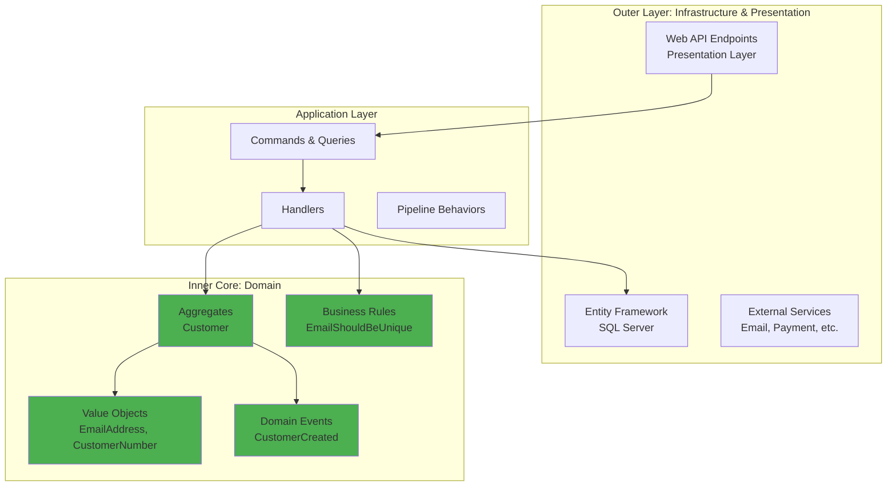
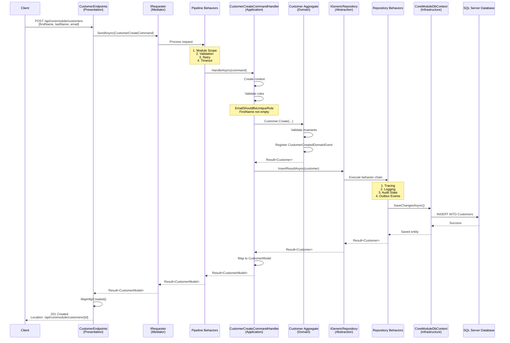

# ROOT README.md - Architecture Section Draft

This file contains the new Architecture Deep Dive section to be added to the ROOT README.md.

---

## Architecture Deep Dive

The bITdevKit GettingStarted project implements **Clean/Onion Architecture** principles combined with **Domain-Driven Design (DDD)** and a **Modular Monolith** approach. This section explains the architectural decisions, layer responsibilities, and how components interact.

### Clean Architecture Overview

Clean Architecture enforces strict dependency rules where **inner layers never depend on outer layers**. Dependencies flow inward toward the domain core, ensuring business logic remains independent of infrastructure concerns and delivery mechanisms.



### Layer Responsibilities

#### Domain Layer (Core)
**Location**: `src/Modules/CoreModule/CoreModule.Domain`

**Responsibilities**:
- Pure business logic and domain rules
- Aggregates (e.g., `Customer`)
- Value Objects (e.g., `EmailAddress`, `CustomerNumber`)
- Domain Events (e.g., `CustomerCreatedDomainEvent`)
- Business Rules (e.g., `EmailShouldBeUniqueRule`)
- Enumerations (e.g., `CustomerStatus`)

**Dependencies**: None (only bITdevKit domain abstractions)

**Key Principle**: The domain layer is **persistence-ignorant** and **framework-agnostic**. It contains no references to databases, web frameworks, or external services.

**Example - Customer Aggregate**:
```csharp
public class Customer : AuditableAggregateRoot<CustomerId>, IConcurrency
{
    private Customer() { } // Private for EF Core
    
    public static Result<Customer> Create(
        string firstName, 
        string lastName, 
        string email, 
        CustomerNumber number)
    {
        // Validation and business rules
        var emailResult = EmailAddress.Create(email);
        if (emailResult.IsFailure)
            return emailResult.Unwrap();
        
        var customer = new Customer
        {
            FirstName = firstName,
            LastName = lastName,
            Email = emailResult.Value,
            Number = number,
            Status = CustomerStatus.Lead
        };
        
        // Register domain event
        customer.DomainEvents.Register(
            new CustomerCreatedDomainEvent(customer));
        
        return customer;
    }
}
```

#### Application Layer
**Location**: `src/Modules/CoreModule/CoreModule.Application`

**Responsibilities**:
- Use cases orchestration via Commands and Queries
- Request/Response DTOs (`CustomerModel`)
- Handlers that coordinate domain operations
- Validation logic (FluentValidation)
- Mapping between domain and DTOs

**Dependencies**: Domain layer only

**Key Principle**: Application defines **what** the system does, not **how** it's implemented (infrastructure) or **how** it's exposed (presentation).

**Example - Command Handler**:
```csharp
public class CustomerCreateCommandHandler : 
    RequestHandlerBase<CustomerCreateCommand, CustomerModel>
{
    private readonly IGenericRepository<Customer> repository;
    private readonly IMapper mapper;
    
    protected override async Task<Result<CustomerModel>> HandleAsync(
        CustomerCreateCommand request,
        SendOptions options,
        CancellationToken cancellationToken)
    {
        return await Result<CustomerModel>
            .Bind(() => new Context(request.Model))
            .Unless(ValidateRules)
            .Bind(CreateAggregate)
            .BindResultAsync(PersistAsync, cancellationToken)
            .Map(MapToDto);
    }
}
```

#### Infrastructure Layer
**Location**: `src/Modules/CoreModule/CoreModule.Infrastructure`

**Responsibilities**:
- Database context and EF Core configurations
- Repository implementations
- External service integrations
- Startup tasks and background jobs
- Migrations

**Dependencies**: Domain and Application layers

**Key Principle**: Infrastructure provides **implementations** of abstractions defined by inner layers.

**Example - DbContext**:
```csharp
public class CoreModuleDbContext : ModuleDbContextBase
{
    public DbSet<Customer> Customers { get; set; }
    
    protected override void OnModelCreating(ModelBuilder modelBuilder)
    {
        // Apply entity configurations
        modelBuilder.ApplyConfigurationsFromAssembly(
            typeof(CoreModuleDbContext).Assembly);
            
        // Database sequence for customer numbers
        modelBuilder.HasSequence<int>("CustomerNumbers")
            .StartsAt(100000);
    }
}
```

#### Presentation Layer
**Location**: `src/Modules/CoreModule/CoreModule.Presentation`

**Responsibilities**:
- HTTP endpoints (Minimal APIs)
- Module registration and configuration
- DTO mapping (Mapster)
- Request/Response transformations

**Dependencies**: Application layer (through `IRequester`)

**Key Principle**: Presentation is a **thin adapter** that translates HTTP requests into application commands/queries and responses back to HTTP.

**Example - Endpoint**:
```csharp
public class CustomerEndpoints : EndpointsBase
{
    public override void Map(IEndpointRouteBuilder app)
    {
        var group = app.MapGroup("api/coremodule/customers")
            .RequireAuthorization()
            .WithTags("CoreModule.Customers");
            
        group.MapPost("",
            async (IRequester requester, CustomerModel model, CancellationToken ct) =>
                (await requester.SendAsync(
                    new CustomerCreateCommand(model), 
                    cancellationToken: ct))
                .MapHttpCreated(v => $"/api/coremodule/customers/{v.Id}"))
            .WithName("CoreModule.Customers.Create");
    }
}
```

### Dependency Rules

The architecture enforces these strict dependency rules (validated by [architecture tests](tests/Modules/CoreModule/CoreModule.UnitTests/ArchitectureTests.cs)):

1. **Domain ? NONE**: Domain has no dependencies on other layers
2. **Application ? Domain**: Application depends only on Domain
3. **Infrastructure ? Domain + Application**: Infrastructure implements abstractions
4. **Presentation ? Application**: Presentation uses Application through `IRequester`

**Violations are automatically detected** by architecture tests:
```csharp
[Fact]
public void Application_ShouldNot_HaveDependencyOnInfrastructure()
{
    // Test fails if Application references Infrastructure
}
```

### Request Processing Flow

Understanding how a request flows through the architecture is crucial. Here's a complete end-to-end flow for creating a customer:



**Key Stages**:

1. **HTTP Request**: Client sends JSON payload to endpoint
2. **Command Creation**: Endpoint creates `CustomerCreateCommand` with DTO
3. **Pipeline Processing**: Request passes through cross-cutting behaviors
4. **Handler Execution**: Handler orchestrates domain logic
5. **Domain Validation**: Aggregate enforces business rules
6. **Repository Persistence**: Entity saved with behavior chain
7. **Response Mapping**: Result mapped to HTTP response

### Modular Monolith Structure

The application follows a **Modular Monolith** pattern where each module is a **vertical slice** containing all layers:

```
src/Modules/CoreModule/
??? CoreModule.Domain/          (Business logic)
??? CoreModule.Application/     (Use cases)
??? CoreModule.Infrastructure/  (Persistence)
??? CoreModule.Presentation/    (HTTP endpoints)
```

**Module Characteristics**:
- **Self-contained**: Each module has its own DbContext, endpoints, and domain model
- **Loosely coupled**: Modules communicate through contracts or integration events
- **Independently deployable**: Modules can be extracted into microservices if needed

**Module Boundary Rules** (enforced by architecture tests):
- Modules **cannot** directly reference other modules' internal layers
- Modules **can** reference other modules' `.Contracts` assemblies
- Cross-module communication via integration events or public APIs

See [CoreModule README](src/Modules/CoreModule/CoreModule-README.md) for module-specific implementation details.

---

## Next Section: Core Patterns

Continue to [Core Patterns](#core-patterns) to understand the foundational patterns used throughout the architecture.
