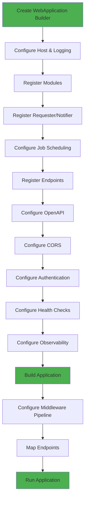
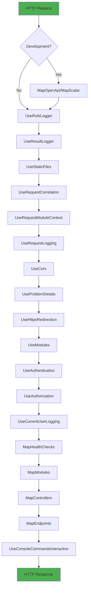
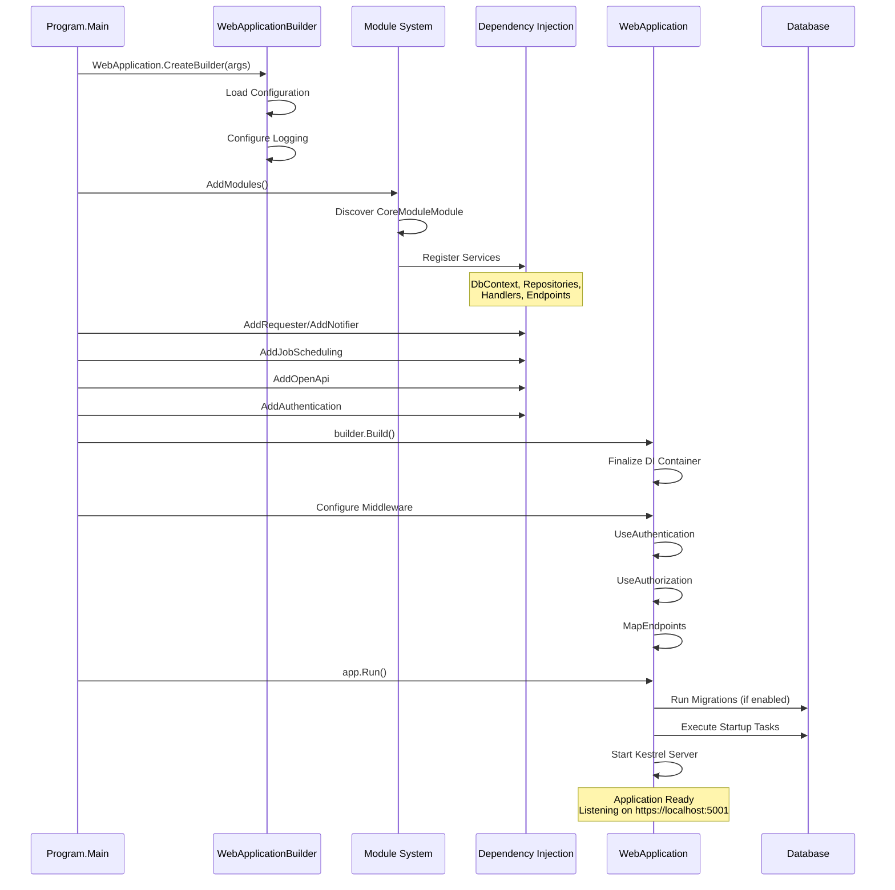

# ROOT README.md - Application Bootstrap Section Draft

This file contains the Application Bootstrap section explaining how Program.cs configures and starts the application.

---

## Application Bootstrap (Program.cs Walkthrough)

The `Program.cs` file is the **composition root** where all services, middleware, and modules are configured. Understanding this file is crucial for grasping how the application starts and how components wire together.

### Configuration Stages

The application bootstrap follows a clear sequence:



### Step-by-Step Breakdown

#### Step 1: Create Builder and Configure Logging

```csharp
var builder = WebApplication.CreateBuilder(args);
builder.Host.ConfigureLogging();
builder.Services.AddConsoleCommandsInteractive();
```

**What happens here**:
- Creates `WebApplicationBuilder` with configuration from `appsettings.json`, environment variables, command-line args
- Configures Serilog for structured logging with enrichers (environment, thread, module context)
- Registers interactive console commands for runtime diagnostics

**Key Files**:
- `appsettings.json` - Application configuration
- `appsettings.Development.json` - Development overrides

#### Step 2: Register Modules

```csharp
builder.Services.AddModules(builder.Configuration, builder.Environment)
    .WithModule<CoreModuleModule>()
    .WithModuleContextAccessors()
    .WithRequestModuleContextAccessors();
```

**What happens here**:
- Scans and registers all modules implementing `WebModuleBase`
- Each module's `Register()` method is called to register its services
- Module context accessors enable tracking which module is handling a request

**Module Registration Process**:
```
AddModules()
  ? Discover CoreModuleModule
    ? CoreModuleModule.Register()
      ? Register DbContext
      ? Register Repositories with Behaviors
      ? Register Handlers
      ? Register Endpoints
      ? Register Startup Tasks
      ? Register Jobs
```

**Configuration Loaded**:
```json
{
  "Modules": {
    "CoreModule": {
      "ConnectionStrings": {
        "Default": "Server=(localdb)\\MSSQLLocalDB;Database=..."
      },
      "SeederTaskStartupDelay": "00:00:05"
    }
  }
}
```

#### Step 3: Register Requester and Notifier

```csharp
builder.Services.AddRequester()
    .AddHandlers()
    .WithDefaultBehaviors();

builder.Services.AddNotifier()
    .AddHandlers()
    .WithDefaultBehaviors();
```

**What happens here**:

**Requester Registration**:
- Scans assemblies for `IRequestHandler<TRequest, TResponse>` implementations
- Registers handlers with dependency injection
- Adds pipeline behaviors: `ModuleScopeBehavior`, `ValidationBehavior`, `RetryBehavior`, `TimeoutBehavior`
- Enables `IRequester.SendAsync()` for command/query execution

**Notifier Registration**:
- Scans assemblies for `INotificationHandler<TNotification>` implementations
- Registers handlers for domain events and integration events
- Enables `INotifier.PublishAsync()` for event publishing

**Behavior Order** (outer to inner):
```
Request ? ModuleScopeBehavior ? ValidationBehavior ? RetryBehavior ? TimeoutBehavior ? Handler
```

#### Step 4: Configure Job Scheduling

```csharp
builder.Services.AddJobScheduling(o => o
    .StartupDelay(builder.Configuration["JobScheduling:StartupDelay"]), 
    builder.Configuration)
    .WithSqlServerStore(builder.Configuration["JobScheduling:Quartz:quartz.dataSource.default.connectionString"])
    .WithBehavior<ModuleScopeJobSchedulingBehavior>();
```

**What happens here**:
- Configures Quartz.NET for background job scheduling
- Uses SQL Server for persistent job storage (survives application restarts)
- Adds `ModuleScopeJobSchedulingBehavior` to ensure jobs run in correct module context
- Jobs are registered by individual modules (e.g., `CustomerExportJob` in CoreModule)

**Configuration**:
```json
{
  "JobScheduling": {
    "StartupDelay": "00:00:10",
    "Quartz": {
      "quartz.dataSource.default.connectionString": "Server=...;Database=..."
    }
  }
}
```

#### Step 5: Register Application Endpoints

```csharp
builder.Services.AddEndpoints<SystemEndpoints>(
    builder.Environment.IsLocalDevelopment() || 
    builder.Environment.IsContainerized());
```

**What happens here**:
- Registers system-level endpoints (health checks, info, diagnostics)
- Conditional registration based on environment
- Module-specific endpoints are registered by modules themselves

**System Endpoints** (enabled in Development/Container):
- `GET /api/_system/info` - Application information
- `GET /api/_system/health` - Health check status
- `GET /api/_system/metrics` - Application metrics

#### Step 6: Configure JSON Serialization

```csharp
builder.Services.ConfigureJson();
builder.Services.AddHttpContextAccessor();
builder.Services.AddControllers(); // Required for OpenAPI generation
builder.Services.AddProblemDetails(o => Configure.ProblemDetails(o, true));
builder.Services.AddTimeProvider();
```

**What happens here**:
- Configures System.Text.Json serialization options (camelCase, ignore nulls)
- Registers `IHttpContextAccessor` for accessing HTTP context in services
- Adds controllers support (needed for OpenAPI document generation)
- Configures RFC 7807 Problem Details for consistent error responses
- Registers `TimeProvider` for testable time-dependent code

#### Step 7: Configure OpenAPI

```csharp
builder.Services.AddAppOpenApi();
```

**What happens here**:
- Configures OpenAPI document generation
- **Build-time generation**: OpenAPI spec generated during compilation
- Output: `wwwroot/openapi.json`
- Served as static file at `/openapi.json`
- Used by Scalar UI at `/scalar`

**Project Configuration** (Presentation.Web.Server.csproj):
```xml
<PropertyGroup>
  <OpenApiGenerateDocuments>true</OpenApiGenerateDocuments>
  <OpenApiDocumentsDirectory>$(MSBuildProjectDirectory)/wwwroot</OpenApiDocumentsDirectory>
  <OpenApiGenerateDocumentsOptions>--file-name openapi</OpenApiGenerateDocumentsOptions>
</PropertyGroup>
```

#### Step 8: Configure CORS

```csharp
builder.Services.AddCors(builder.Configuration);
```

**What happens here**:
- Loads CORS policy from `appsettings.json`
- Configures allowed origins, methods, headers
- Enables cross-origin requests for SPA frontends

**Configuration**:
```json
{
  "Cors": {
    "PolicyName": "DefaultPolicy",
    "AllowedOrigins": ["https://localhost:3000", "https://app.example.com"],
    "AllowedMethods": ["GET", "POST", "PUT", "DELETE"],
    "AllowedHeaders": ["*"],
    "AllowCredentials": true
  }
}
```

#### Step 9: Configure Authentication and Authorization

```csharp
builder.Services.AddScoped<ICurrentUserAccessor, HttpCurrentUserAccessor>();
builder.Services.AddJwtBearerAuthentication(builder.Configuration);
builder.Services.AddAppIdentityProvider(
    builder.Environment.IsLocalDevelopment() || builder.Environment.IsContainerized(), 
    builder.Configuration);
```

**What happens here**:
- Registers `ICurrentUserAccessor` to get current authenticated user
- Configures JWT Bearer authentication
- Adds identity provider integration (development mode uses simplified auth)

**Configuration**:
```json
{
  "Authentication": {
    "Authority": "https://auth.example.com",
    "Audience": "getting-started-api",
    "RequireHttpsMetadata": true
  }
}
```

#### Step 10: Configure Health Checks

```csharp
builder.Services.AddHealthChecks(builder.Configuration);
```

**What happens here**:
- Registers health check services
- Adds checks for: Database connectivity, external services, disk space
- Exposes health status at `/health` endpoint

#### Step 11: Configure Observability (OpenTelemetry)

```csharp
builder.Services.AddOpenTelemetry(builder);
```

**What happens here**:
- Configures OpenTelemetry for distributed tracing
- Instruments: HTTP calls, database queries, repository operations
- Exports traces to configured backend (Jaeger, Zipkin, Application Insights)

### Build Application

```csharp
var app = builder.Build();
```

**What happens here**:
- Builds the `WebApplication` with all registered services
- Finalizes dependency injection container
- Ready to configure middleware pipeline

### Middleware Pipeline Configuration

The middleware pipeline processes HTTP requests in order. Understanding this order is critical:



#### Middleware Breakdown

```csharp
var app = builder.Build();

// Development-only: OpenAPI documentation
if (app.Environment.IsLocalDevelopment() || app.Environment.IsContainerized())
{
    app.MapOpenApi();    // Serves /openapi.json
    app.MapScalar();     // Serves /scalar UI
}

// Rule and Result logging (bITdevKit diagnostics)
app.UseRuleLogger();     // Logs business rule evaluations
app.UseResultLogger();   // Logs Result<T> operations

// Static files and correlation
app.UseStaticFiles();               // Serve wwwroot/openapi.json
app.UseRequestCorrelation();        // Add correlation ID to requests
app.UseRequestModuleContext();      // Set module context for request
app.UseRequestLogging();            // Log HTTP requests

// Security and error handling
app.UseCors(builder.Configuration);     // CORS policy
app.UseProblemDetails();                // RFC 7807 error responses
app.UseHttpsRedirection();              // Redirect HTTP to HTTPS

// Module and authentication
app.UseModules();                   // Module-specific middleware
app.UseAuthentication();            // JWT authentication
app.UseAuthorization();             // Policy-based authorization
app.UseCurrentUserLogging();        // Log current user in requests

// Endpoint mapping
app.MapHealthChecks();              // /health endpoint
app.MapModules();                   // Module-specific endpoints
app.MapControllers();               // Controller endpoints (if any)
app.MapEndpoints();                 // System endpoints

// Interactive diagnostics
app.UseConsoleCommandsInteractiveStats();
app.UseConsoleCommandsInteractive();

// Start the application
app.Run();
```

#### Key Middleware Purposes

**UseRequestCorrelation()** - Correlation tracking:
```
Purpose: Assigns unique correlation ID to each request
Usage: Logs include correlation ID for distributed tracing
Header: X-Correlation-ID
```

**UseRequestModuleContext()** - Module scoping:
```
Purpose: Determines which module is handling the request
Usage: Module context available in handlers and behaviors
Example: Request to /api/coremodule/customers sets context to CoreModule
```

**UseProblemDetails()** - Error handling:
```
Purpose: Catches exceptions and returns RFC 7807 Problem Details
Response: {
  "type": "https://tools.ietf.org/html/rfc7231#section-6.5.1",
  "title": "Bad Request",
  "status": 400,
  "detail": "Validation failed",
  "traceId": "00-abc123..."
}
```

**UseAuthentication() / UseAuthorization()** - Security:
```
Purpose: Validates JWT tokens and enforces authorization policies
Order: Authentication must come before Authorization
Result: HttpContext.User populated with claims
```

### Complete Request Flow

Putting it all together, here's what happens when a request arrives:

```
1. Client sends: POST /api/coremodule/customers
2. UseHttpsRedirection ? Ensure HTTPS
3. UseRequestCorrelation ? Assign correlation ID
4. UseRequestModuleContext ? Set context to CoreModule
5. UseRequestLogging ? Log request start
6. UseCors ? Validate CORS policy
7. UseAuthentication ? Validate JWT token
8. UseAuthorization ? Check authorization policy
9. Endpoint matched: CustomerEndpoints.MapPost
10. IRequester.SendAsync(CustomerCreateCommand)
11. Pipeline behaviors execute (validation, retry, timeout)
12. CustomerCreateCommandHandler.HandleAsync
13. Domain logic: Customer.Create()
14. Repository: InsertResultAsync with behavior chain
15. DbContext.SaveChangesAsync()
16. Result<CustomerModel> returned through pipeline
17. MapHttpCreated() converts to HTTP 201 response
18. UseRequestLogging ? Log request completion
19. Response sent to client
```

### Environment-Specific Configuration

The application adapts based on environment:

**Development**:
```csharp
if (app.Environment.IsLocalDevelopment())
{
    - OpenAPI documentation enabled
    - Scalar UI available
    - Database auto-migration
    - Seeder tasks enabled
    - Detailed error messages
}
```

**Production**:
```csharp
if (app.Environment.IsProduction())
{
    - No OpenAPI/Scalar exposure
    - Manual database migrations
    - No seeder tasks
    - Generic error messages
    - Enhanced security headers
}
```

**Container**:
```csharp
if (app.Environment.IsContainerized())
{
    - Similar to Development
    - Database connection from environment
    - Health checks enabled
    - Metrics endpoints exposed
}
```

### Startup Sequence Diagram



### Configuration Sources Priority

Configuration is loaded in order (later sources override earlier):

```
1. appsettings.json (base configuration)
2. appsettings.{Environment}.json (environment-specific)
3. User Secrets (Development only)
4. Environment Variables (ASPNETCORE_*, Modules__*)
5. Command-Line Arguments (--urls, --environment)
```

**Example Override**:
```bash
# Override connection string via environment variable
export Modules__CoreModule__ConnectionStrings__Default="Server=prod-db;..."

# Override via command-line
dotnet run --Modules:CoreModule:ConnectionStrings:Default="Server=..."
```

### Troubleshooting Startup Issues

Common startup problems and solutions:

**Problem**: Module not loading
```
Check: Is module registered in Program.cs?
Check: Does module have parameterless constructor?
Check: Are module dependencies registered?
```

**Problem**: Database connection fails
```
Check: Connection string in appsettings.json
Check: SQL Server is running
Check: Database exists (or migrations enabled)
```

**Problem**: Authentication fails
```
Check: JWT configuration in appsettings.json
Check: Token has correct audience and issuer
Check: Token not expired
```

**Problem**: Endpoint not found
```
Check: Module endpoints registered
Check: MapModules() called in Program.cs
Check: Endpoint route matches request URL
```

---

## Summary

The `Program.cs` file orchestrates the entire application startup:
1. Loads configuration from multiple sources
2. Registers modules with their services
3. Configures cross-cutting concerns (auth, logging, health)
4. Builds the middleware pipeline
5. Maps endpoints
6. Starts the web server

Understanding this flow is essential for:
- Adding new modules
- Configuring new services
- Troubleshooting startup issues
- Customizing middleware behavior

For module-specific implementation details, see [CoreModule README](src/Modules/CoreModule/CoreModule-README.md).
