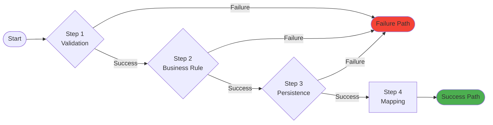
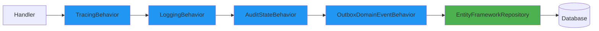

# ROOT README.md - Core Patterns Section Draft

This file contains the Core Patterns section explaining the foundational design patterns used throughout the application.

---

## Core Patterns

The bITdevKit GettingStarted application is built on several key design patterns that work together to create a robust, maintainable, and testable architecture. This section explains each pattern and how they're implemented.

### Result Pattern (Railway-Oriented Programming)

The Result Pattern replaces exception-based error handling with explicit success/failure types, enabling **functional composition** and **railway-oriented programming**.

#### Why Use Result Pattern?

**Problems with Traditional Exception Handling**:
```csharp
// Traditional approach - exceptions for control flow
public async Task<Customer> CreateCustomer(string email)
{
    if (string.IsNullOrEmpty(email))
        throw new ValidationException("Email required");
    
    if (await _repo.ExistsAsync(c => c.Email == email))
        throw new BusinessRuleException("Email already exists");
    
    var customer = new Customer { Email = email };
    await _repo.AddAsync(customer);
    return customer;
}

// Problems:
// 1. Exceptions are expensive
// 2. Error handling scattered across call stack
// 3. Caller doesn't know what errors to expect
// 4. Difficult to compose operations
```

**Result Pattern Solution**:
```csharp
// Result pattern - explicit success/failure
public async Task<Result<Customer>> CreateCustomer(string email)
{
    return await Result<Customer>
        .Success(new { Email = email })
        .Ensure(
            ctx => !string.IsNullOrEmpty(ctx.Email),
            new ValidationError("Email required"))
        .UnlessAsync(async ctx => 
            await _repo.ExistsAsync(c => c.Email == ctx.Email),
            new BusinessRuleError("Email already exists"))
        .BindAsync(async ctx => 
        {
            var customer = new Customer { Email = ctx.Email };
            await _repo.AddAsync(customer);
            return customer;
        });
}

// Benefits:
// 1. Explicit error handling
// 2. Composable operations
// 3. Type-safe error information
// 4. Railway-oriented flow
```

#### Result Type Structure

```csharp
public class Result<T>
{
    public T Value { get; }
    public bool IsSuccess { get; }
    public bool IsFailure { get; }
    public IEnumerable<IResultMessage> Messages { get; }
    public IEnumerable<IResultError> Errors { get; }
}
```

#### Railway-Oriented Programming Diagram



**Key Concept**: Once a step fails, all subsequent steps are skipped, and the failure flows directly to the end. This is the "railway switch" metaphor.

#### Result Pattern Methods

**Transformation Methods**:

**`Bind()`** - Transform success value:
```csharp
Result<int> result = Result<int>.Success(5);
Result<int> doubled = result.Bind(x => x * 2); // Value: 10
```

**`BindAsync()`** - Async transformation:
```csharp
Result<Customer> result = await customerResult
    .BindAsync(async (customer, ct) =>
    {
        await _emailService.SendWelcomeEmail(customer.Email, ct);
        return customer;
    }, cancellationToken);
```

**`BindResult()`** - Chain operations that return Results:
```csharp
Result<CustomerContext> result = await Result<CustomerContext>
    .Success(new CustomerContext(model))
    .BindResultAsync(
        async (ctx, ct) => await _numberGenerator.GetNextAsync(ct),
        (ctx, number) => ctx.WithNumber(number),
        cancellationToken);
```

**Validation Methods**:

**`Ensure()`** - Inline validation:
```csharp
Result<Customer> result = customerResult
    .Ensure(
        c => c.Email.Contains("@"),
        new ValidationError("Invalid email format"));
```

**`Unless()` / `UnlessAsync()`** - Business rule checking:
```csharp
Result<Customer> result = await customerResult
    .UnlessAsync(
        async (c, ct) => await _repo.ExistsAsync(
            x => x.Email == c.Email, ct),
        new BusinessRuleError("Email already exists"),
        cancellationToken);
```

**Mapping Methods**:

**`Map()`** - Transform to different type:
```csharp
Result<CustomerModel> dto = customerResult
    .Map(customer => new CustomerModel
    {
        Id = customer.Id,
        FirstName = customer.FirstName,
        LastName = customer.LastName
    });
```

**Side Effect Methods**:

**`Tap()`** - Execute action without changing result:
```csharp
Result<Customer> result = await customerResult
    .Tap(c => _logger.LogInformation(
        "Customer created: {Id}", c.Id));
```

**`Log()`** - bITdevKit logging extension:
```csharp
Result<Customer> result = await customerResult
    .Log(_logger, "Customer {Id} created", r => [r.Value.Id]);
```

#### Real-World Example: CustomerCreateCommandHandler

```csharp
protected override async Task<Result<CustomerModel>> HandleAsync(
    CustomerCreateCommand request,
    SendOptions options,
    CancellationToken cancellationToken)
{
    return await Result<CustomerModel>
        // STEP 1: Create context from request
        .Bind<CustomerCreateContext>(() => new(request.Model))
        .Log(_logger, "Context created {@Context}", r => [r.Value])
        
        // STEP 2: Inline validation
        .Ensure(
            ctx => ctx.Model.FirstName != ctx.Model.LastName,
            new ValidationError("First and last name cannot be the same"))
        
        // STEP 3: Business rules validation
        .UnlessAsync(async (ctx, ct) => await Rule
            .Add(RuleSet.IsNotEmpty(ctx.Model.FirstName))
            .Add(RuleSet.IsNotEmpty(ctx.Model.LastName))
            .Add(new EmailShouldBeUniqueRule(ctx.Model.Email, _repository))
            .CheckAsync(ct), 
            cancellationToken: cancellationToken)
        
        // STEP 4: Generate customer number sequence
        .BindResultAsync(
            GenerateSequenceAsync, 
            CaptureNumber, 
            cancellationToken)
        .Log(_logger, "Number generated: {@Number}", r => [r.Value.Number])
        
        // STEP 5: Create domain aggregate
        .Bind(CreateEntity)
        
        // STEP 6: Persist to database
        .BindResultAsync(
            PersistEntityAsync, 
            CapturePersistedEntity, 
            cancellationToken)
        .Log(_logger, "Customer persisted: {Id}", r => [r.Value.Entity.Id])
        
        // STEP 7: Map to DTO
        .Map(ToModel)
        .Log(_logger, "Mapped to {@Model}", r => [r.Value]);
}

// Helper methods for each step
private async Task<Result<long>> GenerateSequenceAsync(
    CustomerCreateContext ctx, CancellationToken ct) =>
    await _numberGenerator.GetNextAsync("CustomerNumbers", "core", ct);

private CustomerCreateContext CaptureNumber(
    CustomerCreateContext ctx, long seq)
{
    ctx.Number = CustomerNumber.Create(DateTime.UtcNow, seq).Value;
    return ctx;
}

private Result<CustomerCreateContext> CreateEntity(
    CustomerCreateContext ctx)
{
    var createResult = Customer.Create(
        ctx.Model.FirstName, 
        ctx.Model.LastName, 
        ctx.Model.Email, 
        ctx.Number);
        
    if (createResult.IsFailure)
        return createResult.Unwrap();
    
    ctx.Entity = createResult.Value;
    return ctx;
}

private async Task<Result<Customer>> PersistEntityAsync(
    CustomerCreateContext ctx, CancellationToken ct) =>
    await _repository.InsertResultAsync(ctx.Entity, ct);

private CustomerCreateContext CapturePersistedEntity(
    CustomerCreateContext ctx, Customer entity)
{
    ctx.Entity = entity;
    return ctx;
}

private CustomerModel ToModel(CustomerCreateContext ctx) =>
    _mapper.Map<Customer, CustomerModel>(ctx.Entity);

// Context holds state throughout the pipeline
private class CustomerCreateContext(CustomerModel model)
{
    public CustomerModel Model { get; init; } = model;
    public CustomerNumber Number { get; set; }
    public Customer Entity { get; set; }
}
```

**Benefits of this approach**:
1. **Linear flow**: Easy to read top-to-bottom
2. **Explicit steps**: Each operation is clearly labeled
3. **Early exit**: Failures short-circuit remaining steps
4. **Logging**: Side effects integrated into the pipeline
5. **Testable**: Each helper method can be unit tested
6. **Type-safe**: Compiler ensures correct types at each step

---

### Requester/Notifier Pattern (Mediator)

The Requester/Notifier pattern is bITdevKit's implementation of the Mediator pattern, decoupling request senders from handlers and enabling cross-cutting concerns through pipeline behaviors.

#### Architecture Diagram

```mermaid
graph TB
    subgraph "Client Code (Endpoint)"
        Client[CustomerEndpoints]
    end
    
    subgraph "Mediator (IRequester)"
        Req[IRequester.SendAsync]
        Pipeline[Pipeline Behaviors]
    end
    
    subgraph "Handler"
        Handler[CustomerCreateCommandHandler]
    end
    
    subgraph "Cross-Cutting Behaviors"
        B1[ModuleScopeBehavior]
        B2[ValidationBehavior]
        B3[RetryBehavior]
        B4[TimeoutBehavior]
    end
    
    Client -->|CustomerCreateCommand| Req
    Req --> B1
    B1 --> B2
    B2 --> B3
    B3 --> B4
    B4 --> Handler
    Handler -->|Result<CustomerModel>| B4
    B4 --> B3
    B3 --> B2
    B2 --> B1
    B1 --> Req
    Req -->|Result<CustomerModel>| Client
    
    style Handler fill:#4CAF50
    style Pipeline fill:#2196F3
```

#### Key Components

**IRequester** - Send commands/queries:
```csharp
public interface IRequester
{
    Task<TResponse> SendAsync<TResponse>(
        IRequest<TResponse> request,
        SendOptions options = null,
        CancellationToken cancellationToken = default);
}
```

**IRequest** - Command/Query marker:
```csharp
public class CustomerCreateCommand : RequestBase<CustomerModel>
{
    public CustomerModel Model { get; set; }
    
    // Nested validator using FluentValidation
    public class Validator : AbstractValidator<CustomerCreateCommand>
    {
        public Validator()
        {
            RuleFor(c => c.Model).NotNull();
            RuleFor(c => c.Model.FirstName).NotEmpty();
            RuleFor(c => c.Model.LastName).NotEmpty();
            RuleFor(c => c.Model.Email).NotEmpty().EmailAddress();
        }
    }
}
```

**IRequestHandler** - Handles request:
```csharp
public class CustomerCreateCommandHandler : 
    RequestHandlerBase<CustomerCreateCommand, CustomerModel>
{
    protected override async Task<Result<CustomerModel>> HandleAsync(
        CustomerCreateCommand request,
        SendOptions options,
        CancellationToken cancellationToken)
    {
        // Handler implementation
    }
}
```

#### Pipeline Behaviors

Pipeline behaviors wrap handlers to provide cross-cutting concerns:

**1. ModuleScopeBehavior** - Sets module context:
```csharp
// Ensures all operations within a request are scoped to the correct module
// Useful for multi-tenant or multi-module scenarios
```

**2. ValidationBehavior** - Validates request:
```csharp
// Automatically runs FluentValidation validators
// Returns Result.Failure with validation errors if validation fails
// Only executes handler if validation passes
```

**3. RetryBehavior** - Retries on transient failures:
```csharp
[HandlerRetry(maxAttempts: 3, delayMilliseconds: 100)]
public class CustomerCreateCommandHandler : RequestHandlerBase<...>
{
    // Automatically retries on transient exceptions
    // Exponential backoff supported
}
```

**4. TimeoutBehavior** - Enforces execution timeout:
```csharp
[HandlerTimeout(milliseconds: 5000)]
public class CustomerCreateCommandHandler : RequestHandlerBase<...>
{
    // Throws TimeoutException if handler exceeds 5 seconds
    // Cancels operation gracefully
}
```

#### Setup in Program.cs

```csharp
// Register requester with all handlers and behaviors
builder.Services.AddRequester()
    .AddHandlers()          // Scan and register all IRequestHandler implementations
    .WithDefaultBehaviors(); // Add validation, retry, timeout behaviors

// Register notifier for domain/integration events
builder.Services.AddNotifier()
    .AddHandlers()          // Scan and register all INotificationHandler implementations
    .WithDefaultBehaviors();
```

#### Usage in Endpoints

```csharp
public class CustomerEndpoints : EndpointsBase
{
    public override void Map(IEndpointRouteBuilder app)
    {
        group.MapPost("",
            async (IRequester requester, CustomerModel model, CancellationToken ct) =>
            {
                // Send command through requester
                var result = await requester.SendAsync(
                    new CustomerCreateCommand(model),
                    cancellationToken: ct);
                
                // Map result to HTTP response
                return result.MapHttpCreated(
                    v => $"/api/coremodule/customers/{v.Id}");
            });
    }
}
```

#### Benefits

1. **Decoupling**: Endpoints don't know about handler implementations
2. **Cross-cutting concerns**: Behaviors apply to all handlers uniformly
3. **Testability**: Handlers can be tested independently
4. **Extensibility**: Add new behaviors without changing handlers
5. **Type-safety**: Compiler ensures request/response types match

---

### Repository with Behaviors Pattern (Decorator)

The Repository pattern abstracts data access, while the Decorator pattern adds cross-cutting concerns through behavior chains.

#### Repository Abstraction

```csharp
public interface IGenericRepository<TEntity> 
    where TEntity : class, IEntity
{
    Task<Result<TEntity>> FindOneResultAsync(
        object id, 
        CancellationToken cancellationToken = default);
    
    Task<Result<IEnumerable<TEntity>>> FindAllResultAsync(
        ISpecification<TEntity> specification = null,
        CancellationToken cancellationToken = default);
    
    Task<Result<TEntity>> InsertResultAsync(
        TEntity entity,
        CancellationToken cancellationToken = default);
    
    Task<Result<TEntity>> UpdateResultAsync(
        TEntity entity,
        CancellationToken cancellationToken = default);
    
    Task<Result> DeleteResultAsync(
        object id,
        CancellationToken cancellationToken = default);
}
```

#### Behavior Chain Diagram



#### Behavior Implementations

**1. RepositoryTracingBehavior** - OpenTelemetry spans:
```csharp
// Automatically creates tracing spans for repository operations
// Captures operation name, entity type, execution time
// Integrates with OpenTelemetry for distributed tracing
```

**2. RepositoryLoggingBehavior** - Structured logging:
```csharp
// Logs repository operations with structured data
// Example: "Repository operation: Insert, Entity: Customer, Duration: 45ms"
// Includes correlation IDs and module context
```

**3. RepositoryAuditStateBehavior** - Audit metadata:
```csharp
// Automatically sets Created/Updated timestamps and user information
// For Insert: Sets CreatedBy, CreatedDate
// For Update: Sets UpdatedBy, UpdatedDate
// Requires entity to implement IAuditableEntity
```

**4. RepositoryOutboxDomainEventBehavior** - Event persistence:
```csharp
// Intercepts domain events from aggregates
// Persists events to OutboxDomainEvents table
// Ensures transactional consistency (events saved with entity)
// Enables reliable event delivery via outbox pattern
```

#### Configuration in Module

```csharp
// Register repository with behavior chain
services.AddEntityFrameworkRepository<Customer, CoreModuleDbContext>()
    .WithBehavior<RepositoryTracingBehavior<Customer>>()
    .WithBehavior<RepositoryLoggingBehavior<Customer>>()
    .WithBehavior<RepositoryAuditStateBehavior<Customer>>()
    .WithBehavior<RepositoryOutboxDomainEventBehavior<Customer, CoreModuleDbContext>>();

// Configure audit behavior options
services.AddScoped(_ => new RepositoryAuditStateBehaviorOptions
{
    SoftDeleteEnabled = false
});
```

#### Execution Flow Example

```csharp
// Handler calls repository
await repository.InsertResultAsync(customer, cancellationToken);

// Execution flow:
// 1. TracingBehavior ? Start span "Repository.Insert"
// 2. LoggingBehavior ? Log "Inserting Customer entity"
// 3. AuditStateBehavior ? Set customer.CreatedBy, customer.CreatedDate
// 4. OutboxDomainEventBehavior ? Extract CustomerCreatedDomainEvent
//                              ? Insert event into OutboxDomainEvents table
// 5. EntityFrameworkRepository ? context.Customers.Add(customer)
//                               ? context.SaveChangesAsync()
// 6. OutboxDomainEventBehavior ? (on success) Mark events as persisted
// 7. AuditStateBehavior ? (on success) Confirm audit fields saved
// 8. LoggingBehavior ? Log "Customer inserted successfully, Duration: 45ms"
// 9. TracingBehavior ? End span with success status
```

#### Benefits

1. **Separation of concerns**: Each behavior has single responsibility
2. **Testability**: Behaviors can be tested independently
3. **Composability**: Mix and match behaviors per repository
4. **No duplication**: Cross-cutting logic written once
5. **Explicit ordering**: Behavior chain order is clear and configurable

---

### Module System (Vertical Slices)

The Modular Monolith pattern organizes code into self-contained vertical slices, each representing a business capability.

#### Module Structure

```
src/Modules/CoreModule/
??? CoreModule.Domain/              # Business logic layer
?   ??? Model/                      # Aggregates, Value Objects
?   ??? Events/                     # Domain Events
?   ??? Rules/                      # Business Rules
??? CoreModule.Application/         # Use cases layer
?   ??? Commands/                   # Write operations
?   ??? Queries/                    # Read operations
?   ??? Models/                     # DTOs
?   ??? Handlers/                   # Command/Query handlers
??? CoreModule.Infrastructure/      # Persistence layer
?   ??? EntityFramework/            # DbContext, Configurations
?   ??? Repositories/               # Repository implementations
?   ??? Jobs/                       # Background jobs
??? CoreModule.Presentation/        # API layer
    ??? Web/Endpoints/              # HTTP endpoints
    ??? CoreModuleModule.cs         # Module registration
```

#### Module Registration

Each module implements `WebModuleBase` and provides service registration:

```csharp
public class CoreModuleModule : WebModuleBase
{
    public override IServiceCollection Register(
        IServiceCollection services,
        IConfiguration configuration,
        IWebHostEnvironment environment)
    {
        // 1. Load module configuration
        var config = this.Configure<CoreModuleConfiguration>(
            services, configuration);
        
        // 2. Register startup tasks
        services.AddStartupTasks()
            .WithTask<CoreModuleDomainSeederTask>();
        
        // 3. Register job scheduling
        services.AddJobScheduling()
            .WithJob<CustomerExportJob>()
            .Cron(CronExpressions.EveryMinute);
        
        // 4. Register database context
        services.AddSqlServerDbContext<CoreModuleDbContext>()
            .WithSequenceNumberGenerator()
            .WithOutboxDomainEventService();
        
        // 5. Register repositories with behaviors
        services.AddEntityFrameworkRepository<Customer, CoreModuleDbContext>()
            .WithBehavior<RepositoryTracingBehavior<Customer>>()
            .WithBehavior<RepositoryLoggingBehavior<Customer>>()
            .WithBehavior<RepositoryAuditStateBehavior<Customer>>()
            .WithBehavior<RepositoryOutboxDomainEventBehavior<Customer, CoreModuleDbContext>>();
        
        // 6. Register mapping
        services.AddMapping()
            .WithMapster<CoreModuleMapperRegister>();
        
        // 7. Register endpoints
        services.AddEndpoints<CustomerEndpoints>();
        
        return services;
    }
}
```

#### Module Registration in Program.cs

```csharp
// Register all modules
builder.Services.AddModules(builder.Configuration, builder.Environment)
    .WithModule<CoreModuleModule>()
    // .WithModule<InventoryModuleModule>()  // Future modules
    // .WithModule<OrderModuleModule>()
    .WithModuleContextAccessors()
    .WithRequestModuleContextAccessors();

// Map module endpoints
app.UseModules();
app.MapModules();
```

#### Module Isolation Rules

See [Architecture Tests](tests/Modules/CoreModule/CoreModule.UnitTests/ArchitectureTests.cs) for enforcement:

1. **No direct module references**: Modules cannot reference other modules' internal layers
2. **Contracts only**: Inter-module communication through `.Contracts` assemblies
3. **Database per module**: Each module has its own `DbContext`
4. **Event-driven communication**: Use integration events for cross-module workflows

#### Adding New Modules

To add a new module (e.g., `InventoryModule`):

1. Create module structure following `CoreModule` pattern
2. Implement `InventoryModuleModule : WebModuleBase`
3. Register in `Program.cs`: `.WithModule<InventoryModuleModule>()`
4. Add to architecture test's `ForbiddenModules` list
5. Create `.Contracts` assembly for public interfaces if needed

---

## Next Section: Application Bootstrap

Continue to [Application Bootstrap](#application-bootstrap) to understand how Program.cs wires everything together.
