# System Design

> Comprehensive architecture and design documentation for the bITdevKit GettingStarted Example project.

## Table of Contents

- [System Design](#system-design)
  - [Table of Contents](#table-of-contents)
  - [Architecture Overview](#architecture-overview)
    - [Architecture Overview Diagram](#architecture-overview-diagram)
  - [Domain Model and Boundaries](#domain-model-and-boundaries)
  - [Module Architecture](#module-architecture)
  - [Layer Responsibilities and Dependencies](#layer-responsibilities-and-dependencies)
    - [Layer Responsibilities](#layer-responsibilities)
    - [Dependency Rules](#dependency-rules)
  - [Inter-Module Communication](#inter-module-communication)
  - [Domain Events and Messages](#domain-events-and-messages)
  - [Architectural Patterns](#architectural-patterns)
    - [Modular Monolith and Bounded Context Modules](#modular-monolith-and-bounded-context-modules)
    - [Domain Events (In-Process)](#domain-events-in-process)
    - [Messaging (Messages and Broker)](#messaging-messages-and-broker)
    - [Contracts API (Explicit Module Interfaces)](#contracts-api-explicit-module-interfaces)
    - [Outbox Pattern](#outbox-pattern)
    - [Vertical Slice / Package-by-Feature](#vertical-slice--package-by-feature)
  - [Rich Domain Model](#rich-domain-model)
    - [Behaviors (Decorators)](#behaviors-decorators)
    - [Database-per-Module (Logical Ownership)](#database-per-module-logical-ownership)
    - [Background Jobs and Startup Tasks](#background-jobs-and-startup-tasks)
    - [Architectural Tests (Fitness Functions)](#architectural-tests-fitness-functions)
    - [Result Pattern](#result-pattern)
    - [Requester/Notifier Pattern](#requesternotifier-pattern)
    - [Repository Pattern](#repository-pattern)
  - [Domain Specifications](#domain-specifications)
  - [Architecture Governance (ADRs)](#architecture-governance-adrs)
  - [Building Blocks and Context](#building-blocks-and-context)
    - [1. System Context Diagram](#1-system-context-diagram)
    - [2. Container Diagram](#2-container-diagram)
    - [3. Component Diagram - CoreModule](#3-component-diagram---coremodule)
  - [Architecture Diagrams](#architecture-diagrams)
    - [4. Clean Architecture Overview](#4-clean-architecture-overview)
    - [5. Clean Architecture Layers](#5-clean-architecture-layers)
    - [6. Module Structure](#6-module-structure)
  - [Interaction Diagrams](#interaction-diagrams)
    - [6. Sequence Diagram - Customer Creation](#6-sequence-diagram---customer-creation)
    - [7. Sequence Diagram - Domain Event Dispatching](#7-sequence-diagram---domain-event-dispatching)
  - [Data Model](#data-model)
    - [8. Entity Relationship Diagram](#8-entity-relationship-diagram)
  - [Request Processing](#request-processing)
    - [9. Request Pipeline Flow](#9-request-pipeline-flow)
  - [Diagram Usage](#diagram-usage)
  - [Related Documentation](#related-documentation)
  - [Updating These Diagrams](#updating-these-diagrams)

---

## Architecture Overview

This document captures the architectural intent of a modular, domain-driven system using Clean/Onion principles. The goal is to keep domain logic independent from delivery mechanisms and infrastructure while enabling independent evolution of modules.

Architecture decisions prioritize clear boundaries, explicit dependencies, and predictable flows for both synchronous and asynchronous communication.

**Why these principles matter:**

Software systems tend to accumulate coupling over time. Without deliberate structure, business logic leaks into controllers, persistence details bleed into domain models, and modules become entangled through shared tables or implicit dependencies. This system is designed to resist that drift by making architectural intent explicit and enforceable.

The Clean/Onion model ensures that the most valuable and stable part of the system — the domain — has zero dependencies on volatile infrastructure or delivery concerns. When a database engine changes, when an API transport evolves, or when a new consumer appears, the domain remains untouched.

The modular monolith approach adds a second axis of protection: modules are isolated from each other. This prevents the "big ball of mud" that monoliths often become, while avoiding the operational complexity of distributed microservices. The system ships as a single deployable unit but is internally structured as if it could be split tomorrow.

Key principles:

- **Domain independence:** Domain logic is isolated from infrastructure and delivery concerns. The domain model should be expressible and testable without any framework or persistence dependency.
- **Modular autonomy:** Modules are autonomous vertical slices with their own domain, application, infrastructure, and presentation layers. Each module can evolve its internal design without affecting others.
- **Inward dependency direction:** Dependency direction is strictly inward toward the domain core. Outer layers know about inner layers, never the reverse.
- **Explicit communication:** Communication across modules is explicit and intentional. Accidental coupling through shared internals, shared databases, or implicit references is treated as an architectural violation.
- **Evolutionary architecture:** The system is designed to evolve. Patterns like explicit module interfaces, messaging, and data isolation make it possible to extract modules into independent services if and when the need arises.

### Architecture Overview Diagram

The following overview captures the layered flow from transport to domain and persistence, highlighting how presentation, application, domain, and infrastructure collaborate.

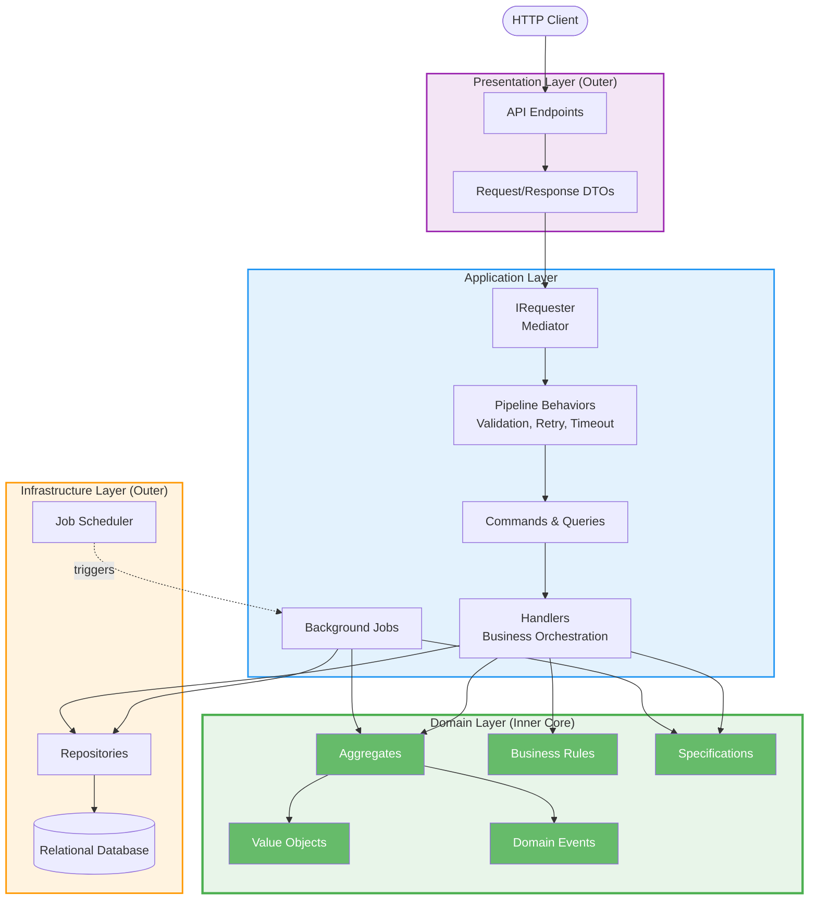

**Reading this diagram:** Follow any request from top to bottom. The client enters through the presentation layer, which translates HTTP concerns into application-level commands or queries. The application layer orchestrates the use case, delegating business decisions to the domain. Infrastructure handles persistence and scheduling. Note that the domain layer has no outgoing arrows — it depends on nothing.

## Domain Model and Boundaries

Domain-driven design (DDD) focuses on modeling the core business domain with explicit boundaries. Each module represents a bounded context with its own ubiquitous language, invariants, and lifecycle.

**What is a Bounded Context?**

A bounded context is a linguistic and conceptual boundary within which a particular domain model is defined and applicable. The term "Customer" may mean something different in a billing context than in an identity context. By giving each module its own bounded context, we avoid ambiguity and prevent models from becoming bloated with concerns that belong elsewhere.

This is not merely an organizational convenience — it is a design constraint. Models inside a bounded context are free to evolve independently. A change to the Customer aggregate in CoreModule does not require changes in other modules, provided the module's public contracts remain stable.

**Building blocks of the domain model:**

- **Aggregates** encapsulate business rules and transactional consistency. An aggregate defines a consistency boundary: all invariants within an aggregate are guaranteed to be consistent after every operation. Access to entities inside the aggregate is always through the aggregate root. This prevents external code from putting the aggregate into an inconsistent state.
- **Value objects** capture immutable concepts and validation rules. Unlike entities, value objects have no identity — they are defined entirely by their attributes. An `EmailAddress` value object, for example, guarantees structural validity at construction time and cannot be modified afterward. This eliminates an entire class of bugs related to invalid or partially-initialized data.
- **Domain events** represent significant state changes inside a module. They are facts — things that have already happened. A `CustomerCreatedEvent` is not a request; it is a notification that a customer was successfully created. This distinction matters because events drive reactive workflows without introducing command-style coupling.
- **Business rules** enforce invariants at the domain boundary. Rules are explicit, named, and testable. Rather than scattering validation logic across handlers and controllers, rules live in the domain where they can be composed, reused, and reasoned about in isolation.
- **Specifications** encapsulate query logic in a domain-oriented way. They express "what to find" without dictating "how to find it," keeping persistence concerns out of the domain.

**Why domain events are not inter-module contracts:**

Domain events remain internal to their owning module. They are part of the domain model and are not used as a direct inter-module contract. When a module needs to communicate changes to other modules, it publishes messages through asynchronous channels (see Inter-Module Communication).

This separation is deliberate. Domain events may change frequently as the internal model evolves. If other modules depended directly on domain events, every internal refactoring would risk breaking consumers. By translating domain events into stable, versioned messages at the application boundary, we decouple internal evolution from external contracts.

## Module Architecture

Modules are organized as vertical slices with full layering inside each module:

- **Presentation:** incoming requests and transport concerns. Endpoints, DTOs, request/response mapping. This layer knows about HTTP but nothing about databases.
- **Application:** use-case orchestration, command/query processing. Handlers coordinate the work but do not contain business rules themselves. They delegate to the domain for decisions and to infrastructure for persistence.
- **Domain:** aggregates, value objects, domain events, rules. The domain is the most stable and valuable layer. It has no framework dependencies and can be tested with plain unit tests.
- **Infrastructure:** persistence and external system integrations. DbContexts, repository implementations, job scheduling, and external API clients live here.

**Why vertical slices?**

Traditional layered architectures organize code by technical concern: all controllers in one folder, all services in another, all repositories in a third. This makes it easy to find "all controllers" but hard to understand "everything involved in creating a customer."

Vertical slices flip this: all code for a use case lives together. A `CreateCustomer` slice contains its command, validator, handler, and any domain interactions. This supports local reasoning — a developer working on customer creation sees everything relevant in one place — and limits the blast radius of changes.

**Module independence:**

This structure supports local reasoning, independent evolution, and consistent testing practices per module. Cross-module dependencies are minimized and made explicit. A module can change its internal persistence strategy, refactor its domain model, or restructure its handlers without affecting any other module, as long as its public contracts remain stable.

Each module registers itself with the host through a well-defined composition root. The host does not know about module internals — it only knows that modules exist and how to wire them up.

## Layer Responsibilities and Dependencies

The architecture uses layered responsibilities to keep business logic stable and infrastructure replaceable.

**The motivation behind layering:**

Layers exist to manage the rate of change. Business rules change less frequently than UI layouts. Database schemas change less frequently than API response formats. By organizing code into layers with strict dependency direction, we ensure that changes in volatile areas (UI, infrastructure) do not cascade into stable areas (domain logic).

This is not the same as the traditional three-tier architecture where a "business logic layer" depends on a "data access layer." Here, the dependency is inverted: infrastructure depends on the domain, not the other way around. The domain defines repository interfaces; infrastructure provides implementations.

### Layer Responsibilities

- **Presentation:** transport, request/response mapping, and API contracts. Translates between the outside world (HTTP, gRPC, CLI) and the application's internal language (commands, queries). No business logic lives here.
- **Application:** use-case orchestration, commands/queries, and workflow coordination. Handlers are thin — they coordinate calls to the domain and infrastructure but do not make business decisions themselves. Cross-cutting behaviors (validation, retry, timeout) wrap handlers through the pipeline.
- **Domain:** business rules, aggregates, value objects, and domain events. The domain layer is pure — no persistence, no HTTP, no frameworks. It expresses what the business cares about in code that reads like the business speaks.
- **Infrastructure:** persistence and external system integrations. Implements the abstractions defined by the domain and application layers. If the database changes from SQL Server to PostgreSQL, only this layer is affected.

### Dependency Rules

Dependencies flow inward toward the domain core:

- **Domain has no dependencies on other layers.** It defines interfaces and abstractions that other layers implement.
- **Application depends on Domain only.** It orchestrates use cases using domain abstractions.
- **Infrastructure depends on Domain and Application.** It provides concrete implementations of persistence, messaging, and external integrations.
- **Presentation depends on Application.** It translates transport concerns into application commands and queries.

This ensures business logic remains independent of delivery and infrastructure concerns.

**Practical consequence:** You should be able to delete the entire presentation layer and the domain still compiles. You should be able to swap the database engine and no domain code changes. These are testable properties of the architecture.

**Common violations to watch for:**

- Domain classes importing Entity Framework attributes or annotations.
- Handlers directly constructing SQL queries or HttpClient calls.
- Presentation-layer DTOs leaking into domain method signatures.
- Infrastructure types appearing in application-layer interfaces.

These violations are caught by architectural tests (see Architectural Tests section).

## Inter-Module Communication

Modules can communicate in two primary ways, each with a clear intent and trade-offs:

- **Synchronous (Contracts API):** direct calls using stable contracts. This is appropriate for read-after-write scenarios, user-facing interactions, or strict consistency requirements.
- **Asynchronous (Message Broker):** publish/subscribe communication via messages. The message broker transports and dispatches messages to subscribers. This is appropriate for decoupling modules, reducing temporal coupling, and supporting eventual consistency.

**When to use which:**

| Concern          | Synchronous (Contracts)               | Asynchronous (Messages)                      |
| ---------------- | ------------------------------------- | -------------------------------------------- |
| Consistency      | Immediate                             | Eventual                                     |
| Coupling         | Temporal (caller waits)               | Loose (fire-and-forget)                      |
| Failure handling | Caller handles errors                 | Retry, dead-letter, idempotency              |
| Use case         | "Show me the customer I just created" | "Notify billing that a customer was created" |
| Scalability      | Bounded by provider throughput        | Independently scalable                       |

**Guidelines:**

Synchronous communication should remain limited to a well-defined Contracts API. It should feel like calling a library method — fast, reliable, and typed. If a synchronous call starts requiring retries, timeouts, or circuit breakers, it is a signal that the interaction should be asynchronous instead.

Asynchronous communication should be used when domain autonomy and scalability are more important than immediate consistency. The producing module does not need to know who consumes its messages or what they do with them. This enables modules to evolve independently and new consumers to be added without modifying the producer.

**Anti-patterns to avoid:**

- Synchronous calls that create deep call chains across multiple modules (A calls B calls C calls D).
- Using the message broker for interactions that require immediate consistency.
- Modules reaching into each other's databases instead of using contracts or messages.
- Circular dependencies between modules through either mechanism.

## Domain Events and Messages

Domain events and messages are related but separate concepts. Conflating them is one of the most common architectural mistakes in event-driven systems.

- **Domain events** are internal signals produced by aggregates to indicate meaningful changes. They live in the domain model and enable intra-module workflows. A domain event says "something happened inside this aggregate." Its audience is the module itself.
- **Messages** are external-facing contracts used for asynchronous communication between modules. They live at the application boundary (or an explicit messaging boundary) and are transported through a message broker. A message says "something happened that other modules should know about." Its audience is the rest of the system.

**Why the separation matters:**

Domain events may lead to messages, but they are not the same artifact and they are not handled through the same pipeline. Domain events express domain intent; messages express inter-module communication intent.

Consider a `CustomerCreatedEvent` domain event. Inside CoreModule, this event might trigger:
- Generating a customer number.
- Logging an audit trail.
- Updating an internal read model.

None of these reactions should be visible to other modules. They are internal implementation details.

If another module (say, Billing) needs to know about new customers, the application layer translates the domain event into a `CustomerCreatedMessage` and publishes it to the broker. This message has its own schema, its own versioning, and its own lifecycle. The internal domain event can change freely without affecting Billing.

This separation ensures that internal domain evolution does not force downstream consumers to change, while still enabling reactive, event-driven workflows.

**Lifecycle comparison:**

| Aspect           | Domain Event                    | Message                           |
| ---------------- | ------------------------------- | --------------------------------- |
| Scope            | Internal to module              | Cross-module                      |
| Transport        | In-process dispatcher           | Message broker                    |
| Schema ownership | Domain model                    | Application/messaging boundary    |
| Versioning       | Internal (no external contract) | Explicit (external contract)      |
| Reliability      | Outbox (optional)               | Outbox (recommended)              |
| Idempotency      | Typically not needed            | Required (at-least-once delivery) |

## Architectural Patterns

The architecture leverages proven patterns that support modularity, maintainability, and clear module boundaries. The patterns listed here capture both what is commonly implemented in this solution today and what the architecture is designed to support as the system grows.

Each pattern below includes its purpose, how it is applied, the trade-offs it introduces, and common pitfalls to avoid.

> Bounded contexts (modules) encapsulate a rich domain model, may expose explicit synchronous contracts when needed, and communicate asynchronously via messages. Domain events remain internal to a module and can be processed reliably via a domain-event outbox. Message publishing can also use a message outbox for durability when delivering to a broker. Cross-cutting policies are applied consistently through mediator pipelines, and architectural tests protect boundaries.

- **Modular monolith with bounded contexts (modules):** strong boundaries, explicit dependencies, and local autonomy.
- **Vertical slice / package-by-feature:** use-cases modeled explicitly and grouped by intent.
- **Rich domain model:** aggregates and value objects enforce invariants inside the domain boundary.
- **Request/notification dispatch (Mediator):** decouples senders from handlers and enables a consistent pipeline.
- **Pipeline behaviors (decorators):** cross-cutting policies applied consistently around use-cases.
- **Repository pattern with behaviors:** persistence behind a domain-oriented abstraction with cross-cutting behaviors.
- **Domain events:** internal business signals for intra-module workflows.
- **Messages:** external-facing contracts for asynchronous module communication.
- **Contracts API:** explicit module interfaces for synchronous module-to-module calls.
- **Outbox pattern:** reliable processing of side effects after successful state changes using an outbox store and a worker/processor.
- **Database-per-module (logical ownership):** each module owns its persistence boundary.
- **Background jobs and startup tasks:** module-owned, scheduled/bootstrapping workflows.
- **Architectural tests (fitness functions):** automated checks that protect boundaries and dependency rules.

This architecture follows **CQS (Command Query Separation)** rather than a traditional CQRS approach. Commands and queries are modeled separately to clarify intent and processing flow, but they share the same underlying data store. The system does not aim to maintain separate read/write models or independent query storage.

**Why CQS and not CQRS?** Full CQRS introduces significant complexity: separate read stores, eventual consistency between read and write models, projection management, and rebuild strategies. CQS captures the most valuable part of the idea — separating the intent of "do something" from "tell me something" — without the operational overhead. If specific modules eventually need dedicated read models, they can adopt CQRS locally without forcing it on the entire system.

### Modular Monolith and Bounded Context Modules

**Background:** The modular monolith is a deliberate architectural choice that sits between a traditional monolith and a microservices architecture. A traditional monolith has no internal structure — any class can reference any other class, and the system becomes increasingly difficult to change over time. Microservices enforce boundaries through network calls and independent deployments, but introduce distributed systems complexity (network failures, eventual consistency, operational overhead).

The modular monolith provides boundary enforcement without distribution. Modules are isolated at the code level: separate projects, separate namespaces, separate persistence. They communicate through explicit interfaces. But they deploy as a single unit, share a single process, and can leverage in-process communication when appropriate.

Modules represent bounded contexts with their own domain model and lifecycle. Each module is designed to be locally coherent and independently evolvable while still shipping as part of a single deployable unit.

Key constraint: modules communicate through explicit mechanisms (contracts or messages) rather than arbitrary cross-module references.

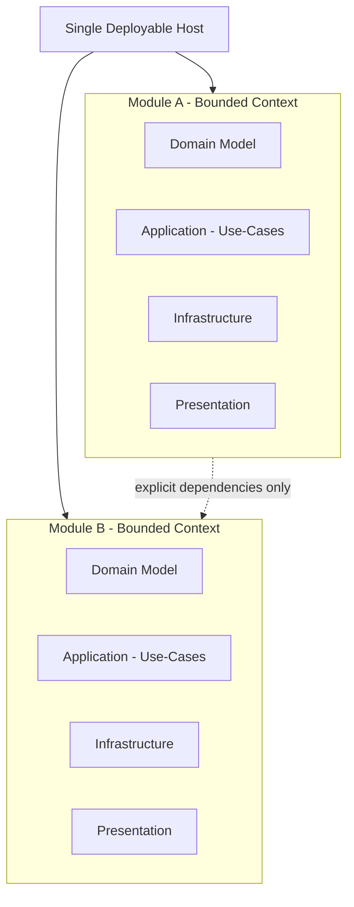

**Trade-offs:**

| Advantage                                       | Limitation                                 |
| ----------------------------------------------- | ------------------------------------------ |
| Simple deployment and operations                | All modules must deploy together           |
| In-process communication (fast, reliable)       | Cannot scale modules independently         |
| Shared infrastructure (logging, auth, config)   | Shared process means shared failure domain |
| Lower operational complexity than microservices | Requires discipline to maintain boundaries |

**When to extract a module into a service:** If a module has fundamentally different scaling requirements, a different deployment cadence, or is owned by a separate team with its own release cycle, it is a candidate for extraction. The explicit contracts and data isolation make this extraction mechanical rather than architectural.

### Domain Events (In-Process)

**Background:** Domain events are a core DDD pattern introduced by Udi Dahan and popularized by Vaughn Vernon. They represent things that have happened in the domain — past tense, immutable facts. Unlike commands (which express intent and may be rejected), events express outcomes.

Domain events capture meaningful state changes inside a bounded context. They are raised from aggregates and processed within the same module to trigger internal workflows.

**Why raise events from aggregates?** The aggregate is the authority on state changes. By raising events from within the aggregate, we guarantee that events are only produced when valid state transitions occur. If the aggregate rejects an operation (throws, returns failure), no event is raised. This eliminates the risk of publishing events for operations that never actually happened.

Optionally, a domain-event outbox can be added to ensure domain events are dispatched only after successful persistence (and can be retried if dispatch fails). Without an outbox, there is a window between "state was persisted" and "event was dispatched" where a failure could cause events to be lost.

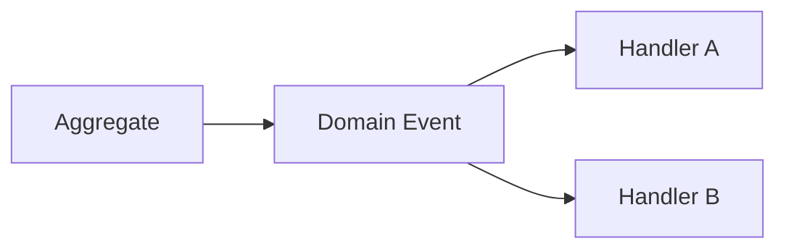

**Common uses of domain events:**

- Generating derived data (e.g., a customer number after creation).
- Triggering side effects within the same module (e.g., audit logging).
- Translating into outbound messages for other modules.
- Updating projections or read models within the module.

**Pitfalls:**

- Raising events for things that did not actually change state (use events for facts, not wishes).
- Processing events that have side effects before the transaction commits (use the outbox to defer).
- Creating deep event chains where Event A triggers Handler B which raises Event C — this makes debugging difficult and can create hidden ordering dependencies.

### Messaging (Messages and Broker)

**Background:** Messaging decouples producers from consumers in both time and space. The producing module does not need to know who will consume the message, when they will consume it, or how many consumers exist. This is fundamentally different from synchronous calls, where the caller must know the provider and wait for a response.

Messaging is a separate concern from domain events. Messages are application-boundary artifacts used for asynchronous communication between modules via a message broker.

Messages may be produced from application workflows or as a deliberate translation step from domain events.

Optionally, a message outbox can be added to make publishing to the broker more reliable (store the message as part of the state change and publish it asynchronously).

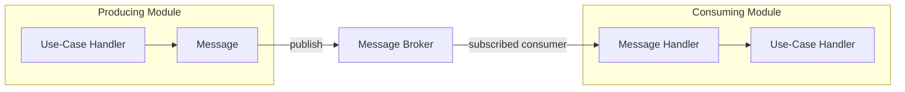

**Message design guidelines:**

- Messages are contracts. Treat them with the same care as API endpoints — version them, document them, avoid breaking changes.
- Messages should be self-contained. A consumer should not need to call back to the producer to understand a message.
- Messages should be named in past tense (`CustomerCreated`, `OrderShipped`) to emphasize that they represent facts.
- Consumers must be idempotent. At-least-once delivery means a message may arrive more than once.

**Broker responsibilities:** The message broker handles transport, routing, and delivery guarantees. It is not responsible for message content, schema validation, or business logic. The broker is infrastructure; message contracts are application concerns.

### Contracts API (Explicit Module Interfaces)

**Background:** In a modular monolith, modules share a process. Without discipline, this makes it easy to "just reference that class from the other module." The Contracts API pattern prevents this by defining an explicit, minimal interface that a module exposes to others.

Synchronous module interactions are modeled through explicit contracts. This prevents accidental coupling and provides a clear, versionable interface between bounded contexts.

In practice, these contracts are typically owned by the providing module (for example as a dedicated Contracts package/project) and referenced by consuming modules.

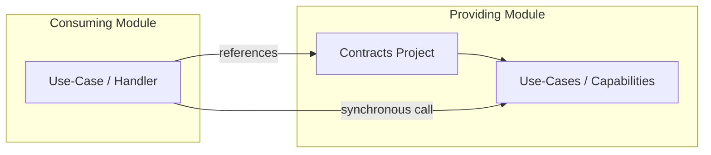

**Design principles for Contracts APIs:**

- **Minimal surface:** Expose only what consumers genuinely need. Every public contract is a commitment.
- **Owned by the provider:** The module that implements the capability owns and publishes the contracts. Consumers depend on the contract, not on internals.
- **Stable DTOs:** Contract DTOs are separate from internal domain models. Internal refactoring does not change contracts.
- **No domain leakage:** Contracts should not expose aggregates, entities, or value objects. They expose flat, serializable DTOs.
- **Versioning strategy:** When a contract must change in a breaking way, version it explicitly rather than modifying the existing contract.

**Anti-patterns:**

- Exposing a module's `DbContext` or `IRepository` as a contract.
- Returning domain entities through the contracts API.
- Creating "god contracts" that expose too much of a module's internal state.

### Outbox Pattern

**Background:** The outbox pattern solves a fundamental distributed systems problem: how to reliably perform a side effect (send a message, dispatch an event) only when a state change succeeds, without using distributed transactions.

The naive approach — save to the database, then publish a message — fails if the process crashes between the two steps. The message is lost. The reverse — publish first, then save — risks publishing a message for a state change that never persisted.

The outbox pattern ensures reliable handling of "something that must happen because state changed" (a side effect) without trying to perform the side effect inside the same request/transaction.

At a high level:

- In the same transaction as the domain state change, the application writes an outbox record describing the pending work.
- A separate worker/processor reads pending outbox records and performs the side effect.
- After successful handling, the worker marks the outbox record as processed.

This improves consistency because the state change and the creation of the outbox record are atomic, and the side effect can be retried independently.

Note: Outbox processing is typically at-least-once. Consumers/handlers should be idempotent.

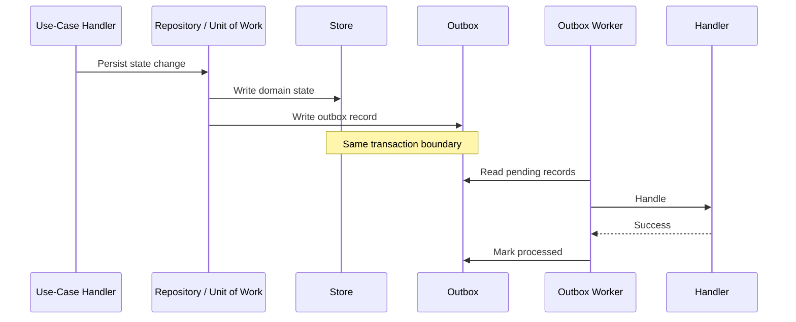

**Two flavors in this system:**

| Outbox type         | Purpose                                       | Records                          |
| ------------------- | --------------------------------------------- | -------------------------------- |
| Domain-event outbox | Reliable dispatch of in-process domain events | Domain events pending dispatch   |
| Message outbox      | Reliable publishing to the message broker     | Messages pending broker delivery |

**Operational considerations:**

- The outbox worker should run on a schedule or trigger (not on every request).
- Failed outbox records should be retried with backoff and eventually moved to a dead-letter store.
- Outbox tables should be pruned periodically to prevent unbounded growth.
- Monitoring the outbox backlog is a key health indicator: a growing backlog suggests processing failures or throughput issues.

### Vertical Slice / Package-by-Feature

**Background:** The vertical slice architecture organizes code by use case rather than by technical layer. Instead of asking "where are all the handlers?" you ask "where is everything related to creating a customer?"

This aligns the code structure with how developers think about changes. When a product owner says "change how customer creation works," the developer navigates to a single folder and finds everything relevant: the command, the validator, the handler, and any related domain interactions.

Use-cases are modeled explicitly (commands/queries + handlers) and grouped by intent, enabling local reasoning and limiting cross-feature coupling.

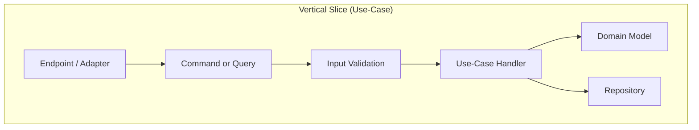

**Benefits:**

- **Local reasoning:** Everything for a use case is in one place.
- **Low coupling between features:** Changing one use case does not touch files shared with others.
- **Easy to add:** A new feature is a new folder with a new command, handler, and validator. No existing files are modified.
- **Easy to delete:** Removing a feature means deleting a folder. No scattered references.

**Trade-offs:**

- Some duplication across slices is expected and acceptable. Shared abstractions should emerge naturally, not be forced prematurely.
- Cross-cutting concerns (validation, retry, logging) are handled by the pipeline, not duplicated per slice.

Here's the **merged section on Rich Domain Model** that combines both perspectives:

---

## Rich Domain Model

**Background:** The rich domain model is the opposite of the "anemic domain model" anti-pattern. In an anemic model, domain objects are data bags — they have properties but no behavior. Business logic lives in services and handlers, scattered across the application layer. In a rich domain model, the domain objects themselves enforce invariants and express behavior. Business rules and invariants live in the domain model (aggregates, entities, value objects, and rules), not in endpoints or procedural scripts.

The domain model is built from three fundamental building blocks: aggregates, entities, and value objects. Together, they enforce invariants, prevent invalid state, and make business rules explicit in code.

**Why a rich domain model matters:**

Without a rich model, business logic is scattered across handlers and services, making it hard to find, reuse, or test. Aggregates say "these objects belong together, and this root object is responsible for keeping them consistent." Value objects move validation to the type system — if an EmailAddress instance exists, it is valid. Entities enforce their own invariants rather than allowing external code to set state inconsistently.

Scattered logic also leads to inconsistent enforcement — a rule might be checked in one handler but forgotten in another. A rich model ensures rules are checked everywhere, because they are enforced by the type system.

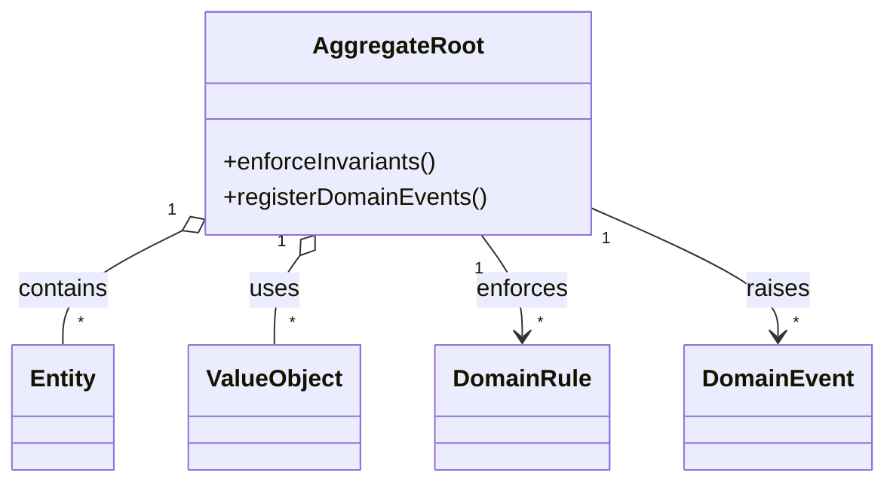

**Aggregates:**

An aggregate is a cluster of domain objects (entities and value objects) treated as a single unit. The aggregate root is the only object external code can reference. All access to entities and value objects inside the aggregate flows through the root, preventing external code from putting the aggregate into an inconsistent state.

An aggregate defines a consistency boundary: all invariants within the aggregate are guaranteed to be consistent after every operation. You should not need a distributed transaction to keep an aggregate consistent.

Each handler should operate on one aggregate at a time. If an operation requires changing multiple aggregates, those changes are separate transactions, or the operation is a domain event that other modules react to.

**Design guidelines for aggregates:**

- Keep aggregates small. Include only entities that must be consistent together within a single transaction. Large aggregates cause contention and make reasoning about consistency difficult.
- The aggregate root is the only object with an identity (ID). Entities inside the aggregate are identified only through the root.
- Use factory methods on the aggregate root for creation — not `new Customer()` followed by property assignments. Factory methods enforce creation invariants in one place.
- Make invalid state unrepresentable. If an aggregate has rules about which combinations of state are valid, the type system should prevent invalid combinations.
- Aggregates should not reference other aggregates or entities by holding a reference. Use IDs instead, or separate the operation into multiple transactions with messaging.
- Aggregate roots can raise domain events to trigger other workflows. These events should be raised as part of the aggregate's methods, ensuring they are only produced when valid state changes occur.

**Entities:**

An entity is a domain object with a unique identity that persists over time. Two entities are different if they have different IDs, even if all their attributes are identical. Entities can change state — a Customer's email can be updated, an Order's status can change.

Entities are responsible for enforcing their own invariants. Methods should validate preconditions and reject invalid operations rather than allowing external code to set state inconsistently.

**Value Objects:**

A value object is a domain object with no identity. Two value objects are equal if all their attributes are equal. Value objects are immutable — once created, they cannot be modified. A Money value object with amount 100 and currency USD is equal to any other Money with the same amount and currency, regardless of when it was created.

Value objects are ideal for domain concepts that have structural constraints. An EmailAddress value object validates its format at construction time. An address, a money amount, a date range — these are all naturally value objects.

Why value objects matter: they move validation to the type system. Rather than checking "is the email valid?" scattered across handlers, the EmailAddress value object guarantees validity at construction. If an EmailAddress instance exists, it is valid.

**Design guidelines for value objects:**

- Immutable — no setters, no mutating methods. Create a new value object rather than modifying an existing one.
- Validated at construction — constructor validates all rules. If construction succeeds, the object is valid.
- No identity — equality is based on attributes, not ID.
- Prefer value objects over primitives for domain concepts. Use `Money` instead of `decimal`, `EmailAddress` instead of `string`.
- Value objects can be compared and hashed, making them suitable for use in collections and as dictionary keys.

**When to use each:**

| Concept      | Identity        | Mutability | When to use                                                      |
| ------------ | --------------- | ---------- | ---------------------------------------------------------------- |
| Aggregate    | Yes (root only) | Yes        | A cluster of objects that must be consistent together            |
| Entity       | Yes             | Yes        | A domain object that changes over time and needs unique identity |
| Value Object | No              | No         | A domain concept with structural validation and no identity      |

**Anti-patterns to avoid:**

- Anemic aggregates — aggregates that hold data but have no behavior. Business rules should live inside aggregates, not in handlers.
- Mutable value objects — value objects that can be modified after creation. This defeats the purpose of type-level validation.
- Aggregates that are too large — includes too many entities and value objects. This causes contention and makes reasoning about consistency difficult.
- Referencing other aggregates by holding a reference — use IDs instead, or separate the operation into multiple transactions with messaging.
- Value objects that expose internal mutable collections — if a value object contains a collection, it should be immutable (or a copy should be returned).
- Scattering business logic across handlers — rules that belong in the domain should not be checked in the application layer.

**Architectural benefit:** Well-designed aggregates, entities, and value objects make the domain model self-documenting. Rules are not scattered across handlers — they live where they belong, in the domain. Invalid states are impossible to construct. The code reads like the business speaks. Tests focus on domain rules, not on wiring handlers and repositories together.

### Behaviors (Decorators)

**Background:** Cross-cutting concerns — validation, retry, timeout, logging, authorization — apply to many use cases but are not part of any specific use case's logic. Without a structured approach, these concerns get copy-pasted into every handler, creating duplication and inconsistency.

The behavior pipeline (a form of the decorator pattern, also known as the Chain of Responsibility) wraps handlers with reusable, composable policies. Each behavior in the chain can inspect the request, modify it, short-circuit the pipeline (e.g., on validation failure), or add context (e.g., set a module scope).

Cross-cutting policies are applied consistently around use-cases via a behavior chain, keeping handlers focused on orchestration and domain interaction.

This is used for concerns like validation, retry, timeout, logging, and similar policies that should apply consistently across use-cases. The decorator idea can also be applied around persistence (repository behaviors) and around request dispatching (Requester/Notifier behaviors).

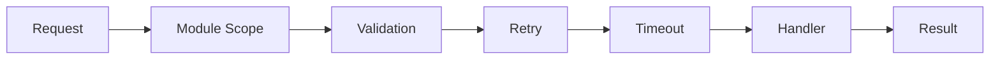

**Behavior ordering matters:**

The order of behaviors in the pipeline is significant. Consider:

1. **Module Scope** — Sets the module context so downstream behaviors and handlers know which module is active.
2. **Validation** — Runs first to reject invalid requests before any expensive work. A failed validation short-circuits the entire pipeline.
3. **Retry** — Wraps the remaining pipeline so that transient failures trigger a retry of everything downstream.
4. **Timeout** — Wraps the handler to prevent long-running operations from blocking the pipeline.

If retry were placed before validation, invalid requests would be retried — wasteful and incorrect.

**Repository behaviors** follow the same principle but wrap persistence operations: tracing, logging, audit state tracking, and domain event outbox publishing are all applied as a chain around the actual repository call. This ensures these concerns are consistent across all persistence operations without polluting repository implementations.

**Adding new behaviors:** A new cross-cutting concern (e.g., caching, rate limiting) is added by implementing a new behavior and registering it in the pipeline. No existing handlers or behaviors need to change.

### Database-per-Module (Logical Ownership)

**Background:** Data ownership is one of the hardest boundaries to enforce in a monolith. When modules share tables, any schema change becomes a cross-team coordination problem. When modules join across each other's tables, they create invisible coupling that only surfaces when a migration breaks something.

Database-per-module enforces data isolation at the design level. Each module owns its tables, its schema, and its DbContext. Other modules cannot query, join, or write to another module's tables.

Each bounded context owns its persistence boundary. Other modules do not directly access its data store; they collaborate through contracts or messages.

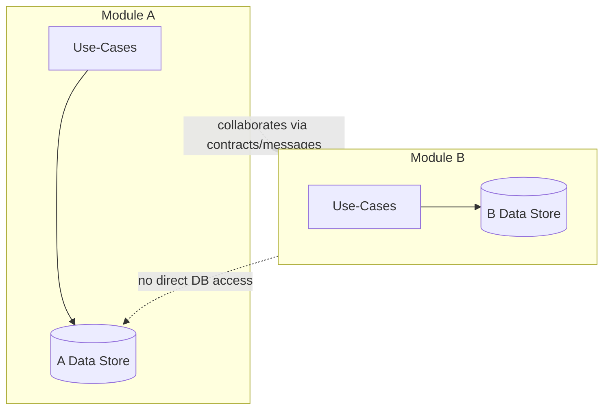

**Implementation options (in order of increasing isolation):**

| Strategy                             | Isolation    | Complexity | Migration path      |
| ------------------------------------ | ------------ | ---------- | ------------------- |
| Separate DbContexts, shared database | Logical      | Low        | Good starting point |
| Separate schemas, shared database    | Schema-level | Medium     | Natural next step   |
| Separate databases                   | Physical     | High       | Full autonomy       |

**Why "no direct DB access" matters:**

If Module B queries Module A's tables directly, it creates a hidden dependency. Module A cannot change its schema without risking Module B. Module A cannot change its database engine. Module A cannot optimize its storage strategy. The dependency is invisible at the code level — it only exists at the SQL level — making it particularly dangerous.

By enforcing "collaborate via contracts or messages," every cross-module dependency is visible in the code and can be versioned, tested, and evolved explicitly.

**Trade-off:** Cross-module reporting and analytics may require a separate read model or data warehouse that aggregates data from multiple modules. This is acceptable and expected — reporting is a different bounded context with its own storage strategy.

### Background Jobs and Startup Tasks

**Background:** Not all work is triggered by HTTP requests. Systems need to perform scheduled tasks (exports, cleanups, reconciliation), process outbox records, and initialize state at startup. These workflows are first-class citizens in the architecture, not afterthoughts bolted on outside the module structure.

Time-triggered and bootstrapping workflows are treated as module-owned use-cases, applying the same domain and persistence boundaries as request-driven flows.

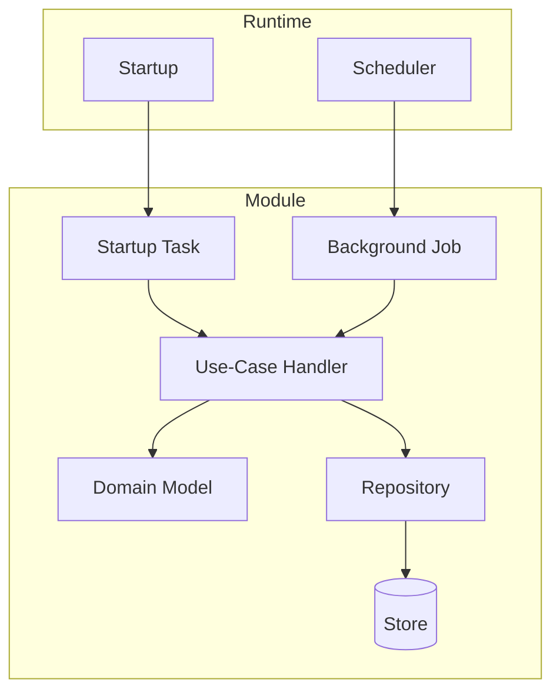

**Key principle:** Background jobs and startup tasks are module-owned. A job that processes CoreModule data lives in CoreModule's infrastructure layer, not in a shared "Jobs" project. This maintains module autonomy and ensures that job logic has access to the module's domain model and repositories through the same channels as request-driven handlers.

**Design guidelines:**

- Jobs should be idempotent — running a job twice should produce the same result.
- Jobs should be observable — log start, end, duration, and item counts.
- Jobs should respect module boundaries — a job in Module A does not access Module B's data.
- Startup tasks should be fast and fail-safe — a slow startup task delays the entire application.
- Long-running jobs should support cancellation via `CancellationToken`.

### Architectural Tests (Fitness Functions)

**Background:** Architecture erodes. Even with the best intentions, developers under time pressure take shortcuts: a handler references a DbContext directly, a domain class imports an infrastructure namespace, a module reaches into another module's internals. Over time, these small violations accumulate until the architecture exists only in documentation, not in code.

Architectural tests (also called fitness functions, a term from Neal Ford's "Building Evolutionary Architectures") are automated checks that continuously validate the architecture's structural constraints. They run in CI alongside unit and integration tests, catching violations before they reach the main branch.

Architectural tests act as automated fitness functions to continuously validate dependency direction, layer boundaries, and module coupling rules.

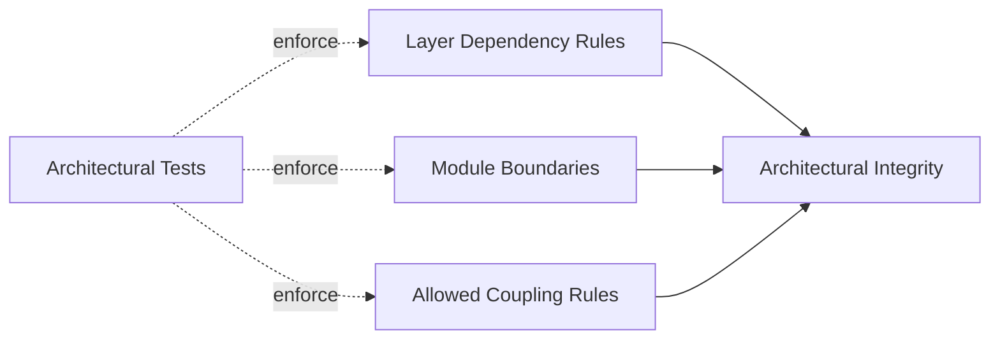

**What to test:**

| Rule                       | Example                                                               |
| -------------------------- | --------------------------------------------------------------------- |
| Layer dependency direction | Domain does not reference Infrastructure                              |
| Module isolation           | CoreModule internals are not referenced by other modules              |
| Domain purity              | Domain layer has no framework dependencies                            |
| Naming conventions         | Commands end with `Command`, queries end with `Query`                 |
| Aggregate access           | Entities inside an aggregate are not referenced directly from outside |
| Contract stability         | Contracts project only contains DTOs and interfaces                   |

**Example rules (conceptual):**

- Types in `*.Domain` namespaces should not depend on types in `*.Infrastructure` namespaces.
- Types in `Module.A.Internal` should not be referenced by types in `Module.B`.
- All command handlers should reside in the application layer.

These tests are cheap to write, fast to run, and provide enormous value in preventing architectural drift over the lifetime of the system.

### Result Pattern

**Background:** Traditional .NET error handling relies heavily on exceptions. While exceptions are appropriate for exceptional circumstances (a database is unreachable, memory is exhausted), using them for expected business outcomes (validation failures, not-found conditions, rule violations) has several problems:

- Exceptions are invisible in method signatures — callers do not know what can go wrong.
- Exception-driven flow is hard to trace and reason about.
- Catching and re-throwing exceptions for control flow is expensive and obscures intent.

The Result pattern makes success and failure explicit in the type system. A method returns `Result<T>` which is either a success with a value or a failure with error information. Callers must explicitly handle both cases.

The Result pattern makes success and failure explicit, enabling composable workflows and eliminating exception-driven control flow.

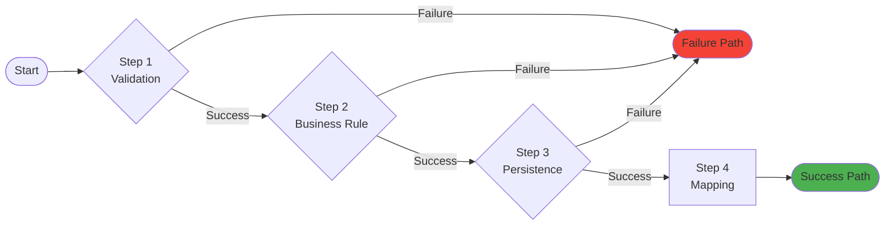

**Benefits:**

- **Explicit:** The method signature tells the caller that failure is possible and what kind.
- **Composable:** Results can be chained. If any step fails, subsequent steps are skipped.
- **Mappable:** The presentation layer maps `Result.Failure` to appropriate HTTP status codes (400, 404, 500) consistently, without catching exceptions.
- **Testable:** Testing the failure path is as simple as asserting on the result — no exception assertions needed.

**How results flow through the system:**

1. Handlers return `Result<T>`.
2. Pipeline behaviors can short-circuit with `Result.Failure` (e.g., validation).
3. Endpoints map results to HTTP responses.

This eliminates the "catch-and-rethrow" pattern and makes the entire request pipeline predictable and traceable.

### Requester/Notifier Pattern

**Background:** The Requester/Notifier pattern is this system's implementation of the mediator concept. Rather than endpoints calling handlers directly (which creates coupling between presentation and application layers), endpoints send commands or queries through the Requester, which dispatches them to the appropriate handler.

This indirection provides a natural interception point for cross-cutting behaviors. The pipeline behaviors (validation, retry, timeout) do not need to know about specific handlers, and handlers do not need to know about behaviors. They are composed at runtime through the pipeline.

**Why "Requester/Notifier" instead of "Mediator"?** The naming is deliberate. A "Requester" sends a request and expects a response (commands, queries). A "Notifier" broadcasts a notification without expecting a response (domain events). This naming makes the communication pattern explicit: request-response vs. fire-and-forget.

The Requester/Notifier (Mediator) pattern decouples senders from handlers and enables cross-cutting behaviors in a consistent pipeline.

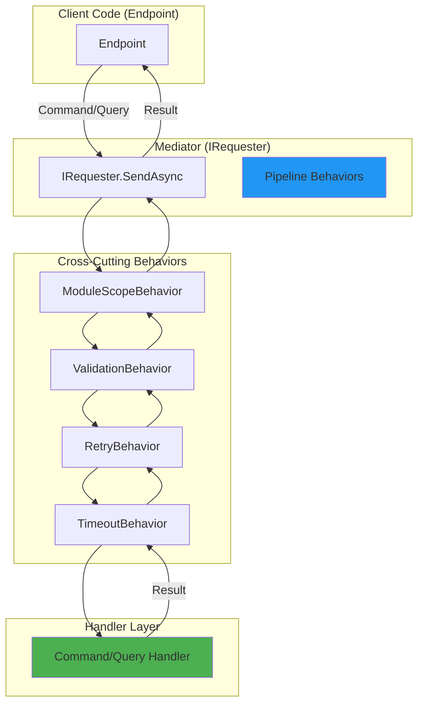

**Design guidelines:**

- One handler per command/query. This keeps handlers focused and testable.
- Handlers should not call the Requester to dispatch other commands. If a handler needs to trigger additional work, it should raise domain events or return a result that the caller can act on.
- Notifications (via INotifier) are for broadcasting — multiple handlers can respond to the same notification. This is used for domain events.
- The Requester is an application-layer concern. Domain objects should not depend on or use it.

### Repository Pattern

**Background:** The repository pattern, described by Martin Fowler and Eric Evans, provides a domain-oriented abstraction over persistence. To the application layer, a repository looks like an in-memory collection of aggregates. The implementation details — SQL queries, ORM mappings, connection management — are hidden behind the interface.

The repository pattern abstracts persistence behind a domain-oriented interface, keeping application and domain logic independent of storage details. It centralizes data access and enables consistent handling of cross-cutting concerns (logging, auditing, and outbox handling) through a behavior chain.

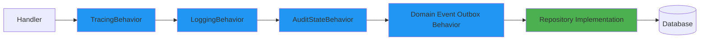

**Why repository behaviors?**

Without behaviors, every repository operation would need to manually handle tracing, logging, auditing, and outbox publishing. This creates duplication and inconsistency. By wrapping the repository in a behavior chain (using the same decorator pattern as the request pipeline), these concerns are applied consistently and transparently.

**Behavior responsibilities:**

| Behavior                  | Responsibility                                                                                |
| ------------------------- | --------------------------------------------------------------------------------------------- |
| TracingBehavior           | Creates trace spans for observability                                                         |
| LoggingBehavior           | Logs operation type, entity type, and duration                                                |
| AuditStateBehavior        | Sets CreatedDate, CreatedBy, UpdatedDate, UpdatedBy                                           |
| DomainEventOutboxBehavior | Collects domain events from aggregates, writes outbox records, dispatches events after commit |

**Design guidelines:**

- One repository per aggregate root. Do not create repositories for non-root entities.
- Repositories accept and return domain objects, not DTOs or database entities.
- Avoid repositories that expose `IQueryable` — they leak persistence concerns into the application layer. Use specifications to express query intent.
- Repository interfaces are defined in the domain or application layer; implementations live in infrastructure.

Here's the **concise section on Domain Specifications** without code samples:

---

## Domain Specifications

**Background:** Specifications encapsulate query logic in a domain-oriented way. Rather than scattering query conditions across handlers or exposing `IQueryable` from repositories, a specification expresses "what to find" as a reusable, composable domain concept. Specifications keep persistence concerns out of the domain while keeping domain intent visible in the application layer.

**Why specifications matter:**

Without specifications, query logic either lives in handlers (mixing application and persistence concerns) or gets scattered across multiple places, creating duplication. Specifications define an explicit boundary: the domain says "here is a meaningful query concept," the application layer uses it, and the infrastructure layer implements it. If the database changes, only the infrastructure layer is affected.

Specifications also improve testability and reusability. A condition like "find active customers" is defined once and used everywhere—in handlers, jobs, and reports—without duplication.

**Common use cases:**

- Find active customers (vs. archived)
- Find customers created in a date range
- Find customers matching a search term
- Find high-value customers

**Design guidelines:**

- One specification per meaningful domain concept (`ActiveCustomerSpec`, `CustomerByNameSpec`).
- Name specifications after the domain concept, not the query mechanism. `ActiveCustomerSpec` not `CustomerQueryByStatus`.
- Specifications should be composable — combine multiple specs with AND/OR operations rather than creating a new spec for every combination.
- Specifications live in the domain layer and express domain logic, not persistence details.
- Repository implementations translate specifications into LINQ or SQL — keep this translation isolated in infrastructure.
- Keep specifications focused and simple. One responsibility per specification.

**Anti-patterns to avoid:**

- Specifications that mention SQL or table joins in their public interface.
- Over-specifying — not every one-off query needs a specification.
- Using specifications for business logic instead of just query conditions.

**Architectural benefit:** Specifications are a natural seam between domain and infrastructure. The domain defines what to find (specification interfaces and concrete specs), handlers use domain concepts (specific specifications), and repositories implement the translation to LINQ or SQL. This keeps business logic out of persistence and makes queries traceable through domain language.

## Architecture Governance (ADRs)

Architectural Decision Records (ADRs) document key architectural choices, alternatives, and rationale. They serve as the authoritative source for why the system uses specific patterns, boundaries, and behaviors. Refer to the ADRs to understand the intent behind each diagram and section in this document.

**Why ADRs matter:** Code shows *what* the system does, and sometimes *how*. It almost never shows *why*. Why did we choose a modular monolith over microservices? Why do we use an outbox instead of publishing events directly? Why is the Requester/Notifier pattern preferred over traditional application services? These decisions have context, trade-offs, and alternatives that are invisible in code. ADRs preserve that context for future team members who were not part of the original discussion.

**ADR lifecycle:**

- **Proposed:** A decision is being discussed.
- **Accepted:** The decision has been made and applies.
- **Superseded:** A newer decision replaces this one (link to the replacement).
- **Deprecated:** The decision is no longer relevant.

In addition, the solution uses architectural tests as fitness functions. These automated checks continuously validate key constraints such as dependency direction, layer boundaries, and allowed module coupling, helping prevent architectural erosion over time.

**The relationship between ADRs and architectural tests:** ADRs express intent ("Domain must not depend on Infrastructure"). Architectural tests enforce it. Every significant ADR should have a corresponding architectural test that prevents violations. When a new ADR is accepted, a new test should be added to the suite.

## Building Blocks and Context

These diagrams provide a shared language for communicating architecture at different levels of detail:

- **Context:** align stakeholders on the system boundary and external collaborators. Useful for non-technical stakeholders and new team members who need to understand "what does this system do and who does it interact with?"
- **Container:** explain the main runtime building blocks and how they interact. Useful for architects and senior developers discussing infrastructure, deployment, and integration decisions.
- **Component:** help developers navigate responsibilities and dependencies inside a module. Useful for implementation-level discussions and code reviews.

They are primarily used for onboarding, architecture reviews, and as a stable reference when discussing changes to boundaries and responsibilities. The notation is based on the [C4 model](https://c4model.com/abstractions), which emphasizes simplicity and clarity while still capturing essential architectural information.

**C4 model levels (for reference):**

| Level        | Audience               | Shows                                                                |
| ------------ | ---------------------- | -------------------------------------------------------------------- |
| 1. Context   | Everyone               | System and its environment                                           |
| 2. Container | Technical stakeholders | Deployable units and their interactions                              |
| 3. Component | Developers             | Internal structure of a container                                    |
| 4. Code      | Developers             | Class-level detail (usually auto-generated, not maintained manually) |

This document covers levels 1–3. Level 4 is left to the code itself and IDE tooling.

### 1. System Context Diagram

High-level view showing the system and its external actors.

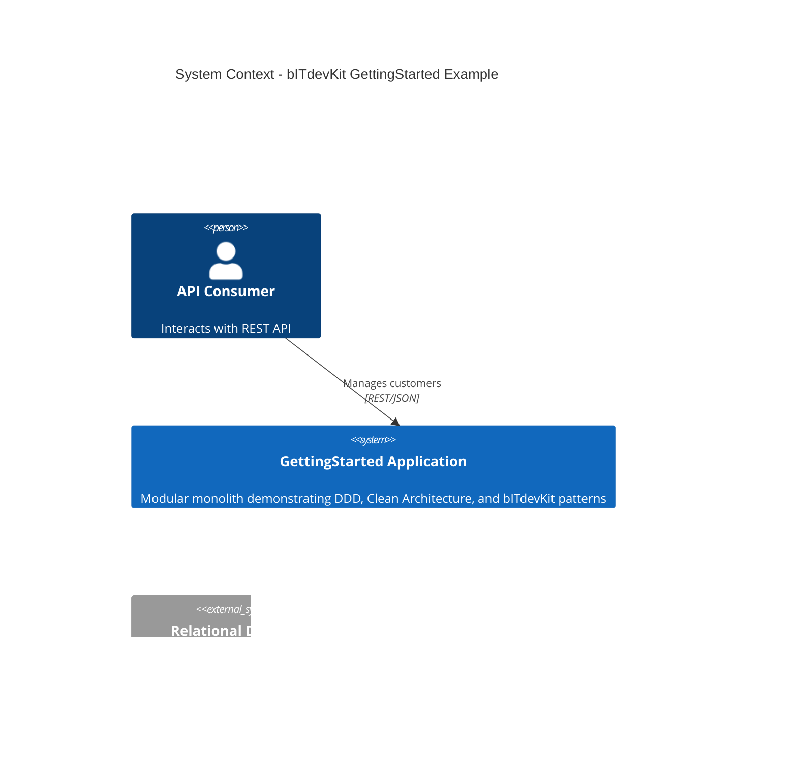

This diagram frames the system boundary and its external collaborators. It is useful for understanding responsibilities and dependencies at the highest level. Notice that the system has a small external footprint — a database and a logging platform. This simplicity is intentional for a modular monolith: operational complexity is kept low.

### 2. Container Diagram

Shows the major containers (applications/processes) that make up the system.

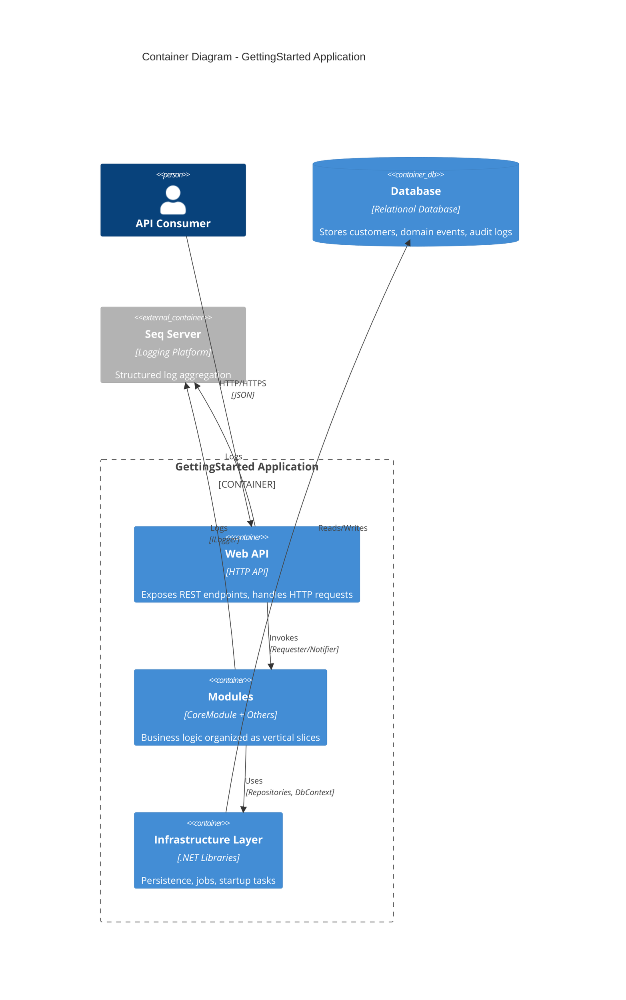

This diagram highlights the deployable/runtime units and how they collaborate, focusing on infrastructure and interaction boundaries. Note that the Web API communicates with modules through the Requester/Notifier — not through direct method calls to handlers. This is the architectural seam that enables the behavior pipeline.

### 3. Component Diagram - CoreModule

Internal structure of the CoreModule showing Clean Architecture layers.

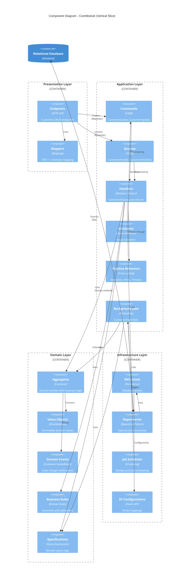

This diagram zooms into a module to show how presentation, application, domain, and infrastructure components interact within a vertical slice. Every new module follows this same structure, making the architecture predictable and the learning curve flat: once you understand one module, you understand all of them.

---

## Architecture Diagrams

### 4. Clean Architecture Overview

High-level view of the Clean/Onion architecture and dependency direction.

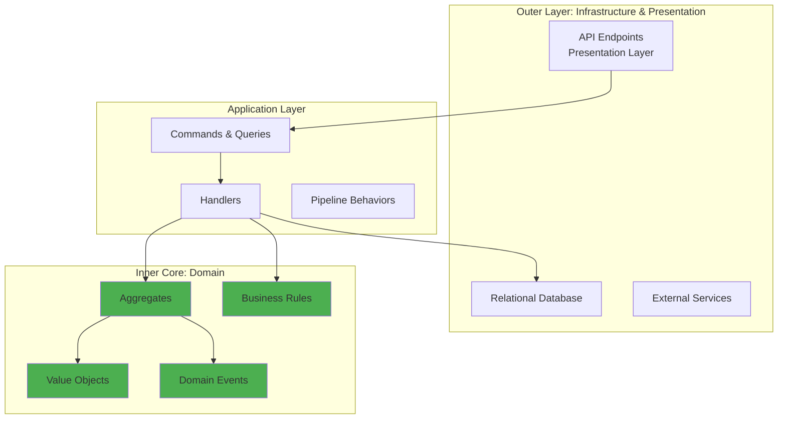

This diagram emphasizes the inner core and highlights that dependencies flow toward domain logic. The green inner core is the most stable part of the system. Everything outside it can be replaced — a new UI framework, a different database, an alternative logging platform — without touching the domain.

### 5. Clean Architecture Layers

Onion Architecture showing dependency direction (inward only).

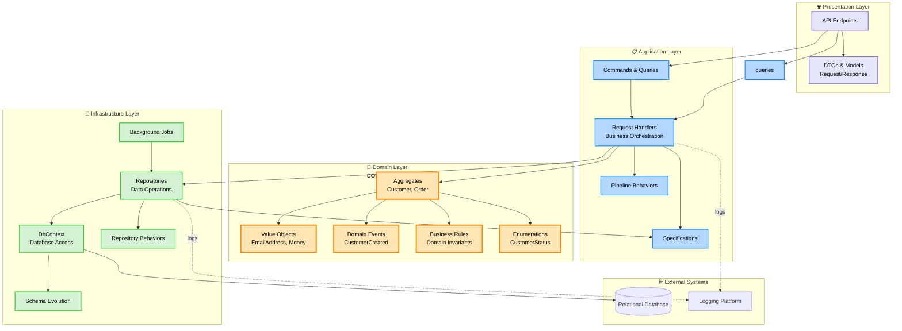

This diagram emphasizes dependency direction and the separation of concerns between layers. Notice that the domain layer (orange) has no outgoing arrows to infrastructure or presentation — only incoming arrows from the application layer. This is the dependency rule in action.

### 6. Module Structure

Modular monolith organization with vertical slices.

```mermaid
flowchart TB
    subgraph host["🚀 Host"]
        program[Composition Root]
        middleware[Middleware Pipeline]
        startup[Startup Configuration]
    end

    subgraph coremodule["📦 CoreModule (Vertical Slice)"]
        direction TB

        subgraph corepresentation["Presentation"]
            coreendpoints[API Endpoints]
            coremappers[Mapping Profiles]
            coremoduleconfig[Module Registration]
        end

        subgraph coreapp["Application"]
            corecmds[Commands]
            corequeries[Queries]
            corehandlers[Handlers]
            corevalidators[Validation]
        end

        subgraph coredomain["Domain"]
            customer[Customer Aggregate]
            email[EmailAddress VO]
            status[CustomerStatus Enum]
            customerevents[Domain Events]
        end

        subgraph coreinfra["Infrastructure"]
            coredbcontext[DbContext]
            corerepos[Repository]
            corejobs[Background Jobs]
            coremigrations[Migrations]
        end
    end

    subgraph futuremodule["📦 Future Module Example"]
        futureplaceholder[Order Module<br/>Product Module<br/>etc.]
    end

    subgraph shared["🔗 Shared/Common"]
        devkit[bITdevKit<br/>Abstractions & Utilities]
        crosscutting[Cross-Cutting Concerns<br/>Logging, Caching, etc.]
    end

    program --> coremoduleconfig
    program --> middleware
    middleware --> coreendpoints

    coreendpoints --> corecmds
    coreendpoints --> corequeries
    corecmds --> corehandlers
    corequeries --> corehandlers
    corehandlers --> customer
    corehandlers --> corerepos
    corerepos --> coredbcontext
    customer --> email
    customer --> status
    customer --> customerevents

    coremoduleconfig -.registers.-> devkit
    futuremodule -.future.-> program

    crosscutting -.used by.-> coremodule

    classDef hostStyle fill:#FFE4E1,stroke:#DC143C,stroke-width:2px
    classDef moduleStyle fill:#F0F8FF,stroke:#4682B4,stroke-width:2px
    classDef sharedStyle fill:#F5F5DC,stroke:#DAA520,stroke-width:2px

    class host hostStyle
    class coremodule,futuremodule moduleStyle
    class shared sharedStyle
```

This diagram shows how modules are organized and how the host composes them into a single application. The host (composition root) is thin — it registers modules and sets up middleware but contains no business logic. Each module is self-registering: it provides a registration method that the host calls during startup. This keeps the host decoupled from module internals and makes adding a new module a single-line change.

---

## Interaction Diagrams

### 6. Sequence Diagram - Customer Creation

Complete flow from HTTP request to database persistence.

```mermaid
sequenceDiagram
    actor User
    participant API as API Gateway<br/>(Presentation)
    participant Endpoint as Customer Endpoint
    participant Requester as Requester<br/>(Mediator)
    participant Behaviors as Pipeline Behaviors
    participant Handler as CommandHandler<br/>(Application)
    participant Customer as Customer<br/>(Domain)
    participant Repo as Repository<br/>(Infrastructure)
    participant RepoBehaviors as Repository Behaviors
    participant DB as Relational Database

    User->>API: POST /api/core/customers
    activate API

    API->>Endpoint: Route to endpoint
    activate Endpoint

    Endpoint->>Endpoint: Map DTO to Command
    Endpoint->>Requester: Send CustomerCreateCommand
    activate Requester

    Requester->>Behaviors: ModuleScopeBehavior
    activate Behaviors
    Behaviors->>Behaviors: Set Module Context
    Behaviors->>Behaviors: ValidationBehavior

    alt Validation Fails
        Behaviors-->>Requester: Result.Failure (ValidationErrors)
        Requester-->>Endpoint: ValidationError
        Endpoint-->>API: 400 Bad Request
        API-->>User: Error Response
    else Validation Succeeds
        Behaviors->>Behaviors: RetryBehavior
        Behaviors->>Behaviors: TimeoutBehavior
        Behaviors->>Handler: Execute Command
        deactivate Behaviors

        activate Handler
        Handler->>Customer: Create(name, email)
        activate Customer

        Customer->>Customer: Validate Invariants
        Customer->>Customer: Generate CustomerId
        Customer->>Customer: Create EmailAddress VO
        Customer->>Customer: Register Domain Event
        Customer-->>Handler: Customer instance
        deactivate Customer

        Handler->>Repo: AddAsync(customer)
        activate Repo

        Repo->>RepoBehaviors: LoggingBehavior
        activate RepoBehaviors
        RepoBehaviors->>RepoBehaviors: Log operation
        RepoBehaviors->>RepoBehaviors: AuditStateBehavior
        RepoBehaviors->>RepoBehaviors: Set Created/Updated metadata
        RepoBehaviors->>RepoBehaviors: DomainEventPublishingBehavior
        RepoBehaviors->>DB: INSERT INTO Customers
        activate DB
        DB-->>RepoBehaviors: Row inserted
        deactivate DB

        RepoBehaviors->>RepoBehaviors: Publish CustomerCreated event
        RepoBehaviors-->>Repo: Success
        deactivate RepoBehaviors
        Repo-->>Handler: Customer with Id
        deactivate Repo

        Handler-->>Requester: Result.Success(customer)
        deactivate Handler
        Requester-->>Endpoint: Result<Customer>
        deactivate Requester

        Endpoint->>Endpoint: Map to ResponseModel
        Endpoint-->>API: 201 Created + Location
        deactivate Endpoint
        API-->>User: Success Response
        deactivate API
    end

    Note over User,DB: Full request-response cycle with<br/>validation, domain logic, and persistence
```

This sequence focuses on request orchestration across layers, highlighting behaviors, domain logic, and repository behaviors.

### 7. Sequence Diagram - Domain Event Dispatching

How domain events flow through the system (in-process).

```mermaid
sequenceDiagram
    participant Handler as Command Handler
    participant Customer as Customer Aggregate
    participant Repo as Repository
    participant RepoBehavior as DomainEvent Behavior
    participant Notifier as In-Process Notifier
    participant EventHandler as Domain Event Handler
    participant Logger as ILogger

    Handler->>Customer: Create/Update operation
    activate Customer
    Customer->>Customer: Business logic
    Customer->>Customer: DomainEvents.Register(event)
    Customer-->>Handler: Modified aggregate
    deactivate Customer

    Handler->>Repo: SaveChanges()
    activate Repo

    Repo->>RepoBehavior: Before SaveChanges
    activate RepoBehavior

    RepoBehavior->>RepoBehavior: Collect domain events
    RepoBehavior->>Repo: Persist changes to DB
    Repo->>Repo: Persist changes

    Note over RepoBehavior: Transaction committed

    RepoBehavior->>Notifier: Dispatch(CustomerCreatedEvent)
    activate Notifier

    Notifier->>EventHandler: Handle(CustomerCreatedEvent)
    activate EventHandler
    EventHandler->>Logger: Log event
    EventHandler->>EventHandler: Execute side effects
    EventHandler-->>Notifier: Complete
    deactivate EventHandler

    Notifier-->>RepoBehavior: Events dispatched
    deactivate Notifier

    RepoBehavior->>Customer: Clear domain events
    RepoBehavior-->>Repo: Complete
    deactivate RepoBehavior

    Repo-->>Handler: Success
    deactivate Repo

    Note over Handler,Logger: Events dispatched after successful<br/>transaction commit (Domain Event Outbox)
```

This sequence illustrates how domain events are collected and dispatched reliably after persistence.

---

## Data Model

### 8. Entity Relationship Diagram

Current domain model for CoreModule.

```mermaid
erDiagram
    CUSTOMER ||--o{ DOMAIN_EVENT : triggers

    CUSTOMER {
        uniqueidentifier Id PK "Typed CustomerId"
        nvarchar(256) Name "Customer full name"
        nvarchar(256) Email UK "EmailAddress value object"
        nvarchar(50) Status "CustomerStatus enumeration"
        nvarchar(64) CustomerNumber UK "Unique customer number"
        datetime2 CreatedDate "Audit: Created timestamp"
        nvarchar(256) CreatedBy "Audit: Creator identifier"
        datetime2 UpdatedDate "Audit: Last update timestamp"
        nvarchar(256) UpdatedBy "Audit: Last updater"
    }

    DOMAIN_EVENT {
        uniqueidentifier Id PK
        nvarchar(256) EventType "Discriminator for event types"
        uniqueidentifier AggregateId FK "Reference to aggregate"
        nvarchar(max) EventData "Serialized event payload (JSON)"
        datetime2 OccurredAt "Event timestamp"
        bit IsDispatched "Domain event outbox flag"
        datetime2 DispatchedAt "Dispatch timestamp"
    }

    MESSAGE_OUTBOX {
        uniqueidentifier Id PK
        nvarchar(256) Type "Message type"
        nvarchar(max) Content "Serialized message (JSON)"
        datetime2 CreatedAt
        datetime2 ProcessedAt
        int RetryCount
        nvarchar(max) ErrorMessage
    }

    DOMAIN_EVENT ||--o{ MESSAGE_OUTBOX : "may be translated into"
```

This diagram captures the persistence view of core domain concepts and the outbox mechanism.

**Notes:**

- Customer uses typed ID (CustomerId) via source generator
- EmailAddress is a value object but stored as string
- CustomerStatus is an enumeration stored as string
- Domain events are persisted in a domain-event outbox for reliable dispatch after persistence
- Messages may be persisted in a message outbox for reliable broker publication
- Audit fields populated by AuditStateBehavior

---

## Request Processing

### 9. Request Pipeline Flow

How requests flow through pipeline behaviors before reaching handlers.

```mermaid
flowchart TD
    Start([HTTP Request]) --> Endpoint[API Endpoint]
    Endpoint --> MapDTO[Map DTO to Command/Query]
    MapDTO --> SendRequest[Requester.SendAsync]

    SendRequest --> ModuleScope[ModuleScopeBehavior]
    ModuleScope --> SetContext[Set Module Context]

    SetContext --> Validation[ValidationPipelineBehavior]
    Validation --> ValidateCheck{Valid?}
    ValidateCheck -->|No| ValidationErrors[Collect Validation Errors]
    ValidationErrors --> FailureResult1[Return Result.Failure]

    ValidateCheck -->|Yes| Retry[RetryPipelineBehavior]
    Retry --> RetryConfig[Check Retry Attributes]

    RetryConfig --> Timeout[TimeoutPipelineBehavior]
    Timeout --> TimeoutConfig[Check Timeout Attributes]

    TimeoutConfig --> Handler[Command/Query Handler]
    Handler --> Execute[Execute Business Logic]

    Execute --> CheckResult{Success?}
    CheckResult -->|Exception| RetryCheck{Retry?}
    RetryCheck -->|Yes| RetryDelay[Wait & Retry]
    RetryDelay --> Handler
    RetryCheck -->|No| FailureResult2[Return Result.Failure]

    CheckResult -->|Timeout| TimeoutError[Return Timeout Error]

    CheckResult -->|Success| Domain[Domain Operations]
    Domain --> Persistence[Repository Operations]
    Persistence --> SuccessResult[Return Result.Success]

    FailureResult1 --> MapResponse
    FailureResult2 --> MapResponse
    TimeoutError --> MapResponse
    SuccessResult --> MapResponse[Map to Response DTO]

    MapResponse --> HTTPResponse{Result Type?}
    HTTPResponse -->|Success| HTTP200[200 OK / 201 Created]
    HTTPResponse -->|Validation| HTTP400[400 Bad Request]
    HTTPResponse -->|Not Found| HTTP404[404 Not Found]
    HTTPResponse -->|Error| HTTP500[500 Server Error]

    HTTP200 --> End([Return to Client])
    HTTP400 --> End
    HTTP404 --> End
    HTTP500 --> End

    classDef behaviorStyle fill:#B4E7FF,stroke:#0077BE,stroke-width:2px
    classDef errorStyle fill:#FFB4B4,stroke:#DC143C,stroke-width:2px
    classDef successStyle fill:#B4FFB4,stroke:#228B22,stroke-width:2px
    classDef handlerStyle fill:#FFE4B4,stroke:#FF8C00,stroke-width:2px

    class ModuleScope,Validation,Retry,Timeout behaviorStyle
    class ValidationErrors,FailureResult1,FailureResult2,TimeoutError,HTTP400,HTTP404,HTTP500 errorStyle
    class SuccessResult,HTTP200 successStyle
    class Handler,Execute handlerStyle
```

This flowchart shows the end-to-end request lifecycle, from transport to domain execution and response mapping.

---

## Diagram Usage

These diagrams serve different purposes:

1. **C4 Diagrams (1-3)**: For architectural understanding and stakeholder communication
2. **Architecture Diagrams (4-5)**: For understanding layer boundaries and module organization
3. **Sequence Diagrams (6-7)**: For understanding runtime behavior and request flows
4. **ERD (8)**: For database schema understanding and domain model relationships
5. **Flow Diagram (9)**: For understanding request processing pipeline

## Related Documentation

- [Clean/Onion Architecture ADR](./ADR/0001-clean-onion-architecture.md)
- [Modular Monolith ADR](./ADR/0003-modular-monolith-architecture.md)
- [Requester/Notifier Pattern ADR](./ADR/0005-requester-notifier-mediator-pattern.md)
- [Domain Events Outbox Pattern ADR](./ADR/0006-outbox-pattern-domain-events.md)
- [Repository Behaviors ADR](./ADR/0004-repository-decorator-behaviors.md)

## Updating These Diagrams

When the architecture changes:

1. Update relevant diagram(s) in this file
2. Test rendering in your markdown viewer
3. Commit diagram source (not images) with code changes
4. Reference in pull request description
5. Update related ADRs if architectural decisions change

---

*Generated: February 3, 2026*
*Project: bITdevKit GettingStarted Example*
*Architecture: Clean/Onion with Modular Monolith*
