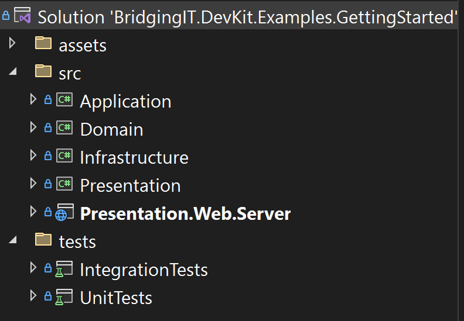
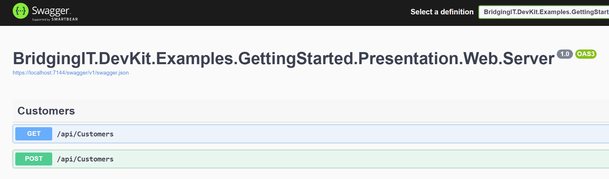
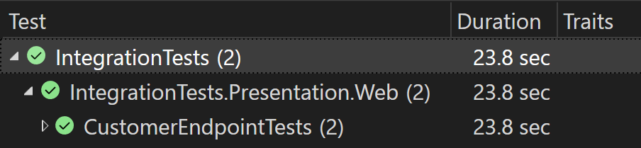
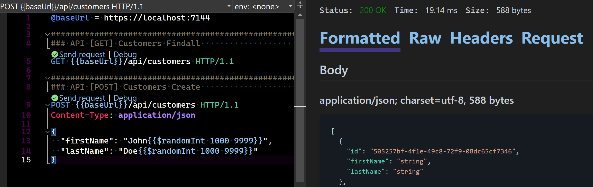

=====================================

# Architecture overview

> An application built using .NET 8 and following a Domain-Driven Design approach by using the BridgingIT DevKit.

## Features
- Application Commands/Queries
- Domain Model, ValueObjects, Events, Rules, TypedIds, Repositories
- Presentation Model
- Unit & Integration Tests

## Frameworks
- [.NET 8](https://learn.microsoft.com/en-us/dotnet/core/whats-new/dotnet-8/overview)
- [Entity Framework Core](https://learn.microsoft.com/en-us/ef/core/)
- [ASP.NET Core](https://dotnet.microsoft.com/en-us/apps/aspnet)
- [Serilog](https://serilog.net/)
- [xUnit.net](https://xunit.net/), [NSubstitute](https://nsubstitute.github.io/), [Shouldly](https://docs.shouldly.org/)

## Getting Started

### Running the Application

The supporting containers should first be started with `docker-compose up` or `docker-compose up -d`.
Then the Presentation.Web.Server project can be set as the startup project.
On `CTRL+F5` this will start the host at [https://localhost:7144](https://localhost:7144).

- [SQL Server](https://learn.microsoft.com/en-us/sql/sql-server/?view=sql-server-ver16) details: `Server=127.0.0.1,14339;Database=bit_devkit_gettingstarted;User=sa;Password=Abcd1234!;Trusted_Connection=False;TrustServerCertificate=True;MultipleActiveResultSets=true;encrypt=false;`
- [Swagger UI](https://swagger.io/docs/) is available [here](https://localhost:7144/swagger/index.html).
- [Seq](https://docs.datalust.co/docs/an-overview-of-seq) Dashboard is available [here](http://localhost:15349).

### Architecture Overview

The GettingStarted project, powered by bITDevKit, is structured around key architectural layers:


### Solution Structure



### Application

Contains commands, queries, and their respective handlers.

#### Commands

([CustomerCreateCommand.cs](./src/Application/Commands/CustomerCreateCommand.cs))

```csharp
public class CustomerCreateCommand
    : CommandRequestBase<Customer>
{
    public string FirstName { get; set; }

    public string LastName { get; set; }

    public override ValidationResult Validate() =>
        new Validator().Validate(this);

    public class Validator : AbstractValidator<CustomerCreateCommand>
    {
        public Validator()
        {
            this.RuleFor(c => c.FirstName).NotNull().NotEmpty().WithMessage("Must not be empty.");
            this.RuleFor(c => c.LastName).NotNull().NotEmpty().WithMessage("Must not be empty.");
        }
    }
}
```

([CustomerCreateCommandHandler.cs](./src/Application/Commands/CustomerCreateCommandHandler.cs))

```csharp
public class CustomerCreateCommandHandler
    : CommandHandlerBase<CustomerCreateCommand, Customer>
{
    private readonly IGenericRepository<Customer> repository;

    public CustomerCreateCommandHandler(
        ILoggerFactory loggerFactory,
        IGenericRepository<Customer> repository)
        : base(loggerFactory)
    {
        this.repository = repository;
    }

    public override async Task<CommandResponse<Customer>> Process(
        CustomerCreateCommand request,
        CancellationToken cancellationToken)
    {
        var customer = new Customer { FirstName = request.FirstName, LastName = request.LastName };
        await this.repository.UpsertAsync(customer, cancellationToken).AnyContext();

        return new CommandResponse<Customer> // TODO: use .For?
        {
            Result = customer
        };
    }
}
```

#### Queries


### Domain

Defining your core business logic with domain models and aggregates.

#### Aggregates

```csharp
public class Customer : AggregateRoot<Guid>
{
    public string FirstName { get; set; }
    public string LastName { get; set; }
}
```

### Infrastructure

Providing the backbone with a DbContext setup and repository implementations.

#### DbContext

([AppDbContext.cs](./src/Infrastructure/EntityFramework/AppDbContext.cs))

````csharp
public class AppDbContext : DbContext
{
    public AppDbContext(DbContextOptions<AppDbContext> options)
        : base(options)
    {
    }

    public DbSet<Customer> Customers { get; set; }
}
````

### Presentation

Serves as the entry point for external interactions, focusing on delivering data and services to clients.

#### CompositeRoot (Registrations)

([Program.cs](./src/Presentation.Web.Server/Program.cs))

```csharp
builder.Services.AddCommands();
builder.Services.AddQueries();

builder.Services
    .AddSqlServerDbContext<CoreDbContext>(o => o
        .UseConnectionString(builder.Configuration.GetConnectionString("Default")))
    .WithDatabaseMigratorService();
```

#### ViewModels

([CustomerViewModel.cs](./src/Presentation/ViewModels/CustomerViewModel.cs))

````csharp
public class CustomerViewModel
{
    public string Id { get; set; }

    public string FirstName { get; set; }

    public string LastName { get; set; }
}
````

#### Web API (Controllers)

([CustomersController.cs](./src/Presentation/Web/Controllers/CustomersController.cs))

````csharp
[ApiController]
[Route("api/[controller]")]
public class CustomersController : ControllerBase
{
    private readonly IMediator mediator;

    public CustomersController(IMediator mediator)
    {
        this.mediator = mediator;
    }

    [HttpGet]
    public async Task<ActionResult<IEnumerable<CustomerViewModel>>> GetAsync()
    {
        var query = new CustomerFindAllQuery();
        var result = await this.mediator.Send(query);

        return this.Ok(result?.Result?.Select(e =>
            new CustomerViewModel
            {
                Id = e.Id.ToString(),
                FirstName = e.FirstName,
                LastName = e.LastName
            }));
    }

    [HttpPost]
    public async Task<ActionResult> PostAsync([FromBody] CustomerViewModel model)
    {
        if (model is null)
        {
            return this.BadRequest();
        }

        var command = new CustomerCreateCommand()
        {
            FirstName = model.FirstName,
            LastName = model.LastName
        };

        var result = await this.mediator.Send(command);

        return this.Created($"/api/customers/{result.Result.Id}", null);
    }
}
````


### Testing the API

Ensuring reliability through comprehensive unit, integration, and HTTP tests.

#### Swagger UI

Start the application (CTRL-F5) and use the following UI to test the API:

[Swagger UI](https://localhost:7144/swagger/index.html)



#### Unit Tests


#### Integration Tests



#### Http Tests

Start the application (CTRL-F5) and use the following HTTP requests to test the API:
[API.http](./API.http)


