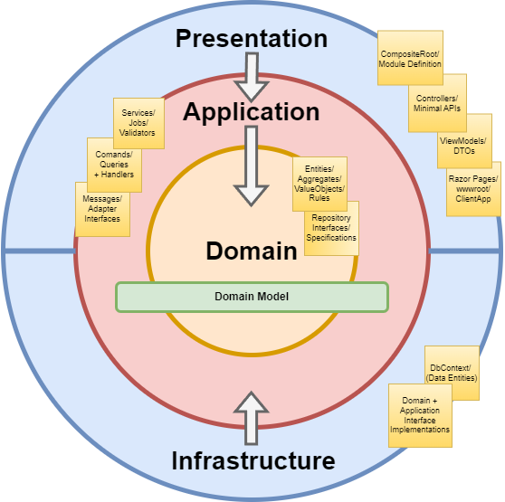

# BridgingIT DevKit GettingStarted Example


An application built using .NET 9 and following a Domain-Driven Design (DDD) approach by using the BridgingIT DevKit (bIT DevKit).

## Features
- Modular architecture with CoreModule as an example. [Modules](https://github.com/BridgingIT-GmbH/bITdevKit/blob/main/docs/features-modules.md)
- Application layer with Commands (e.g., CustomerCreateCommand) and Queries (e.g., CustomerFindAllQuery, CustomerFindOneQuery) using IRequester. [Requester](https://github.com/BridgingIT-GmbH/bITdevKit/blob/main/docs/features-requester-notifier.md), [Commands and Queries](https://github.com/BridgingIT-GmbH/bITdevKit/blob/main/docs/features-application-commands-queries.md)
- Domain layer with Aggregates (Customer), Value Objects (EmailAddress, CustomerId), Enumerations (CustomerStatus), Domain Events (CustomerCreatedDomainEvent, CustomerUpdatedDomainEvent), and Business Rules (e.g., EmailShouldBeUniqueRule). [Domain](https://github.com/BridgingIT-GmbH/bITdevKit/blob/main/docs/features-domain-models.md), [DomainEvents](https://github.com/BridgingIT-GmbH/bITdevKit/blob/main/docs/features-domain-events.md), [Rules](https://github.com/BridgingIT-GmbH/bITdevKit/blob/main/docs/features-rules.md)
- Infrastructure layer with Entity Framework Core (CoreDbContext, migrations, configurations) and Generic Repositories with behaviors (logging, audit, domain event publishing). [Repositories](https://github.com/BridgingIT-GmbH/bITdevKit/blob/main/docs/features-domain-repositories.md)
- Presentation layer with Web API Endpoints for CRUD operations on Customers, using minimal API-style routing. [Endpoints](https://github.com/BridgingIT-GmbH/bITdevKit/blob/main/docs/features-presentation-endpoints.md)
- Startup tasks for seeding domain data (CoreDomainSeederTask). [StartupTasks](https://github.com/BridgingIT-GmbH/bITdevKit/blob/main/docs/features-startuptasks.md)
- Job scheduling with Quartz (e.g., CustomerExportJob). [JobScheduling](https://github.com/BridgingIT-GmbH/bITdevKit/blob/main/docs/features-jobscheduling.md)
- Comprehensive testing: Unit tests (e.g., for command/query handlers, architecture rules), Integration tests (e.g., for endpoints).
- Architecture validation tests to enforce Onion Architecture dependencies and domain rules (e.g., no public constructors on entities/value objects).

## Frameworks and Libaries
- [.NET 9](https://learn.microsoft.com/en-us/dotnet/core/whats-new/dotnet-9/overview)
- [ASP.NET Core](https://dotnet.microsoft.com/en-us/apps/aspnet)
- [Entity Framework Core](https://learn.microsoft.com/en-us/ef/core/) for data access
- [Serilog](https://serilog.net/) for structured logging
- [Mapster](https://github.com/MapsterMapper/Mapster) for object mapping
- [FluentValidation](https://fluentvalidation.net/) for validation
- [Quartz.NET](https://www.quartz-scheduler.net/) for job scheduling
- [xUnit.net](https://xunit.net/), [NSubstitute](https://nsubstitute.github.io/), [Shouldly](https://docs.shouldly.org/) for testing
---
## Getting Started

### Running the Application

1. Ensure you have .NET 9/10 SDK installed.
2. Configure the database connection string in `appsettings.json` under "CoreModule:ConnectionStrings:Default" (e.g., SQL Server LocalDB).
3. Optionally, start supporting containers with `docker-compose up` or `docker-compose up -d` for SQL Server and Seq logging.
4. Set `Presentation.Web.Server` as the startup project.
5. Run with `CTRL+F5` to start the host at [https://localhost:7144](https://localhost:7144).

- **SQL Server** details: Use the connection string from `appsettings.json` (e.g., `Server=(localdb)\\MSSQLLocalDB;Database=bit_devkit_gettingstarted;Trusted_Connection=True`).
- **Swagger UI** is available [here](https://localhost:7144/swagger/index.html).
- **Seq** Dashboard (if using containers) is available [here](http://localhost:15349).

The application will automatically migrate the database on startup (via DatabaseMigratorService in CoreModule) and seed initial data (via CoreDomainSeederTask) in development mode.

### Architecture Overview

The GettingStarted project follows Clean/Onion Architecture principles, powered by bIT DevKit for modular DDD:



- **Core (Domain)**: Business logic, aggregates, value objects, events.
- **Application**: Commands, queries, handlers with behaviors (retry, timeout).
- **Infrastructure**: Persistence (EF Core), repositories with behaviors (logging, audit).
- **Presentation**: Web API endpoints, module registration.

### Solution Structure

```
BridgingIT.DevKit.Examples.GettingStarted.sln
├── src
│   ├── Modules
│   │   └── CoreModule
│   │       ├── CoreModule.Application
│   │       ├── CoreModule.Domain
│   │       ├── CoreModule.Infrastructure
│   │       ├── CoreModule.Presentation
│   │       ├── CoreModule.UnitTests
│   │       └── CoreModule.IntegrationTests
│   └── Presentation.Web.Server
└── docker-compose.yml
```

### Application

Contains commands, queries, and handlers for business operations.

#### Commands

([CustomerCreateCommand.cs](./src/Modules/CoreModule/CoreModule.Application/Commands/CustomerCreateCommand.cs))

```csharp
public class CustomerCreateCommand(CustomerModel model) : RequestBase<CustomerModel>
{
    public CustomerModel Model { get; set; } = model;

    public class Validator : AbstractValidator<CustomerCreateCommand>
    {
        public Validator()
        {
            this.RuleFor(c => c.Model).NotNull();
            this.RuleFor(c => c.Model.FirstName).NotNull().NotEmpty().WithMessage("Must not be empty.");
            this.RuleFor(c => c.Model.LastName).NotNull().NotEmpty().WithMessage("Must not be empty.");
            this.RuleFor(c => c.Model.Email).NotNull().NotEmpty().WithMessage("Must not be empty.");
        }
    }
}
```

([CustomerCreateCommandHandler.cs](./src/Modules/CoreModule/CoreModule.Application/Commands/CustomerCreateCommandHandler.cs))

```csharp
[HandlerRetry(2, 100)]   // retry twice, wait 100ms between retries
[HandlerTimeout(500)]    // timeout after 500ms execution
public class CustomerCreateCommandHandler(
    ILoggerFactory loggerFactory,
    IMapper mapper,
    IGenericRepository<Customer> repository)
    : RequestHandlerBase<CustomerCreateCommand, CustomerModel>(loggerFactory)
{
    protected override async Task<Result<CustomerModel>> HandleAsync(
        CustomerCreateCommand request,
        SendOptions options,
        CancellationToken cancellationToken)
    {
        var customer = mapper.Map<CustomerModel, Customer>(request.Model);
        return await repository.InsertResultAsync(customer, cancellationToken: cancellationToken)
            .Tap(_ => Console.WriteLine("AUDIT"))
            .Map(mapper.Map<Customer, CustomerModel>);
    }
}
```

#### Queries

([CustomerFindAllQuery.cs](./src/Modules/CoreModule/CoreModule.Application/Queries/CustomerFindAllQuery.cs))

```csharp
public class CustomerFindAllQuery : RequestBase<IEnumerable<CustomerModel>>
{
    public Specification<Customer>? Filter { get; set; } = null;
}
```

([CustomerFindAllQueryHandler.cs](./src/Modules/CoreModule/CoreModule.Application/Queries/CustomerFindAllQueryHandler.cs))

```csharp
[HandlerRetry(2, 100)]   // retry twice, wait 100ms between retries
[HandlerTimeout(500)]    // timeout after 500ms execution
public class CustomerFindAllQueryHandler(
    ILoggerFactory loggerFactory,
    IMapper mapper,
    IGenericRepository<Customer> repository)
    : RequestHandlerBase<CustomerFindAllQuery, IEnumerable<CustomerModel>>(loggerFactory)
{
    protected override async Task<Result<IEnumerable<CustomerModel>>> HandleAsync(
        CustomerFindAllQuery request,
        SendOptions options,
        CancellationToken cancellationToken) =>
        await repository.FindAllResultAsync(request.Filter, cancellationToken: cancellationToken)
            .Tap(_ => Console.WriteLine("AUDIT"))
            .Map(mapper.Map<Customer, CustomerModel>);
}
```

### Domain

Core business logic with domain models and aggregates.

#### Aggregates

([Customer.cs](./src/Modules/CoreModule/CoreModule.Domain/Model/Customer.cs))

```csharp
[DebuggerDisplay("Id={Id}, Name={FirstName} {LastName}, Status={Status}")]
[TypedEntityId<Guid>]
public class Customer : AuditableAggregateRoot<CustomerId>, IConcurrency
{
    public string FirstName { get; private set; }
    public string LastName { get; private set; }
    public EmailAddress Email { get; private set; }
    public CustomerStatus Status { get; private set; } = CustomerStatus.Lead;
    public Guid ConcurrencyVersion { get; set; }

    public static Customer Create(string firstName, string lastName, string email)
    {
        var customer = new Customer(firstName, lastName, EmailAddress.Create(email));
        customer.DomainEvents.Register(new CustomerCreatedDomainEvent(customer));
        return customer;
    }

    // Additional methods for changing name, email, status with domain event registration
}
```

#### Value Objects

([EmailAddress.cs](./src/Modules/CoreModule/CoreModule.Domain/Model/EmailAddress.cs))

```csharp
[DebuggerDisplay("Value={Value}")]
public class EmailAddress : ValueObject
{
    public string Value { get; private set; }

    public static EmailAddress Create(string value)
    {
        value = value?.Trim()?.ToLowerInvariant();
        Rule.Add(RuleSet.IsValidEmail(value)).Throw();
        return new EmailAddress(value);
    }

    protected override IEnumerable<object> GetAtomicValues()
    {
        yield return this.Value;
    }
}
```

#### Enumerations

([CustomerStatus.cs](./src/Modules/CoreModule/CoreModule.Domain/Model/CustomerStatus.cs))

```csharp
[DebuggerDisplay("Id={Id}, Value={Value}")]
public class CustomerStatus : Enumeration
{
    public static readonly CustomerStatus Lead = new(1, nameof(Lead), "Lead customer");
    public static readonly CustomerStatus Active = new(2, nameof(Active), "Active customer");
    public static readonly CustomerStatus Retired = new(3, nameof(Retired), "Retired customer");

    // Additional properties and methods
}
```

#### Domain Events

([CustomerCreatedDomainEvent.cs](./src/Modules/CoreModule/CoreModule.Domain/Events/CustomerCreatedDomainEvent.cs))

```csharp
public class CustomerCreatedDomainEvent(Customer model) : DomainEventBase
{
    public Customer Model { get; } = model;
}
```

### Infrastructure

Persistence setup with EF Core.

#### DbContext

([CoreDbContext.cs](./src/Modules/CoreModule/CoreModule.Infrastructure/EntityFramework/CoreDbContext.cs))

```csharp
public class CoreDbContext(DbContextOptions<CoreDbContext> options) : DbContext(options)
{
    public DbSet<Customer> Customers { get; set; }

    protected override void OnModelCreating(ModelBuilder modelBuilder)
    {
        modelBuilder.ApplyConfigurationsFromAssembly(this.GetType().Assembly);
    }
}
```

#### Configurations

([CustomerTypeConfiguration.cs](./src/Modules/CoreModule/CoreModule.Infrastructure/EntityFramework/Configurations/CustomerTypeConfiguration.cs))

```csharp
public class CustomerTypeConfiguration : IEntityTypeConfiguration<Customer>
{
    public void Configure(EntityTypeBuilder<Customer> builder)
    {
        builder.ToTable("Customers").HasKey(x => x.Id).IsClustered(false);
        // Additional property configurations for Id, Names, Email, Status, AuditState
    }
}
```

#### Migrations

Initial migration creates Customers table with audit fields.

### Presentation

Web API endpoints and module registration.

#### Module Registration

([CoreModule.cs](./src/Modules/CoreModule/CoreModule.Presentation/CoreModule.cs))

```csharp
public class CoreModule : WebModuleBase
{
    public override IServiceCollection Register(
        IServiceCollection services,
        IConfiguration configuration = null,
        IWebHostEnvironment environment = null)
    {
        var moduleConfiguration = this.Configure<CoreModuleConfiguration, CoreModuleConfiguration.Validator>(services, configuration);

        services.AddStartupTasks(o => o.WithTask<CoreDomainSeederTask>(o => o.Enabled(environment.IsLocalDevelopment())));
        services.AddJobScheduling(o => o.StartupDelay(configuration["JobScheduling:StartupDelay"]), configuration)
            .WithSqlServerStore(configuration["JobScheduling:Quartz:quartz.dataSource.default.connectionString"])
            .WithJob<CustomerExportJob>().Cron(CronExpressions.EveryHour).Named(nameof(CustomerExportJob)).RegisterScoped();

        services.AddSqlServerDbContext<CoreDbContext>(o => o.UseConnectionString(moduleConfiguration.ConnectionStrings["Default"]).UseLogger())
            .WithDatabaseMigratorService(o => o.Enabled(environment.IsLocalDevelopment()).DeleteOnStartup(environment.IsLocalDevelopment()));

        services.AddEntityFrameworkRepository<Customer, CoreDbContext>()
            .WithBehavior<RepositoryLoggingBehavior<Customer>>()
            .WithBehavior<RepositoryAuditStateBehavior<Customer>>()
            .WithBehavior<RepositoryDomainEventPublisherBehavior<Customer>>();

        services.AddEndpoints<CoreCustomerEndpoints>();

        return services;
    }
}
```

#### Endpoints

([CoreCustomerEndpoints.cs](./src/Modules/CoreModule/CoreModule.Presentation/Web/Endpoints/CoreCustomerEndpoints.cs))

```csharp
public class CoreCustomerEndpoints : EndpointsBase
{
    public override void Map(IEndpointRouteBuilder app)
    {
        var group = app.MapGroup("api/core/customers").WithTags("Core.Customers");

        group.MapGet("/{id:guid}", CustomerFindOne).WithName("Core.Customers.GetById");
        group.MapGet("", CustomerFindAll).WithName("Core.Customers.GetAll");
        group.MapPost("", CustomerCreate).WithName("Core.Customers.Create");
        group.MapPut("/{id:guid}", CustomerUpdate).WithName("Core.Customers.Update");
        group.MapDelete("/{id:guid}", CustomerDelete).WithName("Core.Customers.Delete");
    }

    // Handler methods for each endpoint using IRequester
}
```

#### Mapper Registration

([CoreModuleMapperRegister.cs](./src/Modules/CoreModule/CoreModule.Presentation/CoreModuleMapperRegister.cs))

```csharp
public class CoreModuleMapperRegister : IRegister
{
    public void Register(TypeAdapterConfig config)
    {
        // Configurations for value objects, enumerations, and aggregate-DTO mappings
    }
}
```

### Testing the API

#### Swagger UI

Start the application (CTRL-F5) and test via [Swagger UI](https://localhost:7144/swagger/index.html).

#### Unit Tests

Run tests in `CoreModule.UnitTests` (e.g., CustomerCreateCommandHandlerTests, ArchitectureTests).

#### Integration Tests

Run tests in `CoreModule.IntegrationTests` (e.g., CustomerEndpointTests for HTTP responses).

#### HTTP Tests

Use tools like Postman or VS HTTP file to test endpoints:
- GET /api/core/customers
- POST /api/core/customers with body { "firstName": "John", "lastName": "Doe", "email": "john.doe@example.com" }
--- 
## License

This project is licensed under the MIT License - see the LICENSE file for details.