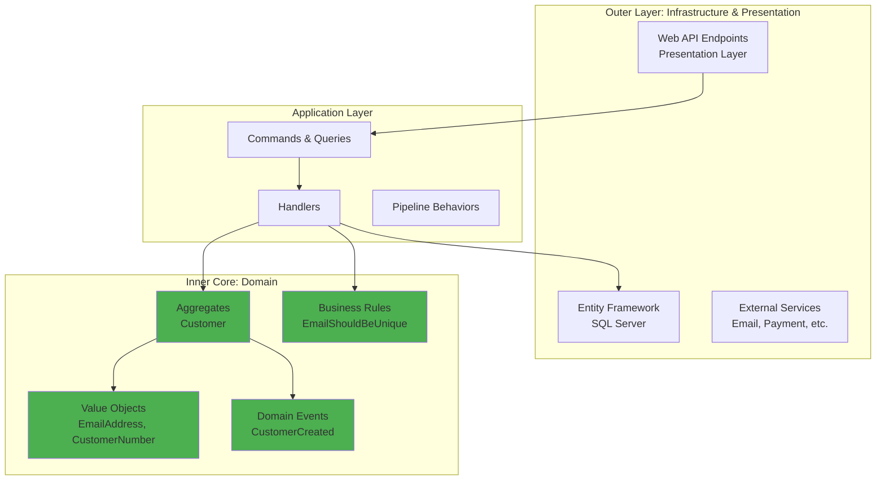
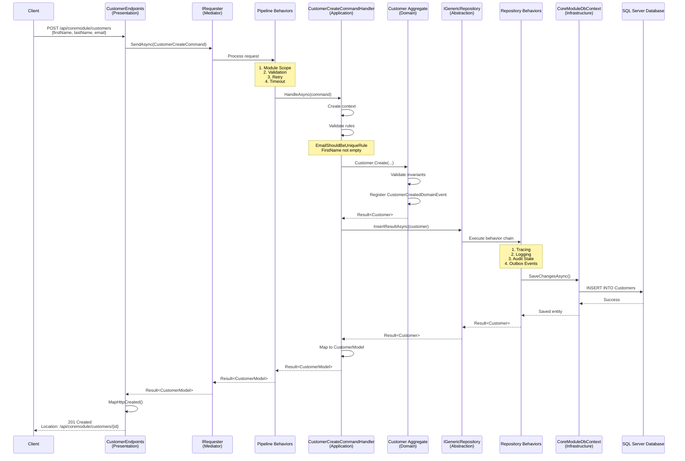
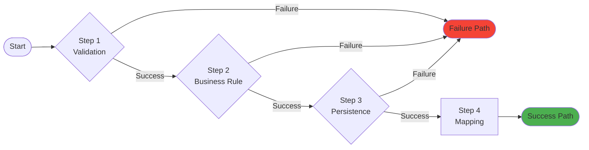
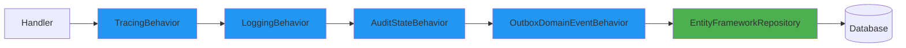
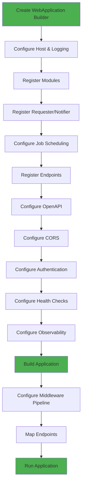
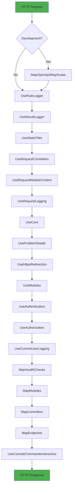

# bITdevKit GettingStarted Example


An application built using .NET 10 and following a Domain-Driven Design (DDD) approach by using the bITdevKit.

## Table of Contents

- [Features](#features)
- [Frameworks and Libraries](#frameworks-and-libraries)
- [Getting Started](#getting-started)
  - [Running the Application](#running-the-application)
- [Architecture Deep Dive](#architecture-deep-dive)
  - [Clean Architecture Overview](#clean-architecture-overview)
  - [Layer Responsibilities](#layer-responsibilities)
  - [Dependency Rules](#dependency-rules)
  - [Request Processing Flow](#request-processing-flow)
  - [Modular Monolith Structure](#modular-monolith-structure)
- [Core Patterns](#core-patterns)
  - [Result Pattern (Railway-Oriented Programming)](#result-pattern-railway-oriented-programming)
  - [Requester/Notifier Pattern (Mediator)](#requesternotifier-pattern-mediator)
  - [Repository with Behaviors Pattern (Decorator)](#repository-with-behaviors-pattern-decorator)
  - [Module System (Vertical Slices)](#module-system-vertical-slices)
- [Application Bootstrap](#application-bootstrap)
  - [Configuration Stages](#configuration-stages)
  - [Step-by-Step Breakdown](#step-by-step-breakdown)
  - [Middleware Pipeline Configuration](#middleware-pipeline-configuration)
  - [Complete Request Flow](#complete-request-flow)
- [Solution Structure](#solution-structure)
- [Quick Code Examples](#quick-code-examples)
  - [Commands](#commands)
  - [Queries](#queries)
  - [Domain Aggregates](#domain-aggregates)
  - [Value Objects](#value-objects)
  - [Enumerations](#enumerations)
  - [Domain Events](#domain-events)
  - [Infrastructure](#infrastructure)
  - [Presentation](#presentation)
  - [Testing](#testing)
- [Appendix A: Docker & Local Registry Usage](#appendix-a-docker--local-registry-usage)
- [Appendix B: OpenAPI Specification and API Clients](#appendix-b-openapi-specification-and-api-clients)
- [License](#license)

## Features

- Modular architecture with CoreModule as an example. [Modules](https://github.com/BridgingIT-GmbH/bITdevKit/blob/main/docs/features-modules.md)
- Application layer with Commands (e.g., CustomerCreateCommand) and Queries (e.g., CustomerFindAllQuery, CustomerFindOneQuery) using IRequester. [Requester](https://github.com/BridgingIT-GmbH/bITdevKit/blob/main/docs/features-requester-notifier.md), [Commands and Queries](https://github.com/BridgingIT-GmbH/bITdevKit/blob/main/docs/features-application-commands-queries.md)
- Domain layer with Aggregates (Customer), Value Objects (EmailAddress, CustomerId), Enumerations (CustomerStatus), Domain Events (CustomerCreatedDomainEvent, CustomerUpdatedDomainEvent), and Business Rules (e.g., EmailShouldBeUniqueRule). [Domain](https://github.com/BridgingIT-GmbH/bITdevKit/blob/main/docs/features-domain-models.md), [DomainEvents](https://github.com/BridgingIT-GmbH/bITdevKit/blob/main/docs/features-domain-events.md), [Rules](https://github.com/BridgingIT-GmbH/bITdevKit/blob/main/docs/features-rules.md)
- Infrastructure layer with Entity Framework Core (CoreModuleDbContext, migrations, configurations) and Generic Repositories with behaviors (tracing, logging, audit, outbox domain event publishing). [Repositories](https://github.com/BridgingIT-GmbH/bITdevKit/blob/main/docs/features-domain-repositories.md)
- Presentation layer with Web API Endpoints for CRUD operations on Customers, using minimal API-style routing. [Endpoints](https://github.com/BridgingIT-GmbH/bITdevKit/blob/main/docs/features-presentation-endpoints.md)
- Startup tasks for seeding domain data (CoreModuleDomainSeederTask). [StartupTasks](https://github.com/BridgingIT-GmbH/bITdevKit/blob/main/docs/features-startuptasks.md)
- Job scheduling with Quartz (e.g., CustomerExportJob in Application layer). [JobScheduling](https://github.com/BridgingIT-GmbH/bITdevKit/blob/main/docs/features-jobscheduling.md)
- Comprehensive testing: Unit tests (command/query handlers, architecture rules), Integration tests (endpoints, persistence), Architecture tests (boundary enforcement).
- Build-time OpenAPI generation with Kiota client support for C#, TypeScript, and Python.

## Frameworks and Libraries

- [.NET 10](https://learn.microsoft.com/en-us/dotnet/core/whats-new/dotnet-9/overview)
- [ASP.NET Core](https://dotnet.microsoft.com/en-us/apps/aspnet)
- [Entity Framework Core](https://learn.microsoft.com/en-us/ef/core/) for data access
- [Serilog](https://serilog.net/) for structured logging
- [Mapster](https://github.com/MapsterMapper/Mapster) for object mapping
- [FluentValidation](https://fluentvalidation.net/) for validation
- [Quartz.NET](https://www.quartz-scheduler.net/) for job scheduling
- [xUnit.net](https://xunit.net/), [NSubstitute](https://nsubstitute.github.io/), [Shouldly](https://docs.shouldly.org/) for testing

---

## Getting Started

### Running the Application

1. Ensure you have .NET 10 SDK installed.
2. Configure the database connection string in `appsettings.json` under "CoreModule:ConnectionStrings:Default" (e.g., SQL Server LocalDB).
3. Optionally, start supporting containers with `docker-compose up` or `docker-compose up -d` for SQL Server and Seq logging.
4. Set `Presentation.Web.Server` as the startup project.
5. Run with `CTRL+F5` to start the host at [https://localhost:5001](https://localhost:5001).

Access points:
- **Scalar UI**: [https://localhost:5001/scalar](https://localhost:5001/scalar)
- **OpenAPI Spec**: [https://localhost:5001/openapi.json](https://localhost:5001/openapi.json)
- **Health Checks**: [https://localhost:5001/health](https://localhost:5001/health)
- **Seq Dashboard** (if using containers): [http://localhost:15349](http://localhost:15349)

The application will automatically migrate the database on startup (via DatabaseMigratorService in CoreModule) and seed initial data (via CoreModuleDomainSeederTask) in development mode.

---

## Architecture Deep Dive

The bITdevKit GettingStarted project implements **Clean/Onion Architecture** principles combined with **Domain-Driven Design (DDD)** and a **Modular Monolith** approach. This section explains the architectural decisions, layer responsibilities, and how components interact.

### Clean Architecture Overview

Clean Architecture enforces strict dependency rules where **inner layers never depend on outer layers**. Dependencies flow inward toward the domain core, ensuring business logic remains independent of infrastructure concerns and delivery mechanisms.



### Layer Responsibilities

#### Domain Layer (Core)
**Location**: `src/Modules/CoreModule/CoreModule.Domain`

**Responsibilities**:
- Pure business logic and domain rules
- Aggregates, Entities (e.g., `Customer`)
- Value Objects (e.g., `EmailAddress`, `CustomerNumber`)
- Domain Events (e.g., `CustomerCreatedDomainEvent`)
- Business Rules (e.g., `EmailShouldBeUniqueRule`)
- Enumerations (e.g., `CustomerStatus`)

**Dependencies**: None (only bITdevKit domain abstractions)

**Key Principle**: The domain layer is **persistence-ignorant** and **framework-agnostic**. It contains no references to databases, web frameworks, or external services.

#### Application Layer
**Location**: `src/Modules/CoreModule/CoreModule.Application`

**Responsibilities**:
- Use cases orchestration via Commands and Queries
- Request/Response DTOs (`CustomerModel`)
- Handlers that coordinate domain operations
- Validation logic (FluentValidation)
- Mapping between domain and DTOs
- Background Jobs (e.g., `CustomerExportJob`)

**Dependencies**: Domain layer only

**Key Principle**: Application defines **what** the system does, not **how** it's implemented (infrastructure) or **how** it's exposed (presentation).

#### Infrastructure Layer
**Location**: `src/Modules/CoreModule/CoreModule.Infrastructure`

**Responsibilities**:
- Database context and EF Core configurations
- Repository implementations
- External service integrations
- Startup tasks
- Migrations

**Dependencies**: Domain and Application layers

**Key Principle**: Infrastructure provides **implementations** of abstractions defined by inner layers.

#### Presentation Layer
**Location**: `src/Modules/CoreModule/CoreModule.Presentation`

**Responsibilities**:
- HTTP endpoints (Minimal APIs)
- Module registration and configuration
- DTO mapping (Mapster)
- Request/Response transformations

**Dependencies**: Application layer (through `IRequester`)

**Key Principle**: Presentation is a **thin adapter** that translates HTTP requests into application commands/queries and responses back to HTTP.

### Dependency Rules

The architecture enforces these strict dependency rules (validated by [architecture tests](tests/Modules/CoreModule/CoreModule.UnitTests/ArchitectureTests.cs)):

1. **Domain → NONE**: Domain has no dependencies on other layers
2. **Application → Domain**: Application depends only on Domain
3. **Infrastructure → Domain + Application**: Infrastructure implements abstractions
4. **Presentation → Application**: Presentation uses Application through `IRequester`

**Violations are automatically detected** by architecture tests.

### Request Processing Flow

Understanding how a request flows through the architecture is crucial. Here's a complete end-to-end flow for creating a customer:



**Key Stages**:

1. **HTTP Request**: Client sends JSON payload to endpoint
2. **Command Creation**: Endpoint creates `CustomerCreateCommand` with DTO
3. **Pipeline Processing**: Request passes through cross-cutting behaviors
4. **Handler Execution**: Handler orchestrates domain logic
5. **Domain Validation**: Aggregate enforces business rules
6. **Repository Persistence**: Entity saved with behavior chain
7. **Response Mapping**: Result mapped to HTTP response

### Modular Monolith Structure

The application follows a **Modular Monolith** pattern where each module is a **vertical slice** containing all layers:

```
src/Modules/CoreModule/
├── CoreModule.Domain/              (Business logic)
├── CoreModule.Application/         (Use cases)
├── CoreModule.Infrastructure/      (Persistence)
└── CoreModule.Presentation/        (HTTP endpoints)
```

**Module Characteristics**:
- **Self-contained**: Each module has its own DbContext, endpoints, and domain model
- **Loosely coupled**: Modules communicate through contracts or integration events
- **Independently deployable**: Modules can be extracted into microservices if needed

**Module Boundary Rules** (enforced by architecture tests):
- Modules **cannot** directly reference other modules' internal layers
- Modules **can** reference other modules' `.Contracts` assemblies
- Cross-module communication via integration events or public APIs

See [CoreModule README](src/Modules/CoreModule/CoreModule-README.md) for module-specific implementation details.

---

## Core Patterns

The bITdevKit GettingStarted application is built on several key design patterns that work together to create a robust, maintainable, and testable architecture.

### Result Pattern (Railway-Oriented Programming)

The Result Pattern replaces exception-based error handling with explicit success/failure types, enabling **functional composition** and **railway-oriented programming**.

#### Railway-Oriented Programming Diagram



**Key Concept**: Once a step fails, all subsequent steps are skipped, and the failure flows directly to the end.

#### Result Type Structure

```csharp
public class Result<T>
{
    public T Value { get; }
    public bool IsSuccess { get; }
    public bool IsFailure { get; }
    public IEnumerable<IResultMessage> Messages { get; }
    public IEnumerable<IResultError> Errors { get; }
}
```

#### Result Pattern Methods

**Transformation Methods**:
- **`Bind()`**: Transform success value
- **`BindAsync()`**: Async transformation
- **`BindResult()`**: Chain operations that return Results

**Validation Methods**:
- **`Ensure()`**: Inline validation
- **`Unless()` / `UnlessAsync()`**: Business rule checking

**Mapping Methods**:
- **`Map()`**: Transform to different type

**Side Effect Methods**:
- **`Tap()`**: Execute action without changing result
- **`Log()`**: bITdevKit logging extension

See [CoreModule README - Handler Deep Dive](src/Modules/CoreModule/CoreModule-README.md#handler-deep-dive) for detailed examples.

### Requester/Notifier Pattern (Mediator)

The Requester/Notifier pattern is bITdevKit's implementation of the Mediator pattern, decoupling request senders from handlers and enabling cross-cutting concerns through pipeline behaviors.

#### Architecture Diagram

```mermaid
graph TB
    subgraph "Client Code (Endpoint)"
        Client[CustomerEndpoints]
    end
    
    subgraph "Mediator (IRequester)"
        Req[IRequester.SendAsync]
        Pipeline[Pipeline Behaviors]
    end
    
    subgraph "Handler"
        Handler[CustomerCreateCommandHandler]
    end
    
    subgraph "Cross-Cutting Behaviors"
        B1[ModuleScopeBehavior]
        B2[ValidationBehavior]
        B3[RetryBehavior]
        B4[TimeoutBehavior]
    end
    
    Client -->|CustomerCreateCommand| Req
    Req --> B1
    B1 --> B2
    B2 --> B3
    B3 --> B4
    B4 --> Handler
    Handler -->|Result<CustomerModel>| B4
    B4 --> B3
    B3 --> B2
    B2 --> B1
    B1 --> Req
    Req -->|Result<CustomerModel>| Client
    
    style Handler fill:#4CAF50
    style Pipeline fill:#2196F3
```

#### Pipeline Behaviors

Pipeline behaviors wrap handlers to provide cross-cutting concerns:

1. **ModuleScopeBehavior**: Sets module context
2. **ValidationBehavior**: Validates request (FluentValidation)
3. **RetryBehavior**: Retries on transient failures
4. **TimeoutBehavior**: Enforces execution timeout

#### Setup in Program.cs

```csharp
builder.Services.AddRequester()
    .AddHandlers()
    .WithDefaultBehaviors();

builder.Services.AddNotifier()
    .AddHandlers()
    .WithDefaultBehaviors();
```

### Repository with Behaviors Pattern (Decorator)

The Repository pattern abstracts data access, while the Decorator pattern adds cross-cutting concerns through behavior chains.

#### Behavior Chain Diagram



#### Behavior Implementations

1. **RepositoryTracingBehavior**: OpenTelemetry spans for distributed tracing
2. **RepositoryLoggingBehavior**: Structured logging with duration measurement
3. **RepositoryAuditStateBehavior**: Automatic audit metadata (CreatedBy, UpdatedBy)
4. **RepositoryOutboxDomainEventBehavior**: Outbox pattern for reliable event delivery

#### Configuration in Module

```csharp
services.AddEntityFrameworkRepository<Customer, CoreModuleDbContext>()
    .WithBehavior<RepositoryTracingBehavior<Customer>>()
    .WithBehavior<RepositoryLoggingBehavior<Customer>>()
    .WithBehavior<RepositoryAuditStateBehavior<Customer>>()
    .WithBehavior<RepositoryOutboxDomainEventBehavior<Customer, CoreModuleDbContext>>();
```

See [CoreModule README - Repository Behaviors](src/Modules/CoreModule/CoreModule-README.md#repository-behaviors-chain) for detailed explanation.

### Module System (Vertical Slices)

The Modular Monolith pattern organizes code into self-contained vertical slices, each representing a business capability.

#### Module Structure

```
src/Modules/CoreModule/
├── CoreModule.Domain/              # Business logic layer
│   ├── Model/                      # Aggregates, Value Objects
│   ├── Events/                     # Domain Events
│   └── Rules/                      # Business Rules
├── CoreModule.Application/         # Use cases layer
│   ├── Commands/                   # Write operations
│   ├── Queries/                    # Read operations
│   ├── Models/                     # DTOs
│   ├── Jobs/                       # Background jobs
│   └── Events/                     # Event handlers
├── CoreModule.Infrastructure/      # Persistence layer
│   ├── EntityFramework/            # DbContext, Configurations
│   └── StartupTasks/               # Seeder tasks
└── CoreModule.Presentation/        # API layer
    ├── Web/Endpoints/              # HTTP endpoints
    └── CoreModuleModule.cs         # Module registration
```

#### Module Registration in Program.cs

```csharp
builder.Services.AddModules(builder.Configuration, builder.Environment)
    .WithModule<CoreModuleModule>()
    .WithModuleContextAccessors()
    .WithRequestModuleContextAccessors();
```

---

## Application Bootstrap

The `Program.cs` file is the **composition root** where all services, middleware, and modules are configured. Understanding this file is crucial for grasping how the application starts and how components wire together.

### Configuration Stages



### Step-by-Step Breakdown

#### Step 1: Create Builder and Configure Logging

```csharp
var builder = WebApplication.CreateBuilder(args);
builder.Host.ConfigureLogging();
builder.Services.AddConsoleCommandsInteractive();
```

**What happens**: Creates `WebApplicationBuilder` with configuration from `appsettings.json`, environment variables, and command-line args. Configures Serilog for structured logging.

#### Step 2: Register Modules

```csharp
builder.Services.AddModules(builder.Configuration, builder.Environment)
    .WithModule<CoreModuleModule>()
    .WithModuleContextAccessors()
    .WithRequestModuleContextAccessors();
```

**What happens**: Each module's `Register()` method is called to register services (DbContext, repositories, handlers, endpoints, jobs).

#### Step 3: Register Requester and Notifier

```csharp
builder.Services.AddRequester()
    .AddHandlers()
    .WithDefaultBehaviors();

builder.Services.AddNotifier()
    .AddHandlers()
    .WithDefaultBehaviors();
```

**What happens**: Scans assemblies for handlers and registers pipeline behaviors (Module Scope, Validation, Retry, Timeout).

#### Step 4: Configure Job Scheduling

```csharp
builder.Services.AddJobScheduling(o => o
    .StartupDelay(builder.Configuration["JobScheduling:StartupDelay"]), 
    builder.Configuration)
    .WithSqlServerStore(builder.Configuration["JobScheduling:Quartz:..."])
    .WithBehavior<ModuleScopeJobSchedulingBehavior>();
```

**What happens**: Configures Quartz.NET with SQL Server persistence for background jobs.

#### Additional Steps

5. Register Application Endpoints
6. Configure JSON Serialization
7. Configure OpenAPI
8. Configure CORS
9. Configure Authentication/Authorization
10. Configure Health Checks
11. Configure Observability (OpenTelemetry)

### Middleware Pipeline Configuration

The middleware pipeline processes HTTP requests in order:



**Key middleware**:
- **UseRequestCorrelation**: Assigns unique correlation ID
- **UseRequestModuleContext**: Determines handling module
- **UseProblemDetails**: RFC 7807 error responses
- **UseAuthentication/UseAuthorization**: Security layer

### Complete Request Flow

```
1. HTTO Request: POST /api/coremodule/customers
2. UseHttpsRedirection → Ensure HTTPS
3. UseRequestCorrelation → Assign correlation ID
4. UseRequestModuleContext → Set context to CoreModule
5. UseRequestLogging → Log request start
6. UseCors → Validate CORS policy
7. UseAuthentication → Validate JWT token
8. UseAuthorization → Check authorization policy
9. Endpoint matched: CustomerEndpoints.MapPost
10. IRequester.SendAsync(CustomerCreateCommand)
11. Pipeline behaviors execute
12. CustomerCreateCommandHandler.HandleAsync
13. Result<CustomerModel> returned from Handler
14. MapHttpCreated() converts to HTTP 201
15. UseRequestLogging → Log completion
16. HTTP Response sent to client
```

---

## Solution Structure

```
├── src
│   ├── Modules
│   │   └── CoreModule
│   │       ├── CoreModule.Application      # Commands, Queries, Handlers, Jobs
│   │       ├── CoreModule.Contracts        # Public interfaces for other modules
│   │       ├── CoreModule.Domain           # Aggregates, Value Objects, Events
│   │       ├── CoreModule.Infrastructure   # DbContext, Configurations, Migrations
│   │       └── CoreModule.Presentation     # Endpoints, Module registration
│   └── Presentation.Web.Server            # Host application (Program.cs)
├── tests
│   └── Modules
│       ├── CoreModule.UnitTests           # Unit tests (handlers, domain)
│       ├── CoreModule.IntegrationTests    # Integration tests (endpoints, DB)
│       └── CoreModule.Benchmarks          # Performance benchmarks
├── bITdevKit.Examples.GettingStarted.slnx # Solution file
└── docker-compose.yml                     # Container definitions
```

---

## Quick Code Examples

### Commands

([CustomerCreateCommand.cs](./src/Modules/CoreModule/CoreModule.Application/Commands/CustomerCreateCommand.cs))

```csharp
public class CustomerCreateCommand(CustomerModel model) : RequestBase<CustomerModel>
{
    public CustomerModel Model { get; set; } = model;

    public class Validator : AbstractValidator<CustomerCreateCommand>
    {
        public Validator()
        {
            this.RuleFor(c => c.Model).NotNull();
            this.RuleFor(c => c.Model.FirstName).NotNull().NotEmpty();
            this.RuleFor(c => c.Model.LastName).NotNull().NotEmpty();
            this.RuleFor(c => c.Model.Email).NotNull().NotEmpty().EmailAddress();
        }
    }
}
```

### Queries

([CustomerFindAllQuery.cs](./src/Modules/CoreModule/CoreModule.Application/Queries/CustomerFindAllQuery.cs))

```csharp
public class CustomerFindAllQuery : RequestBase<IEnumerable<CustomerModel>>
{
    public FilterModel Filter { get; set; } = null;
}
```

### Domain Aggregates

([Customer.cs](./src/Modules/CoreModule/CoreModule.Domain/Model/Customer.cs))

```csharp
[TypedEntityId<Guid>]
public class Customer : AuditableAggregateRoot<CustomerId>, IConcurrency
{
    public string FirstName { get; private set; }
    public string LastName { get; private set; }
    public EmailAddress Email { get; private set; }
    public CustomerStatus Status { get; private set; } = CustomerStatus.Lead;

    public static Result<Customer> Create(
        string firstName, 
        string lastName, 
        string email, 
        CustomerNumber number)
    {
        var emailResult = EmailAddress.Create(email);
        if (emailResult.IsFailure)
            return emailResult.Unwrap();

        var customer = new Customer(firstName, lastName, emailResult.Value, number);
        customer.DomainEvents.Register(new CustomerCreatedDomainEvent(customer));
        
        return customer;
    }

    public Result<Customer> ChangeEmail(string email)
    {
        var emailResult = EmailAddress.Create(email);
        if (emailResult.IsFailure)
            return emailResult.Unwrap();

        return this.ApplyChange(this.Email, emailResult.Value, v => this.Email = v);
    }
}
```

### Value Objects

([EmailAddress.cs](./src/Modules/CoreModule/CoreModule.Domain/Model/EmailAddress.cs))

```csharp
public class EmailAddress : ValueObject
{
    public string Value { get; private set; }

    public static Result<EmailAddress> Create(string value)
    {
        value = value?.Trim()?.ToLowerInvariant();
        
        if (string.IsNullOrEmpty(value))
            return Result<EmailAddress>.Failure()
                .WithError(new ValidationError("Email cannot be empty"));

        if (!value.Contains("@"))
            return Result<EmailAddress>.Failure()
                .WithError(new ValidationError("Invalid email format"));

        return new EmailAddress(value);
    }

    protected override IEnumerable<object> GetAtomicValues()
    {
        yield return this.Value;
    }
}
```

### Enumerations

([CustomerStatus.cs](./src/Modules/CoreModule/CoreModule.Domain/Model/CustomerStatus.cs))

```csharp
public class CustomerStatus : Enumeration
{
    public static readonly CustomerStatus Lead = new(1, nameof(Lead), "Lead customer");
    public static readonly CustomerStatus Active = new(2, nameof(Active), "Active customer");
    public static readonly CustomerStatus Retired = new(3, nameof(Retired), "Retired customer");

    private CustomerStatus(int id, string name, string description = null) 
        : base(id, name)
    {
        this.Description = description;
    }

    public string Description { get; private set; }
}
```

### Domain Events

([CustomerCreatedDomainEvent.cs](./src/Modules/CoreModule/CoreModule.Domain/Events/CustomerCreatedDomainEvent.cs))

```csharp
public partial class CustomerCreatedDomainEvent(Customer model) : DomainEventBase
{
    public Customer Model { get; private set; } = model;
}
```

### Infrastructure

([CoreModuleDbContext.cs](./src/Modules/CoreModule/CoreModule.Infrastructure/EntityFramework/CoreModuleDbContext.cs))

```csharp
public class CoreModuleDbContext(DbContextOptions<CoreModuleDbContext> options) 
    : ModuleDbContextBase(options), IOutboxDomainEventContext
{
    public DbSet<Customer> Customers { get; set; }
    public DbSet<OutboxDomainEvent> OutboxDomainEvents { get; set; }

    protected override void OnModelCreating(ModelBuilder modelBuilder)
    {
        modelBuilder.HasSequence<int>("CustomerNumbers").StartsAt(100000);
        base.OnModelCreating(modelBuilder);
    }
}
```

### Presentation

([CustomerEndpoints.cs](./src/Modules/CoreModule/CoreModule.Presentation/Web/Endpoints/CustomerEndpoints.cs))

```csharp
public class CustomerEndpoints : EndpointsBase
{
    public override void Map(IEndpointRouteBuilder app)
    {
        var group = app.MapGroup("api/coremodule/customers")
            .RequireAuthorization()
            .WithTags("CoreModule.Customers");

        group.MapPost("",
            async (IRequester requester, CustomerModel model, CancellationToken ct) =>
                (await requester.SendAsync(new CustomerCreateCommand(model), cancellationToken: ct))
                    .MapHttpCreated(v => $"/api/coremodule/customers/{v.Id}"))
            .WithName("CoreModule.Customers.Create");
    }
}
```

### Testing

([CustomerCreateCommandHandlerTests.cs](./tests/Modules/CoreModule/CoreModule.UnitTests/Application/Commands/CustomerCreateCommandHandlerTests.cs))

```csharp
[Fact]
public async Task Process_ValidRequest_SuccessResult()
{
    // Arrange
    var requester = this.ServiceProvider.GetService<IRequester>();
    var command = new CustomerCreateCommand(
        new CustomerModel { FirstName = "John", LastName = "Doe", Email = "john@example.com" });

    // Act
    var response = await requester.SendAsync(command, null, CancellationToken.None);

    // Assert
    response.ShouldBeSuccess();
    response.Value.ShouldNotBeNull();
    response.Value.Id.ShouldNotBe(Guid.Empty.ToString());
}
```

For detailed implementation guidance, see:
- [CoreModule README](src/Modules/CoreModule/CoreModule-README.md) - Module-specific patterns and workflows
- [Architecture Tests](tests/Modules/CoreModule/CoreModule.UnitTests/ArchitectureTests.cs) - Boundary enforcement

---

## Appendix A: Docker & Local Registry Usage

This appendix documents building, tagging, pushing, pulling and running the `Presentation.Web.Server` container image with the local registry (`registry` service in `docker-compose.yml` on port `5500`).

### Prerequisites
- Docker installed (Desktop or Engine)
- Local registry running: `docker compose up -d`

### Build Image
```pwsh
docker build -t bit_devkit_gettingstarted-web:latest -f src/Presentation.Web.Server/Dockerfile .
```

### Tag For Local Registry
```pwsh
docker tag bit_devkit_gettingstarted-web:latest localhost:5500/bit_devkit_gettingstarted-web:latest
```

### Push To Local Registry
```pwsh
docker push localhost:5500/bit_devkit_gettingstarted-web:latest
```

### Run Container
```pwsh
docker run `
  -d `
  -p 8080:8080 `
  --name bit_devkit_gettingstarted-web `
  --network bit_devkit_gettingstarted `
  -e ASPNETCORE_ENVIRONMENT=Development `
  -e "Modules__CoreModule__ConnectionStrings__Default=Server=mssql,1433;Initial Catalog=bit_devkit_gettingstarted;User Id=sa;Password=Abcd1234!;..." `
  localhost:5500/bit_devkit_gettingstarted-web:latest
```

**Test Running Container**:
```pwsh
curl http://localhost:8080/api/_system/info -v
```

---

## Appendix B: OpenAPI Specification and API Clients

The project uses **build-time OpenAPI** document generation with **Kiota** for client generation.

### OpenAPI Document Generation

The OpenAPI specification is generated automatically during compilation:
- **On build**: OpenAPI spec generated to `wwwroot/openapi.json`
- **At runtime**: Served as static file at `/openapi.json`
- **UI**: Scalar UI available at `/scalar` (Development/Container only)

### Generating API Clients with Kiota

[Kiota](https://learn.microsoft.com/en-us/openapi/kiota/overview) is Microsoft's OpenAPI-based API client generator that produces idiomatic, strongly-typed clients for multiple languages.

#### Installing Kiota

```bash
dotnet tool install --global Microsoft.OpenApi.Kiota
```

#### Generating C# Client

```bash
kiota generate \
  --openapi src/Presentation.Web.Server/wwwroot/openapi.json \
  --language CSharp \
  --class-name GettingStartedApiClient \
  --namespace BridgingIT.DevKit.Examples.GettingStarted.Client \
  --output ./generated/csharp
```

#### Using the Generated Client

```csharp
using var httpClient = new HttpClient();
httpClient.DefaultRequestHeaders.Add("Authorization", "Bearer YOUR_JWT_TOKEN");

var requestAdapter = new HttpClientRequestAdapter(
    new AnonymousAuthenticationProvider(), 
    httpClient: httpClient);

var client = new GettingStartedApiClient(requestAdapter);

// Get all customers
var customers = await client.Api.Coremodule.Customers.GetAsync();

// Create new customer
var newCustomer = new CustomerModel
{
    FirstName = "Jane",
    LastName = "Doe",
    Email = "jane.doe@example.com"
};

var created = await client.Api.Coremodule.Customers.PostAsync(newCustomer);
Console.WriteLine($"Created customer: {created.Id}");
```

#### Generating TypeScript Client

```bash
kiota generate \
  --openapi src/Presentation.Web.Server/wwwroot/openapi.json \
  --language TypeScript \
  --class-name GettingStartedApiClient \
  --output ./generated/typescript
```

### Resources

- [Kiota Documentation](https://learn.microsoft.com/en-us/openapi/kiota/overview)
- [Kiota GitHub Repository](https://github.com/microsoft/kiota)
- [ASP.NET Core OpenAPI](https://learn.microsoft.com/en-us/aspnet/core/fundamentals/openapi/)

---

## License

This project is licensed under the MIT License - see the [LICENSE](./LICENSE) file for details.