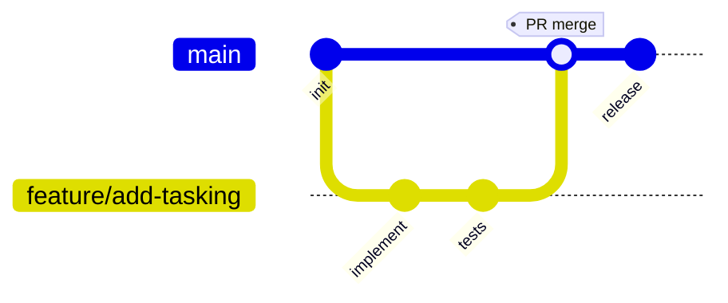
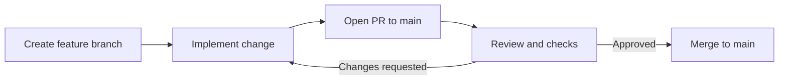
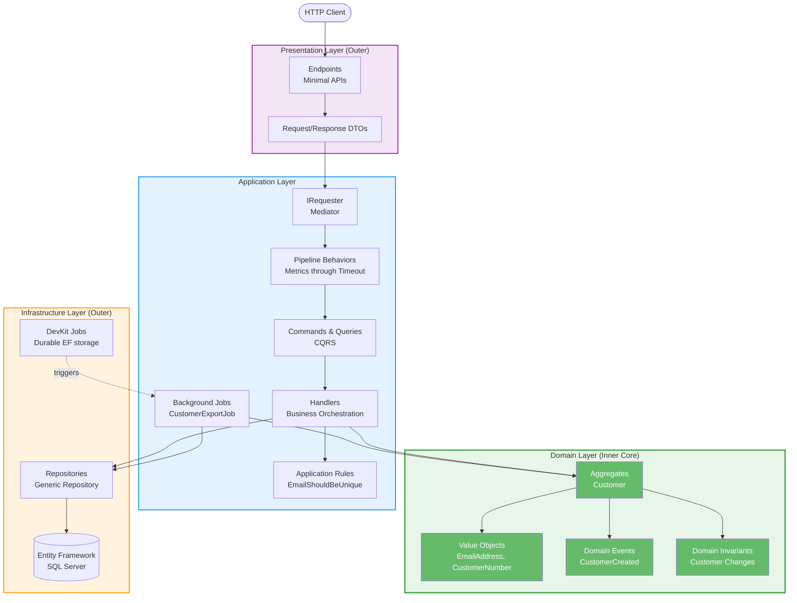
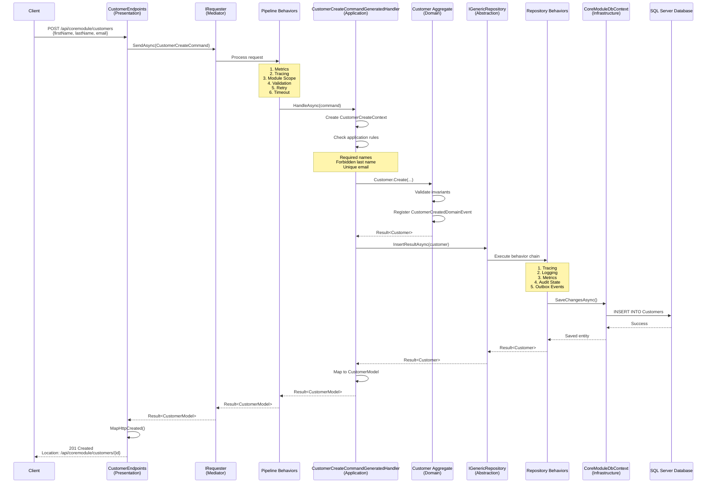
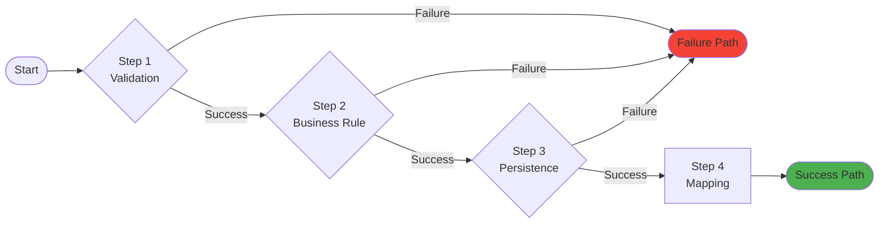
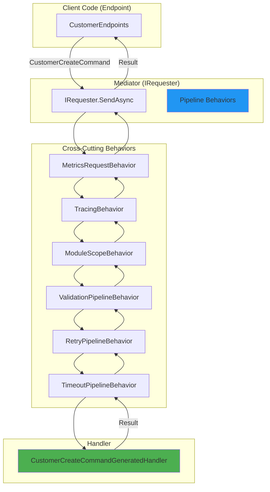
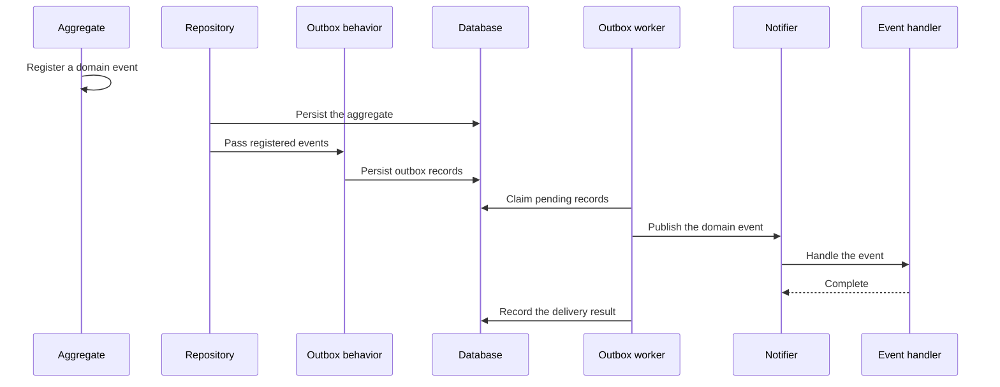
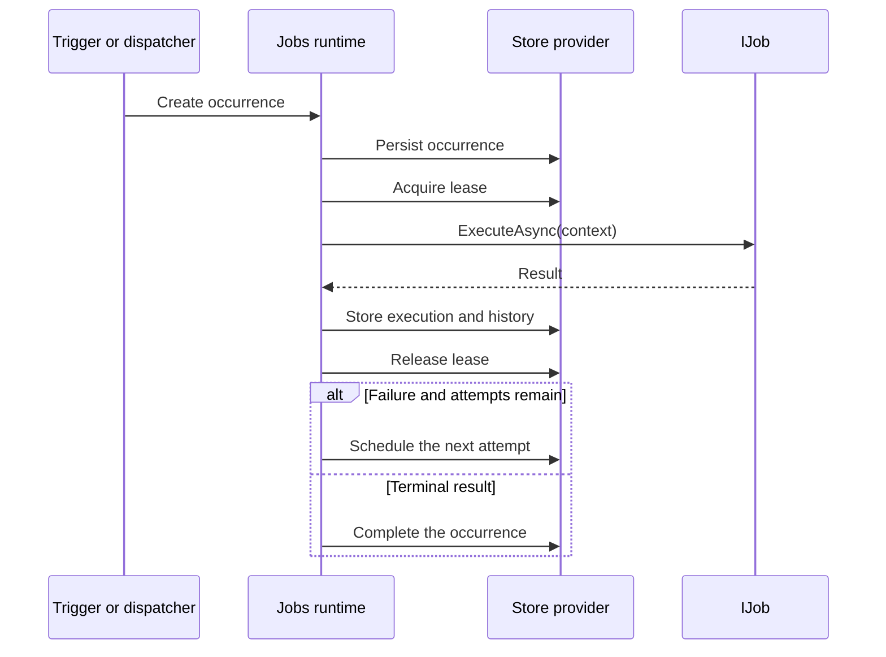
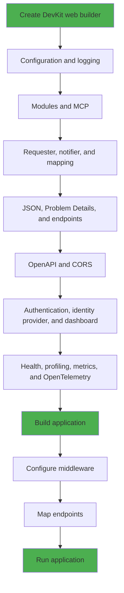
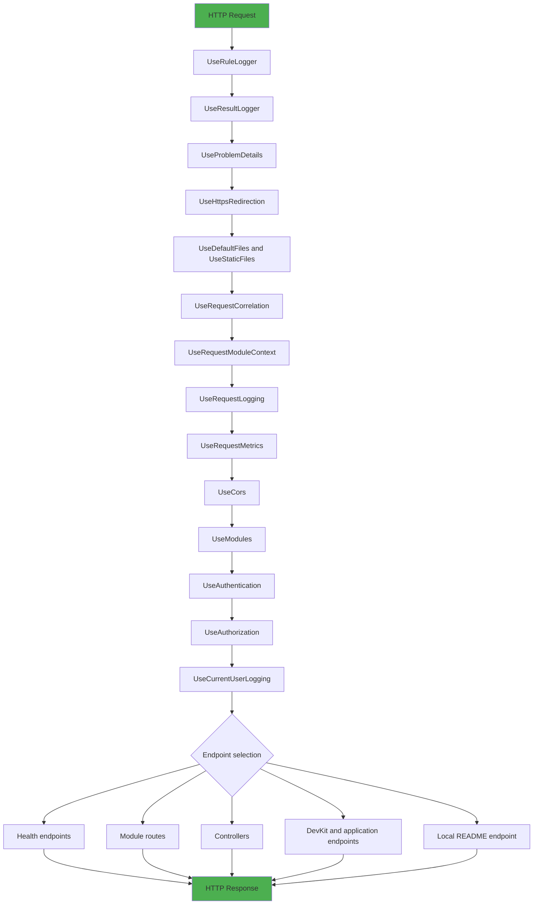

# bITdevKit GettingStarted Example


An application built using .NET 10 and following a Domain-Driven Design (DDD) approach by using the [bITdevKit](https://bridgingit-gmbh.github.io/bITdevKit).

## Table of Contents

- [bITdevKit GettingStarted Example](#bitdevkit-gettingstarted-example)
  - [Table of Contents](#table-of-contents)
  - [Features](#features)
  - [Frameworks and Libraries](#frameworks-and-libraries)
  - [Getting Started](#getting-started)
    - [Running the Application](#running-the-application)
  - [Developer Guidelines](#developer-guidelines)
    - [Architecture Boundaries](#architecture-boundaries)
    - [Aggregate Boundaries](#aggregate-boundaries)
    - [Commands and Queries](#commands-and-queries)
    - [Endpoint Conventions](#endpoint-conventions)
    - [Persistence and Events](#persistence-and-events)
    - [Job Changes](#job-changes)
    - [Mapping Changes](#mapping-changes)
    - [Testing Changes](#testing-changes)
    - [Observability Rules](#observability-rules)
    - [Host Composition Extensions](#host-composition-extensions)
    - [Accelerate Agent Development with BDK MCP](#accelerate-agent-development-with-bdk-mcp)
    - [DevKit API Changes](#devkit-api-changes)
    - [Verify a Change](#verify-a-change)
    - [Change Checklist](#change-checklist)
    - [Commit Messages](#commit-messages)
    - [Branching Strategy](#branching-strategy)
      - [Features Development](#features-development)
      - [PR Flow](#pr-flow)
    - [EF Core Migrations](#ef-core-migrations)
  - [Architecture](#architecture)
    - [Overview](#overview)
    - [Layer Responsibilities](#layer-responsibilities)
      - [Domain Layer (Core)](#domain-layer-core)
      - [Application Layer](#application-layer)
      - [Infrastructure Layer](#infrastructure-layer)
      - [Presentation Layer](#presentation-layer)
    - [Dependency Rules](#dependency-rules)
    - [Request Processing Flow](#request-processing-flow)
    - [Modular Monolith Structure](#modular-monolith-structure)
  - [Core Patterns](#core-patterns)
    - [Result Pattern (Railway-Oriented Programming)](#result-pattern-railway-oriented-programming)
      - [Railway-Oriented Programming Diagram](#railway-oriented-programming-diagram)
      - [Result Type Structure](#result-type-structure)
      - [Result Pattern Methods](#result-pattern-methods)
    - [Aggregate Consistency Boundary Pattern](#aggregate-consistency-boundary-pattern)
    - [Command-Query Separation Pattern](#command-query-separation-pattern)
    - [Requester/Notifier Pattern (Mediator)](#requesternotifier-pattern-mediator)
      - [Architecture Diagram](#architecture-diagram)
      - [Pipeline Behaviors](#pipeline-behaviors)
      - [Setup in Program.cs](#setup-in-programcs)
    - [Repository with Behaviors Pattern (Decorator)](#repository-with-behaviors-pattern-decorator)
      - [Behavior Chain Diagram](#behavior-chain-diagram)
      - [Behavior Implementations](#behavior-implementations)
      - [Configuration in Module](#configuration-in-module)
    - [Domain Event and Outbox Pattern](#domain-event-and-outbox-pattern)
      - [Event Delivery Flow](#event-delivery-flow)
    - [Jobs Pattern (Durable Background Work)](#jobs-pattern-durable-background-work)
      - [Definition and Runtime Responsibilities](#definition-and-runtime-responsibilities)
      - [Occurrence and Execution Flow](#occurrence-and-execution-flow)
    - [Module System (Vertical Slices)](#module-system-vertical-slices)
      - [Module Structure](#module-structure)
      - [Module Registration in Program.cs](#module-registration-in-programcs)
  - [Application Bootstrap](#application-bootstrap)
    - [Configuration Stages](#configuration-stages)
    - [Step-by-Step Breakdown](#step-by-step-breakdown)
      - [Step 1: Create Builder and Configure Logging](#step-1-create-builder-and-configure-logging)
      - [Step 2: Register Modules](#step-2-register-modules)
      - [Step 3: Register Requester and Notifier](#step-3-register-requester-and-notifier)
      - [Step 4: Configure Durable Jobs in CoreModule](#step-4-configure-durable-jobs-in-coremodule)
      - [Step 5. Register Application Endpoints](#step-5-register-application-endpoints)
      - [Step 6. Configure JSON Serialization](#step-6-configure-json-serialization)
      - [Step 7. Configure OpenAPI](#step-7-configure-openapi)
      - [Step 8. Configure CORS](#step-8-configure-cors)
      - [Step 9. Configure Authentication/Authorization](#step-9-configure-authenticationauthorization)
      - [Step 10. Configure Health Checks](#step-10-configure-health-checks)
      - [Step 11. Configure Observability (OpenTelemetry)](#step-11-configure-observability-opentelemetry)
    - [Middleware Pipeline Configuration](#middleware-pipeline-configuration)
    - [Complete Request Flow](#complete-request-flow)
  - [Solution Structure](#solution-structure)
  - [Quick Code Examples](#quick-code-examples)
    - [Commands](#commands)
    - [Queries](#queries)
    - [Domain Aggregates](#domain-aggregates)
    - [Value Objects](#value-objects)
    - [Enumerations](#enumerations)
    - [Domain Events](#domain-events)
    - [Infrastructure](#infrastructure)
    - [Presentation](#presentation)
    - [Testing](#testing)
      - [Unit tests](#unit-tests)
      - [Integration tests](#integration-tests)
  - [Appendix A: Docker \& Local Registry Usage](#appendix-a-docker--local-registry-usage)
    - [Prerequisites](#prerequisites)
    - [Build Image](#build-image)
    - [Tag For Local Registry](#tag-for-local-registry)
    - [Push To Local Registry](#push-to-local-registry)
    - [Run Container](#run-container)
  - [Appendix B: OpenAPI Specification and API Clients](#appendix-b-openapi-specification-and-api-clients)
    - [OpenAPI Document Generation](#openapi-document-generation)
    - [Generating API Clients with Kiota](#generating-api-clients-with-kiota)
      - [Installing Kiota](#installing-kiota)
      - [Generating C# Client](#generating-c-client)
      - [Using the Generated Client](#using-the-generated-client)
      - [Generating TypeScript Client](#generating-typescript-client)
    - [Resources](#resources)

## Features

- Modular architecture with CoreModule as an example. [Modules](https://github.com/BridgingIT-GmbH/bITdevKit/blob/main/docs/features-modules.md)
- Application layer with Commands (e.g., CustomerCreateCommand) and Queries (e.g., CustomerFindAllQuery, CustomerFindOneQuery) using IRequester. [Requester](https://github.com/BridgingIT-GmbH/bITdevKit/blob/main/docs/features-requester-notifier.md), [Commands and Queries](https://github.com/BridgingIT-GmbH/bITdevKit/blob/main/docs/features-application-commands-queries.md)
- Domain layer with the `Customer` aggregate, the `EmailAddress` and `CustomerNumber` value objects, the generated `CustomerId`, the `CustomerStatus` enumeration, domain events, and domain invariants. The Application layer contains the repository-backed `EmailShouldBeUniqueRule`. [Domain](https://github.com/BridgingIT-GmbH/bITdevKit/blob/main/docs/features-domain.md), [Domain Events](https://github.com/BridgingIT-GmbH/bITdevKit/blob/main/docs/features-domain-events.md), [Rules](https://github.com/BridgingIT-GmbH/bITdevKit/blob/main/docs/features-rules.md)
- Infrastructure layer with Entity Framework Core (`CoreModuleDbContext`, migrations, and configurations) and a generic repository with tracing, logging, metrics, audit, and outbox behaviors. [Repositories](https://github.com/BridgingIT-GmbH/bITdevKit/blob/main/docs/features-domain-repositories.md)
- Presentation layer with Web API Endpoints for CRUD operations on Customers, using minimal API-style routing. [Endpoints](https://github.com/BridgingIT-GmbH/bITdevKit/blob/main/docs/features-presentation-endpoints.md)
- Startup tasks for seeding domain data (CoreModuleDomainSeederTask). [StartupTasks](https://github.com/BridgingIT-GmbH/bITdevKit/blob/main/docs/features-startuptasks.md)
- Durable background jobs with the DevKit Jobs subsystem (for example, `CustomerExportJob`), including retries, history, dashboard pages, console commands, and MCP diagnostics. [Jobs](https://github.com/BridgingIT-GmbH/bITdevKit/blob/main/docs/features-jobs.md)
- A protected DevKit dashboard with Jobs, Metrics, Profiling, and application-specific customer management pages. [Dashboard](https://github.com/BridgingIT-GmbH/bITdevKit/blob/main/docs/features-presentation-dashboard.md)
- In-process metrics and development profiling for operational inspection. [Metrics](https://github.com/BridgingIT-GmbH/bITdevKit/blob/main/docs/features-metrics.md), [Profiling](https://github.com/BridgingIT-GmbH/bITdevKit/blob/main/docs/features-profiling.md)
- Agent-assisted development through the repository-installed BDK MCP, with DevKit guidance, documentation, API lookup, project orientation, and runtime diagnostics. [AI Agent Support](https://bridgingit-gmbh.github.io/bITdevKit/agent-support/)
- Comprehensive testing: Unit tests (command/query handlers, architecture rules), Integration tests (endpoints, persistence), Architecture tests (boundary enforcement).
- A tracked OpenAPI document generated at build time and suitable for Kiota client generation.

## Frameworks and Libraries

- [.NET 10](https://learn.microsoft.com/en-us/dotnet/core/whats-new/dotnet-10/overview)
- [ASP.NET Core](https://dotnet.microsoft.com/en-us/apps/aspnet)
- [Entity Framework Core](https://learn.microsoft.com/en-us/ef/core/) for data access
- [Serilog](https://serilog.net/) for structured logging
- [Mapster](https://github.com/MapsterMapper/Mapster) for object mapping
- [FluentValidation](https://fluentvalidation.net/) for validation
- [RazorSlices](https://github.com/DamianEdwards/RazorSlices) for application dashboard pages
- [xUnit.net](https://xunit.net/), [NSubstitute](https://nsubstitute.github.io/), [Shouldly](https://docs.shouldly.org/) for testing

---

## Getting Started

### Running the Application

1. Install the .NET 10 SDK. `global.json` selects SDK `10.0.400` and permits `latestFeature` roll-forward.
2. Configure the database connection string in `appsettings.json` under `Modules:CoreModule:ConnectionStrings:Default`.
3. Optionally, run `docker compose up -d` to start SQL Server, Seq, and the other local infrastructure services.
4. Set `Presentation.Web.Server` as the startup project.
5. Run with `CTRL+F5` to start the host at [https://localhost:5001](https://localhost:5001).

Access points:

- **Scalar UI**: [https://localhost:5001/scalar](https://localhost:5001/scalar)
- **OpenAPI Spec**: [https://localhost:5001/openapi.json](https://localhost:5001/openapi.json)
- **Health Checks**: [https://localhost:5001/health](https://localhost:5001/health)
- **DevKit Dashboard**: [https://localhost:5001/\_bdk/dashboard](https://localhost:5001/_bdk/dashboard)
- **Seq Dashboard** (if using containers): [http://localhost:15349](http://localhost:15349)

The application applies EF Core migrations through `DatabaseMigratorService` and seeds customer data through `CoreModuleDomainSeederTask`. Both services run only in local development or container environments.

---

## Developer Guidelines

The [Core Patterns](#core-patterns) section explains the design. The rules below define how to preserve that design when changing the application.

### Architecture Boundaries

- Keep domain invariants, aggregate behavior, value objects, and domain events in `CoreModule.Domain`. The Domain project does not reference another solution layer.
- Put use-case coordination in `CoreModule.Application`. Application code depends on domain types and repository abstractions, not on `CoreModuleDbContext` or another infrastructure type.
- Keep Entity Framework Core configurations, migrations, and durable runtime storage in `CoreModule.Infrastructure`.
- Use `CoreModule.Presentation` for module registration, Mapster configuration, endpoints, and dashboard pages. Endpoints and dashboard actions dispatch application requests through `IRequester`.
- Treat `Presentation.Web.Server` as the composition root. Keep `Program.cs` focused on assembling the host and its middleware pipeline.
- Do not reference another module's internal projects. Add an explicit contracts project when modules need a shared synchronous contract.

The [architecture tests](tests/Modules/CoreModule/CoreModule.UnitTests/ArchitectureTests.cs) enforce the project dependencies and selected domain conventions.

### Aggregate Boundaries

- Model each consistency boundary behind one aggregate root. Keep constructors and state setters private unless a framework requires a narrower exception.
- Return `Result<T>` from aggregate factories and change methods so expected validation and business-rule failures remain explicit.
- Represent the complete aggregate in REST models. Create and update actions accept that representation, while focused actions still address the aggregate root by ID.
- Register repositories for aggregate roots, not for their child entities. Load and persist the aggregate as one unit.
- Change child entities only through methods on the aggregate root. Do not add independent repositories or top-level REST resources for aggregate children.
- Include the current concurrency token in update requests and return conflicts instead of overwriting a newer aggregate version.

### Commands and Queries

- Define state-changing use cases as `partial` classes marked with `[Command]`.
- Define read-only use cases as `partial` classes marked with `[Query]`. Queries do not intentionally change application state and remain safe to repeat.
- Mark one handler method with `[Handle]` and return `Result` or `Result<T>`. Use exceptions only for unexpected failures.
- Keep business invariants in the aggregate. Put rules that need repositories or another application dependency in the Application layer.
- Pass `CancellationToken` through the handler, repository, and other asynchronous calls.
- Dispatch requests through `IRequester`. Do not instantiate or invoke generated handlers directly from endpoints, dashboard actions, or jobs.

### Endpoint Conventions

- Derive endpoint sets from `EndpointsBase` and keep routes grouped by module resource.
- Keep endpoint delegates limited to HTTP binding, request dispatch, and result mapping. Do not implement business rules in an endpoint.
- Require authorization on application route groups. The included identity provider is for local development and tests, not production authentication.
- Use the DevKit result mapping extensions so the HTTP status and Problem Details response follow the `Result` outcome.
- Give every route a stable name, summary, description, accepted content type, success response, and applicable problem responses.
- Propagate the request cancellation token to `IRequester.SendAsync`.
- Regenerate and review `src/Presentation.Web.Server/wwwroot/openapi.json` after changing a route, model, response, or authorization contract.

### Persistence and Events

- Access application data through `IGenericRepository<TAggregate>`. Do not inject `CoreModuleDbContext` into Domain or Application code.
- Register repository behaviors in `CoreModuleModule`. Their order is part of the operation pipeline, so review the complete chain when adding or moving a behavior.
- Register a past-tense domain event inside the aggregate only after a business-significant change.
- Put event reactions in application event handlers. Keep external work and infrastructure dependencies out of the aggregate and the event type.
- Use the outbox behavior when event delivery must survive a process or dependency failure.
- Do not assume that the outbox behavior makes aggregate and outbox writes atomic. Add a surrounding database transaction when both writes must commit or roll back together.
- Add EF Core migrations in `CoreModule.Infrastructure` and update the model snapshot for every persistence-model change. Do not edit historical migrations unless a correction is required before release.

### Job Changes

- Register jobs and triggers in the owning module through `AddJobScheduler`.
- Give each job and trigger a stable name. Keep those names in constants when application code or operational tools depend on them.
- Inject scoped dependencies into the job constructor. Do not create a nested service scope inside the job.
- Return a failed `Result` when the work fails so retries and execution history record the failure.
- Add a concise execution summary to the Jobs context. Do not include customer email addresses, credentials, access tokens, or other sensitive data.
- Set concurrency and retry policies deliberately. Match the policy to whether the operation is safe to repeat.
- Use `WithEntityFramework<CoreModuleDbContext>()` when occurrences, attempts, leases, and history must survive a restart. Update `IJobsContext` mappings and add a migration when the Jobs persistence model changes.

### Mapping Changes

- Define Mapster mappings in `CoreModuleMapperRegister` instead of spreading mapping expressions across handlers and endpoints.
- Map API models to domain concepts through their supported factories and conversions. Do not bypass value-object validation or aggregate methods.
- Return application models from commands and queries. Do not expose Entity Framework Core types or tracked domain instances as HTTP contracts.
- Add focused mapping coverage when a new value object, enumeration, child entity, or transport field needs a custom conversion.

### Testing Changes

- Test aggregate invariants and value-object validation in Domain unit tests.
- Test commands, queries, rules, and jobs through the real DevKit registration supplied by the test base or the appropriate test harness.
- Test HTTP binding, authorization, result mapping, optimistic concurrency, and persistence through `WebApplicationFactory` and the endpoint fixture.
- Give endpoint tests unique data and verify important writes with a follow-up API read.
- Cover the success path and the failures owned by the changed layer. Typical endpoint cases include validation, not found, conflict, and unauthorized responses.
- Keep tests independent of execution order and shared mutable data.
- Do not add tests for dashboard page markup or dashboard routing. Test the application requests shared by the dashboard and the API instead.

### Observability Rules

- Use structured logging templates and stable property names. Do not build log messages through string interpolation.
- Preserve request correlation, tracing, and metrics when adding a new entry point or background operation.
- Keep metric tags bounded. Do not use customer IDs, email addresses, request paths with IDs, or exception messages as metric dimensions.
- Do not log customer email addresses, passwords, credentials, authorization headers, or access tokens.
- Propagate cancellation through asynchronous work and distinguish cancellation from an operation failure.

### Host Composition Extensions

- Keep feature-specific service registration and middleware mapping in the matching `ProgramExtensions.*.cs` file.
- Name application service-registration methods with an `AddApp` prefix and application-mapping methods with a `Map` prefix. Keep the fluent `With` prefix for builder configuration.
- Add XML documentation to every public type and public member in `ProgramExtensions.*`.
- Keep module-specific persistence, repository, endpoint, dashboard, startup-task, and job registration in the module rather than the host.
- Keep extension methods focused on one host concern so `Program.cs` remains an ordered composition overview.

### Accelerate Agent Development with BDK MCP

This repository is ready for agent-assisted DevKit development. The local tool manifest pins `BridgingIT.DevKit.Cli`, [`.vscode/mcp.json`](.vscode/mcp.json) configures the `bdk` MCP server, and the web host calls `AddMcp()`. An MCP-capable coding agent can use official DevKit knowledge while it edits code and can inspect the running application after the change.

The BDK MCP supports each stage of the development loop:

| Stage | Tools | Purpose |
| --- | --- | --- |
| Plan | `bdk_guidance_get` | Get a focused implementation checklist and the related feature areas. |
| Read | `bdk_docs_search`, `bdk_docs_get` | Find and load the official DevKit guidance for the task. |
| Confirm | `bdk_api_search`, `bdk_api_get` | Check concrete types, members, overloads, and signatures before writing code. |
| Orient | `bdk_project_summary`, `bdk_capabilities_get` | Inspect the selected runtime, registered modules, and advertised capabilities. |
| Verify | `bdk_mcp_self_test` and feature tools | Check the runtime connection and confirm the changed feature in the running application. |

Restore the repository tools after cloning or after the tool manifest changes:

```pwsh
dotnet tool restore
dotnet tool run bdk --version
```

The checked-in VS Code configuration starts `dotnet tool run bdk mcp` over standard input and output. Reload the MCP client after restoring the tool. Other MCP-capable clients can use the same command and arguments.

Documentation, guidance, and API reference tools work without a running application. Runtime tools require the web host to run separately in local development. The BDK MCP does not start the application.

Use this workflow for DevKit changes:

1. Ask the agent to load the relevant BDK guidance.
2. Read the routed documentation and confirm exact API symbols.
3. Compare the guidance with the current module and its tests.
4. Implement the change and run the focused tests.
5. Start the application, run `bdk_mcp_self_test`, and inspect the affected runtime capability.

For example:

```text
Use bdk_guidance_get for this DevKit change. Read the linked documentation, confirm the exact API symbols, and compare the guidance with this repository before editing code.
```

```text
Start the application and run the bdk MCP self-test. If the selected runtime is healthy, inspect the affected capability and verify the implemented behavior.
```

The checked-in MCP command uses the default diagnostics toolset. Enable operations only when the task requires a controlled runtime action. Enable admin tools only for an explicit maintenance request with the required confirmation arguments.

The published DevKit documentation lives on the [bITdevKit documentation site](https://bridgingit-gmbh.github.io/bITdevKit/). This repository also includes the DevKit documentation under [`.bdk/docs/`](.bdk/docs/). Direct file research starts at [`.bdk/docs/INDEX.md`](.bdk/docs/INDEX.md). BDK MCP adds curated guidance, API reference lookup, workspace-aware runtime selection, and live evidence from the selected application. See the official [AI Agent Support guide](https://bridgingit-gmbh.github.io/bITdevKit/agent-support/) for client setup, prompts, toolsets, and safety controls.

### DevKit API Changes

- The DevKit documentation for this repository lives in [`.bdk/docs/`](.bdk/docs/). Start with [`.bdk/docs/INDEX.md`](.bdk/docs/INDEX.md) and use it only to locate the relevant DevKit guide.
- Use the repository-configured BDK MCP to get guidance, search documentation, confirm API symbols, and verify the running application.
- Read the routed guide and the XML documentation for the installed package API before changing DevKit registrations or behavior.
- Treat the installed `BridgingIT.DevKit.*` NuGet packages as the source of the available API. Do not add project references to a local DevKit checkout.
- Use DevKit examples to confirm a composition pattern after checking the documentation. Do not infer unsupported behavior from an example.
- Keep related DevKit packages on the same approved version and verify the restored dependency graph after a package change.

### Verify a Change

Run the smallest relevant check while developing, then run the affected test projects and a solution build before handing off the change.

```pwsh
dotnet test tests/Modules/CoreModule/CoreModule.UnitTests/CoreModule.UnitTests.csproj --nologo
dotnet test tests/Modules/CoreModule/CoreModule.IntegrationTests/CoreModule.IntegrationTests.csproj --nologo
dotnet build --nologo /p:UseSharedCompilation=false
```

After changing Markdown, lint every included Markdown file:

```pwsh
npx --yes markdownlint-cli2 "**/*.md" "#.bdk/**" "#.agents/**" "#.github/**" "#**/bin/**" "#**/obj/**"
```

After changing runtime registration or operational behavior, start the application and use the BDK MCP self-test. Verify the affected capability through its MCP tools when those tools are available.

### Change Checklist

Before handing off a change, confirm each applicable item:

- The change preserves project and module boundaries.
- Domain changes go through the aggregate root and return expected failures through `Result<T>`.
- REST actions and repositories preserve the aggregate boundary.
- Commands, queries, endpoints, jobs, and repository calls propagate cancellation.
- Endpoint metadata matches the runtime request and response contract.
- Logs, job messages, and telemetry contain no credentials, tokens, or customer email addresses.
- Persistence changes include an EF Core migration and an updated model snapshot.
- Endpoint changes include an updated tracked OpenAPI document.
- Public members in `ProgramExtensions.*` have XML documentation.
- Relevant unit tests, integration tests, Markdown lint, and the solution build pass.
- Runtime changes pass the BDK MCP self-test and the affected capability check.

### Commit Messages

Commit messages use this format:

```text
<type>[optional scope]: <description>

[optional body]

[optional footer(s)]
```

Common types:

| Type | Purpose |
| --- | --- |
| `feat` | New feature |
| `fix` | Bug fix |
| `docs` | Documentation only |
| `style` | Formatting/style (no logic) |
| `refactor` | Code refactor (no feature/fix) |
| `perf` | Performance improvement |
| `test` | Add/update tests |
| `build` | Build system/dependencies |
| `ci` | CI/config changes |
| `chore` | Maintenance/misc |
| `revert` | Revert commit |

Breaking changes are marked either with an exclamation mark after type/scope or with a `BREAKING CHANGE:` footer.

```text
feat(core): add customer export endpoint
fix(core): handle missing email address
docs: describe branching strategy

feat!: remove deprecated endpoint

feat: allow config to extend other configs

BREAKING CHANGE: `extends` key behavior changed
```

### Branching Strategy

[Trunk-based development](https://trunkbaseddevelopment.com/) with short-lived feature branches. Changes merge into `main` through Pull Requests (PRs). Keep branches small, rebase frequently, and merge quickly to reduce drift.

> A source-control branching model, where developers collaborate on code in a single branch called ‘trunk/main’ \*, resist any pressure to create other long-lived development branches by employing documented techniques. They therefore avoid merge hell, do not break the build, and live happily ever after.

**Key rules**:

- `main` is always releasable
- Feature branches are short-lived and scoped to a single change
- PRs are required for all merges to `main`
- Commit messages follow the Conventional Commits standard described in [Commit Messages](#commit-messages)

#### Features Development


```mermaid
gitGraph
    commit id: "init"
    branch feature/add-tasking
    checkout feature/add-tasking
    commit id: "implement"
    commit id: "tests"
    checkout main
    merge feature/add-tasking tag: "PR merge"
    commit id: "release"
```

#### PR Flow


```mermaid
flowchart LR
    A[Create feature branch] --> B[Implement change]
    B --> C[Open PR to main]
    C --> D[Review and checks]
    D -->|Approved| E[Merge to main]
    D -->|Changes requested| B
```

### EF Core Migrations

Use the tasks for migrations to keep the workflow consistent and repeatable:

- Add a migration with the EF task for migration creation.
- Apply migrations with the EF task for applying migrations or updating the database.
- Keep migrations in the module infrastructure project and avoid direct edits unless a correction is required.
- For the underlying `dotnet ef` command equivalents, see [src/Modules/CoreModule/CoreModule.Infrastructure/EntityFramework/README.md](src/Modules/CoreModule/CoreModule.Infrastructure/EntityFramework/README.md).

Migrations are applied automatically on application startup in development mode:

```csharp
services.AddSqlServerDbContext<CoreModuleDbContext>(o => o
      .UseConnectionString(moduleConfiguration.ConnectionStrings["Default"]))
  .WithDatabaseMigratorService(o => o // create the database and apply existing migrations
      .Enabled(environment.IsLocalDevelopment() || environment.IsContainerized()));
```

---

## Architecture

The bITdevKit GettingStarted project implements **Clean/Onion Architecture** principles combined with **Domain-Driven Design (DDD)** and a **Modular Monolith** approach. This section explains the architectural decisions, layer responsibilities and how components interact.

> **Architectural Decisions**: For rationale and alternatives behind key choices, see the [Architectural Decision Records](./docs/adr/INDEX.md). Relevant decisions include Clean Architecture ([ADR-0001](./docs/adr/0001-clean-onion-architecture.md)), the Result pattern ([ADR-0002](./docs/adr/0002-result-pattern-error-handling.md)), the modular monolith ([ADR-0003](./docs/adr/0003-modular-monolith-architecture.md)), durable DevKit Jobs ([ADR-0015](./docs/adr/0015-devkit-native-durable-jobs.md)), observability ([ADR-0016](./docs/adr/0016-logging-observability-strategy.md)), and testing ([ADR-0013](./docs/adr/0013-unit-testing-high-coverage-strategy.md), [ADR-0017](./docs/adr/0017-integration-testing-strategy.md)).

### Overview

Clean Architecture enforces strict dependency rules where **inner layers never depend on outer layers**. Dependencies flow inward toward the domain core, ensuring business logic remains independent of infrastructure concerns and delivery mechanisms.


```mermaid
graph TB
    Client([HTTP Client]) --> Endpoints

    subgraph Presentation["Presentation Layer (Outer)"]
        Endpoints[Endpoints<br/>Minimal APIs]
        DTOs[Request/Response DTOs]
    end

    subgraph Application["Application Layer"]
        Requester[IRequester<br/>Mediator]
        CMD[Commands & Queries<br/>CQRS]
        BEHAV[Pipeline Behaviors<br/>Metrics through Timeout]
        HAND[Handlers<br/>Business Orchestration]
        Jobs[Background Jobs<br/>CustomerExportJob]
        RULES[Application Rules<br/>EmailShouldBeUnique]
    end

    subgraph Domain["Domain Layer (Inner Core)"]
        AGG[Aggregates<br/>Customer]
        VO[Value Objects<br/>EmailAddress, CustomerNumber]
        EVENTS[Domain Events<br/>CustomerCreated]
        INVARIANTS[Domain Invariants<br/>Customer Changes]
    end

    subgraph Infrastructure["Infrastructure Layer (Outer)"]
        Repos[Repositories<br/>Generic Repository]
        DB[(Entity Framework<br/>SQL Server)]
        Scheduler[DevKit Jobs<br/>Durable EF storage]
    end

    %% Request Flow
    Endpoints --> DTOs
    DTOs --> Requester
    Requester --> BEHAV
    BEHAV --> CMD
    CMD --> HAND

    %% Handler to Domain
    HAND --> AGG
    HAND --> RULES

    %% Jobs to Domain & Infrastructure
    Jobs --> AGG
    Jobs --> Repos

    %% Domain Internal
    AGG --> VO
    AGG --> EVENTS
    AGG --> INVARIANTS

    %% Persistence Flow
    HAND --> Repos
    Repos --> DB
    Scheduler -.triggers.-> Jobs

    %% Styling
    style Domain fill:#E8F5E9,stroke:#4CAF50,stroke-width:3px
    style AGG fill:#66BB6A,color:#fff
    style VO fill:#66BB6A,color:#fff
    style EVENTS fill:#66BB6A,color:#fff
    style INVARIANTS fill:#66BB6A,color:#fff
    style Application fill:#E3F2FD,stroke:#2196F3,stroke-width:2px
    style Presentation fill:#F3E5F5,stroke:#9C27B0,stroke-width:2px
    style Infrastructure fill:#FFF3E0,stroke:#FF9800,stroke-width:2px
```

### Layer Responsibilities

#### Domain Layer (Core)

**Location**: `src/Modules/CoreModule/CoreModule.Domain`

**Responsibilities**:

- Pure business logic and domain rules
- Aggregates, Entities (e.g., `Customer`)
- Value Objects (e.g., `EmailAddress`, `CustomerNumber`)
- Domain Events (e.g., `CustomerCreatedDomainEvent`)
- Domain invariants and rule composition inside aggregate operations
- Enumerations (e.g., `CustomerStatus`)

**Solution project dependencies**: None. The project references the DevKit domain packages.

**Key Principle**: The domain layer is persistence-ignorant. It depends on the DevKit domain abstractions but not on Entity Framework Core, ASP.NET Core, or another solution layer.

#### Application Layer

**Location**: `src/Modules/CoreModule/CoreModule.Application`

**Responsibilities**:

- Use cases orchestration via Commands and Queries
- Request/Response DTOs (`CustomerModel`)
- Handlers that coordinate domain operations
- Validation logic (FluentValidation)
- Repository-backed application rules such as `EmailShouldBeUniqueRule`
- Background Jobs (e.g., `CustomerExportJob`)

**Project dependencies**: Domain layer only. DevKit application packages provide Jobs, mapping abstractions, generated commands, queries, and handlers.

**Key Principle**: Application defines **what** the system does, not **how** it's implemented (infrastructure) or **how** it's exposed (presentation).

#### Infrastructure Layer

**Location**: `src/Modules/CoreModule/CoreModule.Infrastructure`

**Responsibilities**:

- Database context and EF Core configurations
- Migrations
- Durable outbox and Jobs persistence

**Project dependencies**: Domain and Application layers

**Key Principle**: Infrastructure provides **implementations** of abstractions defined by inner layers.

#### Presentation Layer

**Location**: `src/Modules/CoreModule/CoreModule.Presentation`

**Responsibilities**:

- HTTP endpoints (Minimal APIs)
- Module registration and configuration
- Mapster mapping configuration
- DevKit dashboard pages for customer management
- Request/Response transformations

**Project dependencies**: Application and Infrastructure layers. The module registration uses `CoreModuleDbContext`, while endpoints and dashboard actions dispatch through `IRequester`.

**Key Principle**: Presentation is a **thin adapter** that translates HTTP requests into application commands/queries and responses back to HTTP.

### Dependency Rules

The architecture enforces these strict dependency rules (validated by [architecture tests](tests/Modules/CoreModule/CoreModule.UnitTests/ArchitectureTests.cs)):

1. **Domain → no solution layer**: Domain references only DevKit domain packages.
2. **Application → Domain**: Application has one solution project reference, to Domain.
3. **Infrastructure → Domain + Application**: Infrastructure owns Entity Framework Core persistence.
4. **Presentation → Application + Infrastructure**: Presentation owns module composition, endpoints, mapping registration, and dashboard pages.
5. **Host → Presentation + Infrastructure**: The web host is the composition root.

The [architecture tests](tests/Modules/CoreModule/CoreModule.UnitTests/ArchitectureTests.cs) verify the Domain, Application, and Infrastructure dependency restrictions. They also enforce aggregate construction, value-object construction, and configured module-boundary namespaces.

### Request Processing Flow

Understanding how a request flows through the architecture is crucial. Here's a complete end-to-end flow for creating a customer:


```mermaid
sequenceDiagram
    participant Client
    participant Endpoint as CustomerEndpoints<br/>(Presentation)
    participant Req as IRequester<br/>(Mediator)
    participant Pipeline as Pipeline Behaviors
    participant Handler as CustomerCreateCommandGeneratedHandler<br/>(Application)
    participant Domain as Customer Aggregate<br/>(Domain)
    participant Repo as IGenericRepository<br/>(Abstraction)
    participant RepoBehaviors as Repository Behaviors
    participant DbCtx as CoreModuleDbContext<br/>(Infrastructure)
    participant DB as SQL Server Database

    Client->>Endpoint: POST /api/coremodule/customers<br/>{firstName, lastName, email}
    Endpoint->>Req: SendAsync(CustomerCreateCommand)

    Req->>Pipeline: Process request
    Note over Pipeline: 1. Metrics<br/>2. Tracing<br/>3. Module Scope<br/>4. Validation<br/>5. Retry<br/>6. Timeout

    Pipeline->>Handler: HandleAsync(command)

    Handler->>Handler: Create CustomerCreateContext
    Handler->>Handler: Check application rules
    Note over Handler: Required names<br/>Forbidden last name<br/>Unique email

    Handler->>Domain: Customer.Create(...)
    Domain->>Domain: Validate invariants
    Domain->>Domain: Register CustomerCreatedDomainEvent
    Domain-->>Handler: Result<Customer>

    Handler->>Repo: InsertResultAsync(customer)
    Repo->>RepoBehaviors: Execute behavior chain
    Note over RepoBehaviors: 1. Tracing<br/>2. Logging<br/>3. Metrics<br/>4. Audit State<br/>5. Outbox Events

    RepoBehaviors->>DbCtx: SaveChangesAsync()
    DbCtx->>DB: INSERT INTO Customers
    DB-->>DbCtx: Success
    DbCtx-->>RepoBehaviors: Saved entity
    RepoBehaviors-->>Repo: Result<Customer>
    Repo-->>Handler: Result<Customer>

    Handler->>Handler: Map to CustomerModel
    Handler-->>Pipeline: Result<CustomerModel>
    Pipeline-->>Req: Result<CustomerModel>
    Req-->>Endpoint: Result<CustomerModel>

    Endpoint->>Endpoint: MapHttpCreated()
    Endpoint-->>Client: 201 Created<br/>Location: /api/coremodule/customers/{id}
```

**Key Stages**:

1. **HTTP Request**: Client sends JSON payload to endpoint
2. **Command Creation**: Endpoint creates `CustomerCreateCommand` with DTO
3. **Pipeline processing**: Metrics, tracing, module scope, validation, retry, and timeout behaviors wrap the request.
4. **Handler execution**: The generated handler calls `CustomerCreateCommand.HandleAsync`.
5. **Application and domain checks**: The handler checks repository-backed rules, and `Customer.Create` enforces aggregate invariants.
6. **Repository persistence**: The repository behavior chain stores the aggregate and its outbox events.
7. **Response mapping**: The handler maps the aggregate to `CustomerModel`, and the endpoint maps the result to HTTP 201.

### Modular Monolith Structure

The application follows a **Modular Monolith** pattern where each module is a **vertical slice** containing all layers:

```text
src/Modules/CoreModule/
├── CoreModule.Domain/              (Business logic)
├── CoreModule.Application/         (Use cases)
├── CoreModule.Infrastructure/      (Persistence)
└── CoreModule.Presentation/        (HTTP endpoints)
```

**Module Characteristics**:

- **Self-contained**: CoreModule groups its domain, use cases, persistence, endpoints, dashboard pages, and tests.
- **Single deployment**: The module runs inside `Presentation.Web.Server` as part of one application process.
- **Explicit persistence**: CoreModule owns `CoreModuleDbContext` and its EF Core migrations.

**Module Boundary Rules** (enforced by architecture tests):

- Modules cannot directly reference namespaces configured as another module's internal layers.
- The current solution has one module and no `.Contracts` project.
- If another module needs synchronous integration, add an explicit contracts project instead of referencing its internal layers.

See [CoreModule README](src/Modules/CoreModule/CoreModule-README.md) for module-specific implementation details.

---

## Core Patterns

The bITdevKit GettingStarted application is built on several key design patterns that work together to create a robust, maintainable and testable architecture.

### Result Pattern (Railway-Oriented Programming)

The Result Pattern replaces exception-based error handling with explicit success/failure types, enabling **functional composition** and **railway-oriented programming**.

#### Railway-Oriented Programming Diagram


```mermaid
graph LR
    Start([Start]) --> Step1{Step 1<br/>Validation}
    Step1 -->|Success| Step2{Step 2<br/>Business Rule}
    Step1 -->|Failure| Failure([Failure Path])
    Step2 -->|Success| Step3{Step 3<br/>Persistence}
    Step2 -->|Failure| Failure
    Step3 -->|Success| Step4[Step 4<br/>Mapping]
    Step3 -->|Failure| Failure
    Step4 --> Success([Success Path])

    style Success fill:#4CAF50
    style Failure fill:#f44336
```

**Key Concept**: Once a step fails, all subsequent steps are skipped and the failure flows directly to the end.

#### Result Type Structure

```csharp
public struct Result<T> : IResult<T>
{
    public T Value { get; }
    public bool IsSuccess { get; }
    public bool IsFailure { get; }
    public IReadOnlyList<string> Messages { get; }
    public IReadOnlyList<IResultError> Errors { get; }
}
```

#### Result Pattern Methods

**Transformation Methods**:

- **`Bind()`**: Chain an operation that returns another `Result`
- **`BindAsync()`**: Chain an asynchronous operation that returns another `Result`
- **`BindResult()`**: Run an inner `Result` operation and merge its value into the current context

**Validation Methods**:

- **`Ensure()`**: Inline validation
- **`Unless()` / `UnlessAsync()`**: Business rule checking

**Mapping Methods**:

- **`Map()`**: Transform to different type

**Side Effect Methods**:

- **`Tap()`**: Execute action without changing result
- **`Log()`**: bITdevKit logging extension

See [CoreModule README - Handler Implementation Example](src/Modules/CoreModule/CoreModule-README.md#handler-implementation-example) for detailed examples.

### Aggregate Consistency Boundary Pattern

An aggregate is the consistency boundary for a related set of domain objects. Callers create and change the aggregate through methods that enforce its invariants. They do not set its state directly.

The domain model divides these responsibilities across a small set of building blocks:

| Building block | Responsibility |
| --- | --- |
| Aggregate root | Controls access to the aggregate and protects rules that span its entities and value objects. |
| Entity | Has a stable identity and owns behavior for state that changes over time. |
| Value object | Represents a validated domain concept through its value and structural equality. |
| Typed identifier | Prevents identifiers for unrelated entity types from being mixed accidentally. |
| Enumeration | Gives a closed set of domain choices behavior and type safety. |

The same boundary shapes the REST API. `CustomerModel` represents the complete aggregate for API clients, including child addresses and the concurrency token. Create and update actions accept this aggregate representation, and read actions return it. Focused actions, such as a status change or deletion, still address the aggregate root by ID and dispatch a command for that root. The API does not expose child entities as independent top-level resources or let an endpoint mutate them directly.

The repository boundary follows the same rule. `IGenericRepository<Customer>` loads and persists the `Customer` aggregate as one unit. The application does not register a separate repository for `Address`. Callers add, change, or remove addresses through `Customer` methods, which prevents persistence code from bypassing the aggregate root's invariants.

Factory methods and change methods return `Result<T>` so validation and business-rule failures remain explicit. The fluent change API applies operations in declaration order and registers domain events only when the change succeeds. Application handlers coordinate use cases and invoke aggregate behavior.

See the official [DevKit Domain guide](https://github.com/BridgingIT-GmbH/bITdevKit/blob/main/docs/features-domain.md) for aggregate, entity, value object, identifier, and change-operation APIs.

### Command-Query Separation Pattern

Command-query separation gives every application request one clear purpose. A command may change application state. A query reads state without intentional side effects and should be safe to repeat.

| Request type | Responsibility | Typical result |
| --- | --- | --- |
| Command | Perform a state-changing use case. | `Result` or `Result<T>` describing the outcome. |
| Query | Retrieve data without changing application state. | `Result<T>` containing a model or collection. |

DevKit source generation turns classes marked with `[Command]` or `[Query]` into request types. A method marked with `[Handle]` supplies the handler implementation, and its `Result<T>` return type determines the generated response type.

Command-query separation defines the meaning of a request. The Requester pattern handles dispatch and applies the shared behavior pipeline. This distinction keeps write rules separate from read concerns without coupling callers to handler implementations.

See the official [DevKit Commands and Queries guide](https://github.com/BridgingIT-GmbH/bITdevKit/blob/main/docs/features-application-commands-queries.md) for declaration, dispatch, validation, and testing APIs.

### Requester/Notifier Pattern (Mediator)

The Requester/Notifier pattern is bITdevKit's implementation of the Mediator pattern, decoupling request senders from handlers and enabling cross-cutting concerns through pipeline behaviors.

#### Architecture Diagram


```mermaid
graph TB
    subgraph "Client Code (Endpoint)"
        Client[CustomerEndpoints]
    end

    subgraph "Mediator (IRequester)"
        Req[IRequester.SendAsync]
        Pipeline[Pipeline Behaviors]
    end

    subgraph HandlerStage["Handler"]
        GeneratedHandler[CustomerCreateCommandGeneratedHandler]
    end

    subgraph "Cross-Cutting Behaviors"
        B1[MetricsRequestBehavior]
        B2[TracingBehavior]
        B3[ModuleScopeBehavior]
        B4[ValidationPipelineBehavior]
        B5[RetryPipelineBehavior]
        B6[TimeoutPipelineBehavior]
    end

    Client -->|CustomerCreateCommand| Req
    Req --> B1
    B1 --> B2
    B2 --> B3
    B3 --> B4
    B4 --> B5
    B5 --> B6
    B6 --> GeneratedHandler
    GeneratedHandler -->|Result<CustomerModel>| B6
    B6 --> B5
    B5 --> B4
    B4 --> B3
    B3 --> B2
    B2 --> B1
    B1 --> Req
    Req -->|Result<CustomerModel>| Client

    style GeneratedHandler fill:#4CAF50
    style Pipeline fill:#2196F3
```

#### Pipeline Behaviors

Pipeline behaviors wrap handlers to provide cross-cutting concerns:

1. **MetricsRequestBehavior**: Records bounded request metrics
2. **TracingBehavior**: Creates request activities
3. **ModuleScopeBehavior**: Sets the module context
4. **ValidationPipelineBehavior**: Runs generated FluentValidation rules
5. **RetryPipelineBehavior**: Retries thrown exceptions according to handler policy
6. **TimeoutPipelineBehavior**: Enforces the handler timeout

#### Setup in Program.cs

```csharp
builder.Services.AddRequester()
    .AddHandlers()
    .WithDefaultBehaviors();

builder.Services.AddNotifier()
    .AddHandlers()
    .WithDefaultBehaviors();
```

### Repository with Behaviors Pattern (Decorator)

The Repository pattern abstracts data access, while the Decorator pattern adds cross-cutting concerns through behavior chains.

#### Behavior Chain Diagram


```mermaid
graph LR
    Handler[Handler] --> Tracing[TracingBehavior]
    Tracing --> Logging[LoggingBehavior]
    Logging --> Metrics[MetricsBehavior]
    Metrics --> Audit[AuditStateBehavior]
    Audit --> Outbox[OutboxDomainEventBehavior]
    Outbox --> Repo[EntityFrameworkRepository]
    Repo --> DB[(Database)]

    style Tracing fill:#2196F3
    style Logging fill:#2196F3
    style Metrics fill:#2196F3
    style Audit fill:#2196F3
    style Outbox fill:#2196F3
    style Repo fill:#4CAF50
```

#### Behavior Implementations

1. **RepositoryTracingBehavior**: OpenTelemetry spans for distributed tracing
2. **RepositoryLoggingBehavior**: Structured logging with duration measurement
3. **RepositoryMetricsBehavior**: Repository operation metrics
4. **RepositoryAuditStateBehavior**: Automatic audit metadata (CreatedBy, UpdatedBy)
5. **RepositoryOutboxDomainEventBehavior**: Outbox pattern for reliable event delivery

#### Configuration in Module

```csharp
services.AddEntityFrameworkRepository<Customer, CoreModuleDbContext>()
    .WithBehavior<RepositoryTracingBehavior<Customer>>()
    .WithBehavior<RepositoryLoggingBehavior<Customer>>()
    .WithBehavior<RepositoryMetricsBehavior<Customer>>()
    .WithBehavior<RepositoryAuditStateBehavior<Customer>>()
    .WithBehavior<RepositoryOutboxDomainEventBehavior<Customer, CoreModuleDbContext>>();
```

See [CoreModule README - Repository Behaviors Configuration](src/Modules/CoreModule/CoreModule-README.md#repository-behaviors-configuration) for a detailed explanation.

### Domain Event and Outbox Pattern

A domain event records a business fact that has already happened. The aggregate registers the event as part of a successful state change but does not know which handlers will react to it.

The repository outbox behavior separates aggregate persistence from event delivery. It captures registered domain events and writes durable outbox records. A background worker later claims pending records, publishes them through the notifier, and records whether delivery succeeded. Event handlers therefore stay independent of the storage and retry mechanism.

#### Event Delivery Flow


```mermaid
sequenceDiagram
    participant Aggregate
    participant Repository
    participant Outbox as Outbox behavior
    participant Database
    participant Worker as Outbox worker
    participant Notifier
    participant Handler as Event handler

    Aggregate->>Aggregate: Register a domain event
    Repository->>Database: Persist the aggregate
    Repository->>Outbox: Pass registered events
    Outbox->>Database: Persist outbox records
    Worker->>Database: Claim pending records
    Worker->>Notifier: Publish the domain event
    Notifier->>Handler: Handle the event
    Handler-->>Notifier: Complete
    Worker->>Database: Record the delivery result
```

The outbox behavior does not make the aggregate write and outbox write atomic by itself. When atomic persistence is required, a surrounding database transaction must include both writes. The durable record then protects delivery across process restarts and lets the worker retry failed publications.

Use direct domain-event publication only when losing an event after the aggregate has been stored is acceptable. Use the outbox when event delivery must survive a host or dependency failure. See the official [DevKit Domain Events guide](https://github.com/BridgingIT-GmbH/bITdevKit/blob/main/docs/features-domain-events.md) for registration, publication, outbox processing, and transaction guidance.

### Jobs Pattern (Durable Background Work)

The DevKit Jobs pattern separates background work from scheduling and runtime coordination. A job defines what to execute. A trigger defines when to create work. The scheduler owns dispatch, concurrency, retries, leases, and execution history.

Job and trigger definitions stay in code. A store provider persists operational state around those definitions. Persisted runtime state can pause or disable a registration, but it does not replace the code-first definition.

#### Definition and Runtime Responsibilities

The Jobs model separates authoring concerns from runtime records:

| Concept | Responsibility |
| --- | --- |
| Job definition | Gives the job a stable name, implementation, data contract, lifetime, concurrency limit, and execution policies. |
| Trigger definition | Describes how work starts, such as a cron schedule, a delay, a startup delay, or manual dispatch. |
| Occurrence | Represents one unit of work created from a trigger or dispatch request. |
| Execution | Records one attempt to run an occurrence. A retry creates another execution for the same occurrence. |
| Lease | Gives one scheduler instance temporary ownership of an occurrence during execution. |
| Store provider | Persists occurrences, executions, runtime state, leases, batches, and history. |

A class-based job implements `IJob`, usually through `JobBase` or `JobBase<TData>`. `ExecuteAsync` receives an `IJobExecutionContext` and a cancellation token, then returns a `Result`. A successful result completes the attempt. A failed result lets the scheduler apply the configured retry policy and retain the failure in execution history.

The execution context keeps different kinds of data separate. `Data` is the typed durable payload. `Properties` contains immutable values that travel with the occurrence. `Messages` collects human-readable execution notes. `Items` stores attempt-local values and is not persisted as occurrence data.

#### Occurrence and Execution Flow

A trigger evaluation or manual dispatch creates an occurrence. An occurrence is one durable unit of work. Each retry creates another execution attempt for the same occurrence.


```mermaid
sequenceDiagram
    participant Source as Trigger or dispatcher
    participant Scheduler as Jobs runtime
    participant Store as Store provider
    participant Job as IJob

    Source->>Scheduler: Create occurrence
    Scheduler->>Store: Persist occurrence
    Scheduler->>Store: Acquire lease
    Scheduler->>Job: ExecuteAsync(context)
    Job-->>Scheduler: Result
    Scheduler->>Store: Store execution and history
    Scheduler->>Store: Release lease
    alt Failure and attempts remain
        Scheduler->>Store: Schedule the next attempt
    else Terminal result
        Scheduler->>Store: Complete the occurrence
    end
```

`AddJobScheduler()` collects code-first definitions from the host and its modules. The default in-memory provider suits transient use and tests. `WithEntityFramework<TContext>()` selects durable persistence and requires a context that implements `IJobsContext`.

The operational services use the same stored state. `IJobSchedulerService` dispatches work and changes runtime state. `IJobSchedulerQueryService` returns views for dashboards and support tools. `IJobSchedulerMaintenanceService` handles cleanup and repair. Optional endpoints and console commands expose these operations without giving callers direct access to the store.

Use Jobs when background work needs a schedule, durable dispatch, retry control, concurrency control, or execution history. Use a command or query when the caller needs an immediate application response without scheduler state. See the official [DevKit Jobs guide](https://github.com/BridgingIT-GmbH/bITdevKit/blob/main/docs/features-jobs.md) for registration and testing APIs.

### Module System (Vertical Slices)

The Modular Monolith pattern organizes code into self-contained vertical slices, each representing a business capability.

#### Module Structure

```text
src/Modules/CoreModule/
├── CoreModule.Domain/              # Business logic layer
│   ├── Model/                      # Aggregates, Value Objects
│   └── Events/                     # Domain Events
├── CoreModule.Application/         # Use cases layer
│   ├── Commands/                   # Write operations
│   ├── Queries/                    # Read operations
│   ├── Models/                     # DTOs
│   ├── Jobs/                       # Background jobs
│   └── Events/                     # Event handlers
├── CoreModule.Infrastructure/      # Persistence layer
│   └── EntityFramework/            # DbContext, Configurations, Migrations
└── CoreModule.Presentation/        # API layer
    ├── Dashboard/                  # Customer dashboard page set and RazorSlices
    ├── Web/Endpoints/              # HTTP endpoints
    └── CoreModuleModule.cs         # Module registration
```

#### Module Registration in Program.cs

```csharp
var builder = DevKitWebApplication.CreateBuilder(args)
    .AddConfiguration()
    .AddLogging()
    .AddModules(modules => modules
        .WithModule(new CoreModuleModule()))
    .AddMcp();
```

---

## Application Bootstrap

`Program.cs` is the composition root. It coordinates module registration, shared application services, middleware, and endpoints. The `ProgramExtensions.*.cs` files keep authentication, OpenAPI, health checks, observability, and other host-specific registrations in focused methods.

### Configuration Stages


```mermaid
graph TD
    A[Create DevKit web builder] --> B[Configuration and logging]
    B --> C[Modules and MCP]
    C --> D[Requester, notifier, and mapping]
    D --> E[JSON, Problem Details, and endpoints]
    E --> F[OpenAPI and CORS]
    F --> G[Authentication, identity provider, and dashboard]
    G --> H[Health, profiling, metrics, and OpenTelemetry]
    H --> I[Build application]
    I --> J[Configure middleware]
    J --> K[Map endpoints]
    K --> L[Run application]

    style A fill:#4CAF50
    style I fill:#4CAF50
    style L fill:#4CAF50
```

### Step-by-Step Breakdown

#### Step 1: Create Builder and Configure Logging

```csharp
var builder = DevKitWebApplication.CreateBuilder(args)
    .AddConfiguration()
    .AddLogging()
    .AddModules(modules => modules
        .WithModule(new CoreModuleModule()))
    .AddMcp();
```

This creates a DevKit-aware wrapper around `WebApplicationBuilder`. The starter extensions configure the host, Serilog, CoreModule, and local MCP discovery.

#### Step 2: Register Modules

`AddModules` invokes `CoreModuleModule.Register`. CoreModule registers its startup task, Jobs scheduler, `CoreModuleDbContext`, repository behavior chain, and customer endpoints. Handler discovery remains a shared host registration in the next step.

#### Step 3: Register Requester and Notifier

```csharp
builder.Services.AddRequester()
    .AddHandlers()
    .WithDefaultBehaviors();

builder.Services.AddNotifier()
    .AddHandlers()
    .WithDefaultBehaviors();
```

`AddHandlers` discovers generated and manual handlers. The local `WithDefaultBehaviors` extensions register metrics, tracing, module scope, validation, retry, and timeout behaviors for requests. The notifier pipeline also records notification and notification-handler metrics.

#### Step 4: Configure Durable Jobs in CoreModule

```csharp
services.AddJobScheduler(configuration)
    .StartupDelay(TimeSpan.FromSeconds(30))
    .WithJob<CustomerExportJob>(CustomerExportJob.JobName, job => job
        .Description("Exports all customers from the repository.")
        .Module(this.Name)
        .UseLifetime(ServiceLifetime.Scoped)
        .WithConcurrency(1)
        .WithRetry(retry => retry.MaxAttempts(3).FixedDelay(TimeSpan.FromSeconds(1)))
        .AddTrigger(CustomerExportJob.TriggerName, trigger => trigger.Cron(CronExpressions.EveryMinute)))
    .WithEntityFramework<CoreModuleDbContext>()
    .WithBehavior<ModuleScopeBehavior>()
    .AddEndpoints()
    .AddConsoleCommands();
```

CoreModule registers `CoreModule_CustomerExportJob` with the `cron` trigger. The trigger runs every minute. Jobs uses scoped resolution, one concurrent execution, three attempts with a one-second fixed delay, and durable storage in `CoreModuleDbContext`. The registration also adds module scope, operational endpoints, and Jobs console commands. The host Metrics, Dashboard, and MCP registrations expose the scheduler state to their respective tools.

#### Step 5. Register Application Endpoints

```csharp
// CoreModuleModule.Register
services.AddEndpoints<CustomerEndpoints>();

// Program.cs
builder.Services.AddEndpoints<SystemEndpoints>(
    builder.Environment.IsLocalDevelopment() || builder.Environment.IsContainerized());
```

CoreModule owns the customer API registration. The host adds DevKit system endpoints only for local development and container environments. Jobs, Metrics, and Dashboard register their own endpoint sets through their feature builders.

#### Step 6. Configure JSON Serialization

```csharp
builder.Services.ConfigureJson();
builder.Services.AddControllers();
builder.Services.AddProblemDetails(options => Configure.ProblemDetails(options, true));
```

The host applies the shared JSON conventions and Problem Details mapping. Controllers remain registered because build-time OpenAPI generation requires their API explorer services.

#### Step 7. Configure OpenAPI

```csharp
builder.Services.AddAppOpenApi(builder.Configuration);
```

`AddAppOpenApi` registers the DevKit diagnostic, result-problem, document-info, and authentication transformers. In local development and containers, `MapOpenApi` and `MapScalar` expose the runtime document and Scalar UI.

#### Step 8. Configure CORS

```csharp
builder.Services.AddCors(builder.Configuration);
```

The CORS extension reads the policies from application configuration. `UseCors` applies the configured default policy in the HTTP pipeline.

#### Step 9. Configure Authentication/Authorization

```csharp
builder.Services.AddScoped<ICurrentUserAccessor, HttpCurrentUserAccessor>();
builder.Services.AddJwtBearerAuthentication(builder.Configuration);
builder.Services.AddAppIdentityProvider(
    builder.Environment.IsLocalDevelopment() || builder.Environment.IsContainerized(),
    builder.Configuration);
builder.Services.AddAppDashboard(
    builder.Environment.IsLocalDevelopment() || builder.Environment.IsContainerized(),
    builder.Configuration);
```

JWT bearer authentication protects the customer endpoints. Local development and container environments also enable the fake identity provider and the role-protected DevKit dashboard. The dashboard loads the Jobs pages and the CoreModule customer page set as plugins.

#### Step 10. Configure Health Checks

```csharp
builder.Services.AddAppHealthChecks();
```

The host registers a self check and maps `/health/live`, `/health/ready`, and `/health`.

#### Step 11. Configure Observability (OpenTelemetry)

```csharp
builder.Services.AddProfiling(options => options
        .Enabled(builder.Environment.IsLocalDevelopment()))
    .AddConsoleCommands(builder.Environment.IsLocalDevelopment());

builder.Services.AddMetrics(options => options
    .Enabled()
    .AddEndpoints());

builder.Services.AddAppOpenTelemetry(builder.Configuration, builder.Environment);
builder.Services.AddConsoleCommandsInteractive();
```

DevKit Metrics records application, request, repository, and Jobs measurements. OpenTelemetry exports runtime, ASP.NET Core, HTTP client, SQL client, and DevKit telemetry according to configuration. Profiling and its console commands run only in local development. The interactive console host is always registered.

### Middleware Pipeline Configuration

The middleware pipeline processes HTTP requests in order:


```mermaid
graph TD
    Request[HTTP Request] --> Rule[UseRuleLogger]
    Rule --> Result[UseResultLogger]
    Result --> ProblemDetails[UseProblemDetails]
    ProblemDetails --> HTTPS[UseHttpsRedirection]
    HTTPS --> Static[UseDefaultFiles and UseStaticFiles]
    Static --> Correlation[UseRequestCorrelation]
    Correlation --> ModuleCtx[UseRequestModuleContext]
    ModuleCtx --> ReqLog[UseRequestLogging]
    ReqLog --> Metrics[UseRequestMetrics]
    Metrics --> CORS[UseCors]
    CORS --> Modules[UseModules]
    Modules --> Auth[UseAuthentication]
    Auth --> Authz[UseAuthorization]
    Authz --> UserLog[UseCurrentUserLogging]
    UserLog --> Routing{Endpoint selection}
    Routing --> HealthChecks[Health endpoints]
    Routing --> MapModules[Module routes]
    Routing --> Controllers[Controllers]
    Routing --> Endpoints[DevKit and application endpoints]
    Routing --> Readme[Local README endpoint]
    HealthChecks --> Response[HTTP Response]
    MapModules --> Response
    Controllers --> Response
    Endpoints --> Response
    Readme --> Response

    style Request fill:#4CAF50
    style Response fill:#4CAF50
```

**Key middleware**:

- **UseRequestCorrelation**: Assigns unique correlation ID
- **UseRequestModuleContext**: Determines handling module
- **UseRequestMetrics**: Records HTTP request measurements
- **UseProblemDetails**: RFC 7807 error responses
- **UseAuthentication/UseAuthorization**: Security layer

`UseDefaultFiles` and `MapReadme` activate only in local development. OpenAPI and Scalar endpoints activate in local development and container environments. After endpoint mapping, the host starts interactive console statistics and commands.

### Complete Request Flow

```text
1. The client sends POST /api/coremodule/customers.
2. Logging and Problem Details middleware wrap the request, then HTTPS redirection runs.
3. Correlation, module context, request logging, request metrics, and CORS middleware run.
4. Authentication validates the JWT, and authorization checks the endpoint requirement.
5. CustomerEndpoints creates CustomerCreateCommand and calls IRequester.SendAsync.
6. Metrics, tracing, module scope, validation, retry, and timeout behaviors wrap the generated handler.
7. CustomerCreateCommand.HandleAsync checks application rules and calls Customer.Create.
8. The repository behavior chain persists the aggregate and its outbox events.
9. The handler maps the aggregate to CustomerModel and returns Result<CustomerModel>.
10. MapHttpCreated converts the result to HTTP 201 with a Location header.
11. The middleware pipeline records completion and returns the response.
```

---

## Solution Structure

```text
├── src
│   ├── Modules
│   │   └── CoreModule
│   │       ├── CoreModule.Application      # Commands, Queries, Models, Jobs, Seeder
│   │       ├── CoreModule.Domain           # Aggregates, Value Objects, Events
│   │       ├── CoreModule.Infrastructure   # DbContext, Configurations, Migrations
│   │       └── CoreModule.Presentation     # Module, Endpoints, Mapping, Dashboard
│   └── Presentation.Web.Server            # Host, ProgramExtensions, Static UI
├── tests
│   └── Modules
│       ├── CoreModule.UnitTests           # Unit tests (handlers, domain)
│       ├── CoreModule.IntegrationTests    # Integration tests (endpoints, DB)
│       └── CoreModule.Benchmarks          # Performance benchmarks
├── bITdevKit.Examples.GettingStarted.slnx # Solution file
└── docker-compose.yml                     # Container definitions
```

---

## Quick Code Examples

These examples show how one customer request moves through the solution. Start with the linked source file when you copy a pattern. The snippets omit supporting methods and metadata so that the responsibility of each layer stays visible.

### Commands

Commands describe application operations that change state. The `[Command]` attribute generates the request and handler plumbing, while `[Validate]` and `[Handle]` keep validation and orchestration beside the command contract. Dependencies declared by the `[Handle]` method are resolved from dependency injection when `IRequester` dispatches the command.

([CustomerCreateCommand.cs](./src/Modules/CoreModule/CoreModule.Application/Commands/CustomerCreateCommand.cs))

```csharp
[Command]
public partial class CustomerCreateCommand
{
    public CustomerCreateCommand(CustomerModel model)
    {
        this.Model = model;
    }

    public CustomerModel Model { get; set; }

    [Validate]
    private static void Validate(InlineValidator<CustomerCreateCommand> validator)
    {
        validator.RuleFor(command => command.Model).NotNull();
        validator.When(command => command.Model != null, () =>
        {
            validator.RuleFor(command => command.Model.FirstName).NotNull().NotEmpty();
            validator.RuleFor(command => command.Model.LastName).NotNull().NotEmpty();
            validator.RuleFor(command => command.Model.Email).NotNull().NotEmpty();
        });
    }
}
```

The linked `[Handle]` method checks the email uniqueness rule, obtains a customer number, creates the aggregate, persists it through `IGenericRepository<Customer>`, and maps it to `CustomerModel`. When you add a command, keep request validation in `[Validate]`, business invariants in the aggregate, and persistence behind a repository. Return failures through `Result<T>` so that endpoints and pipeline behaviors can handle them consistently.

### Queries

Queries retrieve data without intentionally changing application state. `[Query]` generates the same requester integration as `[Command]`, and the return type of `[Handle]` defines the generated query result type.

([CustomerFindAllQuery.cs](./src/Modules/CoreModule/CoreModule.Application/Queries/CustomerFindAllQuery.cs))

```csharp
[Query]
public partial class CustomerFindAllQuery
{
    public FilterModel Filter { get; set; }
}
```

The linked `[Handle]` method passes `FilterModel` to `FindAllResultAsync`, propagates the cancellation token, and maps the returned aggregates to `CustomerModel` instances. For a new query, expose only the lookup or filter inputs that the caller needs. Use a result-based repository method and return application models rather than persistence types.

### Domain Aggregates

`Customer` is the consistency boundary for customer state. Private constructors and private setters prevent callers from bypassing its factory and change methods. `[TypedEntityId<Guid>]` generates the customer-specific ID type used by the aggregate.

([Customer.cs](./src/Modules/CoreModule/CoreModule.Domain/Model/CustomerAggregate/Customer.cs))

```csharp
[TypedEntityId<Guid>]
public class Customer : AuditableAggregateRoot<CustomerId>, IConcurrency
{
    private Customer() { }

    private Customer(string firstName, string lastName, EmailAddress email, CustomerNumber number)
    {
        this.FirstName = firstName;
        this.LastName = lastName;
        this.Email = email;
        this.Number = number;
    }

    public string FirstName { get; private set; }
    public string LastName { get; private set; }
    public CustomerNumber Number { get; private set; }
    public EmailAddress Email { get; private set; }
    public CustomerStatus Status { get; private set; } = CustomerStatus.Lead;

    public static Result<Customer> Create(
        string firstName,
        string lastName,
        EmailAddress email,
        CustomerNumber number)
    {
        return Result<Customer>.Success()
            .Ensure(_ => !string.IsNullOrWhiteSpace(firstName) && !string.IsNullOrWhiteSpace(lastName),
                Errors.Validation.Error(Resources.Validator_NameBothFirstAndLastRequired, nameof(firstName)))
            .Ensure(_ => lastName != "notallowed",
                Errors.Validation.Error(Resources.Validator_NotAllowedValue, nameof(lastName)))
            .Ensure(_ => email != null,
                Errors.Validation.Error(Resources.Validator_MustNotBeEmpty, nameof(email)))
            .Ensure(_ => number != null,
                Errors.Validation.Error(Resources.Validator_MustNotBeEmpty, nameof(number)))
            .Bind(_ => new Customer(firstName, lastName, email, number))
            .Tap(customer => customer.DomainEvents
                .Register(new CustomerCreatedDomainEvent(customer))
                .Register(new EntityCreatedDomainEvent<Customer>(customer)));
    }

    public Result<Customer> ChangeEmail(EmailAddress email)
    {
        return this.Change()
            .Ensure(_ => email != null,
                Errors.Validation.Error(Resources.Validator_MustNotBeEmpty, nameof(email)))
            .Set(customer => customer.Email, email)
            .Register(customer => new CustomerUpdatedDomainEvent(customer))
            .Apply();
    }
}
```

`Create` and `ChangeEmail` return `Result<Customer>` so that invalid state does not become a normal success path. The fluent `Change()` builder applies guards, updates changed values, and registers events in declaration order. Add new customer behavior as an aggregate method, keep infrastructure dependencies outside the domain, and register a domain event only when the change represents a useful business fact.

### Value Objects

Value objects give validation and equality rules a domain name. `EmailAddress.Create` trims and normalizes input before it runs the DevKit email rule. `GetAtomicValues` makes two instances with the same normalized value equal.

([EmailAddress.cs](./src/Modules/CoreModule/CoreModule.Domain/Model/EmailAddress.cs))

```csharp
public class EmailAddress : ValueObject
{
    private EmailAddress()
    {
    }

    private EmailAddress(string value) => this.Value = value;

    public string Value { get; private set; }

    public static Result<EmailAddress> Create(string value)
    {
        return Result<string>.Success(value?.Trim()?.ToLowerInvariant())
            .Bind(normalized => Rule
                .Add(RuleSet.IsValidEmail(normalized))
                .Check()
                .ToResult(new EmailAddress(normalized)));
    }

    protected override IEnumerable<object> GetAtomicValues()
    {
        yield return this.Value;
    }
}
```

Create an `EmailAddress` through its factory when data enters the domain and propagate a failed result to the caller. Follow the same pattern for a new value object: keep construction controlled, normalize once, validate in the factory, and list every value that participates in equality. Add focused tests for valid input, rejected input, normalization, and equality.

### Enumerations

DevKit enumerations model a fixed set of domain choices that need more data than a C# `enum` can hold. Each `CustomerStatus` has a stable numeric ID, a transport value, an enabled flag, and a description. The partial-class generator adds constructors, lookup methods such as `GetAll`, and conversions.

([CustomerStatus.cs](./src/Modules/CoreModule/CoreModule.Domain/Model/CustomerAggregate/CustomerStatus.cs))

```csharp
public partial class CustomerStatus : Enumeration
{
    public static readonly CustomerStatus Lead = new(1, nameof(Lead), true, "Lead customer");
    public static readonly CustomerStatus Active = new(2, nameof(Active), true, "Active customer");
    public static readonly CustomerStatus Retired = new(3, nameof(Retired), true, "Retired customer");

    public bool Enabled { get; }
    public string Description { get; }
}
```

The presentation mapper converts `CustomerStatus` to and from its string `Value`, while command validation checks incoming values against `CustomerStatus.GetAll()`. To add a status, declare another static instance with a unique ID and update the status, mapping, and endpoint tests that describe the accepted values.

### Domain Events

Domain events record business facts after the aggregate changes. `Customer.Create` registers `CustomerCreatedDomainEvent`; the repository outbox behavior stores the event after persistence, and the outbox worker later publishes it to the application handler.

([CustomerCreatedDomainEvent.cs](./src/Modules/CoreModule/CoreModule.Domain/Events/CustomerCreatedDomainEvent.cs))

```csharp
public partial class CustomerCreatedDomainEvent(Customer model) : DomainEventBase
{
    public Customer Model { get; private set; } = model;
}
```

Name events in the past tense and keep infrastructure work out of the event and the aggregate. Put reactions in a `DomainEventHandlerBase<TEvent>` implementation such as [CustomerCreatedDomainEventHandler.cs](./src/Modules/CoreModule/CoreModule.Application/Events/CustomerCreatedDomainEventHandler.cs). This separation lets the same handler receive direct or durable outbox-backed publication.

### Infrastructure

`CoreModuleDbContext` is the module's Entity Framework persistence boundary. `IOutboxDomainEventContext` supplies durable domain-event storage. `IJobsContext` supplies the runtime state, occurrence, execution, history, batch, accepted-event, and lease sets required by the durable Jobs provider.

([CoreModuleDbContext.cs](./src/Modules/CoreModule/CoreModule.Infrastructure/EntityFramework/CoreModuleDbContext.cs))

```csharp
public class CoreModuleDbContext(DbContextOptions<CoreModuleDbContext> options)
    : ModuleDbContextBase(options), IOutboxDomainEventContext, IJobsContext
{
    public DbSet<Customer> Customers { get; set; }
    public DbSet<OutboxDomainEvent> OutboxDomainEvents { get; set; }
    public DbSet<JobRuntimeStateEntity> JobRuntimeStates { get; set; }
    public DbSet<JobTriggerRuntimeStateEntity> JobTriggerRuntimeStates { get; set; }
    public DbSet<JobOccurrenceEntity> JobOccurrences { get; set; }
    public DbSet<JobOccurrenceDependencyEntity> JobOccurrenceDependencies { get; set; }
    public DbSet<JobBatchEntity> JobBatches { get; set; }
    public DbSet<JobBatchOccurrenceEntity> JobBatchOccurrences { get; set; }
    public DbSet<JobExecutionEntity> JobExecutions { get; set; }
    public DbSet<JobExecutionHistoryEntity> JobExecutionHistory { get; set; }
    public DbSet<JobBatchHistoryEntity> JobBatchHistory { get; set; }
    public DbSet<JobAcceptedEventEntity> JobAcceptedEvents { get; set; }
    public DbSet<JobLeaseEntity> JobLeases { get; set; }

    protected override void OnModelCreating(ModelBuilder modelBuilder)
    {
        modelBuilder.HasSequence<int>(CodeModuleConstants.CustomerNumberSequenceName)
            .StartsAt(100000);
        base.OnModelCreating(modelBuilder);
    }
}
```

`CoreModuleModule` connects this context to the SQL Server repository, database migrator, outbox worker, and Jobs scheduler. When you persist a new aggregate or infrastructure feature, add its EF configuration and create a migration in `CoreModule.Infrastructure`. Application handlers continue to use repository contracts instead of depending on `CoreModuleDbContext`.

### Presentation

Endpoint classes translate HTTP requests into application commands and queries. The route group applies authorization once, and each route sends a request through `IRequester` before a DevKit result mapper creates the HTTP response.

([CustomerEndpoints.cs](./src/Modules/CoreModule/CoreModule.Presentation/Web/Endpoints/CustomerEndpoints.cs))

```csharp
public class CustomerEndpoints : EndpointsBase
{
    public override void Map(IEndpointRouteBuilder app)
    {
        var group = app
            .MapGroup("api/coremodule/customers")
            .RequireAuthorization()
            .WithTags("CoreModule.Customers");

        group.MapPost("",
            async ([FromServices] IRequester requester,
                   [FromBody] CustomerModel model,
                   CancellationToken ct) =>
                (await requester.SendAsync(new CustomerCreateCommand(model), cancellationToken: ct))
                    .MapHttpCreated(v => $"/api/coremodule/customers/{v.Id}"))
            .WithName("CoreModule.Customers.Create")
            .WithSummary("Create a new customer")
            .Accepts<CustomerModel>("application/json")
            .Produces<CustomerModel>(StatusCodes.Status201Created, "application/json");
    }
}
```

The complete endpoint class contains create, read, search, update, status-change, and delete routes. Keep new endpoints thin: bind HTTP input, dispatch one command or query, pass the cancellation token, and map the result. Add a stable endpoint name plus `Accepts`, `Produces`, and problem-response metadata so that the generated OpenAPI document matches the runtime behavior.

### Testing

The solution has two test layers: unit tests, and integration tests.

#### Unit tests

Application unit tests dispatch commands through the real `IRequester` registration from `CoreModuleTestsBase`. The base class supplies Mapster mappings, generated handlers, a fixed `TimeProvider`, an in-memory repository, and an in-memory customer-number sequence. This setup exercises the application flow without starting SQL Server or the web host.

([CustomerCreateCommandHandlerTests.cs](./tests/Modules/CoreModule/CoreModule.UnitTests/Application/Commands/CustomerCreateCommandHandlerTests.cs))

```csharp
[Fact]
public async Task Process_ValidRequest_SuccessResult()
{
    // Arrange
    var requester = this.ServiceProvider.GetService<IRequester>();
    var command = new CustomerCreateCommand(
        new CustomerModel() { FirstName = "John", LastName = "Doe", Email = "john.doe@example.com" });

    // Act
    var response = await requester.SendAsync(command, null, CancellationToken.None);

    // Assert
    response.ShouldBeSuccess();
    response.Value.ShouldNotBeNull();
    response.Value.Id.ShouldNotBe(Guid.Empty.ToString());
    response.Value.FirstName.ShouldBe(command.Model.FirstName);
    response.Value.LastName.ShouldBe(command.Model.LastName);
}
```

For each command or query, cover the successful result and the failures that the application layer owns. Test aggregate invariants and value-object rules in domain tests. Leave HTTP binding, authentication, response mapping, and database behavior to the endpoint integration tests below.

Run all CoreModule unit tests:

```pwsh
dotnet test tests/Modules/CoreModule/CoreModule.UnitTests/CoreModule.UnitTests.csproj --nologo
```

#### Integration tests

The endpoint integration tests start the complete web application through `WebApplicationFactory`. The create test below sends a request to the customer API, checks the HTTP response, and reads the customer back through the API to verify persistence.

([CustomerEndpointTests.cs](./tests/Modules/CoreModule/CoreModule.IntegrationTests/Presentation/Web/CustomerEndpointTests.cs))

```csharp
[Fact]
public async Task Create_ValidCustomer_ReturnsCreatedCustomerAndLocation()
{
    var request = CreateCustomerRequest();

    using var response = await this.fixture.Client.PostAsJsonAsync(Route, request);

    response.Should().Be201Created();
    var created = await ReadCustomerAsync(response);
    AssertCreatedCustomer(created, request);
    response.Headers.Location.ShouldNotBeNull();
    response.Headers.Location.OriginalString.ShouldBe($"{Route}/{created.Id}");

    var persisted = await this.GetCustomerAsync(created.Id);
    AssertCustomer(persisted, created);
}
```

`CreateCustomerRequest` gives each test unique customer data. `AssertCreatedCustomer` verifies the generated ID, customer number, concurrency version, and submitted values. The final `GET` confirms that the API returns the stored customer. Together, these calls exercise the endpoint, validation, requester, repository, and database paths used by an application client.

`EndpointTestFixture` creates one isolated database for the endpoint test collection. It starts SQL Server in a disposable Testcontainers container and applies the EF Core migrations. If Docker is unavailable on Windows, the fixture creates a uniquely named LocalDB database instead. The fixture removes the container or LocalDB database after the tests finish. The tests stop with an error if neither database option is available.

Customer endpoint tests use the DevKit fake authentication scheme. The shared client sends `Authorization: FakeUser endpoint.tests@example.com`, which keeps customer API tests independent of token issuance. `IdentityProviderEndpointTests` covers the real password grant separately and verifies that the identity provider returns a bearer token. The test does not write the access token to its output.

The endpoint suite covers:

- create requests, generated fields, response locations, persistence, and validation errors
- retrieval by ID, collection queries, JSON query filters, and `POST /search`
- updates, route and body ID mismatches, optimistic concurrency conflicts, and missing customers
- valid and invalid status changes
- deletion and unauthorized requests

Run all CoreModule integration tests:

```pwsh
dotnet test tests/Modules/CoreModule/CoreModule.IntegrationTests/CoreModule.IntegrationTests.csproj --nologo
```

Run only the endpoint tests:

```pwsh
dotnet test tests/Modules/CoreModule/CoreModule.IntegrationTests/CoreModule.IntegrationTests.csproj --nologo --filter "FullyQualifiedName~Presentation.Web"
```

---

## Appendix A: Docker & Local Registry Usage

This appendix documents building, tagging, pushing, pulling and running the `Presentation.Web.Server` container image with the local registry (`registry` service in `docker-compose.yml` on port `5500`).

### Prerequisites

- Docker installed (Desktop or Engine)
- Local registry running: `docker compose up -d`

### Build Image

```pwsh
docker build -t bit_devkit_gettingstarted-web:latest -f src/Presentation.Web.Server/Dockerfile .
```

### Tag For Local Registry

```pwsh
docker tag bit_devkit_gettingstarted-web:latest localhost:5500/bit_devkit_gettingstarted-web:latest
```

### Push To Local Registry

```pwsh
docker push localhost:5500/bit_devkit_gettingstarted-web:latest
```

### Run Container

```pwsh
docker run `
  -d `
  -p 8080:8080 `
  --name bit_devkit_gettingstarted-web `
  --network bit_devkit_gettingstarted `
  -e ASPNETCORE_ENVIRONMENT=Development `
  -e "Modules__CoreModule__ConnectionStrings__Default=Server=mssql,1433;Initial Catalog=bit_devkit_gettingstarted;User Id=sa;Password=Abcd1234!;TrustServerCertificate=True;MultipleActiveResultSets=True;Encrypt=False" `
  localhost:5500/bit_devkit_gettingstarted-web:latest
```

**Test Running Container**:

```pwsh
curl http://localhost:8080/_bdk/api/system/info -v
```

---

## Appendix B: OpenAPI Specification and API Clients

The project uses **build-time OpenAPI** document generation with **Kiota** for client generation.

### OpenAPI Document Generation

The OpenAPI specification is generated automatically during compilation:

- **On build**: OpenAPI spec generated to `wwwroot/openapi.json`
- **At runtime**: Served as static file at `/openapi.json`
- **UI**: Scalar UI available at `/scalar` (Development/Container only)

### Generating API Clients with Kiota

[Kiota](https://learn.microsoft.com/en-us/openapi/kiota/overview) is Microsoft's OpenAPI-based API client generator that produces idiomatic, strongly-typed clients for multiple languages.

#### Installing Kiota

```bash
dotnet tool install --global Microsoft.OpenApi.Kiota
```

#### Generating C# Client

```bash
kiota generate \
  --openapi src/Presentation.Web.Server/wwwroot/openapi.json \
  --language CSharp \
  --class-name GettingStartedApiClient \
  --namespace BridgingIT.DevKit.Examples.GettingStarted.Client \
  --output ./generated/csharp
```

#### Using the Generated Client

```csharp
using var httpClient = new HttpClient();
httpClient.DefaultRequestHeaders.Add("Authorization", "Bearer YOUR_JWT_TOKEN");

var requestAdapter = new HttpClientRequestAdapter(
    new AnonymousAuthenticationProvider(),
    httpClient: httpClient);

var client = new GettingStartedApiClient(requestAdapter);

// Get all customers
var customers = await client.Api.Coremodule.Customers.GetAsync();

// Create new customer
var newCustomer = new CustomerModel
{
    FirstName = "Jane",
    LastName = "Doe",
    Email = "jane.doe@example.com"
};

var created = await client.Api.Coremodule.Customers.PostAsync(newCustomer);
Console.WriteLine($"Created customer: {created.Id}");
```

#### Generating TypeScript Client

```bash
kiota generate \
  --openapi src/Presentation.Web.Server/wwwroot/openapi.json \
  --language TypeScript \
  --class-name GettingStartedApiClient \
  --output ./generated/typescript
```

### Resources

- [Kiota Documentation](https://learn.microsoft.com/en-us/openapi/kiota/overview)
- [Kiota GitHub Repository](https://github.com/microsoft/kiota)
- [ASP.NET Core OpenAPI](https://learn.microsoft.com/en-us/aspnet/core/fundamentals/openapi/)
