# System Design Diagrams - bITdevKit GettingStarted

Comprehensive architecture and design diagrams for the bITdevKit GettingStarted Example project.

## Table of Contents

- [System Design Diagrams - bITdevKit GettingStarted](#system-design-diagrams---bitdevkit-gettingstarted)
  - [Table of Contents](#table-of-contents)
  - [Architecture Overview](#architecture-overview)
    - [Architecture Overview Diagram](#architecture-overview-diagram)
  - [Domain Model and Boundaries](#domain-model-and-boundaries)
  - [Module Architecture](#module-architecture)
  - [Layer Responsibilities and Dependencies](#layer-responsibilities-and-dependencies)
    - [Layer Responsibilities](#layer-responsibilities)
    - [Dependency Rules](#dependency-rules)
  - [Inter-Module Communication](#inter-module-communication)
  - [Domain Events and Messages](#domain-events-and-messages)
  - [Architectural Patterns](#architectural-patterns)
    - [Architectural Patterns Overview Diagram](#architectural-patterns-overview-diagram)
    - [Modular Monolith and Bounded Context Modules](#modular-monolith-and-bounded-context-modules)
    - [Domain Events (In-Process)](#domain-events-in-process)
    - [Messaging (Messages and Broker)](#messaging-messages-and-broker)
    - [Contracts API (Explicit Module Interfaces)](#contracts-api-explicit-module-interfaces)
    - [Outbox Pattern](#outbox-pattern)
    - [Vertical Slice / Package-by-Feature](#vertical-slice--package-by-feature)
    - [Rich Domain Model](#rich-domain-model)
    - [Behaviors (Decorators)](#behaviors-decorators)
    - [Database-per-Module (Logical Ownership)](#database-per-module-logical-ownership)
    - [Background Jobs and Startup Tasks](#background-jobs-and-startup-tasks)
    - [Architectural Tests (Fitness Functions)](#architectural-tests-fitness-functions)
    - [Result Pattern](#result-pattern)
    - [Requester/Notifier Pattern](#requesternotifier-pattern)
    - [Repository Pattern](#repository-pattern)
  - [Architecture Governance (ADRs)](#architecture-governance-adrs)
  - [Building Blocks and Context](#building-blocks-and-context)
    - [1. System Context Diagram](#1-system-context-diagram)
    - [2. Container Diagram](#2-container-diagram)
    - [3. Component Diagram - CoreModule](#3-component-diagram---coremodule)
  - [Architecture Diagrams](#architecture-diagrams)
    - [4. Clean Architecture Overview](#4-clean-architecture-overview)
    - [5. Clean Architecture Layers](#5-clean-architecture-layers)
    - [6. Module Structure](#6-module-structure)
  - [Interaction Diagrams](#interaction-diagrams)
    - [6. Sequence Diagram - Customer Creation](#6-sequence-diagram---customer-creation)
    - [7. Sequence Diagram - Domain Event Dispatching](#7-sequence-diagram---domain-event-dispatching)
  - [Data Model](#data-model)
    - [8. Entity Relationship Diagram](#8-entity-relationship-diagram)
  - [Request Processing](#request-processing)
    - [9. Request Pipeline Flow](#9-request-pipeline-flow)
  - [Diagram Usage](#diagram-usage)
  - [Related Documentation](#related-documentation)
  - [Updating These Diagrams](#updating-these-diagrams)

---

## Architecture Overview

This document captures the architectural intent of a modular, domain-driven system using Clean/Onion principles. The goal is to keep domain logic independent from delivery mechanisms and infrastructure while enabling independent evolution of modules. Architecture decisions prioritize clear boundaries, explicit dependencies, and predictable flows for both synchronous and asynchronous communication.

Key principles:

- Domain logic is isolated from infrastructure and delivery concerns.
- Modules are autonomous vertical slices with their own domain, application, infrastructure, and presentation layers.
- Dependency direction is strictly inward toward the domain core.
- Communication across modules is explicit and intentional.

### Architecture Overview Diagram

The following overview captures the layered flow from transport to domain and persistence, highlighting how presentation, application, domain, and infrastructure collaborate.

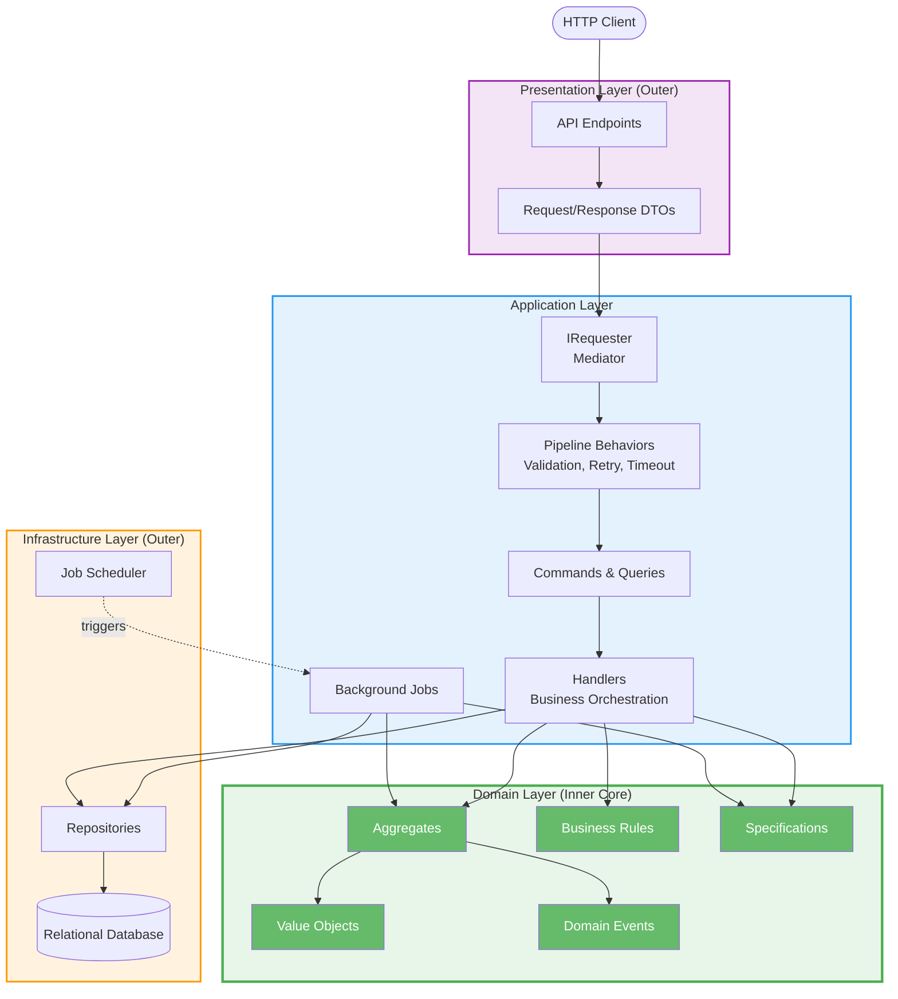

## Domain Model and Boundaries

Domain-driven design (DDD) focuses on modeling the core business domain with explicit boundaries. Each module represents a bounded context with its own ubiquitous language, invariants, and lifecycle.

- Aggregates encapsulate business rules and transactional consistency.
- Value objects capture immutable concepts and validation rules.
- Domain events represent significant state changes inside a module.
- Business rules enforce invariants at the domain boundary.
Domain events remain internal to their owning module. They are part of the domain model and are not used as a direct inter-module contract. When a module needs to communicate changes to other modules, it publishes messages through asynchronous channels (see Inter-Module Communication).

## Module Architecture

Modules are organized as vertical slices with full layering inside each module:

- Presentation: incoming requests and transport concerns.
- Application: use-case orchestration, command/query processing.
- Domain: aggregates, value objects, domain events, rules.
- Infrastructure: persistence and external system integrations.

This structure supports local reasoning, independent evolution, and consistent testing practices per module. Cross-module dependencies are minimized and made explicit.

## Layer Responsibilities and Dependencies

The architecture uses layered responsibilities to keep business logic stable and infrastructure replaceable:

### Layer Responsibilities

- Presentation: transport, request/response mapping, and API contracts.
- Application: use-case orchestration, commands/queries, and workflow coordination.
- Domain: business rules, aggregates, value objects, and domain events.
- Infrastructure: persistence and external system integrations.

### Dependency Rules

Dependencies flow inward toward the domain core:

- Domain has no dependencies on other layers.
- Application depends on Domain only.
- Infrastructure depends on Domain and Application.
- Presentation depends on Application.

This ensures business logic remains independent of delivery and infrastructure concerns.

## Inter-Module Communication

Modules can communicate in two primary ways, each with a clear intent and trade-offs:

- Synchronous (Contracts API): direct calls using stable contracts. This is appropriate for read-after-write scenarios, user-facing interactions, or strict consistency requirements.
- Asynchronous (Message Broker): publish/subscribe communication via messages. The message broker transports and dispatches messages to subscribers. This is appropriate for decoupling modules, reducing temporal coupling, and supporting eventual consistency.

Synchronous communication should remain limited to a well-defined Contracts API. Asynchronous communication should be used when domain autonomy and scalability are more important than immediate consistency.

## Domain Events and Messages

Domain events and messages are related but separate concepts:

- Domain events are internal signals produced by aggregates to indicate meaningful changes. They live in the domain model and enable intra-module workflows.
- Messages are external-facing contracts used for asynchronous communication between modules. They live at the application boundary (or an explicit messaging boundary) and are transported through a message broker.

Domain events may lead to messages, but they are not the same artifact and they are not handled through the same pipeline. Domain events express domain intent; messages express inter-module communication intent.

This separation ensures that internal domain evolution does not force downstream consumers to change, while still enabling reactive, event-driven workflows.

## Architectural Patterns

The architecture leverages proven patterns that support modularity, maintainability, and clear module boundaries. The patterns listed here capture both what is commonly implemented in this solution today and what the architecture is designed to support as the system grows.

### Architectural Patterns Overview Diagram

The following diagram shows how the patterns relate at a system level: bounded contexts (modules) encapsulate a rich domain model, may expose explicit synchronous contracts when needed, and communicate asynchronously via messages. Domain events remain internal to a module and can be processed reliably via a domain-event outbox. Message publishing can also use a message outbox for durability when delivering to a broker. Cross-cutting policies are applied consistently through mediator pipelines, and architectural tests protect boundaries.

- Modular monolith with bounded contexts (modules): strong boundaries, explicit dependencies, and local autonomy.
- Vertical slice / package-by-feature: use-cases modeled explicitly and grouped by intent.
- Rich domain model: aggregates and value objects enforce invariants inside the domain boundary.
- Request/notification dispatch (Mediator): decouples senders from handlers and enables a consistent pipeline.
- Pipeline behaviors (decorators): cross-cutting policies applied consistently around use-cases.
- Repository pattern with behaviors: persistence behind a domain-oriented abstraction with cross-cutting behaviors.
- Domain events: internal business signals for intra-module workflows.
- Messages: external-facing contracts for asynchronous module communication.
- Contracts API: explicit module interfaces for synchronous module-to-module calls.
- Outbox pattern: reliable processing of side effects after successful state changes using an outbox store and a worker/processor.
- Database-per-module (logical ownership): each module owns its persistence boundary.
- Background jobs and startup tasks: module-owned, scheduled/bootstrapping workflows.
- Architectural tests (fitness functions): automated checks that protect boundaries and dependency rules.

This architecture follows CQS (Command Query Separation) rather than a traditional CQRS approach. Commands and queries are modeled separately to clarify intent and processing flow, but they share the same underlying data store. The system does not aim to maintain separate read/write models or independent query storage.

### Modular Monolith and Bounded Context Modules

Modules represent bounded contexts with their own domain model and lifecycle. Each module is designed to be locally coherent and independently evolvable while still shipping as part of a single deployable unit.

Key constraint: modules communicate through explicit mechanisms (contracts or messages) rather than arbitrary cross-module references.

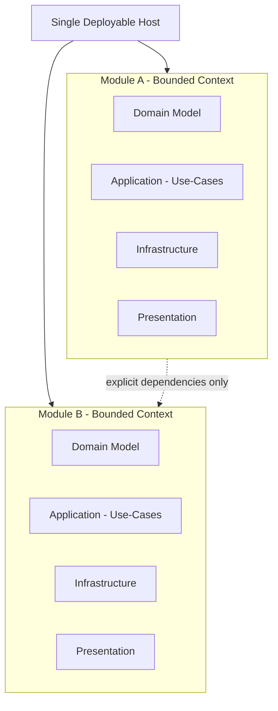

### Domain Events (In-Process)

Domain events capture meaningful state changes inside a bounded context. They are raised from aggregates and processed within the same module to trigger internal workflows.

Optionally, a domain-event outbox can be added to ensure domain events are dispatched only after successful persistence (and can be retried if dispatch fails).

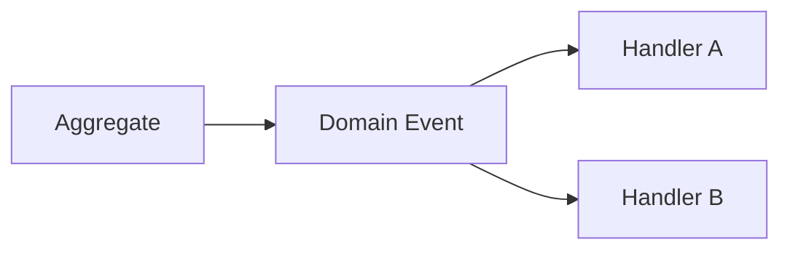

### Messaging (Messages and Broker)

Messaging is a separate concern from domain events. Messages are application-boundary artifacts used for asynchronous communication between modules via a message broker.

Messages may be produced from application workflows or as a deliberate translation step from domain events.

Optionally, a message outbox can be added to make publishing to the broker more reliable (store the message as part of the state change and publish it asynchronously).

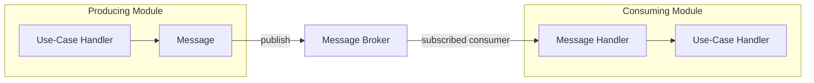

### Contracts API (Explicit Module Interfaces)

Synchronous module interactions are modeled through explicit contracts. This prevents accidental coupling and provides a clear, versionable interface between bounded contexts.

In practice, these contracts are typically owned by the providing module (for example as a dedicated Contracts package/project) and referenced by consuming modules.

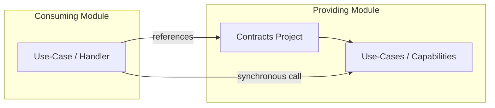

### Outbox Pattern

The outbox pattern ensures reliable handling of “something that must happen because state changed” (a side effect) without trying to perform the side effect inside the same request/transaction.

At a high level:

- In the same transaction as the domain state change, the application writes an outbox record describing the pending work.
- A separate worker/processor reads pending outbox records and performs the side effect.
- After successful handling, the worker marks the outbox record as processed.

This improves consistency because the state change and the creation of the outbox record are atomic, and the side effect can be retried independently.

Note: Outbox processing is typically at-least-once. Consumers/handlers should be idempotent.

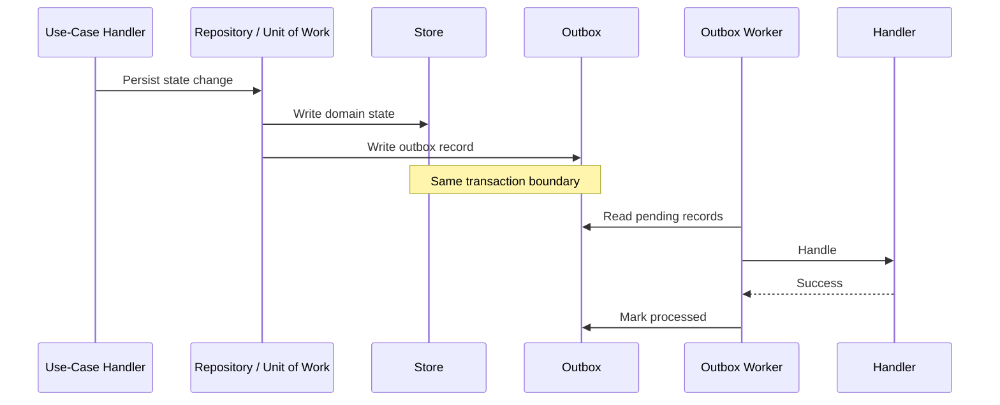

### Vertical Slice / Package-by-Feature

Use-cases are modeled explicitly (commands/queries + handlers) and grouped by intent, enabling local reasoning and limiting cross-feature coupling.

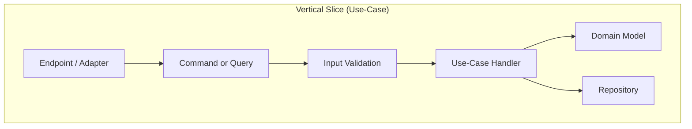

### Rich Domain Model

Business rules and invariants live in the domain model (aggregates/value objects/rules), not in endpoints or procedural scripts.

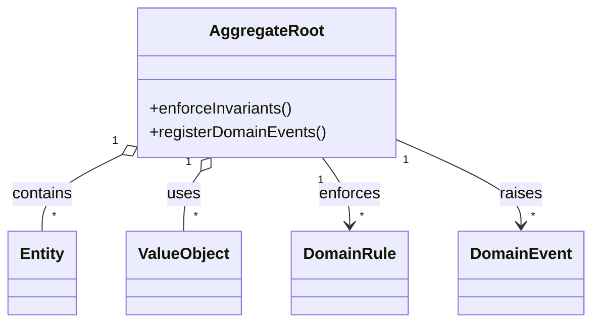

### Behaviors (Decorators)

Cross-cutting policies are applied consistently around use-cases via a behavior chain, keeping handlers focused on orchestration and domain interaction.

This is used for concerns like validation, retry, timeout, logging, and similar policies that should apply consistently across use-cases. The decorator idea can also be applied around persistence (repository behaviors) and around request dispatching (Requester/Notifier behaviors).

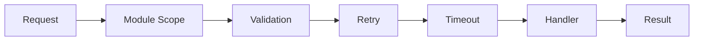

### Database-per-Module (Logical Ownership)

Each bounded context owns its persistence boundary. Other modules do not directly access its data store; they collaborate through contracts or messages.

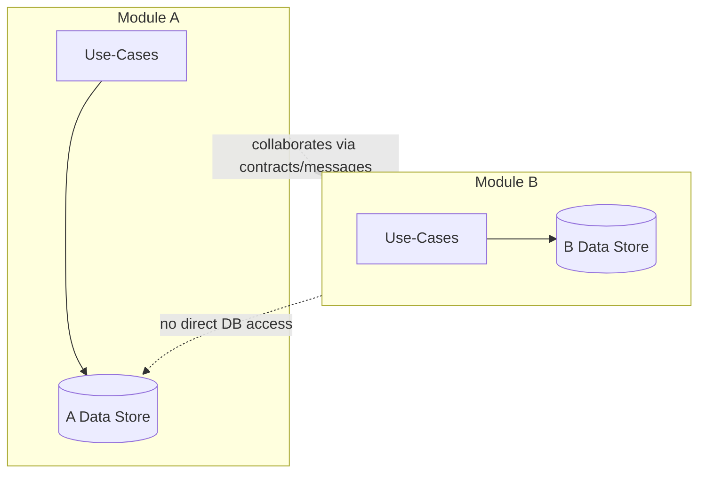

### Background Jobs and Startup Tasks

Time-triggered and bootstrapping workflows are treated as module-owned use-cases, applying the same domain and persistence boundaries as request-driven flows.

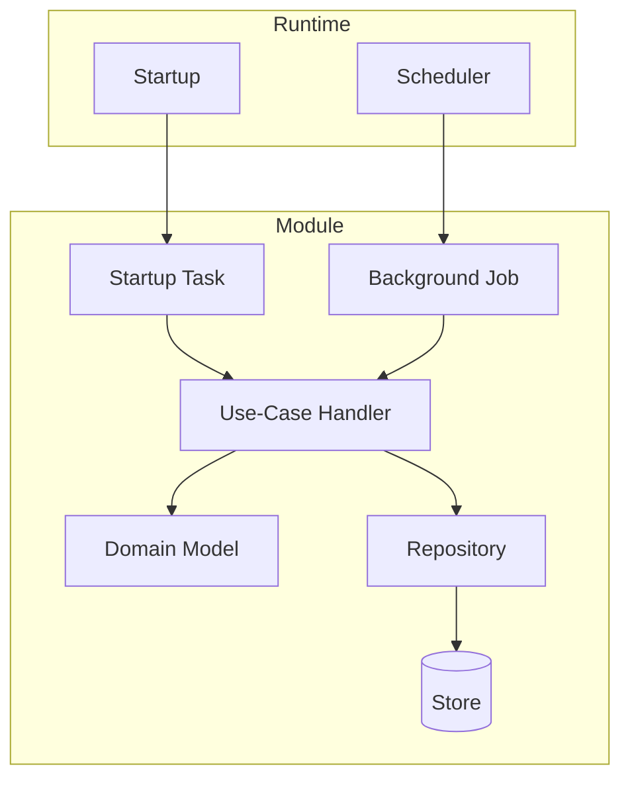

### Architectural Tests (Fitness Functions)

Architectural tests act as automated fitness functions to continuously validate dependency direction, layer boundaries, and m

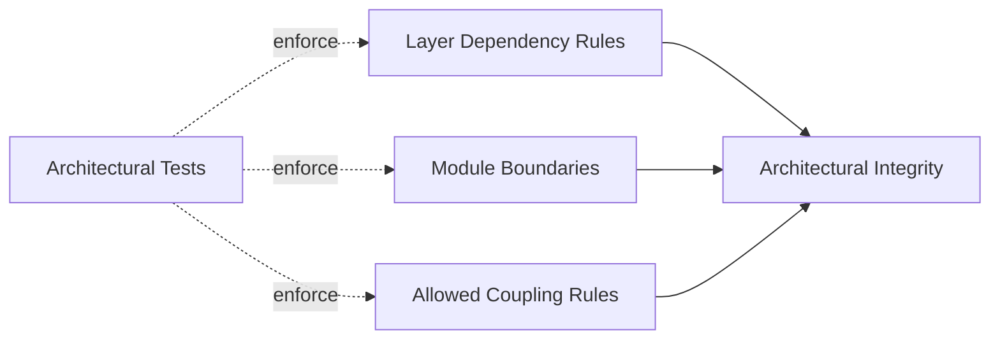

### Result Pattern

The Result pattern makes success and failure explicit, enabling composable workflows and eliminating exception-driven control flow.

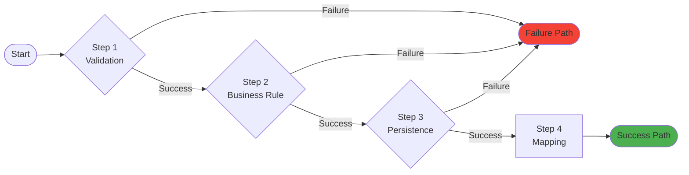

### Requester/Notifier Pattern

The Requester/Notifier (Mediator) pattern decouples senders from handlers and enables cross-cutting behaviors in a consistent pipeline.

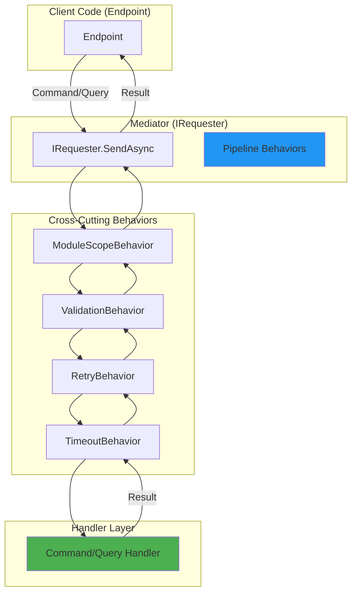

### Repository Pattern

The repository pattern abstracts persistence behind a domain-oriented interface, keeping application and domain logic independent of storage details. It centralizes data access and enables consistent handling of cross-cutting concerns (logging, auditing, and outbox handling) through a behavior chain.

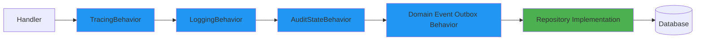

## Architecture Governance (ADRs)

Architectural Decision Records (ADRs) document key architectural choices, alternatives, and rationale. They serve as the authoritative source for why the system uses specific patterns, boundaries, and behaviors. Refer to the ADRs to understand the intent behind each diagram and section in this document.

In addition, the solution uses architectural tests as fitness functions. These automated checks continuously validate key constraints such as dependency direction, layer boundaries, and allowed module coupling, helping prevent architectural erosion over time.

## Building Blocks and Context

These diagrams provide a shared language for communicating architecture at different levels of detail:

- Context: align stakeholders on the system boundary and external collaborators.
- Container: explain the main runtime building blocks and how they interact.
- Component: help developers navigate responsibilities and dependencies inside a module.

They are primarily used for onboarding, architecture reviews, and as a stable reference when discussing changes to boundaries and responsibilities. The notation is based on the [C4 model](https://c4model.com/abstractions), which emphasizes simplicity and clarity while still capturing essential architectural information.

### 1. System Context Diagram

High-level view showing the system and its external actors.

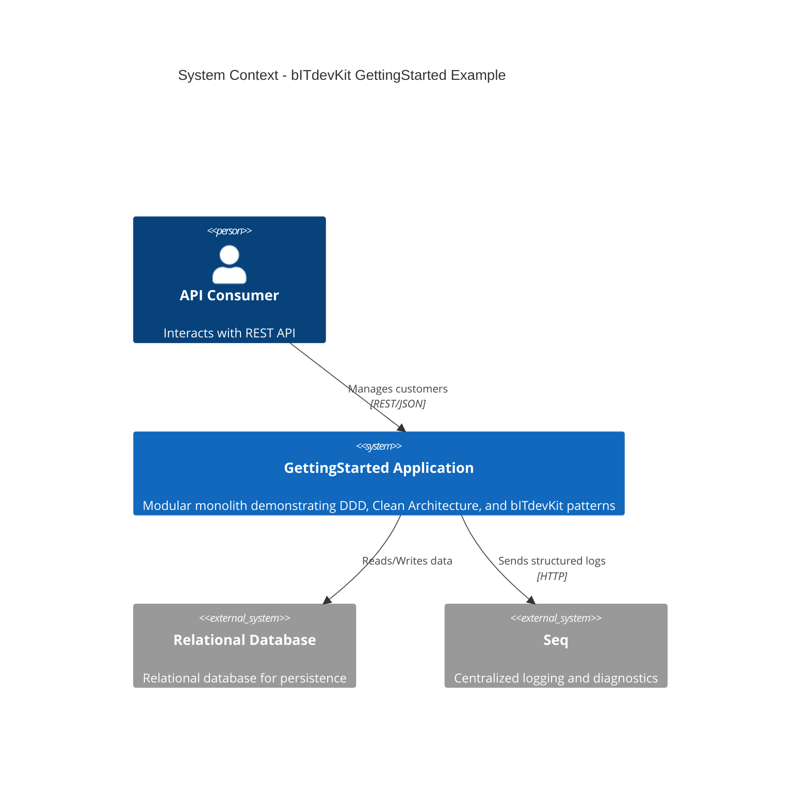

This diagram frames the system boundary and its external collaborators. It is useful for understanding responsibilities and dependencies at the highest level.

### 2. Container Diagram

Shows the major containers (applications/processes) that make up the system.


This diagram highlights the deployable/runtime units and how they collaborate, focusing on infrastructure and interaction boundaries.

### 3. Component Diagram - CoreModule

Internal structure of the CoreModule showing Clean Architecture layers.


This diagram zooms into a module to show how presentation, application, domain, and infrastructure components interact within a vertical slice.

---

## Architecture Diagrams

### 4. Clean Architecture Overview

High-level view of the Clean/Onion architecture and dependency direction.

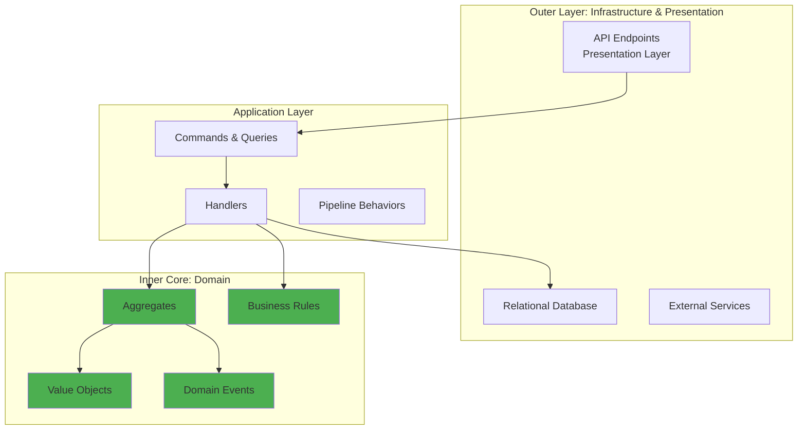

This diagram emphasizes the inner core and highlights that dependencies flow toward domain logic.

### 5. Clean Architecture Layers

Onion Architecture showing dependency direction (inward only).

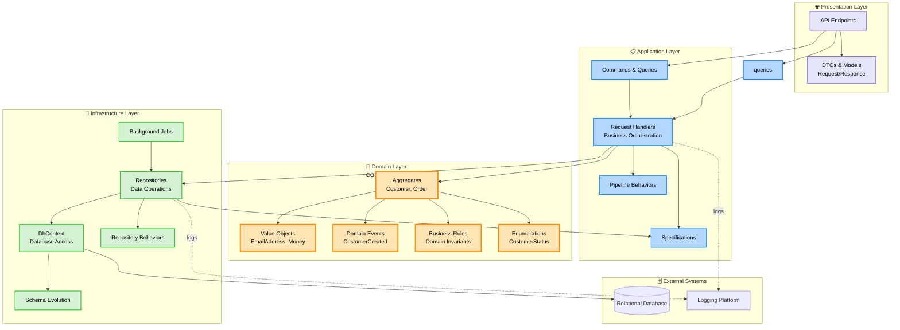

This diagram emphasizes dependency direction and the separation of concerns between layers.

### 6. Module Structure

Modular monolith organization with vertical slices.

```mermaid
flowchart TB
    subgraph host["🚀 Host"]
        program[Composition Root]
        middleware[Middleware Pipeline]
        startup[Startup Configuration]
    end

    subgraph coremodule["📦 CoreModule (Vertical Slice)"]
        direction TB

        subgraph corepresentation["Presentation"]
            coreendpoints[API Endpoints]
            coremappers[Mapping Profiles]
            coremoduleconfig[Module Registration]
        end

        subgraph coreapp["Application"]
            corecmds[Commands]
            corequeries[Queries]
            corehandlers[Handlers]
            corevalidators[Validation]
        end

        subgraph coredomain["Domain"]
            customer[Customer Aggregate]
            email[EmailAddress VO]
            status[CustomerStatus Enum]
            customerevents[Domain Events]
        end

        subgraph coreinfra["Infrastructure"]
            coredbcontext[DbContext]
            corerepos[Repository]
            corejobs[Background Jobs]
            coremigrations[Migrations]
        end
    end

    subgraph futuremodule["📦 Future Module Example"]
        futureplaceholder[Order Module<br/>Product Module<br/>etc.]
    end

    subgraph shared["🔗 Shared/Common"]
        devkit[bITdevKit<br/>Abstractions & Utilities]
        crosscutting[Cross-Cutting Concerns<br/>Logging, Caching, etc.]
    end

    program --> coremoduleconfig
    program --> middleware
    middleware --> coreendpoints

    coreendpoints --> corecmds
    coreendpoints --> corequeries
    corecmds --> corehandlers
    corequeries --> corehandlers
    corehandlers --> customer
    corehandlers --> corerepos
    corerepos --> coredbcontext
    customer --> email
    customer --> status
    customer --> customerevents

    coremoduleconfig -.registers.-> devkit
    futuremodule -.future.-> program

    crosscutting -.used by.-> coremodule

    classDef hostStyle fill:#FFE4E1,stroke:#DC143C,stroke-width:2px
    classDef moduleStyle fill:#F0F8FF,stroke:#4682B4,stroke-width:2px
    classDef sharedStyle fill:#F5F5DC,stroke:#DAA520,stroke-width:2px

    class host hostStyle
    class coremodule,futuremodule moduleStyle
    class shared sharedStyle
```

This diagram shows how modules are organized and how the host composes them into a single application.

---

## Interaction Diagrams

### 6. Sequence Diagram - Customer Creation

Complete flow from HTTP request to database persistence.

```mermaid
sequenceDiagram
    actor User
    participant API as API Gateway<br/>(Presentation)
    participant Endpoint as Customer Endpoint
    participant Requester as Requester<br/>(Mediator)
    participant Behaviors as Pipeline Behaviors
    participant Handler as CommandHandler<br/>(Application)
    participant Customer as Customer<br/>(Domain)
    participant Repo as Repository<br/>(Infrastructure)
    participant RepoBehaviors as Repository Behaviors
    participant DB as Relational Database

    User->>API: POST /api/core/customers
    activate API

    API->>Endpoint: Route to endpoint
    activate Endpoint

    Endpoint->>Endpoint: Map DTO to Command
    Endpoint->>Requester: Send CustomerCreateCommand
    activate Requester

    Requester->>Behaviors: ModuleScopeBehavior
    activate Behaviors
    Behaviors->>Behaviors: Set Module Context
    Behaviors->>Behaviors: ValidationBehavior

    alt Validation Fails
        Behaviors-->>Requester: Result.Failure (ValidationErrors)
        Requester-->>Endpoint: ValidationError
        Endpoint-->>API: 400 Bad Request
        API-->>User: Error Response
    else Validation Succeeds
        Behaviors->>Behaviors: RetryBehavior
        Behaviors->>Behaviors: TimeoutBehavior
        Behaviors->>Handler: Execute Command
        deactivate Behaviors

        activate Handler
        Handler->>Customer: Create(name, email)
        activate Customer

        Customer->>Customer: Validate Invariants
        Customer->>Customer: Generate CustomerId
        Customer->>Customer: Create EmailAddress VO
        Customer->>Customer: Register Domain Event
        Customer-->>Handler: Customer instance
        deactivate Customer

        Handler->>Repo: AddAsync(customer)
        activate Repo

        Repo->>RepoBehaviors: LoggingBehavior
        activate RepoBehaviors
        RepoBehaviors->>RepoBehaviors: Log operation
        RepoBehaviors->>RepoBehaviors: AuditStateBehavior
        RepoBehaviors->>RepoBehaviors: Set Created/Updated metadata
        RepoBehaviors->>RepoBehaviors: DomainEventPublishingBehavior
        RepoBehaviors->>DB: INSERT INTO Customers
        activate DB
        DB-->>RepoBehaviors: Row inserted
        deactivate DB

        RepoBehaviors->>RepoBehaviors: Publish CustomerCreated event
        RepoBehaviors-->>Repo: Success
        deactivate RepoBehaviors
        Repo-->>Handler: Customer with Id
        deactivate Repo

        Handler-->>Requester: Result.Success(customer)
        deactivate Handler
        Requester-->>Endpoint: Result<Customer>
        deactivate Requester

        Endpoint->>Endpoint: Map to ResponseModel
        Endpoint-->>API: 201 Created + Location
        deactivate Endpoint
        API-->>User: Success Response
        deactivate API
    end

    Note over User,DB: Full request-response cycle with<br/>validation, domain logic, and persistence
```

This sequence focuses on request orchestration across layers, highlighting behaviors, domain logic, and repository behaviors.

### 7. Sequence Diagram - Domain Event Dispatching

How domain events flow through the system (in-process).

```mermaid
sequenceDiagram
    participant Handler as Command Handler
    participant Customer as Customer Aggregate
    participant Repo as Repository
    participant RepoBehavior as DomainEvent Behavior
    participant Notifier as In-Process Notifier
    participant EventHandler as Domain Event Handler
    participant Logger as ILogger

    Handler->>Customer: Create/Update operation
    activate Customer
    Customer->>Customer: Business logic
    Customer->>Customer: DomainEvents.Register(event)
    Customer-->>Handler: Modified aggregate
    deactivate Customer

    Handler->>Repo: SaveChanges()
    activate Repo

    Repo->>RepoBehavior: Before SaveChanges
    activate RepoBehavior

    RepoBehavior->>RepoBehavior: Collect domain events
    RepoBehavior->>Repo: Persist changes to DB
    Repo->>Repo: Persist changes

    Note over RepoBehavior: Transaction committed

    RepoBehavior->>Notifier: Dispatch(CustomerCreatedEvent)
    activate Notifier

    Notifier->>EventHandler: Handle(CustomerCreatedEvent)
    activate EventHandler
    EventHandler->>Logger: Log event
    EventHandler->>EventHandler: Execute side effects
    EventHandler-->>Notifier: Complete
    deactivate EventHandler

    Notifier-->>RepoBehavior: Events dispatched
    deactivate Notifier

    RepoBehavior->>Customer: Clear domain events
    RepoBehavior-->>Repo: Complete
    deactivate RepoBehavior

    Repo-->>Handler: Success
    deactivate Repo

    Note over Handler,Logger: Events dispatched after successful<br/>transaction commit (Domain Event Outbox)
```

This sequence illustrates how domain events are collected and dispatched reliably after persistence.

---

## Data Model

### 8. Entity Relationship Diagram

Current domain model for CoreModule.

```mermaid
erDiagram
    CUSTOMER ||--o{ DOMAIN_EVENT : triggers

    CUSTOMER {
        uniqueidentifier Id PK "Typed CustomerId"
        nvarchar(256) Name "Customer full name"
        nvarchar(256) Email UK "EmailAddress value object"
        nvarchar(50) Status "CustomerStatus enumeration"
        nvarchar(64) CustomerNumber UK "Unique customer number"
        datetime2 CreatedDate "Audit: Created timestamp"
        nvarchar(256) CreatedBy "Audit: Creator identifier"
        datetime2 UpdatedDate "Audit: Last update timestamp"
        nvarchar(256) UpdatedBy "Audit: Last updater"
    }

    DOMAIN_EVENT {
        uniqueidentifier Id PK
        nvarchar(256) EventType "Discriminator for event types"
        uniqueidentifier AggregateId FK "Reference to aggregate"
        nvarchar(max) EventData "Serialized event payload (JSON)"
        datetime2 OccurredAt "Event timestamp"
        bit IsDispatched "Domain event outbox flag"
        datetime2 DispatchedAt "Dispatch timestamp"
    }

    MESSAGE_OUTBOX {
        uniqueidentifier Id PK
        nvarchar(256) Type "Message type"
        nvarchar(max) Content "Serialized message (JSON)"
        datetime2 CreatedAt
        datetime2 ProcessedAt
        int RetryCount
        nvarchar(max) ErrorMessage
    }

    DOMAIN_EVENT ||--o{ MESSAGE_OUTBOX : "may be translated into"
```

This diagram captures the persistence view of core domain concepts and the outbox mechanism.

**Notes:**

- Customer uses typed ID (CustomerId) via source generator
- EmailAddress is a value object but stored as string
- CustomerStatus is an enumeration stored as string
- Domain events are persisted in a domain-event outbox for reliable dispatch after persistence
- Messages may be persisted in a message outbox for reliable broker publication
- Audit fields populated by AuditStateBehavior

---

## Request Processing

### 9. Request Pipeline Flow

How requests flow through pipeline behaviors before reaching handlers.

```mermaid
flowchart TD
    Start([HTTP Request]) --> Endpoint[API Endpoint]
    Endpoint --> MapDTO[Map DTO to Command/Query]
    MapDTO --> SendRequest[Requester.SendAsync]

    SendRequest --> ModuleScope[ModuleScopeBehavior]
    ModuleScope --> SetContext[Set Module Context]

    SetContext --> Validation[ValidationPipelineBehavior]
    Validation --> ValidateCheck{Valid?}
    ValidateCheck -->|No| ValidationErrors[Collect Validation Errors]
    ValidationErrors --> FailureResult1[Return Result.Failure]

    ValidateCheck -->|Yes| Retry[RetryPipelineBehavior]
    Retry --> RetryConfig[Check Retry Attributes]

    RetryConfig --> Timeout[TimeoutPipelineBehavior]
    Timeout --> TimeoutConfig[Check Timeout Attributes]

    TimeoutConfig --> Handler[Command/Query Handler]
    Handler --> Execute[Execute Business Logic]

    Execute --> CheckResult{Success?}
    CheckResult -->|Exception| RetryCheck{Retry?}
    RetryCheck -->|Yes| RetryDelay[Wait & Retry]
    RetryDelay --> Handler
    RetryCheck -->|No| FailureResult2[Return Result.Failure]

    CheckResult -->|Timeout| TimeoutError[Return Timeout Error]

    CheckResult -->|Success| Domain[Domain Operations]
    Domain --> Persistence[Repository Operations]
    Persistence --> SuccessResult[Return Result.Success]

    FailureResult1 --> MapResponse
    FailureResult2 --> MapResponse
    TimeoutError --> MapResponse
    SuccessResult --> MapResponse[Map to Response DTO]

    MapResponse --> HTTPResponse{Result Type?}
    HTTPResponse -->|Success| HTTP200[200 OK / 201 Created]
    HTTPResponse -->|Validation| HTTP400[400 Bad Request]
    HTTPResponse -->|Not Found| HTTP404[404 Not Found]
    HTTPResponse -->|Error| HTTP500[500 Server Error]

    HTTP200 --> End([Return to Client])
    HTTP400 --> End
    HTTP404 --> End
    HTTP500 --> End

    classDef behaviorStyle fill:#B4E7FF,stroke:#0077BE,stroke-width:2px
    classDef errorStyle fill:#FFB4B4,stroke:#DC143C,stroke-width:2px
    classDef successStyle fill:#B4FFB4,stroke:#228B22,stroke-width:2px
    classDef handlerStyle fill:#FFE4B4,stroke:#FF8C00,stroke-width:2px

    class ModuleScope,Validation,Retry,Timeout behaviorStyle
    class ValidationErrors,FailureResult1,FailureResult2,TimeoutError,HTTP400,HTTP404,HTTP500 errorStyle
    class SuccessResult,HTTP200 successStyle
    class Handler,Execute handlerStyle
```

This flowchart shows the end-to-end request lifecycle, from transport to domain execution and response mapping.

---

## Diagram Usage

These diagrams serve different purposes:

1. **C4 Diagrams (1-3)**: For architectural understanding and stakeholder communication
2. **Architecture Diagrams (4-5)**: For understanding layer boundaries and module organization
3. **Sequence Diagrams (6-7)**: For understanding runtime behavior and request flows
4. **ERD (8)**: For database schema understanding and domain model relationships
5. **Flow Diagram (9)**: For understanding request processing pipeline

## Related Documentation

- [Clean/Onion Architecture ADR](./ADR/0001-clean-onion-architecture.md)
- [Modular Monolith ADR](./ADR/0003-modular-monolith-architecture.md)
- [Requester/Notifier Pattern ADR](./ADR/0005-requester-notifier-mediator-pattern.md)
- [Domain Events Outbox Pattern ADR](./ADR/0006-outbox-pattern-domain-events.md)
- [Repository Behaviors ADR](./ADR/0004-repository-decorator-behaviors.md)

## Updating These Diagrams

When the architecture changes:

1. Update relevant diagram(s) in this file
2. Test rendering in your markdown viewer
3. Commit diagram source (not images) with code changes
4. Reference in pull request description
5. Update related ADRs if architectural decisions change

---

*Generated: February 3, 2026*
*Project: bITdevKit GettingStarted Example*
*Architecture: Clean/Onion with Modular Monolith*
