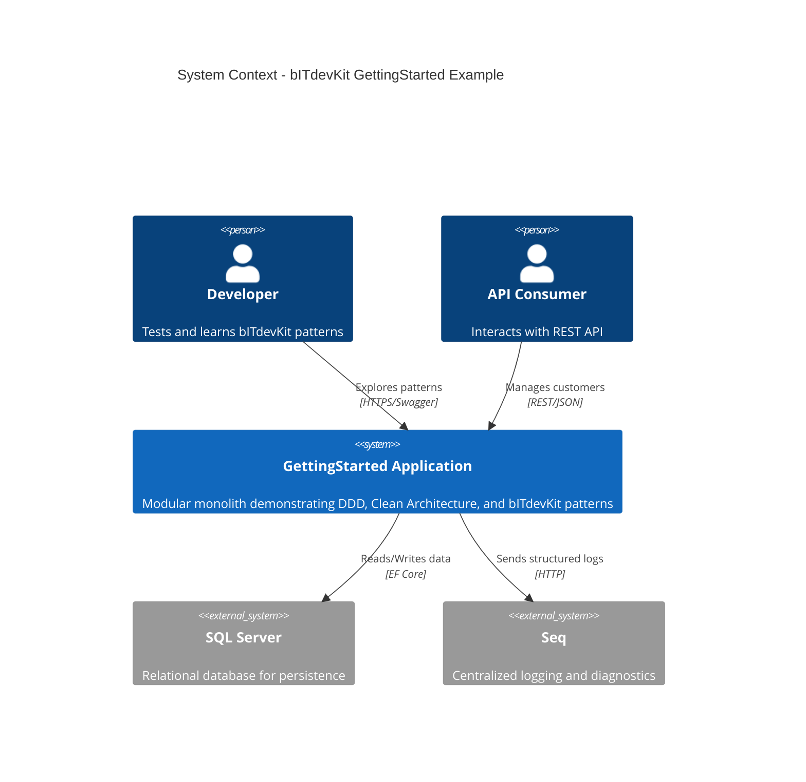
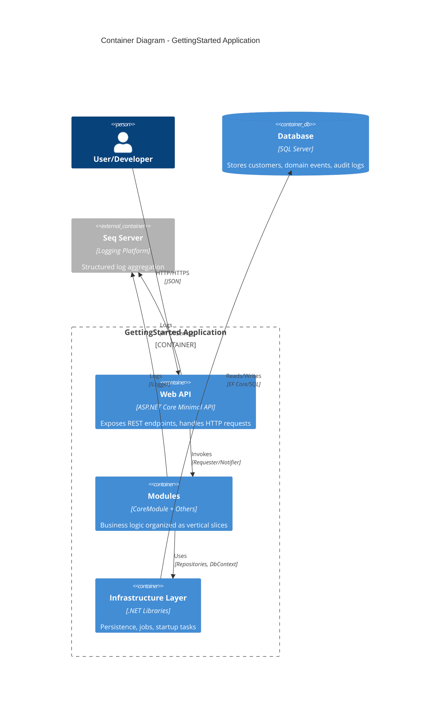
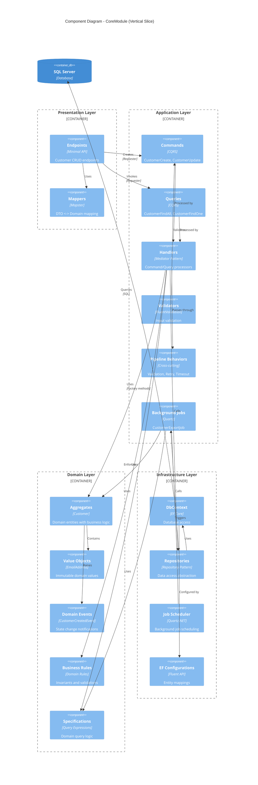
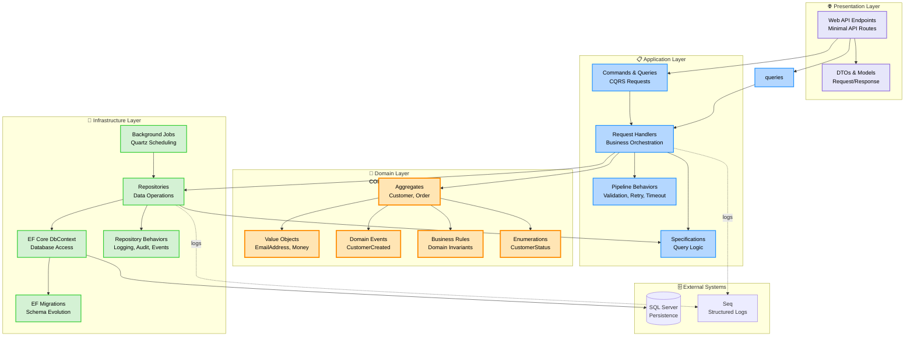
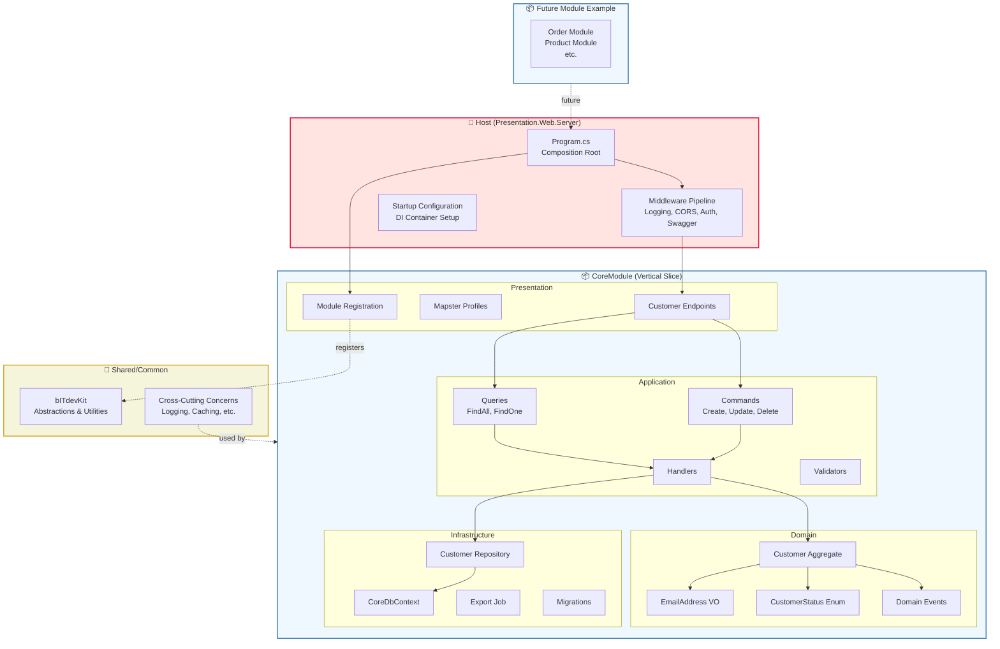
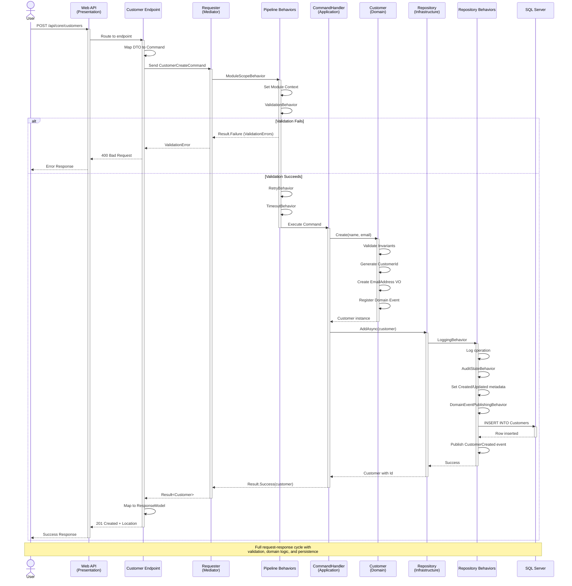
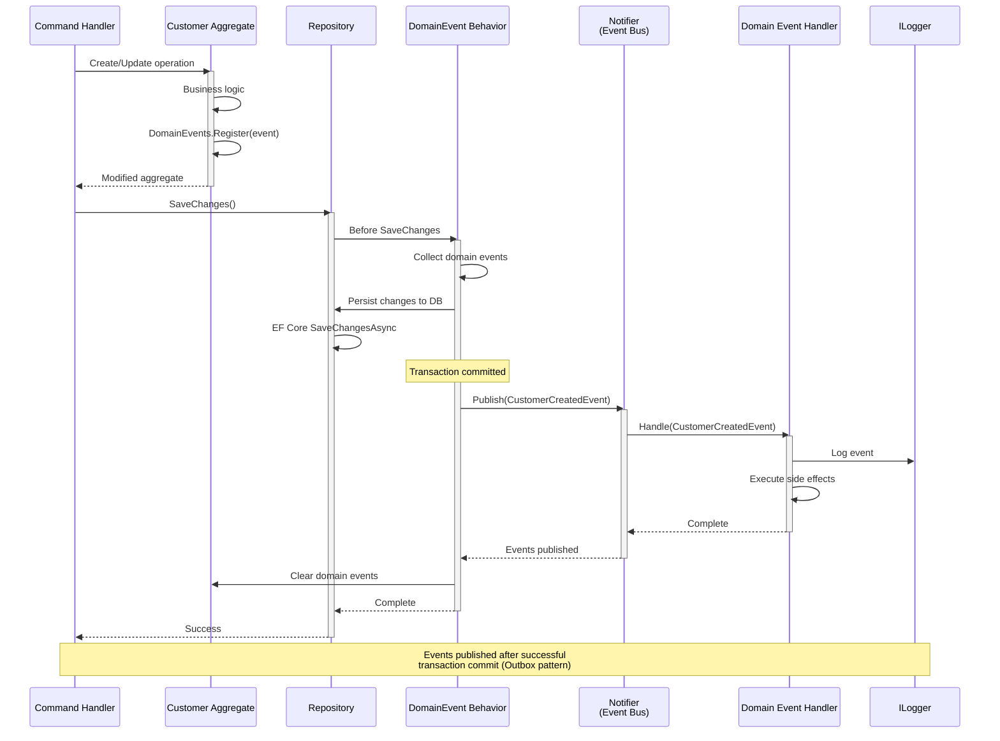
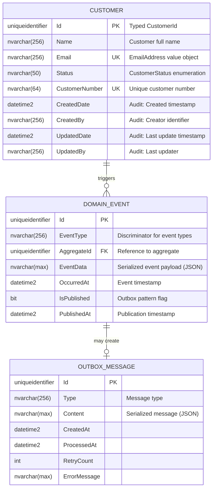
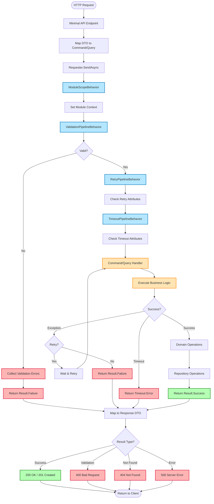

# System Design Diagrams - bITdevKit GettingStarted

Comprehensive architecture and design diagrams for the bITdevKit GettingStarted Example project.

## Table of Contents

- [System Design Diagrams - bITdevKit GettingStarted](#system-design-diagrams---bitdevkit-gettingstarted)
  - [Table of Contents](#table-of-contents)
  - [C4 Model Diagrams](#c4-model-diagrams)
    - [1. System Context Diagram](#1-system-context-diagram)
    - [2. Container Diagram](#2-container-diagram)
    - [3. Component Diagram - CoreModule](#3-component-diagram---coremodule)
  - [Architecture Diagrams](#architecture-diagrams)
    - [4. Clean Architecture Layers](#4-clean-architecture-layers)
    - [5. Module Structure](#5-module-structure)
  - [Interaction Diagrams](#interaction-diagrams)
    - [6. Sequence Diagram - Customer Creation](#6-sequence-diagram---customer-creation)
    - [7. Sequence Diagram - Domain Event Publishing](#7-sequence-diagram---domain-event-publishing)
  - [Data Model](#data-model)
    - [8. Entity Relationship Diagram](#8-entity-relationship-diagram)
  - [Request Processing](#request-processing)
    - [9. Request Pipeline Flow](#9-request-pipeline-flow)
  - [Diagram Usage](#diagram-usage)
  - [Related Documentation](#related-documentation)
  - [Updating These Diagrams](#updating-these-diagrams)

---

## C4 Model Diagrams

### 1. System Context Diagram

High-level view showing the system and its external actors.

### 2. Container Diagram

Shows the major containers (applications/processes) that make up the system.

### 3. Component Diagram - CoreModule

Internal structure of the CoreModule showing Clean Architecture layers.

---

## Architecture Diagrams

### 4. Clean Architecture Layers

Onion Architecture showing dependency direction (inward only).

### 5. Module Structure

Modular monolith organization with vertical slices.

---

## Interaction Diagrams

### 6. Sequence Diagram - Customer Creation

Complete flow from HTTP request to database persistence.

### 7. Sequence Diagram - Domain Event Publishing

How domain events flow through the system.

---

## Data Model

### 8. Entity Relationship Diagram

Current domain model for CoreModule.

**Notes:**
- Customer uses typed ID (CustomerId) via source generator
- EmailAddress is a value object but stored as string
- CustomerStatus is an enumeration stored as string
- Domain events support outbox pattern for reliability
- Audit fields populated by AuditStateBehavior

---

## Request Processing

### 9. Request Pipeline Flow

How requests flow through pipeline behaviors before reaching handlers.

---

## Diagram Usage

These diagrams serve different purposes:

1. **C4 Diagrams (1-3)**: For architectural understanding and stakeholder communication
2. **Architecture Diagrams (4-5)**: For understanding layer boundaries and module organization
3. **Sequence Diagrams (6-7)**: For understanding runtime behavior and request flows
4. **ERD (8)**: For database schema understanding and domain model relationships
5. **Flow Diagram (9)**: For understanding request processing pipeline

## Related Documentation

- [Clean/Onion Architecture ADR](./ADR/0001-clean-onion-architecture.md)
- [Modular Monolith ADR](./ADR/0003-modular-monolith-architecture.md)
- [Requester/Notifier Pattern ADR](./ADR/0005-requester-notifier-mediator-pattern.md)
- [Domain Events Outbox Pattern ADR](./ADR/0006-outbox-pattern-domain-events.md)
- [Repository Behaviors ADR](./ADR/0004-repository-decorator-behaviors.md)

## Updating These Diagrams

When the architecture changes:

1. Update relevant diagram(s) in this file
2. Test rendering in your markdown viewer
3. Commit diagram source (not images) with code changes
4. Reference in pull request description
5. Update related ADRs if architectural decisions change

---

*Generated: February 3, 2026*
*Project: bITdevKit GettingStarted Example*
*Architecture: Clean/Onion with Modular Monolith*
