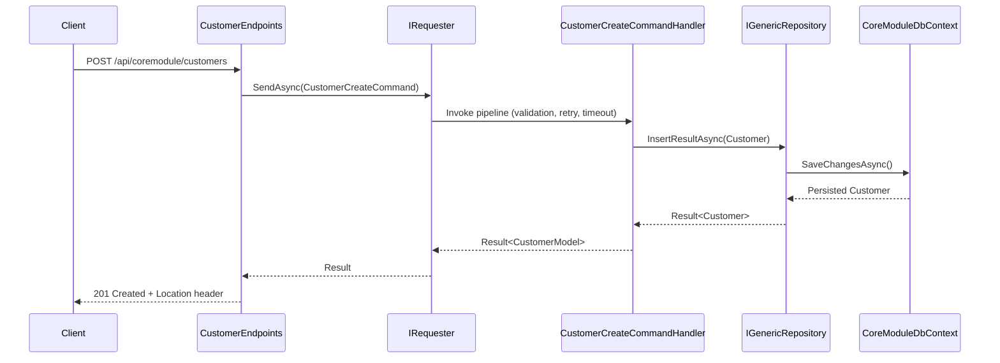

# CoreModule Module Overview

The CoreModule showcases how bITdevKit modules encapsulate a vertical slice: domain model, application workflows, persistence, and presentation endpoints that expose customer management capabilities.

## Table of Contents

- [CoreModule Module Overview](#coremodule-module-overview)
  - [Table of Contents](#table-of-contents)
  - [Overview](#overview)
  - [Architecture](#architecture)
  - [Customer Lifecycle Flow](#customer-lifecycle-flow)
  - [Key Building Blocks](#key-building-blocks)
  - [Configuration And Runtime Services](#configuration-and-runtime-services)
  - [Request Walkthrough](#request-walkthrough)
  - [Data Persistence](#data-persistence)
  - [Testing And Developer Utilities](#testing-and-developer-utilities)

## Overview

- Demonstrates a complete DDD slice for customer lifecycle management (create, update, delete, query).
- Exercises bITdevKit requester/notifier pipeline behaviors, repository abstractions, and startup/job infrastructure.
- Provides a blueprint for additional modules that follow the layering and configuration patterns described in the root `README.md`.

## Architecture

```mermaid
flowchart LR
 subgraph Presentation
  endpoints[CustomerEndpoints\n(Presentation)]
 end
 subgraph Application
  requester[IRequester]
  commands[Commands & Queries]
  handlers[Handlers]
 end
 subgraph Domain
  aggregate[Customer Aggregate]
  valueobjects[Value Objects]
  events[Domain Events]
 end
 subgraph Infrastructure
  dbcontext[CoreModuleDbContext]
  repo[Generic Repository]
  behaviors[Repository Behaviors]
 end
 endpoints --> requester
 requester --> commands
 commands --> handlers
 handlers --> aggregate
 aggregate --> events
 handlers --> repo
 repo --> dbcontext
 dbcontext -->|EF Core| storage[(SQL Server)]
```

## Customer Lifecycle Flow



## Key Building Blocks

- **Domain (`CoreModule.Domain`)**: `Customer` aggregate maintains invariants with value objects (`EmailAddress`, `CustomerNumber`) and emits `CustomerCreatedDomainEvent` and `CustomerUpdatedDomainEvent`. Guards prevent invalid transitions and register events whenever meaningful changes occur.
- **Application (`CoreModule.Application`)**: Command/query records (`CustomerCreateCommand`, `CustomerFindAllQuery`) include nested FluentValidation validators. Handlers (for example `CustomerCreateCommandHandler`) orchestrate rule checks, sequence generation, repository operations, and mapping back to `CustomerModel`.
- **Infrastructure (`CoreModule.Infrastructure`)**: `CoreModuleDbContext` extends `ModuleDbContextBase`, registers the `CustomerNumbers` sequence, and exposes `DbSet<Customer>`. Repository behaviors (tracing, logging, audit state, outbox) are chained when the module registers `AddEntityFrameworkRepository<Customer, CoreModuleDbContext>()` inside `CoreModuleModule`.
- **Presentation (`CoreModule.Presentation`)**: Minimal API endpoints in `Web/Endpoints/CustomerEndpoints.cs` secure the route group `api/coremodule/customers`, map request DTOs, and delegate to the requester. `CoreModuleMapperRegister` wires Mapster conversions between domain types and DTOs.

## Configuration And Runtime Services

- `CoreModuleConfiguration` binds the `CoreModule` section (see `appsettings.json`) and ensures a `ConnectionStrings:Default` entry plus optional `SeederTaskStartupDelay`.
- `CoreModuleModule.Register()` wires:
  - Startup tasks via `CoreModuleDomainSeederTask`, launching after the configured delay once the database is ready.
  - Job scheduling with Quartz, registering `CustomerExportJob` on `CronExpressions.EveryMinute`.
  - SQL Server `CoreModuleDbContext` setup with logging, migrations, sequence number generator, and outbox processing (30 second interval, 15 second startup delay).
  - Repository behaviors, Mapster mappings, and `CustomerEndpoints`.

## Request Walkthrough

`CustomerCreateCommandHandler` highlights the layered orchestration:

```csharp
protected override async Task<Result<CustomerModel>> HandleAsync(
 CustomerCreateCommand request,
 SendOptions options,
 CancellationToken cancellationToken) =>
  await Result<CustomerModel>
   .Bind<CustomerCreateContext>(() => new(request.Model))
   .Ensure(ctx => ctx.Model.FirstName != ctx.Model.LastName,
    new ValidationError("Firstname cannot be same as lastname", "Firstname"))
   .UnlessAsync(async (ctx, ct) => await Rule
    .Add(RuleSet.IsNotEmpty(ctx.Model.FirstName))
    .Add(new EmailShouldBeUniqueRule(ctx.Model.Email, repository))
    .CheckAsync(cancellationToken), cancellationToken: cancellationToken)
   .BindResultAsync(this.GenerateSequenceAsync, this.CaptureNumber, cancellationToken)
   .Bind(this.CreateEntity)
   .BindResultAsync(this.PersistEntityAsync, this.CapturePersistedEntity, cancellationToken)
   .Map(this.ToModel);
```

- The handler builds a context, runs business rules (including `EmailShouldBeUniqueRule`), generates a sequence via `ISequenceNumberGenerator`, constructs the aggregate, persists it through `IGenericRepository<Customer>`, and maps back to `CustomerModel`.
- Pipeline behaviors (validation, retry, timeout) configured at the requester level wrap the handler to provide cross-cutting concerns.

Endpoints project the same workflow to HTTP:

```csharp
group.MapPost("",
 async ([FromServices] IRequester requester,
     [FromBody] CustomerModel model, CancellationToken ct)
     => (await requester
   .SendAsync(new CustomerCreateCommand(model), cancellationToken: ct))
   .MapHttpCreated(v => $"/api/core/customers/{v.Id}"))
 .WithName("CoreModule.Customers.Create")
 .Produces(StatusCodes.Status401Unauthorized)
 .ProducesResultProblem(StatusCodes.Status400BadRequest)
 .ProducesResultProblem(StatusCodes.Status500InternalServerError);
```

## Data Persistence

`CoreModuleDbContext` centralizes EF Core configuration and the sequence generator used by the command handler:

```csharp
public class CoreModuleDbContext(DbContextOptions<CoreModuleDbContext> options)
 : ModuleDbContextBase(options), IOutboxDomainEventContext
{
 public DbSet<Customer> Customers { get; set; }
 public DbSet<OutboxDomainEvent> OutboxDomainEvents { get; set; }

 protected override void OnModelCreating(ModelBuilder modelBuilder)
 {
  modelBuilder.HasSequence<int>(CodeModuleConstants.CustomerNumberSequenceName)
   .StartsAt(100000);

  base.OnModelCreating(modelBuilder);
 }
}
```

- Entity configuration lives under `CoreModule.Infrastructure/EntityFramework/Configurations`, mapping value objects, enumerations, audit state, and concurrency tokens.
- The outbox table enables reliable event delivery when the module is hosted with an outbox worker.

## Testing And Developer Utilities

- Unit tests: see `tests/Modules/CoreModule/CoreModule.UnitTests` for handler, rule, and architecture coverage.
- Integration tests: `tests/Modules/CoreModule/CoreModule.IntegrationTests` exercise HTTP endpoints and persistence.
- HTTP playground: use `CoreModule-Customers-API.http` for manual testing of requests showcased above.
