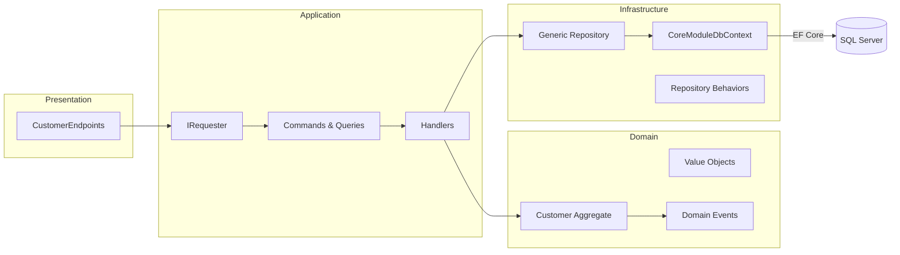
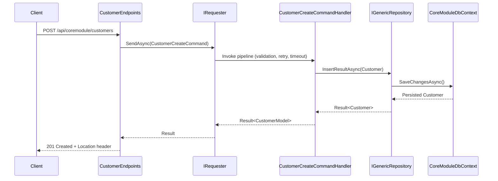

# CoreModule Module Overview

The CoreModule showcases how bITdevKit modules encapsulate a vertical slice: domain model, application workflows, persistence and presentation endpoints that expose customer management capabilities.

## Table of Contents

- [CoreModule Module Overview](#coremodule-module-overview)
  - [Table of Contents](#table-of-contents)
  - [Overview](#overview)
  - [Architecture](#architecture)
  - [Entity Lifecycle Flow](#entity-lifecycle-flow)
  - [Key Building Blocks](#key-building-blocks)
  - [Configuration And Runtime Services](#configuration-and-runtime-services)
  - [Handler Implementation Example](#handler-implementation-example)
  - [Repository Behaviors Configuration](#repository-behaviors-configuration)
  - [Domain Events in CoreModule](#domain-events-in-coremodule)
  - [Data Persistence](#data-persistence)
  - [Testing](#testing)

## Overview

- Demonstrates a complete DDD slice for customer lifecycle management (create, update, delete, query).
- Exercises bITdevKit requester/notifier pipeline behaviors, repository abstractions and startup/job infrastructure.
- Provides a blueprint for additional modules that follow the layering and configuration patterns described in the root [README.md](../../../README.md).

## Architecture



## Entity Lifecycle Flow



## Key Building Blocks

- **Domain (`CoreModule.Domain`)**: `Customer` aggregate maintains invariants with value objects (`EmailAddress`, `CustomerNumber`) and emits `CustomerCreatedDomainEvent` and `CustomerUpdatedDomainEvent`. Guards prevent invalid transitions and register events whenever meaningful changes occur.
- **Application (`CoreModule.Application`)**: Command/query records (`CustomerCreateCommand`, `CustomerFindAllQuery`) include nested FluentValidation validators. Handlers orchestrate rule checks, sequence generation, repository operations and mapping back to `CustomerModel`. Background jobs (e.g., `CustomerExportJob`) live in the Application layer.
- **Infrastructure (`CoreModule.Infrastructure`)**: `CoreModuleDbContext` extends `ModuleDbContextBase`, registers the `CustomerNumbers` sequence and exposes `DbSet<Customer>`. Repository behaviors (tracing, logging, audit state, outbox) are chained during module registration.
- **Presentation (`CoreModule.Presentation`)**: Minimal API endpoints in `Web/Endpoints/CustomerEndpoints.cs` secure the route group `api/coremodule/customers`, map request DTOs and delegate to the requester. `CoreModuleMapperRegister` wires Mapster conversions.

## Configuration And Runtime Services

`CoreModuleModule.Register()` configures:
- Startup tasks via `CoreModuleDomainSeederTask`
- Job scheduling with Quartz (`CustomerExportJob` on `CronExpressions.EveryMinute`)
- SQL Server `CoreModuleDbContext` with logging, migrations, and sequence number generator
- Outbox processing (30 second interval, 15 second startup delay)
- Repository behaviors (tracing, logging, audit state, outbox domain events)
- Mapster mappings and `CustomerEndpoints`

---

## Handler Implementation Example

This section shows the complete implementation of `CustomerCreateCommandHandler` as a concrete example of the handler pattern in CoreModule.

### Complete Handler Code

```csharp
public class CustomerCreateCommandHandler(
    ILogger<CustomerCreateCommandHandler> logger,
    IMapper mapper,
    IGenericRepository<Customer> repository,
    ISequenceNumberGenerator numberGenerator,
    TimeProvider timeProvider)
    : RequestHandlerBase<CustomerCreateCommand, CustomerModel>(logger)
{
    protected override async Task<Result<CustomerModel>> HandleAsync(
        CustomerCreateCommand request,
        SendOptions options,
        CancellationToken cancellationToken) =>
            await Result<CustomerModel>
                // STEP 1: Create context to accumulate state
                .Bind<CustomerCreateContext>(() => new(request.Model))
                
                // STEP 2: Inline validation
                .Ensure((ctx) => ctx.Model.FirstName != ctx.Model.LastName,
                    Errors.Validation.Error("Firstname cannot be same as lastname"))
                
                // STEP 3: Business rules validation
                .UnlessAsync(async (ctx, ct) => await Rule
                    .Add(RuleSet.IsNotEmpty(ctx.Model.FirstName))
                    .Add(RuleSet.IsNotEmpty(ctx.Model.LastName))
                    .Add(new EmailShouldBeUniqueRule(ctx.Model.Email, repository))
                    .CheckAsync(ct), cancellationToken: cancellationToken)
                
                // STEP 4: Generate sequence number (module-specific)
                .BindResultAsync(this.GenerateSequenceAsync, this.CaptureNumber, cancellationToken)
                
                // STEP 5: Create domain aggregate
                .Bind(this.CreateEntity)
                
                // STEP 6: Persist to repository (triggers behavior chain)
                .BindResultAsync(this.PersistEntityAsync, this.CapturePersistedEntity, cancellationToken)
                .Log(logger, "Customer {Id} created", r => [r.Value.Entity.Id])
                
                // STEP 7: Map to DTO
                .Map(this.ToModel);

    // Context pattern: accumulates state across pipeline steps
    private class CustomerCreateContext(CustomerModel model)
    {
        public CustomerModel Model { get; init; } = model;
        public CustomerNumber Number { get; set; }
        public Customer Entity { get; set; }
    }

    // Helper methods (extracted for testability)
    private async Task<Result<CustomerNumber>> GenerateSequenceAsync(CustomerCreateContext ctx, CancellationToken ct) =>
        await numberGenerator.NextAsync(timeProvider.GetUtcNow().Year, ct);

    private CustomerCreateContext CaptureNumber(CustomerCreateContext ctx, CustomerNumber number)
    {
        ctx.Number = number;
        return ctx;
    }

    private Result<CustomerCreateContext> CreateEntity(CustomerCreateContext ctx)
    {
        var createResult = Customer.Create(ctx.Model.FirstName, ctx.Model.LastName, ctx.Model.Email, ctx.Number);
        if (createResult.IsFailure)
            return createResult.Unwrap();
        
        ctx.Entity = createResult.Value;
        return ctx;
    }

    private async Task<Result<Customer>> PersistEntityAsync(CustomerCreateContext ctx, CancellationToken ct) =>
        await repository.InsertResultAsync(ctx.Entity, ct).AnyContext();

    private CustomerCreateContext CapturePersistedEntity(CustomerCreateContext ctx, Customer entity)
    {
        ctx.Entity = entity;
        return ctx;
    }

    private CustomerModel ToModel(CustomerCreateContext ctx) =>
        mapper.Map<Customer, CustomerModel>(ctx.Entity);
}
```

### Key Implementation Details

**Context Pattern**: The `CustomerCreateContext` class accumulates state (Model → Number → Entity) as the handler progresses through the Result pipeline. This avoids nested closures and makes state flow explicit.

**Sequence Generation**: Uses module-specific `ISequenceNumberGenerator` to create customer numbers in format CUS-YYYY-NNNNNN.

**Error Flow**: If any step fails (validation, rule check, persistence), the Result pipeline short-circuits and skips remaining steps, returning `Result.Failure` with error details.

### Other Handler Patterns

**Query Handler** (simpler, read-only):
```csharp
public class CustomerFindAllQueryHandler(IMapper mapper, IGenericRepository<Customer> repository)
    : RequestHandlerBase<CustomerFindAllQuery, IEnumerable<CustomerModel>>
{
    protected override async Task<Result<IEnumerable<CustomerModel>>> HandleAsync(
        CustomerFindAllQuery request,
        SendOptions options,
        CancellationToken cancellationToken) =>
            await repository
                .FindAllResultAsync(request.Filter, cancellationToken: cancellationToken)
                .Map(mapper.Map<Customer, CustomerModel>);
}
```

**Update Handler** (with concurrency check):
```csharp
await Result<CustomerModel>
    .BindResultAsync(async ct => await repository.FindOneResultAsync(request.Model.Id, ct))
    .Ensure(entity => entity.ConcurrencyVersion.ToString() == request.Model.ConcurrencyToken,
        new ConcurrencyError("Entity was modified by another user"))
    .Bind(entity => entity.ChangeFirstName(request.Model.FirstName))
    .BindResultAsync(async (entity, ct) => await repository.UpdateResultAsync(entity, ct))
    .Map(mapper.Map<Customer, CustomerModel>);
```

### Handler Checklist

When creating a new handler in CoreModule:
1. Inherit from `RequestHandlerBase<TRequest, TResponse>`
2. Inject dependencies (logger, mapper, repository, domain services)
3. Use context pattern if multiple steps accumulate state
4. Validate input with `Ensure` and `Unless` (fail fast)
5. Modify aggregate/entities using domain methods
6. Persist via repository Result methods
7. Map aggregate to DTO before returning
8. Write unit tests for happy path and error scenarios

**Pattern Reference**: See [README - Result Pattern](../../../README.md#result-pattern-railway-oriented-programming) for detailed Result mechanics and pipeline behaviors.

---

## Repository Behaviors Configuration

Repository behaviors add cross-cutting concerns (tracing, logging, auditing, event handling) using the Decorator pattern. This section shows CoreModule's specific configuration.

### Behavior Chain

```mermaid
graph LR
    Handler[Handler] -->|InsertResultAsync| Tracing[RepositoryTracingBehavior]
    Tracing --> Logging[RepositoryLoggingBehavior]
    Logging --> Audit[RepositoryAuditStateBehavior]
    Audit --> Outbox[RepositoryOutboxDomainEventBehavior]
    Outbox --> Repo[EntityFrameworkGenericRepository]
    Repo --> DB[(SQL Server)]
    
    style Tracing fill:#2196F3
    style Logging fill:#2196F3
    style Audit fill:#2196F3
    style Outbox fill:#2196F3
    style Repo fill:#4CAF50
```



### Configuration in CoreModuleModule

```csharp
services.AddEntityFrameworkRepository<Customer, CoreModuleDbContext>()
    .WithBehavior<RepositoryTracingBehavior<Customer>>()
    .WithBehavior<RepositoryLoggingBehavior<Customer>>()
    .WithBehavior<RepositoryAuditStateBehavior<Customer>>()
    .WithBehavior<RepositoryOutboxDomainEventBehavior<Customer, CoreModuleDbContext>>();

services.AddScoped(_ => new RepositoryAuditStateBehaviorOptions 
{ 
    SoftDeleteEnabled = false 
});
```

### Execution Flow

When `repository.InsertResultAsync(customer)` is called:

1. **RepositoryTracingBehavior**: Starts OpenTelemetry span "Repository.Insert.Customer" with attributes (entity_type, operation, entity_id)
2. **RepositoryLoggingBehavior**: Logs "Inserting Customer entity" with structured data
3. **RepositoryAuditStateBehavior**: Sets `customer.CreatedBy` (current user) and `customer.CreatedDate` (UTC now)
4. **RepositoryOutboxDomainEventBehavior**: Extracts `CustomerCreatedDomainEvent`, creates `OutboxDomainEvent` entry
5. **EntityFrameworkGenericRepository**: Executes `SaveChangesAsync()` (commits transaction atomically)
6. Behaviors unwind: Clear events, log duration/success, end span

### Behaviors Overview

**TracingBehavior**: Distributed tracing with OpenTelemetry. Creates spans with operation timing and status.

**LoggingBehavior**: Structured logging with duration measurement. Example: `"Customer inserted successfully (Duration: 45ms, EntityId: 123...)"`.

**AuditStateBehavior**: Automatic audit metadata. Sets CreatedBy/CreatedDate on insert, UpdatedBy/UpdatedDate on update. Configured with `SoftDeleteEnabled=false` (no soft deletes).

**OutboxDomainEventBehavior**: Outbox pattern for reliable event delivery. Extracts events from aggregates, persists in same transaction, guarantees delivery.

### Behavior Ordering Rationale

**Order matters**: Tracing (outermost) captures complete operation including all behaviors. Logging second captures audit and events. Audit third sets metadata before event extraction. Outbox (innermost) extracts events with audit fields already set.

**Pattern Reference**: See [README - Repository Behaviors](../../../README.md#repository-with-behaviors-pattern-decorator) for Decorator pattern details.

---

## Domain Events in CoreModule

Domain events represent significant business occurrences in the Customer domain. This section shows how CoreModule implements event registration, persistence, and handling.

### Customer Domain Events

```csharp
public partial class CustomerCreatedDomainEvent(Customer model) : DomainEventBase
{
    public Customer Model { get; private set; } = model;
}

public partial class CustomerUpdatedDomainEvent(Customer model) : DomainEventBase
{
    public Customer Model { get; private set; } = model;
}
```

### Event Registration in Aggregate

**During Creation**:
```csharp
public static Result<Customer> Create(string firstName, string lastName, string email, CustomerNumber number)
{
    var emailResult = EmailAddress.Create(email);
    if (emailResult.IsFailure) return emailResult.Unwrap();

    var customer = new Customer(firstName, lastName, emailResult.Value, number);
    customer.DomainEvents.Register(new CustomerCreatedDomainEvent(customer));
    
    return customer;
}
```

**During Updates** (using ApplyChange pattern):
```csharp
public Result<Customer> ChangeEmail(string email)
{
    var emailResult = EmailAddress.Create(email);
    if (emailResult.IsFailure) return emailResult.Unwrap();
    
    return this.ApplyChange(this.Email, emailResult.Value, v => this.Email = v);
}

private Result<Customer> ApplyChange<T>(T currentValue, T newValue, Action<T> action)
{
    if (EqualityComparer<T>.Default.Equals(currentValue, newValue))
        return Result<Customer>.Success(this); // No change, no event
    
    action(newValue);
    this.DomainEvents.Register(new CustomerUpdatedDomainEvent(this), replace: true);
    return this;
}
```

**ApplyChange Benefits**: Idempotent (no event if unchanged), deduplicates events (`replace: true`), works for any property type.

### Event Handler Example

```csharp
public class CustomerCreatedDomainEventHandler(ILoggerFactory loggerFactory)
    : DomainEventHandlerBase<CustomerCreatedDomainEvent>(loggerFactory)
{
    public override bool CanHandle(CustomerCreatedDomainEvent notification) => true;
    
    public override Task Process(CustomerCreatedDomainEvent notification, CancellationToken ct)
    {
        this.Logger.LogInformation(
            "Customer {CustomerId} created with email {Email}",
            notification.Model.Id,
            notification.Model.Email.Value);
        
        // Business logic: send welcome email, create read models, etc.
        return Task.CompletedTask;
    }
}
```

Multiple handlers can process the same event. Handlers execute sequentially by default.

### Outbox Configuration

```csharp
services.AddSqlServerDbContext<CoreModuleDbContext>()
    .WithOutboxDomainEventService(o => o
        .ProcessingInterval("00:00:30")       // Poll every 30 seconds
        .ProcessingModeImmediate()            // Forward to notifier immediately
        .StartupDelay("00:00:15")             // Wait 15 seconds on startup
        .PurgeOnStartup());                   // Delete old processed events
```

The outbox worker polls `OutboxDomainEvents` table, deserializes events, dispatches to handlers, and marks as processed.

### Testing Events

**Unit Test - Event Registration**:
```csharp
[Fact]
public void Create_ShouldRegisterCustomerCreatedEvent()
{
    var number = CustomerNumber.Create(2025, 100000).Value;
    var result = Customer.Create("John", "Doe", "john@example.com", number);
    
    result.ShouldBeSuccess();
    var events = result.Value.DomainEvents.GetAll();
    events.ShouldHaveSingleItem();
    events.First().ShouldBeOfType<CustomerCreatedDomainEvent>();
}
```

**Integration Test - Outbox Persistence**:
```csharp
[Fact]
public async Task InsertCustomer_ShouldPersistEventToOutbox()
{
    var customer = Customer.Create("John", "Doe", "john@example.com", number).Value;
    await repository.InsertResultAsync(customer);
    
    var outboxEvents = await dbContext.OutboxDomainEvents
        .Where(e => e.AggregateId == customer.Id.ToString())
        .ToListAsync();
    
    outboxEvents.ShouldHaveSingleItem();
    outboxEvents.First().EventType.ShouldContain("CustomerCreatedDomainEvent");
}
```

### Monitoring Events

```sql
-- Outbox table schema
CREATE TABLE OutboxDomainEvents (
    Id UNIQUEIDENTIFIER PRIMARY KEY,
    EventId UNIQUEIDENTIFIER NOT NULL,
    EventType NVARCHAR(512) NOT NULL,
    AggregateId NVARCHAR(256) NOT NULL,
    AggregateType NVARCHAR(512) NOT NULL,
    Content NVARCHAR(MAX) NOT NULL,
    OccurredOn DATETIMEOFFSET NOT NULL,
    ProcessedOn DATETIMEOFFSET NULL,
    ProcessingAttempts INT NOT NULL DEFAULT 0,
    ErrorMessage NVARCHAR(MAX) NULL
);
```

---

## Data Persistence

### DbContext Configuration

`CoreModuleDbContext` centralizes EF Core configuration:

```csharp
public class CoreModuleDbContext(DbContextOptions<CoreModuleDbContext> options)
    : ModuleDbContextBase(options), IOutboxDomainEventContext
{
    public DbSet<Customer> Customers { get; set; }
    public DbSet<OutboxDomainEvent> OutboxDomainEvents { get; set; }

    protected override void OnModelCreating(ModelBuilder modelBuilder)
    {
        modelBuilder.HasSequence<int>(CoreModuleConstants.CustomerNumberSequenceName)
            .StartsAt(100000);
        base.OnModelCreating(modelBuilder);
    }
}
```

- Entity configurations in `CoreModule.Infrastructure/EntityFramework/Configurations`
- Migrations automatically applied on startup (Development/Container environments)
- Outbox table enables reliable event delivery

### Entity Framework Migrations

All migration commands execute from **solution root folder**.

#### Creating a Migration

```bash
dotnet ef migrations add <MigrationName> --context CoreModuleDbContext --output-dir .\EntityFramework\Migrations --project .\src\Modules\CoreModule\CoreModule.Infrastructure\CoreModule.Infrastructure.csproj --startup-project .\src\Presentation.Web.Server\Presentation.Web.Server.csproj
```

Example:
```bash
dotnet ef migrations add AddCustomerPhoneNumber --context CoreModuleDbContext ...
```

Creates `Migrations/[Timestamp]_AddCustomerPhoneNumber.cs` and updates model snapshot.

#### Applying Migrations

```bash
dotnet ef database update --project .\src\Modules\CoreModule\CoreModule.Infrastructure\CoreModule.Infrastructure.csproj --startup-project .\src\Presentation.Web.Server\Presentation.Web.Server.csproj
```

Connects via `appsettings.json`, checks `__EFMigrationsHistory`, applies pending migrations.

**Note**: Automatic in Development/Container via `DatabaseMigratorService`.

#### Common Tasks

**Revert migration**:
```bash
dotnet ef database update <TargetMigration> --project ... --startup-project ...
```

**Remove last migration** (before applied):
```bash
dotnet ef migrations remove --project ... --startup-project ...
```

**Generate SQL script** (for production):
```bash
dotnet ef migrations script --project ... --startup-project ... --output migrations.sql
```

More details: [Microsoft EF Core Migrations Documentation](https://learn.microsoft.com/en-us/ef/core/managing-schemas/migrations/)

---

## Testing

### Test Structure

```
tests/Modules/CoreModule/
├── CoreModule.UnitTests/              # Domain, handlers, mappings
├── CoreModule.IntegrationTests/       # Endpoints, persistence
└── CoreModule.Benchmarks/             # Performance
```

### Example Tests

**Handler Unit Test**:
```csharp
[Fact]
public async Task Process_ValidRequest_SuccessResult()
{
    var requester = this.ServiceProvider.GetService<IRequester>();
    var command = new CustomerCreateCommand(
        new CustomerModel { FirstName = "John", LastName = "Doe", Email = "john@example.com" });
    
    var response = await requester.SendAsync(command, null, CancellationToken.None);
    
    response.ShouldBeSuccess();
    response.Value.Id.ShouldNotBe(Guid.Empty.ToString());
}
```

**Endpoint Integration Test**:
```csharp
[Fact]
public async Task POST_Customer_Returns201Created()
{
    var model = new CustomerModel { FirstName = "Jane", LastName = "Doe", Email = "jane@example.com" };
    var response = await client.PostAsJsonAsync("/api/coremodule/customers", model);
    
    response.StatusCode.ShouldBe(HttpStatusCode.Created);
    response.Headers.Location.ShouldNotBeNull();
}
```

### HTTP Playground

Use [CoreModule-Customers-API.http](CoreModule-Customers-API.http) for manual API testing.

---

For general architecture concepts and patterns, see the [README](../../../README.md).
