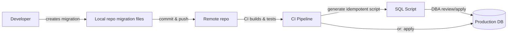

# EF Core Guidance

> Pragmatic guidance for developers to create, manage and apply EF Core migrations for module DbContexts.

Prerequisites:

- Run `dotnet tool restore` from the solution root so local tools (including `dotnet-ef` from the tool manifest) are installed and `dotnet ef` becomes available in this repository.

All `dotnet ef` examples below assume you run them from the solution root. Replace `CoreModuleDbContext`, project paths and migration names with the values for other module.

## Common commands

- Add a new migration (scaffold):

 `dotnet ef migrations add <MigrationName> --context CoreModuleDbContext --output-dir .\EntityFramework\Migrations --project .\src\Modules\CoreModule\CoreModule.Infrastructure\CoreModule.Infrastructure.csproj --startup-project .\src\Presentation.Web.Server\Presentation.Web.Server.csproj`

- Remove the last scaffolded migration (if not applied to DB):

♥ `dotnet ef migrations remove --project .\src\Modules\CoreModule\CoreModule.Infrastructure\CoreModule.Infrastructure.csproj --startup-project .\src\Presentation.Web.Server\Presentation.Web.Server.csproj`

- List migrations (scaffolded):

 `dotnet ef migrations list --project .\src\Modules\CoreModule\CoreModule.Infrastructure\CoreModule.Infrastructure.csproj --startup-project .\src\Presentation.Web.Server\Presentation.Web.Server.csproj`

- Create a SQL script for migrations between two points (e.g. for review or manual application):

 `dotnet ef migrations script <FromMigration> <ToMigration> --context CoreModuleDbContext --project .\src\Modules\CoreModule\CoreModule.Infrastructure\CoreModule.Infrastructure.csproj --startup-project .\src\Presentation.Web.Server\Presentation.Web.Server.csproj -o migrations.sql`

- Apply migrations to the configured database (local):

 `dotnet ef database update --project .\src\Modules\CoreModule\CoreModule.Infrastructure\CoreModule.Infrastructure.csproj --startup-project .\src\Presentation.Web.Server\Presentation.Web.Server.csproj`

- Apply up to a specific migration (local):

 `dotnet ef database update <MigrationName> --project .\src\Modules\CoreModule\CoreModule.Infrastructure\CoreModule.Infrastructure.csproj --startup-project .\src\Presentation.Web.Server\Presentation.Web.Server.csproj`

- Generate idempotent script for production deployments:

 `dotnet ef migrations script --idempotent --context CoreModuleDbContext --project .\src\Modules\CoreModule\CoreModule.Infrastructure\CoreModule.Infrastructure.csproj --startup-project .\src\Presentation.Web.Server\Presentation.Web.Server.csproj -o production-migrations.sql`

## Developer workflow (short)

- Create a migration for your feature: run `dotnet ef migrations add` and inspect the generated code under `src/Modules/CoreModule/CoreModule.Infrastructure/EntityFramework/Migrations`.
- Commit migration files to your feature branch and open a PR. Keep migrations small and focused.
- In CI / release pipelines prefer applying reviewed SQL scripts (`dotnet ef migrations script --idempotent`) or run `dotnet ef database update` from a deployment step that has appropriate DB credentials. Avoid automatic runtime migration application in production without review.

## Team collaboration tips

- Always commit generated migration files to source control. That ensures reproducible DB history across machines and CI.
- If two developers scaffold migrations concurrently, resolve conflicts by re-scaffolding after pulling the branch that introduced the other migration. Use descriptive migration names.
- For large teams, consider a single migration-per-PR policy and use `dotnet ef migrations script` to generate a reviewed SQL change for production.

## Applying migrations in CI/CD

- Option A (apply from artifact/startup project): run `dotnet ef database update` in a controlled pipeline step using the same startup project as the running app and with production DB credentials.
- Option B (DBA-approved): generate an idempotent script with `dotnet ef migrations script --idempotent` and have DBAs apply it with their tooling.

Example CI command (no build if artifacts are provided):

`dotnet ef database update --no-build --project .\src\Modules\CoreModule\CoreModule.Infrastructure\CoreModule.Infrastructure.csproj --startup-project .\src\Presentation.Web.Server\Presentation.Web.Server.csproj`

## Quick recovery & maintenance commands

- Drop database (local/dev):

 `dotnet ef database drop --project .\src\Modules\CoreModule\CoreModule.Infrastructure\CoreModule.Infrastructure.csproj --startup-project .\src\Presentation.Web.Server\Presentation.Web.Server.csproj --force`

- Recreate DB from scratch (useful for local dev):

 1. `dotnet ef database drop --force ...`
 2. `dotnet ef database update ...`

## Notes / background

- EF Core migrations capture schema changes as code. Migrations are code artifacts and should be reviewed and versioned like other source files.
- Use `--context` when a project exposes multiple DbContexts. Always set `--project` to the project that contains the migrations/DbContext and `--startup-project` to the app that hosts configuration/startup.

## Small migration workflow diagram

## References

- EF Core managing migrations: <https://learn.microsoft.com/ef/core/managing-schemas/migrations/managing?tabs=dotnet-core-cli>
- Applying migrations: <https://learn.microsoft.com/ef/core/managing-schemas/migrations/applying?tabs=dotnet-core-cli>
- Team workflows: <https://learn.microsoft.com/ef/core/managing-schemas/migrations/teams>
